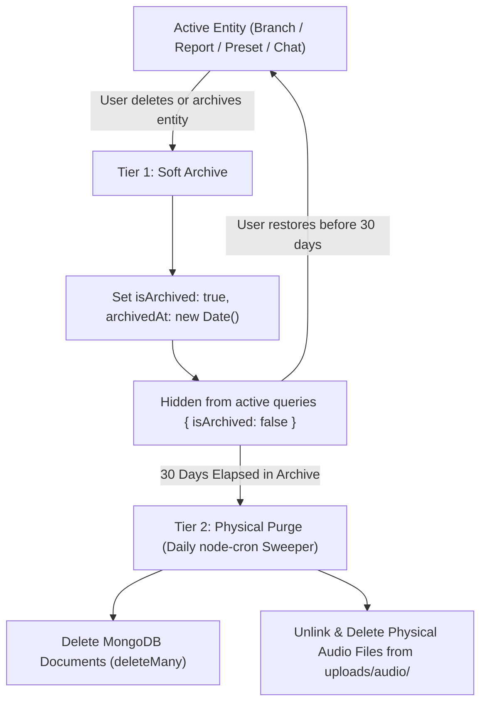
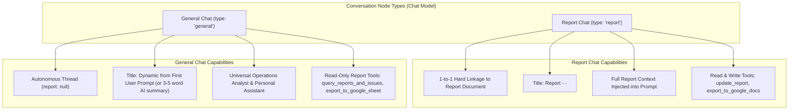
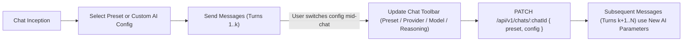
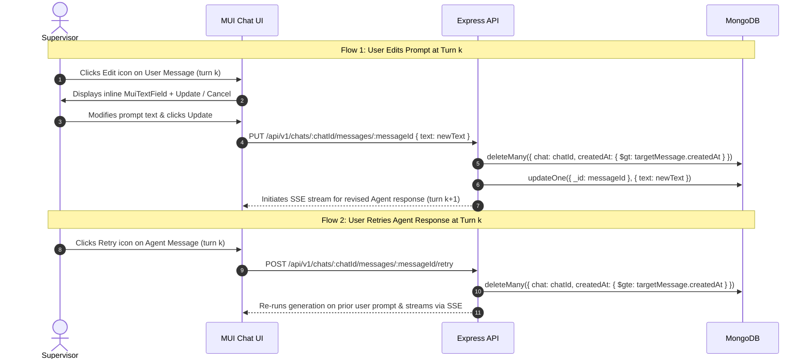

# Master Technical Specification: MERN Stack Agentic AI Report Builder

**Document Version:** 1.0.0  
**Application Title:** Report Builder  
**Branch:** `phase-0-specification`  
**Architecture:** MERN Stack (MongoDB, Express, React, Node.js) with Addis AI STT & Gemini Free Tier LLM  
**Target Environment:** Node.js ES Modules (`"type": "module"`), React 18+ (Vite SPA), Material-UI (Community Edition)

---

## Table of Contents
1. [Section 1: System Vision, Operational Architecture & Constraints Registry](#section-1-system-vision-operational-architecture--constraints-registry)
2. [Section 2: User Persona, Authentication & Session Security](#section-2-user-persona-authentication--session-security)
3. [Section 3: Locked Plain-Text Amharic Report Engine & Formatting Rules](#section-3-locked-plain-text-amharic-report-engine--formatting-rules)
4. [Section 4: Domain Data Models, Schemas & Lifecycle Management](#section-4-domain-data-models-schemas--lifecycle-management)
5. [Section 5: Chat, Message & Conversation Node Architecture](#section-5-chat-message--conversation-node-architecture)
6. *Section 6: Audio Pipeline, FFmpeg Preprocessing & Addis AI STT Engine (Pending)*
7. *Section 7: Agentic Reasoning, Multi-Tier Fallback & Gemini Runtime (Pending)*
8. *Section 8: Workplace Transliteration Engine & Per-User Glossary (Pending)*
9. *Section 9: Conversational Agent UI & MUI X Chat Integration (Pending)*
10. *Section 10: Frontend Routing, Shell Layout & Component Matrix (Pending)*
11. *Section 11: REST API Endpoint Inventory, Validation Chains & Response Envelopes (Pending)*
12. *Section 12: Backend Infrastructure, Winston Logging & Sweeper Tasks (Pending)*
13. *Section 13: Verification Protocols, Quality Gates & Zero-Error Checklists (Pending)*
14. *Section 14: Deployment, Environment Variables, Locked Dependencies & Execution Roadmap (Pending)*

---

# Section 1: System Vision, Operational Architecture & Constraints Registry

### 1.1 Executive Summary & Problem Space
- **Application Purpose**: The **Report Builder** is an intelligent, self-service MERN web platform engineered specifically for field-based personnel (e.g., Area Supervisors, regional auditors, quality control inspectors) who manage or inspect multiple branch locations. The platform converts natural, spoken Amharic audio recordings into standardized, company-ready Amharic operational reports matching an immutable corporate format.
- **The Core Problem Solved**: Area supervisors traditionally return home after demanding branch visits and must manually type structured daily reports on laptops. This manual documentation causes significant cognitive fatigue, delayed report submissions, inconsistent report formatting, and lost operational data. The problem is not opening a computer or remembering the day; the problem is the mechanical typing and structuring. The Report Builder allows employees to simply speak naturally about their workday in Amharic—narrating branches visited, times, activities executed, operational issues identified, and supervisory opinions—and automatically produces a structured report matching company expectations.
- **Universal Multi-Company Scope**: Although originally modeled around restaurant chain supervisors (such as Enjoy Burger's 14-branch network in Ethiopia), the application is engineered as a generic multi-branch operational platform. Any business operating multiple stores, clinics, branches, or field sites can deploy the application without modifying database schemas or application code.
- **Manual Delivery Model**: The application deliberately avoids automated email or messaging distribution to management. Report delivery from the employee to their supervisor or company management is **strictly manual**, providing the employee with total control over report verification prior to submission. The platform provides four standardized export/delivery mechanisms:
  1. **One-Click Clipboard Copy**: Copies the exact formatted plain-text Amharic report to the user's clipboard.
  2. **Plain-Text Download (`.txt`)**: Downloads the formatted report as a UTF-8 encoded text file.
  3. **Browser Print to PDF**: Launches a print stylesheet that formats the report cleanly for saving as a PDF document.
  4. **Backend-Only Google Docs Export**: Creates a formatted Google Document in the user's own Google Drive utilizing the authorized `drive.file` OAuth scope.

---

### 1.2 Supervisor Profile & Operational Routine
- **Target Persona Profile**:
  - **Job Title**: Area Supervisor (or Field Inspector, Store Auditor, Operations Coordinator).
  - **Role Description**: Visits one or more company branches per business day to audit customer service, inspect kitchen/equipment sanitation, verify cash handling and POS operation, identify maintenance issues, and coordinate on-site staff.
  - **Operating Language**: Spoken daily communication and formal reporting are conducted in **Amharic**. Workplace equipment and operational procedures frequently include English technical terms that must be transliterated naturally into Ge'ez script.
- **Standard Day-in-the-Life Workflow**:
  1. **Shift Inception (Clock-In)**: The supervisor commences their workday at a recorded 24-hour time (`HH:mm`, e.g., `08:30`).
  2. **Branch Supervision Visits**:
     - **Single-Branch Visit**: The supervisor visits one branch for the day. The report body and header are associated exclusively with that single location.
     - **Multi-Branch Visits**: The supervisor visits two or more branches throughout the day. The primary report body focuses on the designated primary branch, while the header incorporates all visited branches joined by Amharic conjunctions (`፣` and `እና`) along with per-visit time ranges: `ከ HH:mm – HH:mm (<branch> ብራንች)`.
  3. **Field Observations & Execution**:
     - **Activities Performed (`የተሰሩ ስራዎች`)**: Tasks completed during visits (e.g., store opening checklist, kitchen hygiene audit, cash reconciliation, employee attendance check). Each activity has an internal status: `completed` (default) or `in_progress`.
     - **Issues Identified (`መፍትሄ የሚፈልጉ ጉዳዮች`)**: Operational bottlenecks, broken machinery, missing ingredients, urgent customer complaints. Each issue has an internal status: `reported` (default), `in_progress`, `completed`, or `no_issue`. If no operational issues were found during the entire visit, a mandatory standardized Amharic sentence is rendered: ` - በዕለቱ በብራንቹ አፋጣኝ መፍትሄ የሚፈልግ የተለየ ጉዳይ አልነበረም።`
     - **General Comments (`አጠቃላይ አስተያየት`)**: Subjective observations regarding customer traffic, staff morale, branch atmosphere, or management recommendations. Comments carry no status.
  4. **Shift Conclusion (Clock-Out)**: The supervisor concludes their workday at a recorded 24-hour time (`HH:mm`, e.g., `17:45`).
  5. **Report Generation & Conversational Refinement Lifecycle**:
     The report lifecycle is a deterministic, two-phase process: **Phase A (Form Submission, Ingestion & Initial Synthesis)** followed by **Phase B (Conversational Refinement & Multi-Modal Correction)**.

     - **Phase A: Submission, Ingestion & Initial Synthesis Pipeline**:
       1. *Form Initiation*: The supervisor navigates to `/chat` and clicks **New Report**. The centered composer is immediately hidden, and the 10-row structured report initiation form is rendered.
       2. *Metadata & Audio Collection*: The supervisor completes the required domain metadata (Ethiopian date `DD-MM-YY`, primary branch autocomplete, clock-in `HH:mm`, clock-out `HH:mm`, optional multi-branch visits array `[{ branch, clockIn, clockOut }]`) and records or attaches one or more Amharic audio narrations via the interactive audio orb.
       3. *Atomic Multipart Submission*: The form executes a single `multipart/form-data` POST request to `/api/v1/reports`.
       4. *Concurrency Lock Acquisition*: The server immediately acquires a dedicated `per-chat lock` for the initiating session to guarantee that parallel edits or duplicate submissions cannot create race conditions.
       5. *Audio Preprocessing & Segmentation*: The uploaded audio is validated via Multer (max 25MB per file, max 10 files per submission, strict MIME allowlist). System `ffprobe` extracts codec and duration; `ffmpeg` converts the input stream to standardized mono 16-bit 16kHz PCM WAV format. If duration exceeds 120 seconds or file size exceeds 25MB, FFmpeg automatically segments the stream into clean acoustic chunks on silence thresholds.
       6. *Synchronous Addis AI STT Execution*: Each audio chunk is dispatched synchronously via the official `addisai` SDK (`language: "am"`, `model: "default"`). Provider execution is bounded strictly by `AI_TIMEOUT_MS` with exponential backoff retries (1s $\rightarrow$ 2s $\rightarrow$ 4s). Transcribed segments are concatenated in exact chronological sequence into a unified `rawNarrationText`.
       7. *Dual Document Instantiation & 1:1 Invariant*:
          - The server immediately instantiates a `Report` document containing the validated metadata, author snapshot (`fullName`), audio metadata records, empty initial body collections (`activities: []`, `issues: []`, `comments: []`), and the stored `rawNarrationText`.
          - Simultaneously, the server creates a `Chat` document of `type: 'report'` bound to `report._id`. Exactly one conversation node per report is enforced by a unique compound index on `(user, report)`.
       8. *Initial Agentic Turn & Tool Invocation*:
          - The LLM agent (Gemini Free Tier or Addis-1-Alef via Preset) is initialized with the active system/persona prompt, user's technical workplace Glossary, report metadata, and the full Amharic transcript.
          - The agent extracts and categorizes domain entities: activities (default status: `completed`), issues (default status: `reported`; or `no_issue` if clean), and general comments.
          - Any unlisted branch mentioned in the audio is programmatically added via the `create_branch` tool.
          - **Strict Server-Side Rendering Rule**: The LLM is explicitly forbidden from handcrafting or assembling the final formatted plain-text report string. Instead, the agent must execute the server-side tool `update_report` passing a structured JSON patch payload.
          - The server validates the patch against Mongoose schema rules, writes the structured data to MongoDB, executes the deterministic internal Amharic Plain-Text Renderer, and saves the resulting string into `report.generatedReportText`.
          - The server returns the rendered report text as the tool result back to the agent.
       9. *Token-by-Token Streaming to Client*:
          - The agent streams its response token-by-token over an HTTP `ReadableStream` (Server-Sent Events) to the client using typed event frames (`start`, `tool-call`, `tool-result`, `text-delta`, `finish`).
          - The `@mui/x-chat` interface dynamically renders the completed plain-text report inside a dedicated preview card, restores the composer, and displays quick-action utilities (Copy, Download `.txt`, Print PDF, Export Google Docs).
       10. *Lock Release*: The server releases the `per-chat lock`.

     - **Phase B: Conversational Refinement & Multi-Modal Correction**:
       The supervisor reviews the generated report. The conversation between the agent and supervisor is **not** a single-turn interaction; it is an ongoing, multi-turn conversational thread adhering to a true **ChatGPT / Gemini style conversational architecture** rendered as an `<Outlet />` inside the `AppShell` (`Sidebar` + `[Sticky MuiAppbar + Chat Outlet]`).

       1. *Persistent Multi-Turn Thread Continuity & Entry Points*:
          The user can resume and continue the report conversation at any time through three distinct application entry points:
          - **Entry Point 1 (Sidebar Recent Chats List)**: Clicking any historical report chat node in the sidebar navigates directly to `/chat/:chatId`, loading the full chronological conversation thread.
          - **Entry Point 2 (Reports Page - Card / List View)**: When viewing reports as cards, each card exposes an action icon toolbar:
            - **Chat Icon**: Navigates directly to `/chat/:chatId` to resume the multi-turn discussion with the agent.
            - **View Icon**: Navigates to `/reports/:reportId` for the standalone plain-text report view.
            - **Edit Icon**: Opens the direct structured edit dialog (Mode 1).
            - **Archive Icon**: Present when `isArchived: false` to soft-delete the report.
            - **Restore Icon & Delete Icon**: Present when `isArchived: true` (Delete triggers a `MuiConfirmDialog` for permanent removal).
          - **Entry Point 3 (Reports Page - DataGrid View `MuiDataGrid`)**: The action column exposes the exact same action icon set (Chat, View, Edit, Archive, Restore/Delete).

       2. *In-Thread Message Actions & Truncation Mechanics*:
          Every message rendered in the chat stream is accompanied by dedicated action controls:
          - **Under Each Agent Response**:
            - **Copy Action Icon**: Copies the agent's textual response or formatted report directly to the clipboard.
            - **Retry Action Icon**: Re-executes the agent turn. Clicking Retry immediately **discards and permanently truncates all subsequent messages (both following user prompts and agent replies) located below that specific agent response**, rolls the thread context back to the preceding user prompt, and commands the agent to generate a fresh, revised response from that exact point forward.
          - **Under Each User Request (User Message Card)**:
            - **Copy Action Icon**: Copies the user's prompt text to the clipboard.
            - **Edit Action Icon**:
              - Clicking Edit dynamically transforms the user message card into an inline editor using a `MuiTextField`.
              - The Edit icon transitions into an **Update** button (accompanied by a Cancel button).
              - When the user clicks **Update**, **all subsequent messages (user requests and agent responses) below that message are permanently discarded/truncated**, the updated prompt is submitted to the agent, and the agent generates a fresh response from that new fork point forward.

       3. *The Three Operational Correction Modes*:
          - **Mode 1 (Direct UI Edit)**:
            - Triggered from the preview card in `/chat/:chatId` or from `/reports` (via the card/grid edit icon or `/reports/:reportId`).
            - Opens the structured edit modal: supervisor edits metadata, times, branches, activities (text and `completed`/`in_progress` status), issues (text and `reported`/`in_progress`/`completed`/`no_issue` status), and comments.
            - Issues `PUT /api/v1/reports/:reportId` $\rightarrow$ server validates, saves to MongoDB within a transaction, re-executes the deterministic Amharic plain-text renderer, and instantly updates the preview card across the chat and reports views.
          - **Mode 2 (Typed Natural Language Prompt)**:
            - The supervisor types a natural language Amharic instruction in the composer (e.g., `"የዲፕ ፍራየሩ ችግር ተስተካክሎ ስራ ጀምሯል ስለዚህ ስታተሱን completed አድርገው"` or `"የስራ መውጫ ሰዓቴ 18:00 ነው አስተካክለው"`).
            - The server acquires the `per-chat lock`.
            - The agent invokes `get_report_context` to inspect current MongoDB report state.
            - The agent calls `update_report` with the precise differential patch.
            - The server validates, writes to MongoDB, re-renders the formatted Amharic report, and returns the result.
            - The agent streams its confirmation token-by-token, presenting the revised formatted report as its visible reply.
            - The server releases the lock.
          - **Mode 3 (Spoken Voice Clip)**:
            - The supervisor records a short follow-up audio clip directly in the composer.
            - The audio is posted to `/api/v1/reports/:reportId/clips`.
            - **Ephemeral Clip Guarantee**: Mode 3 audio clips are strictly ephemeral. They are buffered in memory/temp storage, converted to 16kHz mono WAV via FFmpeg, and transcribed synchronously via Addis AI STT. Once transcribed, the audio file is immediately unlinked and is **never persisted** as a permanent row in the database or stored in long-term disk storage.
            - The transcript is injected as the user's turn.
            - The agent invokes `update_report`, the server updates and re-renders the report, and the revised report is streamed back into the chat.
            - The server releases the lock.

     - **Guaranteed Operational Invariants**:
       - *Max 3 Tool Roundtrips*: Every agentic turn is strictly capped at 3 tool execution roundtrips to prevent infinite execution loops.
       - *Deterministic Formatting Guarantee*: Because the plain-text report is assembled exclusively by the backend template engine, formatting syntax errors, improper spacing, missing headings, and incorrect conjunctions are mathematically impossible.
       - *Single Conversation Node*: The unique index on `(user, report)` guarantees that every report has exactly one associated chat thread, ensuring complete auditability and chronological context preservation.
       - *Thread Consistency via Linear Truncation*: Editing an earlier user prompt or retrying an earlier agent response strictly truncates all downstream conversation nodes to preserve an unambiguous, non-contradictory context window.

---

### 1.3 System Scope & Negative Boundaries ("The Never List")
To prevent architectural drift and eliminate unneeded complexity, the following boundaries are strictly enforced:
- **Never Build RBAC or Multi-Tenancy**: The application implements a self-service, single-user architecture. There are no organization accounts, no company administrative hierarchies, no billing tiers, and no permission roles. The concept of `role` does not exist in schemas, tokens, or business logic. All data records are strictly scoped to the authenticated user's `req.user._id.toString()`.
- **Never Build Report Template CRUD**: The corporate Amharic report template is fixed and hardcoded in code. Users cannot create custom templates, modify report layouts, or delete templates.
- **Never Add Automated Translation**: The platform never performs automated machine translation (e.g., English to Amharic or Amharic to English). User-spoken Amharic remains Amharic; UI chrome remains English.
- **Never Add Text-to-Speech (TTS)**: The application produces visual text, structured JSON, and data cards. It never synthesizes speech or speaks back to the user.
- **Never Use TypeScript**: All backend and frontend code must be written in pure modern JavaScript (ES Modules).
- **Never Use Next.js, Remix, or SSR**: The client application is a single-page application built exclusively with React and Vite.
- **Never Use Tailwind CSS**: UI styling must be achieved exclusively via Material-UI `sx` prop and `styled()` components using the Community Edition theme engine.
- **Never Use Zod**: All backend schema and request validations must be implemented using `express-validator` rule chains. Frontend validation uses native `react-hook-form` constraints.
- **Never Add Automated Test Frameworks**: Do not install or configure Jest, Mocha, Vitest, Cypress, or Playwright. Verification is conducted via static syntax checks (`node --check`), build checks (`npx vite build`), and manual interactive testing.
- **Never Build Native Mobile Apps or PWA**: The application is responsive across mobile, tablet, and desktop browser viewports (`xs`, `sm`, `md`, `lg`, `xl`). No progressive web app service workers or native mobile builds (React Native, Flutter) are included.
- **Never Maintain Server-Side Sessions**: The backend is stateless. Tokens are passed via httpOnly cookies. No Redis or database session store exists.
- **Never Use `deletedAt` Soft Deletion**: Soft deletion across branches and reports uses `isArchived` (boolean) and `archivedAt` (Date). A 30-day cron sweeper permanently deletes archived items.

---

### 1.4 Non-Negotiable Engineering Constraints Registry

#### 1.4.1 Naming & Convention Standards
- **Entity & Component Names**: Entity models, React components, and Mongoose schemas must use `PascalCase` (e.g., `User`, `Branch`, `Report`, `Chat`, `MuiAppbar`).
- **Status Enums**: All enum values must be lowercase strings (e.g., `'completed'`, `'in_progress'`, `'reported'`, `'no_issue'`).
- **Domain Dates**: Domain dates displayed to the user must strictly adhere to the Ethiopian calendar format `DD-MM-YY` (e.g., `08-01-17`). Internal database storage uses UTC Gregorian `Date`.
- **Times**: Time fields must strictly follow the 24-hour `HH:mm` format (e.g., `08:30`, `17:45`).
- **Reusable Component Prefix**: All custom reusable UI wrappers around Material-UI must be prefixed with `Mui` (e.g., `MuiAppbar`, `MuiPageHeader`, `MuiConfirmDialog`, `MuiEmptyState`).
- **Constants & Environment Variables**: Must use `UPPER_SNAKE_CASE` (e.g., `JWT_ACCESS_SECRET`, `AI_TIMEOUT_MS`, `DEFAULT_PAGE_LIMIT`).

#### 1.4.2 Identifiers, Keys & Database Scoping
- **Primary Keys**: The database primary key is strictly `_id`. Code must never access or assign `.id`. DTO transforms must strip `id` and `__v`.
- **Route Parameters**: Express route parameters must always use the explicit `<resource>Id` naming convention (e.g., `/:branchId`, `/:reportId`, `/:chatId`). Bare `/:id` parameters are forbidden.
- **Model Reference Fields**: Foreign references in schemas must use the plain singular model name without an `Id` suffix (e.g., `user`, `branch`, `report`).
- **User Scoping**: Every database query, update, and deletion on non-User collections must strictly scope by `req.user._id.toString()`.
- **Compound Uniqueness**: Branch names are unique per user using a compound index on `(user, normalizedName)`. Duplicate names must return HTTP 409 `CONFLICT`.

#### 1.4.3 Functional & Import Rules
- **Arrow Functions**: All JavaScript functions must be arrow functions unless technically impossible (e.g., Mongoose pre-save middleware requiring `this` binding).
- **Destructuring**: Function parameters and React component props must be destructured directly in the signature.
- **Event Handler Naming**: All component event handlers must be prefixed with `handle` (e.g., `handleSubmit`, `handleRecordToggle`, `handleSearchClear`).
- **Import Ordering**: Imports must follow a strict three-tier group separated by blank lines, sorted alphabetically within each tier:
  1. Built-in Node.js modules (e.g., `node:fs`, `node:path`).
  2. Third-party NPM packages (e.g., `@mui/material`, `express`).
  3. Local project modules (e.g., `../controllers/reportController.js`).
- **Import Syntax**:
  - Tree-shaken single imports for Material-UI components (e.g., `import Button from '@mui/material/Button'`). Barrel imports from `@mui/material` are banned.
  - Single default imports for Material-UI icons (e.g., `import AddIcon from '@mui/icons-material/Add'`).
  - Named imports for utilities and functions.
  - Default imports for React components.
  - Wildcard (`* as`) imports are strictly prohibited.
  - Zero unused imports, variables, or dead code.

#### 1.4.4 Documentation & JSDoc Standards
- **File Headers**: Every file must start with a JSDoc block comment declaring `@module path/name` (never `@file`).
- **Type Annotations**: Functions must carry complete JSDoc annotations documenting `@param`, `@returns`, and `@throws`.
- **Object Shapes**: Complex payloads and options must be typed using `@typedef` and `@property`.
- **Mongoose & Express Types**: Express middleware must type parameters using `import('express').Request`, `import('express').Response`, and `import('express').NextFunction`. Mongoose async middleware must document `@returns {Promise<void>}`.
- **Proactive Documentation Ban**: The developer must never proactively create Markdown or documentation files unless explicitly requested by the user.

#### 1.4.5 Logging, Security & Secrets
- **Centralized Logger**: All backend logging must route through `utils/logger.js` using Winston. Direct usage of `console.log` is strictly banned in backend and frontend code.
- **Log Levels & Rotation**: Log levels: `error`, `warn`, `info`, `http`, `verbose`, `debug`, `silly`. Development uses `debug`; production uses `info`. Log files are written to `logs/` (gitignored) with daily rotation and an automatic 30-day retention purge.
- **No Secret Logging**: Provider keys, authorization tokens, passwords, and sensitive request/response bodies must never be logged.
- **Environment Isolation**:
  - All backend secrets reside exclusively in `backend/.env` (gitignored). `.env.example` files are never created.
  - `config/env.js` is the sole module permitted to read `process.env`. The exported `env` object is deeply frozen (`Object.freeze()`).
  - Client-side environment variables must begin with `VITE_` and be accessed via `import.meta.env.*`. API keys must never appear in client code, Vite bundles, localStorage, or Redux state.

#### 1.4.6 API Response & Error Contracts
- **Standard API Envelope**: Every HTTP response must return the standard envelope:
  ```json
  {
    "success": true,
    "message": "Human readable confirmation",
    "data": {}
  }
  ```
- **Paginated API Envelope**: Paginated endpoints utilizing `mongoose-paginate-v2` must return:
  ```json
  {
    "success": true,
    "message": "Data retrieved successfully",
    "data": {
      "docs": [],
      "page": 1,
      "limit": 10,
      "totalDocs": 45,
      "totalPages": 5
    }
  }
  ```
- **HTTP Status Codes**: Numeric status literals (e.g., `200`, `400`, `404`) are banned. All status codes must be imported from `constants/httpStatus.js`.
- **Error Pipeline**: Controllers must never respond directly to caught exceptions. Errors must be forwarded to Express error handling via `next(error)`. Validation errors (HTTP 422) must include `details: [{ field, message }]`.

#### 1.4.7 Build & Verification Protocol
- **Backend Verification**: Every code modification must be verified by running `node --check` against the modified backend files.
- **Client Verification**: Every client change must execute `npx vite build` ensuring 0 compilation errors, followed immediately by deleting the generated `dist/` directory.
- **Git Branching Rules**: Feature branches must strictly follow the `phase-N-description` naming standard. Commits must never be made directly to `main`, and feature branches must never be merged without explicit instructions.

---

# Section 2: User Persona, Authentication & Session Security

### 2.1 User Entity Schema & Persona Specifications
- **Single-User Scope & Architectural Enforcement**:
  - The platform implements a self-service, single-user security architecture.
  - The concept of `role` is strictly prohibited throughout models, DTOs, tokens, and controllers. No `role` or `roles` property may exist anywhere in the codebase.
  - Every application collection except `User` (`Branch`, `Report`, `Chat`, `RefreshToken`, `Preset`, `Glossary`) carries a mandatory `user` field (`type: mongoose.Schema.Types.ObjectId, ref: 'User', required: true`).
  - All controller handlers and service methods scope database queries, mutations, and aggregations strictly to `req.user._id.toString()`.
- **Mongoose `User` Schema Specification**:
  ```javascript
  /**
   * @module models/User
   * @description Mongoose schema and model definition for User entity.
   */

  import mongoose from 'mongoose';
  import bcrypt from 'bcryptjs';

  const userSchema = new mongoose.Schema(
    {
      email: {
        type: String,
        required: [true, 'Email is required'],
        lowercase: true,
        trim: true,
        match: [/^\S+@\S+\.\S+$/, 'Please provide a valid email address'],
      },
      password: {
        type: String,
        select: false,
        minlength: [8, 'Password must be at least 8 characters long'],
      },
      firstName: {
        type: String,
        required: [true, 'First name is required'],
        trim: true,
      },
      lastName: {
        type: String,
        required: [true, 'Last name is required'],
        trim: true,
      },
      position: {
        type: String,
        default: 'Area Supervisor',
        trim: true,
      },
      avatar: {
        type: String,
        default: null,
      },
    },
    {
      timestamps: true,
      strict: true,
      toJSON: {
        virtuals: true,
        transform: (doc, ret) => {
          delete ret.id;
          delete ret.password;
          delete ret.__v;
          return ret;
        },
      },
      toObject: {
        virtuals: true,
        transform: (doc, ret) => {
          delete ret.id;
          delete ret.password;
          delete ret.__v;
          return ret;
        },
      },
    }
  );

  userSchema.index({ email: 1 }, { unique: true });
  ```
- **Name Auto-Derivation Invariant**:
  - `firstName` and `lastName` are never collected on the registration form.
  - Upon registration, the system extracts the local-part of the email prior to the `@` symbol.
  - Both `firstName` and `lastName` are initialized to this local-part string (e.g., `beza@gmail.com` $\rightarrow$ `firstName: "beza"`, `lastName: "beza"`).
  - The supervisor may subsequently customize their first and last names via the Profile tab in `/settings`.
- **Mongoose Virtual `fullName`**:
  ```javascript
  userSchema.virtual('fullName').get(function () {
    return `${this.firstName} ${this.lastName}`.trim();
  });
  ```
  - `fullName` is strictly a Mongoose virtual; it is never persisted to disk, never indexed, and never directly queried.
- **Password Encryption & Comparison Protocol**:
  ```javascript
  userSchema.pre('save', async function (next) {
    if (!this.isModified('password') || !this.password) {
      return next();
    }
    const salt = await bcrypt.genSalt(10);
    this.password = await bcrypt.hash(this.password, salt);
    next();
  });

  userSchema.methods.comparePassword = async function (candidatePassword) {
    if (!this.password) return false;
    return bcrypt.compare(candidatePassword, this.password);
  };
  ```
- **User Lifecycle Rules**:
  - `User` documents have **no** `isArchived`, `archivedAt`, or `deletedAt` fields.
  - `User` documents declare **no** TTL indexes.
  - Deleting an account permanently cascades to delete all dependent user resources inside a single atomic database transaction.

---

### 2.2 Registration & Password Authentication Flows

#### 2.2.1 Registration Flow (`POST /api/v1/auth/register`)
- **Route Definition**: `POST /api/v1/auth/register` (Public).
- **Request Payload**:
  ```json
  {
    "email": "supervisor@company.com",
    "password": "SecurePassword123!",
    "confirmPassword": "SecurePassword123!"
  }
  ```
- **Validation Pipeline (`express-validator`)**:
  - `body('email').isEmail().normalizeEmail()`
  - `body('password').isLength({ min: 8 }).matches(/^(?=.*[a-z])(?=.*[A-Z])(?=.*\d)/)`
  - `body('confirmPassword').custom((value, { req }) => value === req.body.password)`
- **Registration Controller Invariants**:
  - Checks if user exists via `User.findOne({ email })`. If found, returns HTTP 409 `CONFLICT` (`"An account with this email already exists"`).
  - Extracts email local-part: `const prefix = email.split('@')[0];`.
  - Creates user: `await User.create({ email, password, firstName: prefix, lastName: prefix, position: 'Area Supervisor' })`.
  - Returns HTTP 201 `CREATED`:
    ```json
    {
      "success": true,
      "message": "Registration successful. Please log in.",
      "data": null
    }
    ```
- **Client Registration Invariant**:
  - The client registration form collects strictly: email, password, and confirmPassword.
  - No name fields, profile picture capture, or "Remember me" checkboxes exist.
  - Successful registration **never** auto-logs the user in; the client navigates directly to `/login`.

#### 2.2.2 Password Login Flow (`POST /api/v1/auth/login`)
- **Route Definition**: `POST /api/v1/auth/login` (Public).
- **Rate Limit**: Strictly bounded to 10 requests per 15 minutes per IP address.
- **Request Payload**:
  ```json
  {
    "email": "supervisor@company.com",
    "password": "SecurePassword123!"
  }
  ```
- **Anti-User-Enumeration Guarantee**:
  - The controller queries `User.findOne({ email }).select('+password')`.
  - If the user is not found, OR if `await user.comparePassword(password)` evaluates to `false`, the server returns the **exact same 401 response**:
    ```json
    {
      "success": false,
      "message": "Invalid email or password",
      "data": null
    }
    ```
- **Session Issuance on Success**:
  - Generates a cryptographically random UUIDv4 string as the `family` identifier.
  - Issues an Access Token (15m expiration) signed with `JWT_ACCESS_SECRET`.
  - Issues a Refresh Token (7d expiration) signed with `JWT_REFRESH_SECRET`.
  - Calculates `tokenHash = crypto.createHash('sha256').update(rawRefreshToken).digest('hex')`.
  - Creates a document in the `RefreshToken` collection.
  - Sets dual httpOnly cookies:
    - `accessToken`: 15m TTL, `path: '/'`.
    - `refreshToken`: 7d TTL, `path: '/api/v1/auth'`.
  - Returns HTTP 200 `OK`:
    ```json
    {
      "success": true,
      "message": "Login successful",
      "data": {
        "user": {
          "_id": "660c1f2e8f1b2c001f8d4e11",
          "email": "supervisor@company.com",
          "firstName": "supervisor",
          "lastName": "supervisor",
          "fullName": "supervisor supervisor",
          "position": "Area Supervisor",
          "avatar": null,
          "createdAt": "2026-09-18T00:00:00.000Z",
          "updatedAt": "2026-09-18T00:00:00.000Z"
        }
      }
    }
    ```

---

### 2.3 Raw Google OAuth 2.0 Flow (State + PKCE, No Passport)

#### 2.3.1 Architectural Principles
- **No Passport Dependency**: Authentication with Google uses raw, native Node.js HTTP requests (`fetch`) and native `node:crypto` primitives. Passport.js and session middlewares are strictly banned.
- **Environment Configuration**: Environment variables must use `OAUTH_GOOGLE_*`. Any environment variable starting with `GOOGLE_*` is strictly forbidden:
  - `OAUTH_GOOGLE_CLIENT_ID`
  - `OAUTH_GOOGLE_CLIENT_SECRET`
  - `OAUTH_GOOGLE_CALLBACK_URL` (e.g., `http://localhost:4000/api/v1/auth/oauth/google/callback`)

#### 2.3.2 OAuth Initiation (`GET /api/v1/auth/oauth/google`)
1. Server generates a cryptographically random `code_verifier` (64-byte random hex string).
2. Server computes `code_challenge = crypto.createHash('sha256').update(code_verifier).digest('base64url')`.
3. Server generates a random cryptographic `state` token signed with an HMAC secret.
4. Server stores `code_verifier` and `state` inside an ephemeral, signed httpOnly cookie:
   - Name: `oauth_session`
   - TTL: 10 minutes
   - `path: '/api/v1/auth/oauth/google'`
   - `httpOnly: true`, `sameSite: 'lax'`, `secure: production`
5. Constructs Google OAuth 2.0 authorization URL:
   - Base: `https://accounts.google.com/o/oauth2/v2/auth`
   - Parameters:
     - `client_id`: `env.OAUTH_GOOGLE_CLIENT_ID`
     - `redirect_uri`: `env.OAUTH_GOOGLE_CALLBACK_URL`
     - `response_type`: `"code"`
     - `scope`: `"openid email profile https://www.googleapis.com/auth/drive.file"`
     - `code_challenge`: `code_challenge`
     - `code_challenge_method`: `"S256"`
     - `state`: `state`
     - `access_type`: `"offline"`
     - `prompt`: `"consent"`
6. Issues HTTP 302 redirect to Google.

#### 2.3.3 OAuth Callback (`GET /api/v1/auth/oauth/google/callback`)
1. Reads `code` and `state` from query parameters.
2. Validates that `state` matches the value stored in the `oauth_session` cookie.
3. Retrieves `code_verifier` from `oauth_session` cookie.
4. Exchanges authorization code by executing a POST request to `https://oauth2.googleapis.com/token`:
   ```javascript
   const tokenResponse = await fetch('https://oauth2.googleapis.com/token', {
     method: 'POST',
     headers: { 'Content-Type': 'application/x-www-form-urlencoded' },
     body: new URLSearchParams({
       client_id: env.OAUTH_GOOGLE_CLIENT_ID,
       client_secret: env.OAUTH_GOOGLE_CLIENT_SECRET,
       code,
       code_verifier,
       grant_type: 'authorization_code',
       redirect_uri: env.OAUTH_GOOGLE_CALLBACK_URL,
     }),
   });
   ```
5. Fetches profile payload from `https://www.googleapis.com/oauth2/v3/userinfo` using the returned Google access token.
6. User Account Resolution:
   - Queries `User.findOne({ email: googleProfile.email.toLowerCase() })`.
   - If user exists: updates avatar URL if changed.
   - If user does not exist: creates a new `User`:
     - `email`: `googleProfile.email.toLowerCase()`
     - `firstName`: `googleProfile.given_name || prefix`
     - `lastName`: `googleProfile.family_name || prefix`
     - `position`: `'Area Supervisor'`
     - `avatar`: `googleProfile.picture || null`
     - `password`: omitted (user authenticates via OAuth).
7. Session Initialization:
   - Generates application dual JWT tokens (`accessToken`, `refreshToken`).
   - Inserts session row into `RefreshToken` collection.
   - Clears the temporary `oauth_session` cookie.
   - Sets application `accessToken` and `refreshToken` cookies.
   - Issues HTTP 302 redirect to frontend `/dashboard`.

---

### 2.4 Dual JWT httpOnly Cookie Architecture & Token Lifecycle

#### 2.4.1 Cookie Transport Contract
- Authentication tokens are transmitted strictly via secure `httpOnly` cookies. Token storage in `localStorage`, `sessionStorage`, or window objects is strictly banned.
- All client-side fetch requests must include `credentials: 'include'`.

| Cookie Name | Expiration | Path Scope | Flags | Redux / Memory Sync |
|---|---|---|---|---|
| `accessToken` | 15 Minutes | `/` | `httpOnly: true`, `secure: production`, `sameSite: 'lax'` | Mirrored in `authSlice` memory state (never persisted to disk). |
| `refreshToken` | 7 Days | `/api/v1/auth` | `httpOnly: true`, `secure: production`, `sameSite: 'lax'` | Never exposed to client JavaScript or Redux. |

#### 2.4.2 Mongoose `RefreshToken` Collection Specification
```javascript
/**
 * @module models/RefreshToken
 * @description Stores cryptographic hashes of issued refresh tokens for session rotation and reuse detection.
 */

import mongoose from 'mongoose';

const refreshTokenSchema = new mongoose.Schema(
  {
    user: {
      type: mongoose.Schema.Types.ObjectId,
      ref: 'User',
      required: true,
    },
    tokenHash: {
      type: String,
      required: true,
    },
    family: {
      type: String,
      required: true,
    },
    isRevoked: {
      type: Boolean,
      default: false,
    },
    replacedByTokenHash: {
      type: String,
      default: null,
    },
    expiresAt: {
      type: Date,
      required: true,
    },
    userAgent: {
      type: String,
      default: 'Unknown',
    },
    ipAddress: {
      type: String,
      default: 'Unknown',
    },
  },
  {
    timestamps: true,
    strict: true,
  }
);

// Schema-level indexes
refreshTokenSchema.index({ tokenHash: 1 }, { unique: true });
refreshTokenSchema.index({ family: 1 });
refreshTokenSchema.index({ user: 1 });
// The sole TTL index in the entire database
refreshTokenSchema.index({ expiresAt: 1 }, { expireAfterSeconds: 0 });
```

#### 2.4.3 Refresh Token Rotation & Theft Detection Protocol (`POST /api/v1/auth/refresh`)
1. Controller reads `refreshToken` from httpOnly cookie. If absent, returns HTTP 401 `UNAUTHORIZED`.
2. Computes `tokenHash = crypto.createHash('sha256').update(rawToken).digest('hex')`.
3. Queries database: `const tokenDoc = await RefreshToken.findOne({ tokenHash })`.
4. **Theft & Reuse Detection**:
   - If `tokenDoc` exists AND `tokenDoc.replacedByTokenHash !== null`:
     - A previously used refresh token was presented again—indicating a token replay attack or stolen cookie.
     - The server immediately invalidates the **entire token family**:
       `await RefreshToken.updateMany({ family: tokenDoc.family }, { isRevoked: true })`.
     - Clears `accessToken` and `refreshToken` cookies on the response.
     - Returns HTTP 401 `UNAUTHORIZED` (`"Session invalidated due to suspicious activity. Please log in again."`).
5. **Revocation & Expiration Check**:
   - If `!tokenDoc`, OR `tokenDoc.isRevoked === true`, OR `tokenDoc.expiresAt < new Date()`:
     - Clears auth cookies.
     - Returns HTTP 401 `UNAUTHORIZED` (`"Invalid or expired refresh token"`).
6. **Successful Rotation**:
   - Generates new `rawAccessToken` (15m) and new `rawRefreshToken` (7d).
   - Computes `newTokenHash = crypto.createHash('sha256').update(newRefreshToken).digest('hex')`.
   - Updates old session row: `tokenDoc.isRevoked = true; tokenDoc.replacedByTokenHash = newTokenHash; await tokenDoc.save();`.
   - Creates new session row with the **same** `family`:
     ```javascript
     await RefreshToken.create({
       user: tokenDoc.user,
       tokenHash: newTokenHash,
       family: tokenDoc.family,
       expiresAt: new Date(Date.now() + 7 * 24 * 60 * 60 * 1000),
       userAgent: req.headers['user-agent'] || 'Unknown',
       ipAddress: req.ip || 'Unknown',
     });
     ```
   - Sets updated `accessToken` and `refreshToken` httpOnly cookies.
   - Returns HTTP 200 `OK` with refreshed user DTO.

#### 2.4.4 Logout Protocol (`POST /api/v1/auth/logout`)
- Reads `refreshToken` cookie.
- Computes SHA-256 hash and sets `isRevoked: true` on that specific session row.
- Clears both `accessToken` (path: `/`) and `refreshToken` (path: `/api/v1/auth`) cookies.
- **Multi-Device Support**: Only the active device's session row is revoked. Other devices belonging to the user maintain distinct token families and remain logged in.
- Returns HTTP 200 `OK` (`{ success: true, message: "Logged out successfully", data: null }`).

#### 2.4.5 Client-Side 401 Interceptor & Refresh Queue
- Implemented inside `client/src/features/apiSlice.js` using a custom RTK Query base query wrapper.
- When an API request returns HTTP 401:
  1. The base query pauses outbound requests and triggers **exactly one** refresh attempt: `POST /api/v1/auth/refresh`.
  2. If the refresh call succeeds:
     - Outbound requests are re-executed with the newly refreshed session cookies.
  3. If the refresh call fails (HTTP 401/403):
     - Clears user memory state in Redux `authSlice`.
     - Redirects the browser to `/login`.
  4. **Zero Toast Notification**: 401 responses are handled silently by the interceptor and must **never** trigger toast alert popups (`showToast`).

---

### 2.5 Security, Endpoints & Settings Account Management

#### 2.5.1 Profile Information Update (`PATCH /api/v1/auth/profile`)
- **Route**: `PATCH /api/v1/auth/profile` (Protected, requires active auth cookie).
- **Location**: Accessed via the **Profile** tab in `/settings`.
- **UI Form Controls**:
  - Built with `react-hook-form` (`mode: 'onBlur'`).
  - Inputs use `size="small"` with dedicated start adornments:
    - `firstName`: `MuiTextField` (Person icon start adornment, required).
    - `lastName`: `MuiTextField` (Person icon start adornment, required).
    - `fullName`: Read-only preview displaying the live virtual concatenation `${firstName} ${lastName}`.
    - `email`: `MuiTextField` (Email icon start adornment, required, validated email format).
    - `position`: `MuiTextField` (Badge/Work icon start adornment, default `"Area Supervisor"`).
  - Submit button: `MuiButton` (`size="small"`, `"Save Changes"`), disabled when `isSubmitting` or `!isDirty`.
- **Validation Pipeline (`express-validator`)**:
  - `body('firstName').trim().notEmpty().withMessage('First name is required')`
  - `body('lastName').trim().notEmpty().withMessage('Last name is required')`
  - `body('position').trim().notEmpty().withMessage('Position is required')`
  - `body('email').isEmail().normalizeEmail().withMessage('Please provide a valid email address')`
- **Controller Logic & Execution**:
  1. Reads user ID from `req.user._id.toString()`.
  2. Fetches `const user = await User.findById(req.user._id)`.
  3. **Email Uniqueness Verification**:
     - If `req.body.email !== user.email`:
       - Checks `const existing = await User.findOne({ email: req.body.email, _id: { $ne: user._id } })`.
       - If `existing` is found, returns HTTP 409 `CONFLICT` (`"An account with this email address already exists"`).
       - Otherwise, assigns `user.email = req.body.email`.
  4. Assigns `user.firstName = req.body.firstName`, `user.lastName = req.body.lastName`, `user.position = req.body.position`.
  5. Executes `await user.save()`.
  6. Returns HTTP 200 `OK`:
     ```json
     {
       "success": true,
       "message": "Profile updated successfully",
       "data": {
         "user": {
           "_id": "660c1f2e8f1b2c001f8d4e11",
           "email": "supervisor@company.com",
           "firstName": "supervisor",
           "lastName": "supervisor",
           "fullName": "supervisor supervisor",
           "position": "Area Supervisor",
           "avatar": null,
           "createdAt": "2026-09-18T00:00:00.000Z",
           "updatedAt": "2026-09-18T03:25:00.000Z"
         }
       }
     }
     ```
- **Client Synchronization**:
  - Updates Redux `authSlice` user state with the returned payload.
  - Instantly refreshes the user's name and position in the `AppShell` header and sidebar footer.
  - Displays a success toast notification: `"Profile updated successfully"`.

#### 2.5.2 Password Change (`PATCH /api/v1/auth/password`)
- **Route**: `PATCH /api/v1/auth/password` (Protected).
- **Location**: Accessed via the Security tab in `/settings`.
- **Validation**:
  - `body('currentPassword').notEmpty()`
  - `body('newPassword').isLength({ min: 8 }).matches(/^(?=.*[a-z])(?=.*[A-Z])(?=.*\d)/)`
  - `body('confirmNewPassword').custom((value, { req }) => value === req.body.newPassword)`
- **Logic**:
  - Fetches authenticated user including password: `User.findById(req.user._id).select('+password')`.
  - Verifies `await user.comparePassword(req.body.currentPassword)`. If false, returns HTTP 400 `BAD_REQUEST` (`"Current password does not match"`).
  - Assigns `user.password = req.body.newPassword; await user.save();`.
  - Returns HTTP 200 `OK` (`{ success: true, message: "Password updated successfully", data: null }`).

#### 2.5.3 Avatar Upload & Serving Specifications
- **Upload Route (`PATCH /api/v1/auth/avatar`)**:
  - Protected endpoint handled via `multer`.
  - Storage Location: `uploads/avatars/` (gitignored).
  - Naming Convention: `avatar-<userId>-<timestamp>.<ext>`.
  - File Size Limit: Strictly **15MB**, single file upload (`upload.single('avatar')`).
  - Allowed MIME Types: `image/jpeg`, `image/jpg`, `image/png`, `image/webp`. Any other MIME type returns HTTP 422 `UNPROCESSABLE_ENTITY`.
  - Controller saves relative path in `user.avatar`. If an existing local avatar existed, the old file is deleted from disk.
  - Returns HTTP 200 `OK` with updated user DTO.
- **Serving Route (`GET /api/v1/auth/avatar`)**:
  - Protected route requiring valid authentication cookie.
  - If `user.avatar` starts with `http://` or `https://` (Google picture), issues an HTTP 302 redirect to the external URL.
  - If `user.avatar` is a local file path, verifies file existence and streams the file using `res.sendFile()` with appropriate `Content-Type` headers.
  - If `user.avatar` is null, returns a standard fallback or HTTP 404.

#### 2.5.4 Forbidden Endpoints Registry
To strictly uphold security boundaries, the following endpoints are permanently prohibited and must never be declared or implemented:
- `GET /api/v1/auth/me`: Redundant; user state is returned upon login/refresh and fetched via `GET /api/v1/auth/profile`.
- `GET /api/v1/auth/sessions` & `DELETE /api/v1/auth/sessions`: No session management interfaces exist.
- `DELETE /api/v1/auth/user` or generic user deletion endpoints outside of authenticated self-service account deletion in Settings.
- Any administrative user management endpoints (`/api/v1/users/*`).

---

# Section 3: Locked Plain-Text Amharic Report Engine & Formatting Rules

### 3.1 Core Architecture & Deterministic Plain-Text Guarantee
- **Zero Markdown Mandate**:
  - The final generated report is strictly **plain text** (UTF-8).
  - Markdown styling characters (`#`, `##`, `###`, `**bold**`, `*italic*`, `__underline__`, `[links]()`, ````codeblocks````) are **strictly forbidden** anywhere in the output report string.
  - The output must be cleanly readable when copied directly into external communication tools (WhatsApp, Telegram, SMS, Email, Apple Notes) without escaping artifacts or formatting breakage.
- **Deterministic Server-Side Rendering Engine (`utils/reportRenderer.js`)**:
  - The LLM agent is **never permitted to manually assemble or format the final plain-text string**.
  - All report generation and re-rendering is executed deterministically by a centralized backend utility:
    ```javascript
    /**
     * @module utils/reportRenderer
     * @description Deterministically renders a Mongoose Report document into locked Amharic plain text.
     * @param {Object} report - Populated Mongoose report document.
     * @returns {string} Fully formatted plain-text report string.
     */
    export const renderReportText = (report) => { ... };
    ```
  - This architecture mathematically eliminates LLM formatting drift, incorrect indentation, missed headers, accidental markdown injection, and punctuation errors.
- **Whitespace & Delimiter Invariants**:
  - Exactly **one blank newline** (`\n\n`) separates the header block from the body block.
  - Exactly **one blank newline** (`\n\n`) separates each body section from the next.
  - Exactly **one blank newline** (`\n\n`) separates the final body section from the footer line.
  - Every bullet point begins with the exact three-character prefix: ASCII space, ASCII hyphen, ASCII space (` - `).

---

### 3.2 Locked Amharic Layout Templates

#### 3.2.1 Single-Branch Report Layout (No Visits)
When the supervisor visits a single branch (`visits[]` is empty, null, or has length 0):
```text
ቀን: [DD-MM-YY]
ብራንች: [ብራንች ስም]
ስም: [ሙሉ ስም]
ስራ የገባሁበት ሰዓት: [HH:mm]

የተሰሩ ስራዎች:
 - [ስራ 1]
 - [ስራ 2]

መፍትሄ የሚፈልጉ ጉዳዮች:
 - [ችግር 1]
 - [ችግር 2]

አጠቃላይ አስተያየት:
 - [አስተያየት 1]

ከስራ የወጣሁበት ሰዓት: [HH:mm]
```

#### 3.2.2 Multi-Branch Report Layout (With Visits)
When the supervisor visits two or more branches (`visits[]` contains 1 or more visit intervals):
```text
ቀን: [DD-MM-YY]
ብራንች: [የመጀመሪያ ብራንች]፣ [ሁለተኛ ብራንች] እና [ሶስተኛ ብራንች]
ስም: [ሙሉ ስም]
ስራ የገባሁበት ሰዓት: [HH:mm]
ከ [HH:mm] – [HH:mm] ([የመጀመሪያ ብራንች] ብራንች)
ከ [HH:mm] – [HH:mm] ([ሁለተኛ ብራንች] ብራንች)

የተሰሩ ስራዎች:
 - [ስራ 1]
 - [ስራ 2]

መፍትሄ የሚፈልጉ ጉዳዮች:
 - [ችግር 1]
 - [ችግር 2]

አጠቃላይ አስተያየት:
 - [አስተያየት 1]

ከስራ የወጣሁበት ሰዓት: [HH:mm]
```

---

### 3.3 Line-by-Line Formatting Rules & Invariants

#### 3.3.1 Header Block
1. **Date Line (`ቀን: DD-MM-YY`)**:
   - Must output the Ethiopian calendar date formatted as `DD-MM-YY` (e.g., `08-01-17`).
   - Derived bidirectionally from UTC `report.date` using `utils/ethiopianDate.js`.
   - Ethiopian month-name words are strictly banned from this header line.
2. **Branch Line (`ብራንች: ...`)**:
   - *Single Branch Visit*: `ብራንች: <primaryBranchName>` (e.g., `ብራንች: ቦሌ`).
   - *Multiple Branch Visits*: Formatted by joining the primary branch and all visited branch names using standard Amharic punctuation (`፣`) and conjunction (`እና`):
     - Two branches: `ብራንች: ቦሌ እና ሳርቤት`
     - Three or more branches: `ብራንች: ፒያሳ፣ ቦሌ እና መገናኛ`
3. **Supervisor Name Line (`ስም: <fullName>`)**:
   - Outputs the supervisor's `fullName` snapshot stored at report creation: `ስም: በዛ ሀይሌ`.
4. **Workday Entry Time Line (`ስራ የገባሁበት ሰዓት: HH:mm`)**:
   - Outputs the 24-hour time string stored in `report.clockIn` (e.g., `ስራ የገባሁበት ሰዓት: 08:30`).
5. **Per-Visit Intervals Block**:
   - Rendered **if and only if** `report.visits` exists and `report.visits.length > 0`.
   - Placed directly beneath `ስራ የገባሁበት ሰዓት:` on consecutive lines without intervening blank lines.
   - Syntax per line: `ከ HH:mm – HH:mm (<branchName> ብራንች)` utilizing an en-dash `–`.
   - Example:
     ```text
     ከ 09:00 – 12:30 (ቦሌ ብራንች)
     ከ 13:15 – 16:45 (ሳርቤት ብራንች)
     ```
   - If `report.visits` is empty, this block is **entirely omitted**.

#### 3.3.2 Body Block & Bullet Formatting
1. **Activities Section (`የተሰሩ ስራዎች:`)**:
   - Header: `የተሰሩ ስራዎች:`
   - Each activity rendered on a new line prefixed with ` - `.
   - Internal statuses (`completed`, `in_progress`) are **strictly hidden**. Status tags (e.g., `[completed]`) are never output.
2. **Issues Section (`መፍትሄ የሚፈልጉ ጉዳዮች:`)**:
   - Header: strictly `መፍትሄ የሚፈልጉ ጉዳዮች:`. Urgency qualifiers such as `(አፋጣኝ)` are **strictly forbidden** in the header.
   - Each issue rendered on a new line prefixed with ` - `.
   - All documented issues are inherently urgent operational items; urgency prefixes or tags are never rendered in bullet text.
   - Internal statuses (`reported`, `in_progress`, `completed`, `no_issue`) are **strictly hidden**.
   - **The Mandatory `no_issue` Invariant**: If no issues occurred during the shift, the section is **never** blank or omitted. It must render the exact locked sentence:
     ` - በዕለቱ በብራንቹ አፋጣኝ መፍትሄ የሚፈልግ የተለየ ጉዳይ አልነበረም።`
3. **General Comments Section (`አጠቃላይ አስተያየት:`)**:
   - Header: `አጠቃላይ አስተያየት:`
   - Each observation rendered on a new line prefixed with ` - `.
   - Comments carry no status.
   - **The Mandatory Default Comments Fallback**: If the supervisor provided no specific general comments during narration, the section renders the locked professional fallback sentence:
     ` - በዕለቱ በብራንቹ የነበረው አጠቃላይ የስራ እንቅስቃሴ ደህና ነበር።`
     *(The phrase "ምንም ተጨማሪ አስተያየት የለም።" is strictly prohibited).*

#### 3.3.3 Footer Block
1. **Workday Exit Time Line (`ከስራ የወጣሁበት ሰዓት: HH:mm`)**:
   - Separated from the comments section by exactly one blank newline.
   - Outputs the 24-hour departure time string stored in `report.clockOut` (e.g., `ከስራ የወጣሁበት ሰዓት: 17:45`).

---

### 3.4 The Six Linguistic & Cognitive Guardrails

To guarantee professional supervisory reporting and eliminate poor AI generation, the agent runtime and prompt architecture enforce the following six non-negotiable guardrails:

#### 3.4.1 Acoustic Quality Gate & Clarification Fallback
- If the uploaded audio has duration but the Addis AI STT transcript is empty, garbled, noisy, or lacks substantive operational details, the agent **must never hallucinate or invent** synthetic shift tasks or fictitious branch issues.
- In such circumstances, the agent halts the report synthesis flow and responds conversationally in polite Amharic, prompting the supervisor with targeted clarifying questions (e.g., asking which specific tasks were performed, whether any equipment malfunctioned, or confirming departure times).

#### 3.4.2 Empty Comments Fallback Invariant
- If the supervisor narrates activities and issues but provides no general supervisory impressions, customer volume sentiment, or staff atmosphere notes, the system automatically injects:
  `በዕለቱ በብራንቹ የነበረው አጠቃላይ የስራ እንቅስቃሴ ደህና ነበር።`
- The system must never output dismissive or negative placeholders like *"ምንም ተጨማሪ አስተያየት የለም።"*.

#### 3.4.3 First-Person Active Voice for Activities (`የተሰሩ ስራዎች`)
- Every activity bullet must be phrased from the direct supervisory perspective using the **first-person singular active voice** with appropriate Ge'ez past-tense verbal suffixes (`አረጋግጫለሁ`, `ተከታትያለሁ`, `አጠናቅቄአለሁ`, `መርምሬአለሁ`, `አስተካክያለሁ`).
- Passive or third-person phrasing (e.g., *"ስራዎች ተሰርተዋል"*) is strictly prohibited.
- **Reference Standard**:
  ` - በቼክሊስቱ መሰረት በብራንቹ የሚከናወኑ የዕለት ተዕለት ተግባራትን፣ የአሰራር ሂደቶችን እና የሰራተኞችን ዝግጁነት ተከታትዬ አረጋግጫለሁ።`

#### 3.4.4 Action-Oriented Impact-and-Solution Tone for Issues (`መፍትሄ የሚፈልጉ ጉዳዮች`)
- Every documented issue bullet must clearly state three logical elements:
  1. **The Specific Operational Problem**: What failed, broke, or was exhausted.
  2. **The Operational / Financial Impact**: Why it matters to branch efficiency, customer satisfaction, or corporate expenditure.
  3. **The Urgent Resolution Required**: What concrete action management or the supply chain must take immediately.
- **Reference Standard**:
  ` - በአሁኑ ሰዓት በስቶር ውስጥ ፎይል የለም። በዚህም ምክንያት ከውጪ በ6,630 ብር እየተገዛ ይገኛል። ይህ አሰራር ከፍተኛ ወጪ ስለሚያስወጣ፣ ፎይል በፍጥነት ወደ ስቶር ገብቶ ለብራንቹ የሚቀርብበት መንገድ በአፋጣኝ ሊመቻች ይገባል።`
- Issues must never be documented as bare fragments (e.g., *"ፎይል አልቋል"* is unacceptable).

#### 3.4.5 Vague Shorthand Expansion Engine
- Field supervisors often speak in shorthand operational jargon when tired (e.g., saying only *"ቼክሊስት"* or *"ካሽ ቆጠራ"*).
- The agentic prompt pipeline is instructed to expand standard workplace shorthand into professional, auditable supervisory documentation that accurately reflects company Standard Operating Procedures (SOPs).
- E.g., *"ቼክሊስት"* $\rightarrow$ *"በቼክሊስቱ መሰረት በብራንቹ የሚከናወኑ የዕለት ተዕለት ተግባራትን፣ የአሰራር ሂደቶችን እና የሰራተኞችን ዝግጁነት ተከታትዬ አረጋግጫለሁ።"*

#### 3.4.6 The `no_issue` Domain Invariant
- If the supervisor explicitly states that no problems occurred (e.g., *"ምንም ችግር አልነበረም"*), or if the narration contains zero complaints, stockouts, or failures:
  - The issue status is set to `no_issue`.
  - The issues section renders the exact, standardized single bullet:
    ` - በዕለቱ በብራንቹ አፋጣኝ መፍትሄ የሚፈልግ የተለየ ጉዳይ አልነበረም።`

---

### 3.5 Delivery & Export Formatting Specifications

The application provides four client-side and backend export mechanisms that consume the deterministic plain-text output:

1. **One-Click Clipboard Copy**:
   - Implemented via `navigator.clipboard.writeText(report.generatedReportText)`.
   - Triggers a success toast: `"Report copied to clipboard"`.
2. **Plain-Text File Download (`.txt`)**:
   - Generates a client-side `Blob` of type `text/plain;charset=utf-8` containing the exact report string with UTF-8 BOM (`\uFEFF`) to ensure seamless opening in Windows Notepad and Amharic text readers.
   - Naming convention: `Report-<branchName>-<DD-MM-YY>.txt`.
3. **Browser Print to Clean PDF**:
   - Invokes `window.print()` targeting a print-only layout stylesheet (`@media print`).
   - Print stylesheet rules:
     - Hides AppShell navigation, sidebars, headers, action buttons, and chat composers (`display: none !important`).
     - Renders report in a high-readability monospace or Inter font with standard A4 margins (20mm), black text on pure white background, and no URL footers or browser headers.
4. **Backend-Only Google Docs Export (`POST /api/v1/reports/:reportId/export/google-docs`)**:
   - Executes strictly on the backend using the user's authorized Google OAuth tokens under the `https://www.googleapis.com/auth/drive.file` scope.
   - Creates a new Google Document titled `Report - <branchName> - <DD-MM-YY>`.
   - Inserts the formatted report string into the Google Doc body using the Google Docs v1 REST API.
   - Returns the web link to the created Google Document (`{ success: true, message: "Exported to Google Docs", data: { docUrl } }`).

---

# Section 4: Domain Data Models, Schemas & Lifecycle Management

### 4.1 Architecture, Conformance & Global Schema Invariants

All Mongoose models in the application adhere to the following non-negotiable architectural mandates:

1. **Pure ES Modules & Single Identity Invariant**:
   - Written exclusively in native JavaScript ES Modules (`import mongoose, { Schema } from 'mongoose';`).
   - The primary identifier for every document is MongoDB's native `_id` (`Schema.Types.ObjectId`).
   - Accessing or exposing `.id` (Mongoose's virtual string alias) is **strictly forbidden**. Every schema's `toJSON` transform explicitly deletes `id` and `__v`.
2. **Single-User Data Isolation (Zero Multi-Tenancy / Zero RBAC)**:
   - The platform operates as a personal productivity tool without role-based access controls (`role` properties are strictly banned).
   - Every collection except `User` must define a required `user` field referencing `'User'`.
   - Every database query in services and controllers must explicitly scope by `user: req.user._id`.
3. **Document Reference Syntax**:
   - Foreign document references use the **plain singular model name** (`user`, `branch`, `report`, `chat`).
   - Suffixed keys such as `userId`, `branchId`, or `reportId` in Mongoose schemas are **strictly forbidden**.
4. **Universal Timestamps**:
   - Every top-level schema declares `{ timestamps: true }`, automatically generating `createdAt` and `updatedAt` ISO 8601 UTC dates.
5. **Auditing & Historical Snapshot Invariant**:
   - Operational reports must remain immutable even if referenced entities are subsequently renamed, edited, soft-archived, or physically purged.
   - To achieve zero-lookup rendering resilience, the `Report` document snapshots human-readable metadata at the exact moment of synthesis (`supervisorName`, `branchName`, and per-visit `branchName`).
6. **Schema-Level Indexing Mandate (Zero Field-Level Indexing)**:
   - All single-field indexes, compound indexes, unique constraints, sparse indexes, and TTL indexes must be defined **exclusively at the schema level** using `schema.index(...)`.
   - Defining indexes inline at the property level (e.g., `index: true`, `unique: true`, `sparse: true`) is **strictly forbidden** across all schemas to ensure centralized index visibility and avoid duplicate index generation in MongoDB.
7. **Configuration Decoupling Invariant (Zero Hardcoded Defaults)**:
   - Configuration-dependent settings (such as AI provider names, default models, upload paths, quota limits, and timeouts) must **never be hardcoded** as Mongoose schema defaults or static inline strings.
   - All defaults must be injected dynamically at the service/controller layer from centralized environment configuration (`config/env.js`).
8. **Dual Clock-In/Clock-Out Domain Hierarchy**:
   - The application enforces two distinct, hierarchical time tracking boundaries:
     - **Workday Shift Clock-In/Clock-Out (`report.clockIn` / `report.clockOut`)**: Represents the supervisor's overall working hours for the day.
     - **Per-Branch Visit Clock-In/Clock-Out (`visit.clockIn` / `visit.clockOut`)**: Represents arrival and departure times for a specific branch inspection interval within that day.

---

### 4.2 Comprehensive Schema Catalog

#### 4.2.1 `User` Model (`models/User.js`)
Stores authenticated supervisor credentials, profile metadata, and OAuth linkages.
```javascript
/**
 * @module models/User
 * @description Supervisor entity, authentication credentials, and profile settings.
 */
import mongoose, { Schema } from 'mongoose';
import bcrypt from 'bcryptjs';

const userSchema = new Schema({
  firstName: {
    type: String,
    required: [true, 'First name is required'],
    trim: true
  },
  lastName: {
    type: String,
    required: [true, 'Last name is required'],
    trim: true
  },
  email: {
    type: String,
    required: [true, 'Email address is required'],
    lowercase: true,
    trim: true,
    match: [/^\w+([.-]?\w+)*@\w+([.-]?\w+)*(\.\w{2,})+$/, 'Please provide a valid email address']
  },
  password: {
    type: String,
    select: false,
    minlength: [8, 'Password must be at least 8 characters long']
  },
  position: {
    type: String,
    default: 'Area Supervisor',
    trim: true
  },
  avatar: {
    type: String,
    default: null // Stored relative path: 'uploads/avatars/<filename>'
  },
  googleId: {
    type: String,
    default: null
  }
}, {
  timestamps: true,
  toJSON: {
    virtuals: true,
    transform: (doc, ret) => {
      delete ret.password;
      delete ret.__v;
      delete ret.id; // Enforces strict _id convention
      return ret;
    }
  }
});

// Virtual full name accessor
userSchema.virtual('fullName').get(function() {
  return `${this.firstName} ${this.lastName}`.trim();
});

// Schema-level indexes
userSchema.index({ email: 1 }, { unique: true });
userSchema.index({ googleId: 1 }, { sparse: true });

// Pre-save password hashing hook (10 rounds bcrypt)
userSchema.pre('save', async function(next) {
  if (!this.isModified('password') || !this.password) {
    return next();
  }
  const salt = await bcrypt.genSalt(10);
  this.password = await bcrypt.hash(this.password, salt);
  next();
});

// Instance method for secure password verification
userSchema.methods.comparePassword = async function(candidatePassword) {
  if (!this.password) return false;
  return bcrypt.compare(candidatePassword, this.password);
};

export const User = mongoose.model('User', userSchema);
```

---

#### 4.2.2 `Branch` Model (`models/Branch.js`)
Stores company store or inspection branch locations visited by the supervisor.
```javascript
/**
 * @module models/Branch
 * @description Company branch location scoped per user with duplicate-name collision prevention.
 */
import mongoose, { Schema } from 'mongoose';
import mongoosePaginate from 'mongoose-paginate-v2';

const branchSchema = new Schema({
  user: {
    type: Schema.Types.ObjectId,
    ref: 'User',
    required: [true, 'Branch must belong to a user']
  },
  name: {
    type: String,
    required: [true, 'Branch name is required'],
    trim: true // e.g., 'Bole', 'ሳርቤት'
  },
  normalizedName: {
    type: String,
    required: true,
    lowercase: true,
    trim: true // Used for case-insensitive unique constraint per user
  },
  phone: {
    type: String,
    default: null,
    trim: true
  },
  address: {
    type: String,
    default: null,
    trim: true
  },
  isArchived: {
    type: Boolean,
    default: false
  },
  archivedAt: {
    type: Date,
    default: null
  }
}, {
  timestamps: true,
  toJSON: {
    virtuals: true,
    transform: (doc, ret) => {
      delete ret.__v;
      delete ret.id;
      return ret;
    }
  }
});

// Schema-level indexes
branchSchema.index({ user: 1, normalizedName: 1 }, { unique: true });
branchSchema.index({ user: 1, isArchived: 1 });

branchSchema.plugin(mongoosePaginate);

export const Branch = mongoose.model('Branch', branchSchema);
```

---

#### 4.2.3 `Report` Model (`models/Report.js`)
The central domain aggregate storing shift hours, operational bullets, audio attachments, synthesis metadata, and the locked plain-text Amharic output.
```javascript
/**
 * @module models/Report
 * @description Immutable operational report aggregate containing shift data, activities, issues, and locked plain text.
 */
import mongoose, { Schema } from 'mongoose';
import mongoosePaginate from 'mongoose-paginate-v2';

const visitSubdocumentSchema = new Schema({
  branch: {
    type: Schema.Types.ObjectId,
    ref: 'Branch',
    required: true
  },
  branchName: {
    type: String,
    required: true,
    trim: true // Historical snapshot
  },
  clockIn: {
    type: String,
    required: true,
    match: [/^([01]\d|2[0-3]):([0-5]\d)$/, 'Branch visit clock-in must follow HH:mm 24-hour format']
  },
  clockOut: {
    type: String,
    required: true,
    match: [/^([01]\d|2[0-3]):([0-5]\d)$/, 'Branch visit clock-out must follow HH:mm 24-hour format']
  }
}, { _id: true });

const activitySubdocumentSchema = new Schema({
  text: {
    type: String,
    required: [true, 'Activity description is required'],
    trim: true
  },
  status: {
    type: String,
    enum: ['completed', 'in_progress'],
    default: 'completed'
  }
}, { _id: true });

const issueSubdocumentSchema = new Schema({
  text: {
    type: String,
    required: [true, 'Issue description is required'],
    trim: true
  },
  status: {
    type: String,
    enum: ['reported', 'in_progress', 'completed', 'no_issue'],
    default: 'reported'
  }
}, { _id: true });

const commentSubdocumentSchema = new Schema({
  text: {
    type: String,
    required: [true, 'Comment text is required'],
    trim: true
  }
}, { _id: true });

const audioFileSubdocumentSchema = new Schema({
  originalName: { type: String, required: true },
  fileName: { type: String, required: true },
  path: { type: String, required: true }, // e.g., 'uploads/audio/<filename>'
  mimeType: { type: String, required: true },
  size: { type: Number, required: true }, // bytes
  duration: { type: Number, default: 0 } // seconds
}, { _id: true });

const reportSchema = new Schema({
  user: {
    type: Schema.Types.ObjectId,
    ref: 'User',
    required: [true, 'Report must belong to a user']
  },
  branch: {
    type: Schema.Types.ObjectId,
    ref: 'Branch',
    required: [true, 'Primary branch is required']
  },
  branchName: {
    type: String,
    required: [true, 'Primary branch name snapshot is required'],
    trim: true
  },
  date: {
    type: Date,
    required: [true, 'Report calendar date is required'] // Stored at UTC midnight
  },
  ethiopianDate: {
    type: String,
    required: [true, 'Ethiopian date string is required'],
    match: [/^\d{2}-\d{2}-\d{2}$/, 'Ethiopian date must follow DD-MM-YY format']
  },
  supervisorName: {
    type: String,
    required: [true, 'Supervisor name snapshot is required'],
    trim: true
  },
  clockIn: {
    type: String,
    required: [true, 'Shift clock-in time is required'],
    match: [/^([01]\d|2[0-3]):([0-5]\d)$/, 'Shift clock-in must follow HH:mm 24-hour format']
  },
  clockOut: {
    type: String,
    required: [true, 'Shift clock-out time is required'],
    match: [/^([01]\d|2[0-3]):([0-5]\d)$/, 'Shift clock-out must follow HH:mm 24-hour format']
  },
  visits: [visitSubdocumentSchema],
  activities: [activitySubdocumentSchema],
  issues: [issueSubdocumentSchema],
  comments: [commentSubdocumentSchema],
  generated: {
    type: String,
    default: '' // Locked plain-text Amharic output rendered by utils/reportRenderer.js
  },
  rawTranscript: {
    type: String,
    default: '' // Concatenated raw Addis AI STT output from initial narration
  },
  audioFiles: [audioFileSubdocumentSchema],
  chat: {
    type: Schema.Types.ObjectId,
    ref: 'Chat',
    default: null // 1-to-1 link to conversational refinement thread
  },
  aiMetadata: {
    provider: {
      type: String,
      enum: ['addis', 'google', 'nvidia'],
      required: true // Dynamically injected from runtime execution (no hardcoded default)
    },
    model: {
      type: String,
      required: true // Dynamically injected from runtime execution (no hardcoded default)
    },
    reasoning: {
      type: String,
      default: null // Thinking trace for reasoning-enabled models
    },
    durationMs: {
      type: Number,
      default: 0
    },
    tokensUsed: {
      promptTokens: { type: Number, default: 0 },
      completionTokens: { type: Number, default: 0 },
      totalTokens: { type: Number, default: 0 }
    }
  },
  isArchived: {
    type: Boolean,
    default: false
  },
  archivedAt: {
    type: Date,
    default: null
  }
}, {
  timestamps: true,
  toJSON: {
    virtuals: true,
    transform: (doc, ret) => {
      delete ret.__v;
      delete ret.id;
      return ret;
    }
  }
});

// Schema-level composite & query indexes
reportSchema.index({ user: 1, date: -1 });
reportSchema.index({ user: 1, branch: 1, date: -1 });
reportSchema.index({ user: 1, isArchived: 1 });
reportSchema.index({ chat: 1 });

reportSchema.plugin(mongoosePaginate);

export const Report = mongoose.model('Report', reportSchema);
```

---

#### 4.2.4 `RefreshToken` Model (`models/RefreshToken.js`)
Manages rotating refresh token families, reuse detection, and automatic session cleanup.
```javascript
/**
 * @module models/RefreshToken
 * @description Stores cryptographic digests of active refresh tokens with automatic TTL expiry.
 */
import mongoose, { Schema } from 'mongoose';

const refreshTokenSchema = new Schema({
  user: {
    type: Schema.Types.ObjectId,
    ref: 'User',
    required: true
  },
  tokenHash: {
    type: String,
    required: true // SHA-256 digest of the raw refresh token string
  },
  family: {
    type: String,
    required: true // Cryptographic family identifier for reuse/theft detection
  },
  isRevoked: {
    type: Boolean,
    default: false
  },
  expiresAt: {
    type: Date,
    required: true // Set to exactly 7 days from creation
  }
}, {
  timestamps: true,
  toJSON: {
    transform: (doc, ret) => {
      delete ret.__v;
      delete ret.id;
      delete ret.tokenHash;
      return ret;
    }
  }
});

// Schema-level indexes
refreshTokenSchema.index({ tokenHash: 1 }, { unique: true });
refreshTokenSchema.index({ family: 1 });
refreshTokenSchema.index({ user: 1 });
// The SOLE TTL index in the entire database: Automatically purges expired sessions
refreshTokenSchema.index({ expiresAt: 1 }, { expireAfterSeconds: 0 });

export const RefreshToken = mongoose.model('RefreshToken', refreshTokenSchema);
```

---

#### 4.2.5 `Chat` Model (`models/Chat.js`)
Conversational container representing either a dedicated report refinement thread or a general AI assistant conversation.
```javascript
/**
 * @module models/Chat
 * @description Conversation thread aggregate supporting report refinement and general assistance.
 */
import mongoose, { Schema } from 'mongoose';
import mongoosePaginate from 'mongoose-paginate-v2';

const chatSchema = new Schema({
  user: {
    type: Schema.Types.ObjectId,
    ref: 'User',
    required: true
  },
  report: {
    type: Schema.Types.ObjectId,
    ref: 'Report',
    default: null // Associated report when type === 'report'
  },
  title: {
    type: String,
    required: true,
    trim: true,
    default: 'New Chat'
  },
  type: {
    type: String,
    enum: ['report', 'general'],
    default: 'report',
    required: true
  },
  preset: {
    type: Schema.Types.ObjectId,
    ref: 'Preset',
    default: null // Active prompt preset selected at inception or switched mid-chat
  },
  config: {
    provider: {
      type: String,
      enum: ['addis', 'google', 'nvidia']
    },
    model: {
      type: String
    },
    language: {
      type: String,
      default: 'am'
    },
    reasoning: {
      type: Boolean,
      default: false
    }
  },
  isArchived: {
    type: Boolean,
    default: false
  },
  archivedAt: {
    type: Date,
    default: null
  }
}, {
  timestamps: true,
  toJSON: {
    virtuals: true,
    transform: (doc, ret) => {
      delete ret.__v;
      delete ret.id;
      return ret;
    }
  }
});

// Schema-level indexes
// Compound partial unique index: Exactly one chat node per report
chatSchema.index(
  { report: 1 },
  {
    unique: true,
    partialFilterExpression: { report: { $type: 'objectId' } }
  }
);
chatSchema.index({ user: 1, isArchived: 1, updatedAt: -1 });
chatSchema.index({ user: 1 });

chatSchema.plugin(mongoosePaginate);

export const Chat = mongoose.model('Chat', chatSchema);
```

##### Title Derivation Rules for `Chat`:
1. **Report Chats (`type === 'report'`)**:
   - Title is generated deterministically upon report association:
     `Report - <branchName> - <DD-MM-YY>` (e.g., `"Report - Bole - 08-01-17"`).
2. **General Chats (`type === 'general'`)**:
   - Initial placeholder title on creation is `"New Chat"`.
   - **Auto-Generated from User Input**: Upon receiving the supervisor's **first message**, the title is automatically updated to the first 35 characters of the prompt (or a concise 3–5 word AI summary).
   - Supervisors may manually rename the chat at any time via `PATCH /api/v1/chats/:chatId`.

---

#### 4.2.6 `Message` Model (`models/Message.js`)
Stores individual conversational exchanges, attached audio voice notes, STT transcripts, provider metadata, and reasoning traces.
```javascript
/**
 * @module models/Message
 * @description Threaded conversational exchange with multi-modal audio, STT, and multi-provider AI metadata.
 */
import mongoose, { Schema } from 'mongoose';

const messageSchema = new Schema({
  chat: {
    type: Schema.Types.ObjectId,
    ref: 'Chat',
    required: true
  },
  user: {
    type: Schema.Types.ObjectId,
    ref: 'User',
    required: true
  },
  sender: {
    type: String,
    enum: ['user', 'agent'],
    required: true
  },
  text: {
    type: String,
    required: [true, 'Message text content is required']
  },
  audio: {
    originalName: { type: String, default: null },
    fileName: { type: String, default: null },
    path: { type: String, default: null }, // 'uploads/audio/<filename>'
    duration: { type: Number, default: 0 },
    mimeType: { type: String, default: null }
  },
  rawTranscription: {
    type: String,
    default: null // Addis AI STT output if message originated as a voice note
  },
  provider: {
    type: String,
    enum: ['addis', 'google', 'nvidia'],
    required: true // Dynamically injected from runtime execution (no hardcoded default)
  },
  model: {
    type: String,
    required: true // Dynamically injected from runtime execution (no hardcoded default)
  },
  language: {
    type: String,
    required: true // e.g., 'am' or 'en' from active session config
  },
  reasoning: {
    type: String,
    default: null // Chain-of-thought/thinking content extracted from provider response
  },
  tokensUsed: {
    promptTokens: { type: Number, default: 0 },
    completionTokens: { type: Number, default: 0 },
    totalTokens: { type: Number, default: 0 }
  }
}, {
  timestamps: true,
  toJSON: {
    transform: (doc, ret) => {
      delete ret.__v;
      delete ret.id;
      return ret;
    }
  }
});

// Schema-level indexes
messageSchema.index({ chat: 1, createdAt: 1 });
messageSchema.index({ user: 1 });

export const Message = mongoose.model('Message', messageSchema);
```

---

#### 4.2.7 `Preset` Model (`models/Preset.js`)
Configurable supervisory templates separating operational persona from checklist/system instructions.
```javascript
/**
 * @module models/Preset
 * @description User-customizable prompt templates decoupling persona from operational SOP instructions.
 */
import mongoose, { Schema } from 'mongoose';
import mongoosePaginate from 'mongoose-paginate-v2';

const presetSchema = new Schema({
  user: {
    type: Schema.Types.ObjectId,
    ref: 'User',
    required: true
  },
  name: {
    type: String,
    required: [true, 'Preset name is required'],
    trim: true // e.g., 'Enjoy Burger Closing Audit', 'Fast Food Opening Inspection'
  },
  persona: {
    type: String,
    required: [true, 'Persona definition is required'],
    trim: true // e.g., 'You are an experienced, detail-oriented F&B Area Supervisor with strict food safety, sanitation, and cash reconciliation standards.'
  },
  systemPrompt: {
    type: String,
    required: [true, 'Operational guidelines / system prompt is required'],
    trim: true // e.g., 'Verify store sanitation, inspect POS register closing discrepancy, expand shorthand into SOP documentation, and ensure all issues detail problem, financial impact, and resolution.'
  },
  isDefault: {
    type: Boolean,
    default: false
  },
  isArchived: {
    type: Boolean,
    default: false
  },
  archivedAt: {
    type: Date,
    default: null
  }
}, {
  timestamps: true,
  toJSON: {
    transform: (doc, ret) => {
      delete ret.__v;
      delete ret.id;
      return ret;
    }
  }
});

// Schema-level indexes
presetSchema.index({ user: 1, name: 1 }, { unique: true });
presetSchema.index({ user: 1, isArchived: 1 });

presetSchema.plugin(mongoosePaginate);

export const Preset = mongoose.model('Preset', presetSchema);
```

---

#### 4.2.8 `Glossary` Model (`models/Glossary.js`)
Maintains per-user English-to-Ge'ez workplace phonetic transliterations.
```javascript
/**
 * @module models/Glossary
 * @description Workplace transliteration vocabulary mapping English technical terms to natural Ge'ez script phonetics.
 */
import mongoose, { Schema } from 'mongoose';
import mongoosePaginate from 'mongoose-paginate-v2';

const glossarySchema = new Schema({
  user: {
    type: Schema.Types.ObjectId,
    ref: 'User',
    required: true
  },
  englishTerm: {
    type: String,
    required: [true, 'English technical term is required'],
    trim: true // e.g., 'Deep Fryer', 'POS Machine'
  },
  amharicPhonetic: {
    type: String,
    required: [true, 'Amharic Ge\'ez transliteration is required'],
    trim: true // e.g., 'ዲፕ ፍራየር', 'ፒኦኤስ ማሽን'
  },
  category: {
    type: String,
    enum: ['equipment', 'ingredient', 'role', 'general'],
    default: 'general'
  }
}, {
  timestamps: true,
  toJSON: {
    transform: (doc, ret) => {
      delete ret.__v;
      delete ret.id;
      return ret;
    }
  }
});

// Schema-level indexes
glossarySchema.index({ user: 1, englishTerm: 1 }, { unique: true });
glossarySchema.index({ user: 1 });

glossarySchema.plugin(mongoosePaginate);

export const Glossary = mongoose.model('Glossary', glossarySchema);
```

---

### 4.3 Lifecycle Management, Two-Tier Deletion & 30-Day Purge Sweeper

The application enforces a rigorous two-tier data deletion lifecycle designed to prevent accidental data loss while ensuring predictable storage hygiene.



#### 4.3.1 Tier 1: Soft Archive Semantics
- When a supervisor deletes a Branch, Report, Preset, or Chat, the backend never executes a direct MongoDB `deleteOne()` or `deleteMany()`.
- Instead, the entity executes a soft archive:
  ```javascript
  entity.isArchived = true;
  entity.archivedAt = new Date();
  await entity.save();
  ```
- **Query Scoping**: All normal service queries automatically include `{ isArchived: false }` unless the client explicitly passes the query parameter `?archived=true`.
- **Restoration**: Users can restore any archived entity within the 30-day grace window via `PATCH /api/v1/<resource>/:id/restore`, which resets `isArchived: false` and `archivedAt: null`.

#### 4.3.2 Tier 2: Physical Purge Sweeper Engine (`jobs/sweeperJob.js`)
- A background scheduler executed via `node-cron` runs once daily at midnight (`0 0 * * *`):
  ```javascript
  /**
   * @function runArchiveSweeper
   * @description Permanently deletes entities soft-archived for more than 30 consecutive days.
   */
  export const runArchiveSweeper = async () => {
    const thirtyDaysAgo = new Date(Date.now() - 30 * 24 * 60 * 60 * 1000);
    
    // 1. Identify and purge eligible archived Reports
    const expiredReports = await Report.find({ isArchived: true, archivedAt: { $lte: thirtyDaysAgo } });
    for (const report of expiredReports) {
      // Unlink physical audio files from uploads/audio/
      for (const audio of report.audioFiles) {
        await fs.promises.unlink(audio.path).catch(() => {});
      }
      // Cascade delete linked Chat and Messages
      if (report.chat) {
        await Message.deleteMany({ chat: report.chat });
        await Chat.deleteOne({ _id: report.chat });
      }
      await Report.deleteOne({ _id: report._id });
    }

    // 2. Purge eligible archived general Chats and unlinked Messages
    const expiredChats = await Chat.find({ isArchived: true, archivedAt: { $lte: thirtyDaysAgo } });
    for (const chat of expiredChats) {
      const messages = await Message.find({ chat: chat._id });
      for (const msg of messages) {
        if (msg.audio?.path) {
          await fs.promises.unlink(msg.audio.path).catch(() => {});
        }
      }
      await Message.deleteMany({ chat: chat._id });
      await Chat.deleteOne({ _id: chat._id });
    }

    // 3. Purge eligible archived Branches
    await Branch.deleteMany({ isArchived: true, archivedAt: { $lte: thirtyDaysAgo } });

    // 4. Purge eligible archived Presets
    await Preset.deleteMany({ isArchived: true, archivedAt: { $lte: thirtyDaysAgo } });
  };
  ```

#### 4.3.3 Historical Snapshot Resilience (Zero Dangling Reference Breakage)
- When a company branch is permanently purged by the 30-day sweeper, existing historical reports referencing that branch `_id` will encounter a null population result.
- Because `Report` stores immutable snapshots (`branchName`, `supervisorName`, and per-visit `branchName`), the plain-text renderer `utils/reportRenderer.js` **never depends on population**. The historical plain-text Amharic report continues to render with 100% fidelity indefinitely.

---

### 4.4 Schema Validation Rules & Express-Validator Ingress Matrix

Validation occurs at two distinct application boundaries:

| Entity | Layer 1: Ingress Validation (`express-validator`) | Layer 2: Persistence Defense (Mongoose Schema) |
|---|---|---|
| **User Registration** | `firstName`, `lastName` (not empty); `email` (isEmail, normalizeEmail); `password` (min length 8). | `unique: true`, regex on `email`, bcrypt pre-save hash. |
| **Branch** | `name` (trimmed, 1–100 chars); `phone` (optional, valid format); `address` (optional, max 250 chars). | `normalizedName` lowercase, compound unique `{ user: 1, normalizedName: 1 }`. |
| **Report Creation** | `branch` (isMongoId); `date` (isISO8601); `clockIn`, `clockOut` (regex `^([01]\d\|2[0-3]):([0-5]\d)$`); `visits` (valid array of time intervals). | `supervisorName`, `branchName` snapshots required; subdocument validators for activities and issues. |
| **Chat Message** | `text` (required string unless audio file present); `audio` (Multer MIME validation). | `sender` enum, compound index on `{ chat: 1, createdAt: 1 }`. |
| **Preset** | `name` (1–100 chars); `persona` (required text); `systemPrompt` (required text). | Compound unique `{ user: 1, name: 1 }`. |
| **Glossary** | `englishTerm` (trimmed, required); `amharicPhonetic` (trimmed, required); `category` (enum). | Compound unique `{ user: 1, englishTerm: 1 }`. |

---

# Section 5: Chat, Message & Conversation Node Architecture

### 5.1 Dual Conversation Node Taxonomy

The application implements a multi-turn conversational runtime supporting two distinct node types: **Report Chats** and **General Chats**.



#### 5.1.1 Report Chat (`type: 'report'`) — Operational Refinement Co-Pilot
- **Scope & Persona**: The agent operates as a specialized operational co-pilot dedicated exclusively to the active report. It possesses deep, real-time contextual awareness of the report's date, supervisor identity, primary branch, visit intervals, activities, issues, general comments, and plain-text assembly.
- **1-to-1 Relationship Invariant**:
  - Bound to exactly one `Report` document via `chat.report` (`Schema.Types.ObjectId`).
  - Enforced by a MongoDB partial unique index:
    `chatSchema.index({ report: 1 }, { unique: true, partialFilterExpression: { report: { $type: 'objectId' } } })`.
  - Exactly one conversation node may exist per report. Creating a second chat for an existing report is physically impossible.
- **Deterministic Titling**:
  - Automatically derived upon report association: `Report - <branchName> - <DD-MM-YY>` (e.g., `"Report - Bole - 08-01-17"`).
  - Synchronizes if the report's primary branch or calendar date is updated.
- **Available Tool Set (Read & Write)**:
  - `get_report_context`: Fetches current report JSON and assembled plain-text string.
  - `update_report`: Mutates report fields (shift hours, visits, activities, issues, comments) and automatically triggers deterministic re-rendering via `utils/reportRenderer.js`.
  - `export_report_to_google_docs`: Exports the active report text to Google Docs using the user's Google OAuth tokens (`drive.file` scope).
  - `export_to_google_sheet`: Exports current report activities/issues to a live Google Sheet.
  - `list_branches`: Lists user branches for name validation.
  - `create_branch`: Adds a new branch location if the supervisor mentions an unlisted store.
  - `get_glossary`: Retrieves workplace transliteration mappings.

#### 5.1.2 General Chat (`type: 'general'`) — Universal Operations Analyst & Personal Assistant
- **Scope & Persona**: The agent operates as a universal operations analyst, business writing co-pilot, and versatile personal assistant. It is decoupled from any single report (`report: null`), enabling supervisors to query cross-branch historical data, generate Google Sheets across date ranges, draft formal management escalations, review SOP compliance, and perform general inquiries outside company boundaries.
- **Strict Read-Only Guarantee on Reports**:
  - General Chat is **strictly prohibited from mutating existing report documents**.
  - The `update_report` tool is **never registered** in General Chat contexts.
  - Can query historical reports, aggregate activities/issues across branches and dates, and generate Google Sheets, but cannot alter historical records.
- **Dynamic Titling Mechanics**:
  - Initializes upon blank creation as `"New Chat"`.
  - **Automatic Derivation from Prompt**: Upon receiving the supervisor's **first message**, the title is immediately set to the first 35 characters of the prompt (cleanly word-wrapped), or a concise 3–5 word AI summary (e.g., `"የፎይል አቅርቦት እና ስቶር እጥረት"`).
  - **Manual Renaming**: The supervisor may manually rename the chat at any time via `PATCH /api/v1/chats/:chatId` (`{ title }`).

---

### 5.2 Comprehensive General Chat Request Catalog

General Chat accommodates a wide variety of supervisory workflows across seven major operational archetypes:

#### 5.2.1 Cross-Branch Operational Analytics & Historical Issue Tracking
Supervisors can filter, aggregate, and compare historical performance across branches, dates, and statuses:
1. **Multi-Branch Issue Queries**:
   - *"Get me all Bole branch issues with status 'reported' between 01-01-17 and 15-01-17."*
   - *"Which branches experienced stockouts or machinery failures this past week?"*
   - *"List all unresolved maintenance issues across Sarbet and Megnagna branches."*
2. **Activity & Audit History**:
   - *"Show me all deep-cleaning and cash reconciliation activities completed across all branches this month."*
   - *"List all branches visited on Monday and Tuesday with recorded arrival and departure times."*
3. **Frequency & Trend Detection**:
   - *"How many times did foil shortage or POS machine downtime occur in the last 30 days?"*
   - *"Which branch had the highest volume of reported issues this month?"*
4. **Shift & Working Hours Breakdown**:
   - *"Calculate the total hours I spent on-site across all branches last week."*
   - *"Compare total inspection hours between Bole and Piassa branches."*

#### 5.2.2 Structured Document & Live Google Sheets Generation (`export_to_google_sheet`)
Supervisors can command the AI to aggregate operational data and instantly generate an accessible spreadsheet in Google Workspace:
1. **Multi-Branch Issue Spreadsheets**:
   - Prompt: *"Export all unresolved issues across all branches for the last 14 days into a Google Sheet so I can share it with corporate maintenance."*
   - Backend Execution:
     - Agent invokes tool: `export_to_google_sheet({ type: 'issues', status: 'reported', startDate, endDate })`.
     - Queries MongoDB, instantiates Google Sheets API (v4) using the user's OAuth access token (`drive.file` scope).
     - Creates sheet titled `Unresolved Issues - <dateRange>`.
     - Writes headers: `ቀን (Date) | ብራንች (Branch) | ችግር (Issue Description) | ሁኔታ (Status) | ተቆጣጣሪ (Supervisor)`.
     - Returns direct link: `https://docs.google.com/spreadsheets/d/<spreadsheetId>/edit`.
   - In-Chat Response: Displays Amharic summary plus a clickable action button: `[በ Google Sheet ክፈት 📊]`.
2. **Timeline & Shift Logs**:
   - *"Create a Google Sheet tracking my daily arrival and departure times across all branches for the month of Meskerem."*
3. **In-Chat Markdown Tabular Summaries**:
   - *"Format all kitchen equipment maintenance requests from this week into a comparison table here in the chat."*

#### 5.2.3 Corporate Memos, Management Escalations & Meeting Agendas (Amharic)
Field findings frequently require formal corporate escalation:
1. **Executive Escalation Letters**:
   - *"Draft a formal Amharic memo to the Supply Chain Director explaining the ongoing foil shortage at Bole branch, highlighting the 6,630 ETB daily financial loss from outside purchases, and urging immediate warehouse delivery."*
   - *"Help me write an urgent maintenance escalation memo to Operations regarding the broken deep fryer at Sarbet."*
2. **Branch Manager Meeting Agendas**:
   - *"Based on the customer service complaints reported at Piassa this week, draft an agenda for my branch manager meeting tomorrow morning."*
3. **Supervisory Feedback & HR Notes**:
   - *"Draft a professional supervisory feedback note to a branch shift leader regarding uniform hygiene and cash drawer reconciliation."*

#### 5.2.4 SOP Guidance, Compliance & Technical Troubleshooting
Immediate operational decision support while on-site:
1. **Standard Operating Procedure (SOP) Verification**:
   - *"What are the standard checklist steps for closing cash reconciliation at the end of the shift according to company policy?"*
   - *"What is the approved procedure for logging expired raw meat in the kitchen waste log?"*
2. **Equipment Troubleshooting**:
   - *"The POS machine at Bole is displaying a network timeout error during lunch rush. What are the standard troubleshooting steps before calling IT?"*
   - *"What is the emergency protocol if the branch water supply is cut off during operational hours?"*

#### 5.2.5 Financial Impact & Shortage Calculations
1. **Financial Waste Projections**:
   - *"If Bole purchases foil from local retailers at 6,630 ETB per week, calculate the projected 3-month financial loss if the central warehouse does not supply."*
   - *"Calculate total overtime labor cost if 3 employees work 2 additional hours each day for 6 days."*
2. **Visit Route Optimization**:
   - *"I need to inspect Bole, Sarbet, and Megnagna tomorrow between 08:30 and 17:00. Considering lunchtime traffic and rush hours, suggest an optimal visit sequence and time allocation."*

#### 5.2.6 Workplace Transliteration & Glossary Management (`manage_glossary`)
1. **Phonetic Terminology Lookup**:
   - *"What is the standard Amharic Ge'ez transliteration for 'soft serve machine' or 'grease trap'?"*
2. **Glossary Enrichment Tool**:
   - Prompt: *"Add 'grease trap' -> 'ግሪስ ትራፕ' to my equipment glossary under the equipment category."*
   - Tool Execution: `manage_glossary({ action: 'add', englishTerm: 'Grease Trap', amharicPhonetic: 'ግሪስ ትራፕ', category: 'equipment' })`.
   - Creates or updates `Glossary` document in MongoDB.

#### 5.2.7 Open-Ended Personal Productivity & Executive Advisory
Because General Chat operates as an unconstrained personal assistant:
- Drafting personal communications, proofreading Amharic texts, formulating constructive negotiation strategies with branch managers, and personal daily time management.

---

### 5.3 Dynamic AI Configuration & Inception / Mid-Chat Preset Switching

The chat system enables supervisors to customize or reconfigure the AI runtime **either before the conversation begins or at any turn mid-chat**:



#### 5.3.1 Configurable AI Runtime Parameters
The supervisor can adjust four core execution parameters per chat session:
1. **Provider (`addis` | `google` | `nvidia`)**: Selects the active LLM backend.
2. **Model (`String`)**: Specific model identifier under the selected provider:
   - Google: `gemini-2.5-flash`, `gemini-2.5-flash-lite`
   - Addis AI: `addis-1-alef`
   - Nvidia: `meta/llama-3.1-nemotron-70b-instruct`
3. **Language (`'am'` | `'en'`)**: Primary generation language (defaults to Amharic `'am'`).
4. **Reasoning (`Boolean`)**: Enables or disables deep reasoning / chain-of-thought traces for supported reasoning models (capturing `.candidates[0].content.parts[].thought`).

#### 5.3.2 Preset Selection & Mid-Chat Creation Modal
- **Initial Selection**: When opening a new chat, the composer defaults to the user's default `Preset` (or general assistant prompt). The supervisor can select an existing preset from a dropdown selector.
- **Mid-Chat Switching**: At any turn in the conversation, the supervisor can open the Preset selector and switch to a different preset (e.g., switching from *"Kitchen Hygiene Audit"* to *"Management Escalation Mode"*).
- **In-Chat Preset Creation**:
  - The dropdown includes a **"Create New Preset"** action button.
  - Clicking mounts an inline Material-UI modal (`MuiDialog`) containing:
    - Preset Name (`MuiTextField`)
    - Persona (`MuiTextField`, multiline)
    - System Guidelines / Operational Rules (`MuiTextField`, multiline)
  - Submitting creates the `Preset` in MongoDB (`POST /api/v1/presets`) and immediately sets it as `chat.preset` without clearing or interrupting thread history.

#### 5.3.3 Historical Audit Trail & Per-Message Immutability
- When a supervisor switches presets, providers, models, or reasoning mid-chat, the change applies strictly to **future messages**.
- Every individual `Message` document permanently freezes:
  - `message.provider` (`'addis' | 'google' | 'nvidia'`)
  - `message.model` (e.g., `'gemini-2.5-flash'`)
  - `message.language` (`'am' | 'en'`)
  - `message.reasoning` (thinking trace text, if enabled)
  - `message.tokensUsed` (prompt, completion, and total tokens)
- This guarantees full auditing integrity: past turns visibly display which provider and model generated them, even within a single multi-model conversation.

---

### 5.4 The Three Universal Navigation Entry Points

The application provides three persistent entry points ensuring supervisors can instantly access conversations from anywhere in the platform:

| Entry Point | UI Location | Trigger Mechanism | Target Route & Behavior |
|---|---|---|---|
| **1. Sidebar Recent Chats** | AppShell mini/temporary drawer | Clicking any chat item in the recent chats list | Navigates directly to `/chats/:chatId`. List is paginated, auto-refreshes on `updatedAt: -1`, and displays a badge indicating `Report` vs `General`. |
| **2. Reports Card/List View** | `/reports` (Card / List layout) | Clicking `"Refine with AI / Open Chat"` button on report card | Invokes idempotent resolution `POST /api/v1/reports/:reportId/chat` (retrieves existing chat or creates new linked node) and redirects to `/chats/:chatId`. |
| **3. Reports DataGrid View** | `/reports` (MuiDataGrid layout) | Clicking Chat icon button in the row action column | Invokes idempotent resolution `POST /api/v1/reports/:reportId/chat` and navigates to `/chats/:chatId`. |

---

### 5.5 In-Thread Action Icons & Linear Downstream Truncation Mechanics

To prevent branching conversation trees, context divergence, and hallucinated state mutations, threads enforce a **strictly linear history timeline**.



#### 5.5.1 User Message Action Icons
1. **Copy Prompt**: Copies user message text to clipboard.
2. **Edit Prompt**:
   - Replaces the message bubble with an inline `MuiTextField` editor equipped with "Update" and "Cancel" buttons.
   - **Linear Downstream Truncation**: Clicking Update causes the backend to permanently delete all messages in MongoDB where `chat: chatId` and `createdAt > targetMessage.createdAt`.
   - The target message's `text` is updated to the new prompt, and the server immediately begins streaming the new agent response.

#### 5.5.2 Agent Message Action Icons
1. **Copy Response**: Copies generated response text or plain-text report directly to clipboard.
2. **Retry Generation**:
   - Clicking Retry permanently deletes the target agent response and any subsequent messages where `chat: chatId` and `createdAt >= targetMessage.createdAt`.
   - Re-executes LLM generation on the immediately preceding user prompt and streams the fresh response.

---

### 5.6 Multi-Modal Audio Payloads (Mode 3 Ephemeral Voice Notes)

Supervisors can narrate instructions or corrections directly into the chat composer via ephemeral audio voice notes:

1. **Client Recording**:
   - Handled via browser `MediaRecorder` API recording audio into `audio/webm;codecs=opus` (with MP4 fallback).
   - Shows live recording timer and waveform / visualizer.
2. **Multer Audio Ingestion (`POST /api/v1/chats/:chatId/messages/audio`)**:
   - Ingests single audio file under field name `audio` with maximum file size of 25MB.
   - MIME validation allowlist: `audio/webm`, `audio/wav`, `audio/mp3`, `audio/mpeg`, `audio/m4a`, `audio/ogg`, `audio/aac`.
3. **FFmpeg Audio Normalization**:
   - The server converts uploaded audio to mono 16-bit 16kHz PCM WAV format via `fluent-ffmpeg`.
4. **Synchronous Addis AI STT Transcription**:
   - Sends normalized audio to Addis AI STT API (`addisai` SDK).
   - Retrieves exact Amharic transcription text.
5. **Message Creation & Immediate Streaming**:
   - Creates a `Message` document:
     - `sender: 'user'`
     - `text`: Transcribed Amharic text
     - `audio`: `{ originalName, fileName, path, duration, mimeType }`
     - `rawTranscription`: Transcribed Amharic text
   - Automatically triggers upstream LLM streaming response for the transcribed prompt.

---

### 5.7 Concurrency Control, Stream Locking & Abort Mechanics

To prevent duplicate requests, race conditions, and corrupted database states caused by rapid double-clicks:

1. **In-Memory Per-Chat Stream Lock**:
   - The backend maintains an active stream registry: `const activeChatStreams = new Map<string, AbortController>();`.
   - Keyed by `chatId.toString()`.
2. **HTTP 409 Conflict Rejection**:
   - If a user sends a message, edits a prompt, or triggers a retry while a stream is actively writing on that `chatId`:
     - The server rejects the incoming request immediately with **HTTP 409 Conflict**:
       `{ success: false, message: "A response is currently generating for this chat. Please wait for completion or abort the active response." }`.
3. **Client-Side "Stop Generation" Button**:
   - While streaming, the chat composer's "Send" button morphs into a red "Stop Generation" button.
   - Clicking invokes `POST /api/v1/chats/:chatId/abort`:
     - The server looks up `activeChatStreams.get(chatId)` and invokes `.abort()`.
     - Upstream LLM connection is severed, the active SSE stream is cleanly terminated, the partial generated text is saved to MongoDB, and the chat lock is released.


