# Master Technical Specification: MERN Stack Agentic AI Report Builder

**Document Version:** 1.0.0  
**Application Title:** Report Builder  
**Branch:** `phase-0-specification`  
**Architecture:** MERN Stack (MongoDB, Express, React, Node.js) with Addis AI STT & Gemini Free Tier LLM  
**Target Environment:** Node.js ES Modules (`"type": "module"`), React 18+ (Vite SPA), Material-UI (Community Edition)

---

## Table of Contents
1. [Section 1: System Vision, Operational Architecture & Constraints Registry](#section-1-system-vision-operational-architecture--constraints-registry)
2. [Section 2: User Persona, Authentication & Session Security](#section-2-user-persona-authentication--session-security)
3. [Section 3: Locked Plain-Text Amharic Report Engine & Formatting Rules](#section-3-locked-plain-text-amharic-report-engine--formatting-rules)
4. [Section 4: Domain Data Models, Schemas & Lifecycle Management](#section-4-domain-data-models-schemas--lifecycle-management)
5. [Section 5: Chat, Message & Conversation Node Architecture](#section-5-chat-message--conversation-node-architecture)
6. [Section 6: Audio Pipeline, FFmpeg Preprocessing & Addis AI STT Engine](#section-6-audio-pipeline-ffmpeg-preprocessing--addis-ai-stt-engine)
7. [Section 7: Agentic Reasoning, Multi-Tier Fallback & Gemini Runtime](#section-7-agentic-reasoning-multi-tier-fallback--gemini-runtime)
8. [Section 8: Workplace Transliteration Engine & In-Context Phonetic Guidance](#section-8-workplace-transliteration-engine--in-context-phonetic-guidance)
9. [Section 9: Conversational Agent UI & MUI X Chat Integration](#section-9-conversational-agent-ui--mui-x-chat-integration)
10. [Section 10: Frontend Routing, Shell Layout & Component Matrix](#section-10-frontend-routing-shell-layout--component-matrix)
11. [Section 11: REST API Endpoint Inventory, Validation Chains & Response Envelopes](#section-11-rest-api-endpoint-inventory-validation-chains--response-envelopes)
12. [Section 12: Backend Infrastructure, Winston Logging & Sweeper Tasks](#section-12-backend-infrastructure-winston-logging--sweeper-tasks)
13. *Section 13: Verification Protocols, Quality Gates & Zero-Error Checklists (Pending)*
14. *Section 14: Deployment, Environment Variables, Locked Dependencies & Execution Roadmap (Pending)*

---

# Section 1: System Vision, Operational Architecture & Constraints Registry

### 1.1 Executive Summary & Problem Space
- **Application Purpose**: The **Report Builder** is an intelligent, self-service MERN web platform engineered specifically for field-based personnel (e.g., Area Supervisors, regional auditors, quality control inspectors) who manage or inspect multiple branch locations. The platform converts natural, spoken Amharic audio recordings into standardized, company-ready Amharic operational reports matching an immutable corporate format.
- **The Core Problem Solved**: Area supervisors traditionally return home after demanding branch visits and must manually type structured daily reports on laptops. This manual documentation causes significant cognitive fatigue, delayed report submissions, inconsistent report formatting, and lost operational data. The problem is not opening a computer or remembering the day; the problem is the mechanical typing and structuring. The Report Builder allows employees to simply speak naturally about their workday in Amharic—narrating branches visited, times, activities executed, operational issues identified, and supervisory opinions—and automatically produces a structured report matching company expectations.
- **Universal Multi-Company Scope**: Although originally modeled around restaurant chain supervisors (such as Enjoy Burger's 14-branch network in Ethiopia), the application is engineered as a generic multi-branch operational platform. Any business operating multiple stores, clinics, branches, or field sites can deploy the application without modifying database schemas or application code.
- **Manual Delivery Model**: The application deliberately avoids automated email or messaging distribution to management. Report delivery from the employee to their supervisor or company management is **strictly manual**, providing the employee with total control over report verification prior to submission. The platform provides four standardized export/delivery mechanisms:
  1. **One-Click Clipboard Copy**: Copies the exact formatted plain-text Amharic report to the user's clipboard.
  2. **Plain-Text Download (`.txt`)**: Downloads the formatted report as a UTF-8 encoded text file.
  3. **Browser Print to PDF**: Launches a print stylesheet that formats the report cleanly for saving as a PDF document.
  4. **Backend-Only Google Docs Export**: Creates a formatted Google Document in the user's own Google Drive utilizing the authorized `drive.file` OAuth scope.

---

### 1.2 Supervisor Profile & Operational Routine
- **Target Persona Profile**:
  - **Job Title**: Area Supervisor (or Field Inspector, Store Auditor, Operations Coordinator).
  - **Role Description**: Visits one or more company branches per business day to audit customer service, inspect kitchen/equipment sanitation, verify cash handling and POS operation, identify maintenance issues, and coordinate on-site staff.
  - **Operating Language**: Spoken daily communication and formal reporting are conducted in **Amharic**. Workplace equipment and operational procedures frequently include English technical terms that must be transliterated naturally into Ge'ez script.
- **Standard Day-in-the-Life Workflow**:
  1. **Shift Inception (Clock-In)**: The supervisor commences their workday at a recorded 24-hour time (`HH:mm`, e.g., `08:30`).
  2. **Branch Supervision Visits**:
     - **Single-Branch Visit**: The supervisor visits one branch for the day. The report body and header are associated exclusively with that single location.
     - **Multi-Branch Visits**: The supervisor visits two or more branches throughout the day. The primary report body focuses on the designated primary branch, while the header incorporates all visited branches joined by Amharic conjunctions (`፣` and `እና`) along with per-visit time ranges: `ከ HH:mm – HH:mm (<branch> ብራንች)`.
  3. **Field Observations & Execution**:
     - **Activities Performed (`የተሰሩ ስራዎች`)**: Tasks completed during visits (e.g., store opening checklist, kitchen hygiene audit, cash reconciliation, employee attendance check). Each activity has an internal status: `completed` (default) or `in_progress`.
     - **Issues Identified (`መፍትሄ የሚፈልጉ ጉዳዮች`)**: Operational bottlenecks, broken machinery, missing ingredients, urgent customer complaints. Each issue has an internal status: `reported` (default), `in_progress`, `completed`, or `no_issue`. If no operational issues were found during the entire visit, a mandatory standardized Amharic sentence is rendered: ` - በዕለቱ በብራንቹ አፋጣኝ መፍትሄ የሚፈልግ የተለየ ጉዳይ አልነበረም።`
     - **General Comments (`አጠቃላይ አስተያየት`)**: Subjective observations regarding customer traffic, staff morale, branch atmosphere, or management recommendations. Comments carry no status.
  4. **Shift Conclusion (Clock-Out)**: The supervisor concludes their workday at a recorded 24-hour time (`HH:mm`, e.g., `17:45`).
  5. **Report Generation & Conversational Refinement Lifecycle**:
     The report lifecycle is a deterministic, two-phase process: **Phase A (Form Submission, Ingestion & Initial Synthesis)** followed by **Phase B (Conversational Refinement & Multi-Modal Correction)**.

     - **Phase A: Submission, Ingestion & Initial Synthesis Pipeline**:
       1. *Form Initiation*: The supervisor navigates to `/chat` and clicks **New Report**. The centered composer is immediately hidden, and the 10-row structured report initiation form is rendered.
       2. *Metadata & Audio Collection*: The supervisor completes the required domain metadata (Ethiopian date `DD-MM-YY`, primary branch autocomplete, clock-in `HH:mm`, clock-out `HH:mm`, optional multi-branch visits array `[{ branch, clockIn, clockOut }]`) and records or attaches one or more Amharic audio narrations via the interactive audio orb.
       3. *Atomic Multipart Submission*: The form executes a single `multipart/form-data` POST request to `/api/v1/reports`.
       4. *Concurrency Lock Acquisition*: The server immediately acquires a dedicated `per-chat lock` for the initiating session to guarantee that parallel edits or duplicate submissions cannot create race conditions.
       5. *Audio Preprocessing & Segmentation*: The uploaded audio is validated via Multer (max 25MB per file, max 10 files per submission, strict MIME allowlist). System `ffprobe` extracts codec and duration; `ffmpeg` converts the input stream to standardized mono 16-bit 16kHz PCM WAV format. If duration exceeds 120 seconds or file size exceeds 25MB, FFmpeg automatically segments the stream into clean acoustic chunks on silence thresholds.
       6. *Synchronous Addis AI STT Execution*: Each audio chunk is dispatched synchronously via the official `addisai` SDK (`language: "am"`, `model: "default"`). Provider execution is bounded strictly by `AI_TIMEOUT_MS` with exponential backoff retries (1s $\rightarrow$ 2s $\rightarrow$ 4s). Transcribed segments are concatenated in exact chronological sequence into a unified `rawNarrationText`.
       7. *Dual Document Instantiation & 1:1 Invariant (Atomic Session Transaction)*:
          - To guarantee that an orphaned Report or dangling Chat can never exist, instantiation executes within an atomic Mongoose transaction via `session.withTransaction(async () => { ... })`:
            - The server instantiates a `Report` document containing the validated metadata, author snapshot (`fullName`), audio metadata records, empty initial body collections (`activities: []`, `issues: []`, `comments: []`), and the stored `rawNarrationText`, saving with `await report.save({ session })`.
            - Within the same transaction, the server creates the linked `Chat` document of `type: 'report'` bound to `report._id` via `await Chat.create([{ user: req.user._id, report: report._id, type: 'report', title: `Report - ${report.branchName} - ${report.ethiopianDate}` }], { session })`.
            - The server binds `report.chat = chat._id` and commits `await report.save({ session })`.
          - Exactly one conversation node per report is enforced by the unique compound index on `(user, report)`.
       8. *Initial Agentic Turn & Tool Invocation*:
          - The LLM agent (Gemini Free Tier or Addis-1-Alef via Preset) is initialized with the active system/persona prompt, dynamic in-context transliteration guidelines from recent approved reports, report metadata, and the full Amharic transcript.
          - The agent extracts and categorizes domain entities: activities (default status: `completed`), issues (default status: `reported`; or `no_issue` if clean), and general comments.
          - Any unlisted branch mentioned in the audio is programmatically added via the `create_branch` tool.
          - **Strict Server-Side Rendering Rule**: The LLM is explicitly forbidden from handcrafting or assembling the final formatted plain-text report string. Instead, the agent must execute the server-side tool `update_report` passing a structured JSON patch payload.
          - The server validates the patch against Mongoose schema rules, writes the structured data to MongoDB, executes the deterministic internal Amharic Plain-Text Renderer, and saves the resulting string into `report.generated`.
          - The server returns the rendered report text as the tool result back to the agent.
       9. *Token-by-Token Streaming to Client*:
          - The agent streams its response token-by-token over an HTTP `ReadableStream` (Server-Sent Events) to the client using typed event frames (`start`, `tool-call`, `tool-result`, `text-delta`, `finish`).
          - The `@mui/x-chat` interface dynamically renders the completed plain-text report inside a dedicated preview card, restores the composer, and displays quick-action utilities (Copy, Download `.txt`, Print PDF, Export Google Docs).
       10. *Lock Release*: The server releases the `per-chat lock`.

     - **Phase B: Conversational Refinement & Multi-Modal Correction**:
       The supervisor reviews the generated report. The conversation between the agent and supervisor is **not** a single-turn interaction; it is an ongoing, multi-turn conversational thread adhering to a true **ChatGPT / Gemini style conversational architecture** rendered as an `<Outlet />` inside the `AppShell` (`Sidebar` + `[Sticky MuiAppbar + Chat Outlet]`).

       1. *Persistent Multi-Turn Thread Continuity & Entry Points*:
          The user can resume and continue the report conversation at any time through three distinct application entry points:
          - **Entry Point 1 (Sidebar Recent Chats List)**: Clicking any historical report chat node in the sidebar navigates directly to `/chat/:chatId`, loading the full chronological conversation thread.
          - **Entry Point 2 (Reports Page - Card / List View)**: When viewing reports as cards, each card exposes an action icon toolbar:
            - **Chat Icon**: Navigates directly to `/chat/:chatId` to resume the multi-turn discussion with the agent.
            - **View Icon**: Navigates to `/reports/:reportId/details` for the standalone plain-text report view (with `/reports/:reportId` automatically redirecting to `/details`).
            - **Edit Icon**: Navigates directly to the dedicated Report Edit page `/reports/:reportId/edit` (Mode 1).
            - **Archive Icon**: Present when `isArchived: false` to soft-delete the report.
            - **Restore Icon & Delete Icon**: Present when `isArchived: true` (Delete triggers a `MuiConfirmDialog` for permanent removal).
          - **Entry Point 3 (Reports Page - DataGrid View `MuiDataGrid`)**: The action column exposes the exact same action icon set (Chat, View, Edit, Archive, Restore/Delete).

       2. *In-Thread Message Actions & Truncation Mechanics*:
          Every message rendered in the chat stream is accompanied by dedicated action controls:
          - **Under Each Agent Response**:
            - **Copy Action Icon**: Copies the agent's textual response or formatted report directly to the clipboard.
            - **Retry Action Icon**: Re-executes the agent turn. Clicking Retry immediately **discards and permanently truncates all subsequent messages (both following user prompts and agent replies) located below that specific agent response**, rolls the thread context back to the preceding user prompt, and commands the agent to generate a fresh, revised response from that exact point forward.
          - **Under Each User Request (User Message Card)**:
            - **Copy Action Icon**: Copies the user's prompt text to the clipboard.
            - **Edit Action Icon**:
              - Clicking Edit dynamically transforms the user message card into an inline editor using a `MuiTextField`.
              - The Edit icon transitions into an **Update** button (accompanied by a Cancel button).
              - When the user clicks **Update**, **all subsequent messages (user requests and agent responses) below that message are permanently discarded/truncated**, the updated prompt is submitted to the agent, and the agent generates a fresh response from that new fork point forward.

       3. *The Three Operational Correction Modes*:
          - **Mode 1 (Dedicated GUI Edit Page - `/reports/:reportId/edit`)**:
            - Navigated from the preview card in `/chat/:chatId` or from `/reports` (via card/grid edit icon or from `/reports/:reportId/details`).
            - Renders a spacious 2-column operational control page: Left column provides 100% click-first controls (time pickers for `clockIn`/`clockOut`, primary branch selector, visit intervals, 1-click status chips for activities `completed`/`in_progress` and issues `reported`/`in_progress`/`completed`/`no_issue`, and item delete buttons). Right column renders a sticky live Amharic plain-text preview that re-compiles in real time as the user clicks.
            - Submitting issues `PUT /api/v1/reports/:reportId` $\rightarrow$ server validates, saves to MongoDB within a transaction, re-executes the deterministic Amharic plain-text renderer `compileAmharicReport(report)`, and instantly updates the canonical report.
            - A prominent bridge banner invites supervisors who wish to make narrative textual additions to jump directly to the AI Voice Co-pilot: `[ 🎙️ Speak to AI Co-pilot for text changes & additions ]`.
          - **Mode 2 (Typed Natural Language Prompt)**:
            - The supervisor types a natural language Amharic instruction in the composer (e.g., `"የዲፕ ፍራየሩ ችግር ተስተካክሎ ስራ ጀምሯል ስለዚህ ስታተሱን completed አድርገው"` or `"የስራ መውጫ ሰዓቴ 18:00 ነው አስተካክለው"`).
            - The server acquires the `per-chat lock`.
            - The agent invokes `get_report_context` to inspect current MongoDB report state.
            - The agent calls `update_report` with the precise differential patch.
            - The server validates, writes to MongoDB, re-renders the formatted Amharic report, and returns the result.
            - The agent streams its confirmation token-by-token, presenting the revised formatted report in the preview drawer.
            - The server releases the lock.
          - **Mode 3 (Audio Orb Dictation Flow & Ephemeral Voice Clips)**:
            - The supervisor taps the animated Audio Orb directly inside `ChatComposerToolbar`.
            - Ephemeral audio is recorded via browser `MediaRecorder` API and posted to `/api/v1/audio/transcribe-ephemeral`.
            - Normalized to 16kHz mono WAV via FFmpeg and transcribed synchronously via Addis AI STT.
            - **In-Composer Inspection**: The transcribed Amharic text is injected directly into `ChatComposerTextArea` for visual verification and optional editing before sending.
            - Audio clips are strictly ephemeral—unlinked immediately after transcription and never persisted as permanent rows in database storage.
            - Upon submission, the agent receives the verified prompt, invokes `update_report`, and streams back the revised report.
            - The server releases the lock.

     - **Guaranteed Operational Invariants**:
       - *Max 3 Tool Roundtrips*: Every agentic turn is strictly capped at 3 tool execution roundtrips to prevent infinite execution loops.
       - *Deterministic Formatting Guarantee*: Because the plain-text report is assembled exclusively by the backend template engine, formatting syntax errors, improper spacing, missing headings, and incorrect conjunctions are mathematically impossible.
       - *Single Conversation Node*: The unique index on `(user, report)` guarantees that every report has exactly one associated chat thread, ensuring complete auditability and chronological context preservation.
       - *Thread Consistency via Linear Truncation*: Editing an earlier user prompt or retrying an earlier agent response strictly truncates all downstream conversation nodes to preserve an unambiguous, non-contradictory context window.

---

### 1.3 System Scope & Negative Boundaries ("The Never List")
To prevent architectural drift and eliminate unneeded complexity, the following boundaries are strictly enforced:
- **Never Build RBAC or Multi-Tenancy**: The application implements a self-service, single-user architecture. There are no organization accounts, no company administrative hierarchies, no billing tiers, and no permission roles. The concept of `role` does not exist in schemas, tokens, or business logic. All data records are strictly scoped to the authenticated user's `req.user._id.toString()`.
- **Never Build Report Template CRUD**: The corporate Amharic report template is fixed and hardcoded in code. Users cannot create custom templates, modify report layouts, or delete templates.
- **Never Add Automated Translation**: The platform never performs automated machine translation (e.g., English to Amharic or Amharic to English). User-spoken Amharic remains Amharic; UI chrome remains English.
- **Never Add Text-to-Speech (TTS)**: The application produces visual text, structured JSON, and data cards. It never synthesizes speech or speaks back to the user.
- **Never Use TypeScript**: All backend and frontend code must be written in pure modern JavaScript (ES Modules).
- **Never Use Next.js, Remix, or SSR**: The client application is a single-page application built exclusively with React and Vite.
- **Never Use Tailwind CSS**: UI styling must be achieved exclusively via Material-UI `sx` prop and `styled()` components using the Community Edition theme engine.
- **Never Use Zod**: All backend schema and request validations must be implemented using `express-validator` rule chains. Frontend validation uses native `react-hook-form` constraints.
- **Never Add Automated Test Frameworks**: Do not install or configure Jest, Mocha, Vitest, Cypress, or Playwright. Verification is conducted via static syntax checks (`node --check`), build checks (`npx vite build`), and manual interactive testing.
- **Never Build Native Mobile Apps or PWA**: The application is responsive across mobile, tablet, and desktop browser viewports (`xs`, `sm`, `md`, `lg`, `xl`). No progressive web app service workers or native mobile builds (React Native, Flutter) are included.
- **Never Maintain Server-Side Sessions**: The backend is stateless. Tokens are passed via httpOnly cookies. No Redis or database session store exists.
- **Never Use `deletedAt` Soft Deletion**: Soft deletion across branches and reports uses `isArchived` (boolean) and `archivedAt` (Date). A 30-day cron sweeper permanently deletes archived items.

---

### 1.4 Non-Negotiable Engineering Constraints Registry

#### 1.4.1 Naming & Convention Standards
- **Entity & Component Names**: Entity models, React components, and Mongoose schemas must use `PascalCase` (e.g., `User`, `Branch`, `Report`, `Chat`, `MuiAppbar`).
- **Status Enums**: All enum values must be lowercase strings (e.g., `'completed'`, `'in_progress'`, `'reported'`, `'no_issue'`).
- **Domain Dates**: Domain dates displayed to the user must strictly adhere to the Ethiopian calendar format `DD-MM-YY` (e.g., `08-01-17`). Internal database storage uses UTC Gregorian `Date`.
- **Times**: Time fields must strictly follow the 24-hour `HH:mm` format (e.g., `08:30`, `17:45`).
- **Constants & Environment Variables**: Must use `UPPER_SNAKE_CASE` (e.g., `JWT_ACCESS_SECRET`, `AI_TIMEOUT_MS`, `DEFAULT_PAGE_LIMIT`).
- **Centralized Constants Architecture**: Zero magic strings or inline hardcoded constants anywhere across backend controllers, models, or React components. All domain enums (`REPORT_TYPES`, `VISIT_STATUSES`, `ISSUE_STATUSES`, `ACTIVITY_STATUSES`, `CHAT_TYPES`, `MESSAGE_SENDERS`, `AI_PROVIDERS`, `AI_LANGUAGES`), standard Amharic phrases (`AMHARIC_NO_ISSUE_TEXT`, `AMHARIC_DEFAULT_COMMENTS_TEXT`), regexes (`TIME_24H_REGEX`, `ETHIOPIAN_DATE_REGEX`), time limits (`AI_TIMEOUT_MS`, `SESSION_ACCESS_TTL_MS`, `SESSION_REFRESH_TTL_MS`), file upload constraints (`MAX_AUDIO_SIZE_BYTES`, `MAX_AUDIO_FILES`, `MAX_AVATAR_SIZE_BYTES`), and sweeper retention (`SWEEPER_RETENTION_DAYS`) must be defined exclusively in `backend/utils/constants.js` and mirrored in `client/src/utils/constants.js`.

#### 1.4.2 Identifiers, Keys & Database Scoping
- **Primary Keys**: The database primary key is strictly `_id`. Code must never access or assign `.id`. DTO transforms must strip `id` and `__v`.
- **Route Parameters**: Express route parameters must always use the explicit `<resource>Id` naming convention (e.g., `/:branchId`, `/:reportId`, `/:chatId`). Bare `/:id` parameters are forbidden.
- **Model Reference Fields**: Foreign references in schemas must use the plain singular model name without an `Id` suffix (e.g., `user`, `branch`, `report`).
- **User Scoping**: Every database query, update, and deletion on non-User collections must strictly scope by `req.user._id.toString()`.
- **Compound Uniqueness**: Branch names are unique per user using a compound index on `(user, normalizedName)`. Duplicate names must return HTTP 409 `CONFLICT`.

#### 1.4.3 Functional & Import Rules
- **Arrow Functions**: All JavaScript functions must be arrow functions unless technically impossible (e.g., Mongoose pre-save middleware requiring `this` binding).
- **Destructuring**: Function parameters and React component props must be destructured directly in the signature.
- **Event Handler Naming**: All component event handlers must be prefixed with `handle` (e.g., `handleSubmit`, `handleRecordToggle`, `handleSearchClear`).
- **Import Ordering**: Imports must follow a strict three-tier group separated by blank lines, sorted alphabetically within each tier:
  1. Built-in Node.js modules (e.g., `node:fs`, `node:path`).
  2. Third-party NPM packages (e.g., `@mui/material`, `express`).
  3. Local project modules (e.g., `../controllers/reportController.js`).
- **Import Syntax**:
  - Tree-shaken single imports for Material-UI components (e.g., `import Button from '@mui/material/Button'`). Barrel imports from `@mui/material` are banned.
  - Single default imports for Material-UI icons (e.g., `import AddIcon from '@mui/icons-material/Add'`).
  - Named imports for utilities and functions.
  - Default imports for React components.
  - Wildcard (`* as`) imports are strictly prohibited.
  - Zero unused imports, variables, or dead code.

#### 1.4.4 Documentation & JSDoc Standards
- **File Headers**: Every file must start with a JSDoc block comment declaring `@module path/name` (never `@file`).
- **Type Annotations**: Functions must carry complete JSDoc annotations documenting `@param`, `@returns`, and `@throws`.
- **Object Shapes**: Complex payloads and options must be typed using `@typedef` and `@property`.
- **Mongoose & Express Types**: Express middleware must type parameters using `import('express').Request`, `import('express').Response`, and `import('express').NextFunction`. Mongoose async middleware must document `@returns {Promise<void>}`.
- **Proactive Documentation Ban**: The developer must never proactively create Markdown or documentation files unless explicitly requested by the user.

#### 1.4.5 Logging, Security & Secrets
- **Centralized Logger**: All backend logging must route through `utils/logger.js` using Winston. Direct usage of `console.log` is strictly banned in backend and frontend code.
- **Log Levels & Rotation**: Log levels: `error`, `warn`, `info`, `http`, `verbose`, `debug`, `silly`. Development uses `debug`; production uses `info`. Log files are written to `logs/` (gitignored) with daily rotation and an automatic 30-day retention purge.
- **No Secret Logging**: Provider keys, authorization tokens, passwords, and sensitive request/response bodies must never be logged.
- **Environment Isolation**:
  - All backend secrets reside exclusively in `backend/.env` (gitignored). `.env.example` files are never created.
  - `config/env.js` is the sole module permitted to read `process.env`. The exported `env` object is deeply frozen (`Object.freeze()`).
  - Client-side environment variables must begin with `VITE_` and be accessed via `import.meta.env.*`. API keys must never appear in client code, Vite bundles, localStorage, or Redux state.

#### 1.4.6 API Response & Error Contracts
- **Standard API Envelope**: Every HTTP response must return the standard envelope:
  ```json
  {
    "success": true,
    "message": "Human readable confirmation",
    "data": {}
  }
  ```
- **Paginated API Envelope**: Paginated endpoints utilizing `mongoose-paginate-v2` must return:
  ```json
  {
    "success": true,
    "message": "Data retrieved successfully",
    "data": {
      "docs": [],
      "page": 1,
      "limit": 10,
      "totalDocs": 45,
      "totalPages": 5
    }
  }
  ```
- **HTTP Status Codes**: Numeric status literals (e.g., `200`, `400`, `404`) are banned. All status codes must be imported from `constants/httpStatus.js`.
- **Error Pipeline**: Controllers must never respond directly to caught exceptions. Errors must be forwarded to Express error handling via `next(error)`. Validation errors (HTTP 422) must include `details: [{ field, message }]`.

#### 1.4.7 Mongoose ClientSession & Atomic Transaction Architectural Law
- **Mandatory Multi-Document Transaction Boundary**: Every write operation involving two or more database documents or dependent collections must execute within an explicit Mongoose `ClientSession` using `session.withTransaction(async () => { ... })`.
- **Session Propagation Invariant**: Every Mongoose write method inside a transaction (`save()`, `create()`, `updateOne()`, `updateMany()`, `deleteOne()`, `deleteMany()`) must explicitly receive `{ session }`. Read-only endpoints never open database sessions.
- **Model.create() Array Syntax Mandate**: Calling `Model.create(doc, { session })` erroneously treats `{ session }` as a second document to insert. All session-aware document creation must strictly use array syntax: `await Model.create([docPayload], { session })`.
- **Document Middleware Session Awareness**: Document middleware hooks (`pre('save')`, `pre('validate')`) access the active session via `this.$session()`. Any database query executed inside middleware must explicitly chain `.session(this.$session())` to prevent stale reads or transaction deadlocks.
- **Direct Query Update Prohibition for Reports**: Direct query updates (`Report.updateOne()`, `Report.findOneAndUpdate()`) bypass Mongoose document middleware (`pre('save')`), causing silent failures of visit sorting, primary branch validation, and shift boundary synchronization. All report mutations across controllers and agent tools are strictly mandated to follow the **Retrieve $\rightarrow$ Mutate $\rightarrow$ `report.save({ session })`** pattern.

#### 1.4.8 Build & Verification Protocol
- **Backend Verification**: Every code modification must be verified by running `node --check` against the modified backend files.
- **Client Verification**: Every client change must execute `npx vite build` ensuring 0 compilation errors, followed immediately by deleting the generated `dist/` directory.
- **Git Branching Rules**: Feature branches must strictly follow the `phase-N-description` naming standard. Commits must never be made directly to `main`, and feature branches must never be merged without explicit instructions.

---

# Section 2: User Persona, Authentication & Session Security

### 2.1 User Entity Schema & Persona Specifications
- **Single-User Scope & Architectural Enforcement**:
  - The platform implements a self-service, single-user security architecture.
  - The concept of `role` is strictly prohibited throughout models, DTOs, tokens, and controllers. No `role` or `roles` property may exist anywhere in the codebase.
  - Every application collection except `User` (`Branch`, `Report`, `Chat`, `RefreshToken`, `Preset`) carries a mandatory `user` field (`type: mongoose.Schema.Types.ObjectId, ref: 'User', required: true`).
  - All controller handlers and service methods scope database queries, mutations, and aggregations strictly to `req.user._id.toString()`.
- **Mongoose `User` Schema Specification**:
  ```javascript
  /**
   * @module models/User
   * @description Mongoose schema and model definition for User entity.
   */

  import mongoose from 'mongoose';
  import bcrypt from 'bcryptjs';

  const userSchema = new mongoose.Schema(
    {
      email: {
        type: String,
        required: [true, 'Email is required'],
        lowercase: true,
        trim: true,
        match: [/^\S+@\S+\.\S+$/, 'Please provide a valid email address'],
      },
      password: {
        type: String,
        select: false,
        minlength: [8, 'Password must be at least 8 characters long'],
      },
      firstName: {
        type: String,
        required: [true, 'First name is required'],
        trim: true,
      },
      lastName: {
        type: String,
        required: [true, 'Last name is required'],
        trim: true,
      },
      position: {
        type: String,
        default: 'Area Supervisor',
        trim: true,
      },
      avatar: {
        type: String,
        default: null,
      },
    },
    {
      timestamps: true,
      strict: true,
      toJSON: {
        virtuals: true,
        transform: (doc, ret) => {
          delete ret.id;
          delete ret.password;
          delete ret.__v;
          return ret;
        },
      },
      toObject: {
        virtuals: true,
        transform: (doc, ret) => {
          delete ret.id;
          delete ret.password;
          delete ret.__v;
          return ret;
        },
      },
    }
  );

  userSchema.index({ email: 1 }, { unique: true });
  ```
- **Name Auto-Derivation Invariant**:
  - `firstName` and `lastName` are never collected on the registration form.
  - Upon registration, the system extracts the local-part of the email prior to the `@` symbol.
  - Both `firstName` and `lastName` are initialized to this local-part string (e.g., `beza@gmail.com` $\rightarrow$ `firstName: "beza"`, `lastName: "beza"`).
  - The supervisor may subsequently customize their first and last names via the `/profile` page.
- **Mongoose Virtual `fullName`**:
  ```javascript
  userSchema.virtual('fullName').get(function () {
    return `${this.firstName} ${this.lastName}`.trim();
  });
  ```
  - `fullName` is strictly a Mongoose virtual; it is never persisted to disk, never indexed, and never directly queried.
- **Password Encryption & Comparison Protocol**:
  ```javascript
  userSchema.pre('save', async function (next) {
    if (!this.isModified('password') || !this.password) {
      return next();
    }
    const salt = await bcrypt.genSalt(10);
    this.password = await bcrypt.hash(this.password, salt);
    next();
  });

  userSchema.methods.comparePassword = async function (candidatePassword) {
    if (!this.password) return false;
    return bcrypt.compare(candidatePassword, this.password);
  };
  ```
- **User Lifecycle Rules**:
  - `User` documents have **no** `isArchived`, `archivedAt`, or `deletedAt` fields.
  - `User` documents declare **no** TTL indexes.
  - Deleting an account permanently cascades to delete all dependent user resources inside a single atomic database transaction.

---

### 2.2 Registration & Password Authentication Flows

#### 2.2.1 Registration Flow (`POST /api/v1/auth/register`)
- **Route Definition**: `POST /api/v1/auth/register` (Public).
- **Request Payload**:
  ```json
  {
    "email": "supervisor@company.com",
    "password": "SecurePassword123!",
    "confirmPassword": "SecurePassword123!"
  }
  ```
- **Validation Pipeline (`express-validator`)**:
  - `body('email').isEmail().normalizeEmail()`
  - `body('password').isLength({ min: 8 }).matches(/^(?=.*[a-z])(?=.*[A-Z])(?=.*\d)/)`
  - `body('confirmPassword').custom((value, { req }) => value === req.body.password)`
- **Registration Controller Invariants**:
  - Checks if user exists via `User.findOne({ email })`. If found, returns HTTP 409 `CONFLICT` (`"An account with this email already exists"`).
  - Extracts email local-part: `const prefix = email.split('@')[0];`.
  - Creates user: `await User.create({ email, password, firstName: prefix, lastName: prefix, position: 'Area Supervisor' })`.
  - Returns HTTP 201 `CREATED`:
    ```json
    {
      "success": true,
      "message": "Registration successful. Please log in.",
      "data": null
    }
    ```
- **Client Registration Invariant**:
  - The client registration form collects strictly: email, password, and confirmPassword.
  - No name fields, profile picture capture, or "Remember me" checkboxes exist.
  - Successful registration **never** auto-logs the user in; the client navigates directly to `/login`.

#### 2.2.2 Password Login Flow (`POST /api/v1/auth/login`)
- **Route Definition**: `POST /api/v1/auth/login` (Public).
- **Rate Limit**: Strictly bounded to 10 requests per 15 minutes per IP address.
- **Request Payload**:
  ```json
  {
    "email": "supervisor@company.com",
    "password": "SecurePassword123!"
  }
  ```
- **Anti-User-Enumeration Guarantee**:
  - The controller queries `User.findOne({ email }).select('+password')`.
  - If the user is not found, OR if `await user.comparePassword(password)` evaluates to `false`, the server returns the **exact same 401 response**:
    ```json
    {
      "success": false,
      "message": "Invalid email or password",
      "data": null
    }
    ```
- **Session Issuance on Success**:
  - Generates a cryptographically random UUIDv4 string as the `family` identifier.
  - Issues an Access Token (15m expiration) signed with `JWT_ACCESS_SECRET`.
  - Issues a Refresh Token (7d expiration) signed with `JWT_REFRESH_SECRET`.
  - Calculates `tokenHash = crypto.createHash('sha256').update(rawRefreshToken).digest('hex')`.
  - Creates a document in the `RefreshToken` collection.
  - Sets dual httpOnly cookies:
    - `accessToken`: 15m TTL, `path: '/'`.
    - `refreshToken`: 7d TTL, `path: '/api/v1/auth'`.
  - Returns HTTP 200 `OK`:
    ```json
    {
      "success": true,
      "message": "Login successful",
      "data": {
        "user": {
          "_id": "660c1f2e8f1b2c001f8d4e11",
          "email": "supervisor@company.com",
          "firstName": "supervisor",
          "lastName": "supervisor",
          "fullName": "supervisor supervisor",
          "position": "Area Supervisor",
          "avatar": null,
          "createdAt": "2026-09-18T00:00:00.000Z",
          "updatedAt": "2026-09-18T00:00:00.000Z"
        }
      }
    }
    ```

---

### 2.3 Raw Google OAuth 2.0 Flow (State + PKCE, No Passport)

#### 2.3.1 Architectural Principles
- **No Passport Dependency**: Authentication with Google uses raw, native Node.js HTTP requests (`fetch`) and native `node:crypto` primitives. Passport.js and session middlewares are strictly banned.
- **Environment Configuration**: Environment variables must use `OAUTH_GOOGLE_*`. Any environment variable starting with `GOOGLE_*` is strictly forbidden:
  - `OAUTH_GOOGLE_CLIENT_ID`
  - `OAUTH_GOOGLE_CLIENT_SECRET`
  - `OAUTH_GOOGLE_CALLBACK_URL` (e.g., `http://localhost:4000/api/v1/auth/oauth/google/callback`)

#### 2.3.2 OAuth Initiation (`GET /api/v1/auth/oauth/google`)
1. Server generates a cryptographically random `code_verifier` (64-byte random hex string).
2. Server computes `code_challenge = crypto.createHash('sha256').update(code_verifier).digest('base64url')`.
3. Server generates a random cryptographic `state` token signed with an HMAC secret.
4. Server stores `code_verifier` and `state` inside an ephemeral, signed httpOnly cookie:
   - Name: `oauth_session`
   - TTL: 10 minutes
   - `path: '/api/v1/auth/oauth/google'`
   - `httpOnly: true`, `sameSite: 'lax'`, `secure: production`
5. Constructs Google OAuth 2.0 authorization URL:
   - Base: `https://accounts.google.com/o/oauth2/v2/auth`
   - Parameters:
     - `client_id`: `env.OAUTH_GOOGLE_CLIENT_ID`
     - `redirect_uri`: `env.OAUTH_GOOGLE_CALLBACK_URL`
     - `response_type`: `"code"`
     - `scope`: `"openid email profile https://www.googleapis.com/auth/drive.file"`
     - `code_challenge`: `code_challenge`
     - `code_challenge_method`: `"S256"`
     - `state`: `state`
     - `access_type`: `"offline"`
     - `prompt`: `"consent"`
6. Issues HTTP 302 redirect to Google.

#### 2.3.3 OAuth Callback (`GET /api/v1/auth/oauth/google/callback`)
1. Reads `code` and `state` from query parameters.
2. Validates that `state` matches the value stored in the `oauth_session` cookie.
3. Retrieves `code_verifier` from `oauth_session` cookie.
4. Exchanges authorization code by executing a POST request to `https://oauth2.googleapis.com/token`:
   ```javascript
   const tokenResponse = await fetch('https://oauth2.googleapis.com/token', {
     method: 'POST',
     headers: { 'Content-Type': 'application/x-www-form-urlencoded' },
     body: new URLSearchParams({
       client_id: env.OAUTH_GOOGLE_CLIENT_ID,
       client_secret: env.OAUTH_GOOGLE_CLIENT_SECRET,
       code,
       code_verifier,
       grant_type: 'authorization_code',
       redirect_uri: env.OAUTH_GOOGLE_CALLBACK_URL,
     }),
   });
   ```
5. Fetches profile payload from `https://www.googleapis.com/oauth2/v3/userinfo` using the returned Google access token.
6. User Account Resolution:
   - Queries `User.findOne({ email: googleProfile.email.toLowerCase() })`.
   - If user exists: updates avatar URL if changed.
   - If user does not exist: creates a new `User`:
     - `email`: `googleProfile.email.toLowerCase()`
     - `firstName`: `googleProfile.given_name || prefix`
     - `lastName`: `googleProfile.family_name || prefix`
     - `position`: `'Area Supervisor'`
     - `avatar`: `googleProfile.picture || null`
     - `password`: omitted (user authenticates via OAuth).
7. Session Initialization:
   - Generates application dual JWT tokens (`accessToken`, `refreshToken`).
   - Inserts session row into `RefreshToken` collection.
   - Clears the temporary `oauth_session` cookie.
   - Sets application `accessToken` and `refreshToken` cookies.
   - Issues HTTP 302 redirect to frontend `/dashboard`.

---

### 2.4 Dual JWT httpOnly Cookie Architecture & Token Lifecycle

#### 2.4.1 Cookie Transport Contract
- Authentication tokens are transmitted strictly via secure `httpOnly` cookies. Token storage in `localStorage`, `sessionStorage`, or window objects is strictly banned.
- All client-side fetch requests must include `credentials: 'include'`.

| Cookie Name | Expiration | Path Scope | Flags | Redux / Memory Sync |
|---|---|---|---|---|
| `accessToken` | 15 Minutes | `/` | `httpOnly: true`, `secure: production`, `sameSite: 'lax'` | Mirrored in `authSlice` memory state (never persisted to disk). |
| `refreshToken` | 7 Days | `/api/v1/auth` | `httpOnly: true`, `secure: production`, `sameSite: 'lax'` | Never exposed to client JavaScript or Redux. |

#### 2.4.2 Mongoose `RefreshToken` Collection Specification
```javascript
/**
 * @module models/RefreshToken
 * @description Stores cryptographic hashes of issued refresh tokens for session rotation and reuse detection.
 */

import mongoose from 'mongoose';

const refreshTokenSchema = new mongoose.Schema(
  {
    user: {
      type: mongoose.Schema.Types.ObjectId,
      ref: 'User',
      required: [true, 'Refresh token must belong to a user'],
    },
    tokenHash: {
      type: String,
      required: [true, 'Token hash is required'],
    },
    family: {
      type: String,
      required: [true, 'Token family identifier is required'],
    },
    isRevoked: {
      type: Boolean,
      default: false,
    },
    replacedByTokenHash: {
      type: String,
      default: null,
    },
    expiresAt: {
      type: Date,
      required: [true, 'Expiration timestamp is required'],
    },
    userAgent: {
      type: String,
      default: 'Unknown',
    },
    ipAddress: {
      type: String,
      default: 'Unknown',
    },
  },
  {
    timestamps: true,
    strict: true,
    toJSON: {
      virtuals: true,
      transform: (doc, ret) => {
        delete ret.__v;
        delete ret.id;
        delete ret.tokenHash;
        return ret;
      },
    },
    toObject: {
      virtuals: true,
      transform: (doc, ret) => {
        delete ret.__v;
        delete ret.id;
        delete ret.tokenHash;
        return ret;
      },
    },
  }
);

// Schema-level indexes
refreshTokenSchema.index({ tokenHash: 1 }, { unique: true });
refreshTokenSchema.index({ family: 1 });
refreshTokenSchema.index({ user: 1 });
// The sole TTL index in the entire database
refreshTokenSchema.index({ expiresAt: 1 }, { expireAfterSeconds: 0 });
```

#### 2.4.3 Refresh Token Rotation & Theft Detection Protocol (`POST /api/v1/auth/refresh`)
1. Controller reads `refreshToken` from httpOnly cookie. If absent, returns HTTP 401 `UNAUTHORIZED`.
2. Computes `tokenHash = crypto.createHash('sha256').update(rawToken).digest('hex')`.
3. Queries database: `const tokenDoc = await RefreshToken.findOne({ tokenHash })`.
4. **Theft & Reuse Detection**:
   - If `tokenDoc` exists AND `tokenDoc.replacedByTokenHash !== null`:
     - A previously used refresh token was presented again—indicating a token replay attack or stolen cookie.
     - The server immediately invalidates the **entire token family** within an atomic transaction:
       ```javascript
       const session = await mongoose.startSession();
       try {
         await session.withTransaction(async () => {
           await RefreshToken.updateMany({ family: tokenDoc.family }, { isRevoked: true }, { session });
         });
       } finally {
         session.endSession();
       }
       ```
     - Clears `accessToken` and `refreshToken` cookies on the response.
     - Returns HTTP 401 `UNAUTHORIZED` (`"Session invalidated due to suspicious activity. Please log in again."`).
5. **Revocation & Expiration Check**:
   - If `!tokenDoc`, OR `tokenDoc.isRevoked === true`, OR `tokenDoc.expiresAt < new Date()`:
     - Clears auth cookies.
     - Returns HTTP 401 `UNAUTHORIZED` (`"Invalid or expired refresh token"`).
6. **Successful Rotation (Atomic Session Transaction)**:
   - Generates new `rawAccessToken` (15m) and new `rawRefreshToken` (7d).
   - Computes `newTokenHash = crypto.createHash('sha256').update(newRefreshToken).digest('hex')`.
   - Executes atomic rotation inside `session.withTransaction(...)`:
     ```javascript
     const session = await mongoose.startSession();
     try {
       await session.withTransaction(async () => {
         // 1. Mark current token as revoked and record successor hash
         tokenDoc.isRevoked = true;
         tokenDoc.replacedByTokenHash = newTokenHash;
         await tokenDoc.save({ session });

         // 2. Insert rotated token row using array syntax for session propagation
         await RefreshToken.create([{
           user: tokenDoc.user,
           tokenHash: newTokenHash,
           family: tokenDoc.family,
           expiresAt: new Date(Date.now() + 7 * 24 * 60 * 60 * 1000),
           userAgent: req.headers['user-agent'] || 'Unknown',
           ipAddress: req.ip || 'Unknown',
         }], { session });
       });
     } finally {
       session.endSession();
     }
     ```
   - Sets updated `accessToken` and `refreshToken` httpOnly cookies.
   - Returns HTTP 200 `OK` with refreshed user DTO.

#### 2.4.4 Logout Protocol (`POST /api/v1/auth/logout`)
- Reads `refreshToken` cookie.
- Computes SHA-256 hash and sets `isRevoked: true` on that specific session row.
- Clears both `accessToken` (path: `/`) and `refreshToken` (path: `/api/v1/auth`) cookies.
- **Multi-Device Support**: Only the active device's session row is revoked. Other devices belonging to the user maintain distinct token families and remain logged in.
- Returns HTTP 200 `OK` (`{ success: true, message: "Logged out successfully", data: null }`).

#### 2.4.5 Client-Side 401 Interceptor & Refresh Queue (`client/src/features/api/apiSlice.js`)
- Implemented inside `client/src/features/api/apiSlice.js` using a custom RTK Query base query wrapper:
  ```javascript
  import { createApi, fetchBaseQuery } from '@reduxjs/toolkit/query/react';
  import { Mutex } from 'async-mutex';
  import { logout } from './authSlice';

  const mutex = new Mutex();
  const API_BASE_URL = import.meta.env.VITE_API_BASE_URL ?? 'http://localhost:4000/api/v1';

  const baseFetch = fetchBaseQuery({
    baseUrl: API_BASE_URL,
    credentials: 'include', // Guarantees httpOnly cookie transmission
  });

  const normalizeResult = (result) => {
    // Normalizes standard { success, message, data } backend envelope
    return result;
  };

  const baseQueryWithReauth = async (args, api, extraOptions = {}) => {
    // 1. Wait until any pending refresh unlock completes
    await mutex.waitForUnlock();
    let result = await baseFetch(args, api, extraOptions);

    if (result.error && result.error.status === 401) {
      // 2. Infinite Loop Defense: If the failed request was already /auth/refresh, fail immediately
      const requestUrl = typeof args === 'string' ? args : args.url;
      if (requestUrl.includes('/auth/refresh')) {
        api.dispatch(logout());
        api.dispatch(apiSlice.util.resetApiState());
        window.location.replace('/login');
        return normalizeResult(result);
      }

      // 3. Acquire Mutex to prevent multiple parallel refresh storms from tripping RFC 6819 token family reuse alarms
      if (!mutex.isLocked()) {
        const release = await mutex.acquire();
        try {
          const refreshResult = await baseFetch(
            { url: '/auth/refresh', method: 'POST' },
            api,
            extraOptions
          );

          if (refreshResult.data && refreshResult.data.success) {
            // 4. Retry initial failed query with newly rotated access token cookie
            result = await baseFetch(args, api, extraOptions);
          } else {
            // 5. Refresh token expired, revoked, or compromised: purge state and redirect to /login
            api.dispatch(logout());
            api.dispatch(apiSlice.util.resetApiState());
            window.location.replace('/login');
          }
        } finally {
          release();
        }
      } else {
        // 6. Mutex was already locked by a concurrent in-flight request: wait for unlock and retry
        await mutex.waitForUnlock();
        result = await baseFetch(args, api, extraOptions);
      }
    }

    return normalizeResult(result);
  };

  export const apiSlice = createApi({
    reducerPath: 'api',
    baseQuery: baseQueryWithReauth,
    tagTypes: ['User', 'Branch', 'Report', 'Chat', 'Preset'],
    endpoints: () => ({}),
  });
  ```
- **Zero Toast Notification**: 401 responses and automatic session refreshes are handled silently by the interceptor and must **never** trigger toast alert popups (`showToast`). If refresh fails, the user is redirected immediately to the `/login` view without showing flash error toasts.

---

### 2.5 Security, Endpoints & Profile Account Management

#### 2.5.1 Profile Information Update (`PATCH /api/v1/auth/profile`)
- **Route**: `PATCH /api/v1/auth/profile` (Protected, requires active auth cookie).
- **Location**: Accessed via the **Profile Information** card on the dedicated `/profile` page.
- **UI Form Controls**:
  - Built with `react-hook-form` (`mode: 'onBlur'`).
  - Inputs use `size="small"` with dedicated start adornments:
    - `firstName`: `MuiTextField` (Person icon start adornment, required).
    - `lastName`: `MuiTextField` (Person icon start adornment, required).
    - `fullName`: Read-only preview displaying the live virtual concatenation `${firstName} ${lastName}`.
    - `email`: `MuiTextField` (Email icon start adornment, required, validated email format).
    - `position`: `MuiTextField` (Badge/Work icon start adornment, default `"Area Supervisor"`).
  - Submit button: `MuiButton` (`size="small"`, `"Save Changes"`), disabled when `isSubmitting` or `!isDirty`.
- **Validation Pipeline (`express-validator`)**:
  - `body('firstName').trim().notEmpty().withMessage('First name is required')`
  - `body('lastName').trim().notEmpty().withMessage('Last name is required')`
  - `body('position').trim().notEmpty().withMessage('Position is required')`
  - `body('email').isEmail().normalizeEmail().withMessage('Please provide a valid email address')`
- **Controller Logic & Execution**:
  1. Reads user ID from `req.user._id.toString()`.
  2. Fetches `const user = await User.findById(req.user._id)`.
  3. **Email Uniqueness Verification**:
     - If `req.body.email !== user.email`:
       - Checks `const existing = await User.findOne({ email: req.body.email, _id: { $ne: user._id } })`.
       - If `existing` is found, returns HTTP 409 `CONFLICT` (`"An account with this email address already exists"`).
       - Otherwise, assigns `user.email = req.body.email`.
  4. Assigns `user.firstName = req.body.firstName`, `user.lastName = req.body.lastName`, `user.position = req.body.position`.
  5. Executes `await user.save()`.
  6. Returns HTTP 200 `OK`:
     ```json
     {
       "success": true,
       "message": "Profile updated successfully",
       "data": {
         "user": {
           "_id": "660c1f2e8f1b2c001f8d4e11",
           "email": "supervisor@company.com",
           "firstName": "supervisor",
           "lastName": "supervisor",
           "fullName": "supervisor supervisor",
           "position": "Area Supervisor",
           "avatar": null,
           "createdAt": "2026-09-18T00:00:00.000Z",
           "updatedAt": "2026-09-18T03:25:00.000Z"
         }
       }
     }
     ```
- **Client Synchronization**:
  - Updates Redux `authSlice` user state with the returned payload.
  - Instantly refreshes the user's name and position in the `AppShell` header and sidebar footer.
  - Displays a success toast notification: `"Profile updated successfully"`.

#### 2.5.2 Password Change (`PATCH /api/v1/auth/password`)
- **Route**: `PATCH /api/v1/auth/password` (Protected).
- **Location**: Accessed via the **Security & Credentials** section on the `/profile` page.
- **Validation**:
  - `body('currentPassword').notEmpty()`
  - `body('newPassword').isLength({ min: 8 }).matches(/^(?=.*[a-z])(?=.*[A-Z])(?=.*\d)/)`
  - `body('confirmNewPassword').custom((value, { req }) => value === req.body.newPassword)`
- **Logic**:
  - Fetches authenticated user including password: `User.findById(req.user._id).select('+password')`.
  - Verifies `await user.comparePassword(req.body.currentPassword)`. If false, returns HTTP 400 `BAD_REQUEST` (`"Current password does not match"`).
  - Assigns `user.password = req.body.newPassword; await user.save();`.
  - Returns HTTP 200 `OK` (`{ success: true, message: "Password updated successfully", data: null }`).

#### 2.5.3 Avatar Upload & Serving Specifications
- **Upload Route (`PATCH /api/v1/auth/avatar`)**:
  - Protected endpoint handled via `multer`.
  - Storage Location: `uploads/avatars/` (gitignored).
  - Naming Convention: `avatar-<userId>-<timestamp>.<ext>`.
  - File Size Limit: Strictly **15MB**, single file upload (`upload.single('avatar')`).
  - Allowed MIME Types: `image/jpeg`, `image/jpg`, `image/png`, `image/webp`. Any other MIME type returns HTTP 422 `UNPROCESSABLE_ENTITY`.
  - Controller saves relative path in `user.avatar`. If an existing local avatar existed, the old file is deleted from disk.
  - Returns HTTP 200 `OK` with updated user DTO.
- **Serving Route (`GET /api/v1/auth/avatar`)**:
  - Protected route requiring valid authentication cookie.
  - If `user.avatar` starts with `http://` or `https://` (Google picture), issues an HTTP 302 redirect to the external URL.
  - If `user.avatar` is a local file path, verifies file existence and streams the file using `res.sendFile()` with appropriate `Content-Type` headers.
  - If `user.avatar` is null, returns a standard fallback or HTTP 404.

#### 2.5.4 User Account Self-Service Deletion Protocol (`DELETE /api/v1/users/me`)
- **Route**: `DELETE /api/v1/users/me` (Protected).
- **Location**: Triggered from the **Danger Zone** on the `/profile` page, requiring confirmation of the user's password and a confirmation dialog (`MuiConfirmDialog`).
- **Atomic 7-Collection Cascade Transaction**:
  - The deletion of an account must permanently purge all associated resources across the entire database without leaving orphaned records.
  - The operation executes within `session.withTransaction(...)`:
    ```javascript
    const session = await mongoose.startSession();
    try {
      await session.withTransaction(async () => {
        const userId = req.user._id;

        // 1. Fetch user's chat IDs to cascade delete messages
        const userChats = await Chat.find({ user: userId }).select('_id').session(session);
        const chatIds = userChats.map(c => c._id);

        // 2. Cascade delete all messages across all user chats
        await Message.deleteMany({ chat: { $in: chatIds } }, { session });

        // 3. Delete all chats (Report chats and General chats)
        await Chat.deleteMany({ user: userId }, { session });

        // 4. Delete all operational reports
        await Report.deleteMany({ user: userId }, { session });

        // 5. Delete all user-created branches
        await Branch.deleteMany({ user: userId }, { session });

        // 6. Delete all custom user presets
        await Preset.deleteMany({ user: userId }, { session });

        // 7. Revoke and purge all refresh token session families
        await RefreshToken.deleteMany({ user: userId }, { session });

        // 8. Permanently delete the User document
        await User.deleteOne({ _id: userId }, { session });
      });
    } finally {
      session.endSession();
    }
    ```
- **Post-Commit Cleanup**:
  - Unlinks all physical files from disk (`uploads/audio/*` and `uploads/avatars/*`) associated with the user's purged reports and user document.
  - Clears `accessToken` and `refreshToken` httpOnly cookies on the response.
  - Returns HTTP 200 `OK` (`{ success: true, message: "Account deleted successfully", data: null }`).

#### 2.5.5 Forbidden Endpoints Registry
To strictly uphold security boundaries, the following endpoints are permanently prohibited and must never be declared or implemented:
- `GET /api/v1/auth/me`: Redundant; user state is returned upon login/refresh and fetched via `GET /api/v1/auth/profile`.
- `GET /api/v1/auth/sessions` & `DELETE /api/v1/auth/sessions`: No session management interfaces exist.
- `DELETE /api/v1/auth/user` or generic user deletion endpoints outside of authenticated self-service account deletion in Settings (`DELETE /api/v1/users/me`).
- Any administrative user management endpoints (`/api/v1/users/*`).

---

# Section 3: Locked Plain-Text Amharic Report Engine & Formatting Rules

### 3.1 Core Architecture & Deterministic Plain-Text Guarantee
- **Zero Markdown Mandate**:
  - The final generated report is strictly **plain text** (UTF-8).
  - Markdown styling characters (`#`, `##`, `###`, `**bold**`, `*italic*`, `__underline__`, `[links]()`, ````codeblocks````) are **strictly forbidden** anywhere in the output report string.
  - The output must be cleanly readable when copied directly into external communication tools (WhatsApp, Telegram, SMS, Email, Apple Notes) without escaping artifacts or formatting breakage.
- **Deterministic Server-Side Rendering Engine (`utils/reportRenderer.js`)**:
  - The LLM agent is **never permitted to manually assemble or format the final plain-text string**.
  - All report generation and re-rendering is executed deterministically by a centralized backend utility:
    ```javascript
    /**
     * @module utils/reportRenderer
     * @description Deterministically renders a Mongoose Report document into locked Amharic plain text.
     * @param {Object} report - Populated Mongoose report document.
     * @returns {string} Fully formatted plain-text report string.
     */
    export const renderReportText = (report) => { ... };
    ```
  - This architecture mathematically eliminates LLM formatting drift, incorrect indentation, missed headers, accidental markdown injection, and punctuation errors.
- **Whitespace & Delimiter Invariants**:
  - Exactly **one blank newline** (`\n\n`) separates the header block from the body block.
  - Exactly **one blank newline** (`\n\n`) separates each body section from the next.
  - Exactly **one blank newline** (`\n\n`) separates the final body section from the footer line.
  - Every bullet point begins with the exact three-character prefix: ASCII space, ASCII hyphen, ASCII space (` - `).

---

### 3.2 Locked Amharic Layout Templates

#### 3.2.1 Single-Branch Report Layout (No Visits)
When the supervisor visits a single branch (`visits[]` is empty, null, or has length 0):
```text
ቀን: [DD-MM-YY]
ብራንች: [ብራንች ስም]
ስም: [ሙሉ ስም]
ስራ የገባሁበት ሰዓት: [HH:mm]

የተሰሩ ስራዎች:
 - [ስራ 1]
 - [ስራ 2]

መፍትሄ የሚፈልጉ ጉዳዮች:
 - [ችግር 1]
 - [ችግር 2]

አጠቃላይ አስተያየት:
 - [አስተያየት 1]

ከስራ የወጣሁበት ሰዓት: [HH:mm]
```

#### 3.2.2 Multi-Branch Report Layout (With Visits)
When the supervisor visits two or more branches (`type === 'multi'`, defined as `visits[]` containing 1 or more visit intervals):
```text
ቀን: [DD-MM-YY]
ብራንች: [የመጀመሪያ ብራንች]፣ [ሁለተኛ ብራንች] እና [ሶስተኛ ብራንች]
ስም: [ሙሉ ስም]
ስራ የገባሁበት ሰዓት: [HH:mm]
ከ [HH:mm] – [HH:mm] ([የመጀመሪያ ብራንች] ብራንች)
ከ [HH:mm] – [HH:mm] ([ሁለተኛ ብራንች] ብራንች)

የተሰሩ ስራዎች:
 - [ስራ 1]
 - [ስራ 2]

መፍትሄ የሚፈልጉ ጉዳዮች:
 - [ችግር 1]
 - [ችግር 2]

አጠቃላይ አስተያየት:
 - [አስተያየት 1]

ከስራ የወጣሁበት ሰዓት: [HH:mm]
```
> [!NOTE]
> **Format-Only Distinction**: When `type === 'multi'` (`visits.length > 0`), the report body (`የተሰሩ ስራዎች`, `መፍትሄ የሚፈልጉ ጉዳዮች`, `አጠቃላይ አስተያየት`) remains **structurally 100% identical** to a single-branch report. Only the header block changes: the `ብራንች:` header joins all visited branch names with Amharic conjunctions (`፣` and `እና`), and the chronological visit timeline lines are rendered directly beneath `ስራ የገባሁበት ሰዓት:`.

---

### 3.3 Line-by-Line Formatting Rules & Invariants

#### 3.3.1 Header Block
1. **Date Line (`ቀን: DD-MM-YY`)**:
   - Must output the Ethiopian calendar date formatted as `DD-MM-YY` (e.g., `08-01-17`).
   - Derived bidirectionally from UTC `report.date` using `utils/ethiopianDate.js`.
   - Ethiopian month-name words are strictly banned from this header line.
2. **Branch Line (`ብራንች: ...`)**:
   - *Single Branch Visit*: `ብራንች: <primaryBranchName>` (e.g., `ብራንች: ቦሌ`).
   - *Multiple Branch Visits*: Formatted by joining the primary branch and all visited branch names using standard Amharic punctuation (`፣`) and conjunction (`እና`):
     - Two branches: `ብራንች: ቦሌ እና ሳርቤት`
     - Three or more branches: `ብራንች: ሄድ ኦፊስ፣ ቦሌ እና ሳርቤት`
3. **Supervisor Name Line (`ስም: <fullName>`)**:
   - Outputs the supervisor's `fullName` snapshot stored at report creation: `ስም: በዛ ሀይሌ`.
4. **Workday Entry Time Line (`ስራ የገባሁበት ሰዓት: HH:mm`)**:
   - Outputs the 24-hour time string stored in `report.clockIn` (e.g., `ስራ የገባሁበት ሰዓት: 08:30`).
   - **Shift Boundary Invariant**: In multi-branch reports, `report.clockIn` is strictly synchronized with the arrival time of the very first visit: `report.clockIn === visits[0].clockIn`.
5. **Per-Visit Intervals Block**:
   - Rendered **if and only if** `report.visits` exists and `report.visits.length > 0`.
   - Placed directly beneath `ስራ የገባሁበት ሰዓት:` on consecutive lines without intervening blank lines.
   - Syntax per line: `ከ HH:mm – HH:mm (<branchName> ብራንች)` utilizing an en-dash `–`.
   - **Strict Chronological Sequence**:
     - `visits[]` is ordered strictly by arrival time (`clockIn`):
       `visits[0].clockIn < visits[1].clockIn < ... < visits[n-1].clockIn`.
   - **Primary Branch Membership Invariant (Any Index $k$)**:
     - The report's primary subject branch (`report.branch` / `report.branchName`) is **one of the visited branches**, but is **not restricted to index 0**.
     - *Real-World Example*: If the supervisor starts with a morning meeting at Head Office (08:30 – 10:30), travels, and conducts their main inspection at Bole branch (11:00 – 16:30) for which the report is filed:
       - `visits[0]`: Head Office (`08:30 – 10:30`)
       - `visits[1]`: Bole branch (`11:00 – 16:30`) $\leftarrow$ Primary report branch (`report.branch`)
       - Rendered Output:
         ```text
         ከ 08:30 – 10:30 (ሄድ ኦፊስ ብራንች)
         ከ 11:00 – 16:30 (ቦሌ ብራንች)
         ```
   - **Daily Shift Conclusion Synchronization**:
     - The report footer `ከስራ የወጣሁበት ሰዓት` is strictly synchronized with the departure time of the final visit:
       `report.clockOut === visits[visits.length - 1].clockOut`.
   - If `report.visits` is empty (`type === 'single'`), this block is **entirely omitted**.

#### 3.3.2 Body Block & Bullet Formatting
1. **Activities Section (`የተሰሩ ስራዎች:`)**:
   - Header: `የተሰሩ ስራዎች:`
   - Each activity rendered on a new line prefixed with ` - `.
   - Internal statuses (`completed`, `in_progress`) are **strictly hidden**. Status tags (e.g., `[completed]`) are never output.
2. **Issues Section (`መፍትሄ የሚፈልጉ ጉዳዮች:`)**:
   - Header: strictly `መፍትሄ የሚፈልጉ ጉዳዮች:`. Urgency qualifiers such as `(አፋጣኝ)` are **strictly forbidden** in the header.
   - Each issue rendered on a new line prefixed with ` - `.
   - All documented issues are inherently urgent operational items; urgency prefixes or tags are never rendered in bullet text.
   - Internal statuses (`reported`, `in_progress`, `completed`, `no_issue`) are **strictly hidden**.
   - **The Mandatory `no_issue` Invariant**: If no issues occurred during the shift, the section is **never** blank or omitted. It must render the exact locked sentence:
     ` - በዕለቱ በብራንቹ አፋጣኝ መፍትሄ የሚፈልግ የተለየ ጉዳይ አልነበረም።`
3. **General Comments Section (`አጠቃላይ አስተያየት:`)**:
   - Header: `አጠቃላይ አስተያየት:`
   - Each observation rendered on a new line prefixed with ` - `.
   - Comments carry no status.
   - **The Mandatory Default Comments Fallback**: If the supervisor provided no specific general comments during narration, the section renders the locked professional fallback sentence:
     ` - በዕለቱ በብራንቹ የነበረው አጠቃላይ የስራ እንቅስቃሴ ደህና ነበር።`
     *(The phrase "ምንም ተጨማሪ አስተያየት የለም።" is strictly prohibited).*

#### 3.3.3 Footer Block
1. **Workday Exit Time Line (`ከስራ የወጣሁበት ሰዓት: HH:mm`)**:
   - Separated from the comments section by exactly one blank newline.
   - Outputs the 24-hour departure time string stored in `report.clockOut` (e.g., `ከስራ የወጣሁበት ሰዓት: 17:45`).

---

### 3.4 The Six Linguistic & Cognitive Guardrails

To guarantee professional supervisory reporting and eliminate poor AI generation, the agent runtime and prompt architecture enforce the following six non-negotiable guardrails:

#### 3.4.1 Acoustic Quality Gate & Clarification Fallback
- If the uploaded audio has duration but the Addis AI STT transcript is empty, garbled, noisy, or lacks substantive operational details, the agent **must never hallucinate or invent** synthetic shift tasks or fictitious branch issues.
- In such circumstances, the agent halts the report synthesis flow and responds conversationally in polite Amharic, prompting the supervisor with targeted clarifying questions (e.g., asking which specific tasks were performed, whether any equipment malfunctioned, or confirming departure times).

#### 3.4.2 Empty Comments Fallback Invariant
- If the supervisor narrates activities and issues but provides no general supervisory impressions, customer volume sentiment, or staff atmosphere notes, the system automatically injects:
  `በዕለቱ በብራንቹ የነበረው አጠቃላይ የስራ እንቅስቃሴ ደህና ነበር።`
- The system must never output dismissive or negative placeholders like *"ምንም ተጨማሪ አስተያየት የለም።"*.

#### 3.4.3 First-Person Active Voice for Activities (`የተሰሩ ስራዎች`)
- Every activity bullet must be phrased from the direct supervisory perspective using the **first-person singular active voice** with appropriate Ge'ez past-tense verbal suffixes (`አረጋግጫለሁ`, `ተከታትያለሁ`, `አጠናቅቄአለሁ`, `መርምሬአለሁ`, `አስተካክያለሁ`).
- Passive or third-person phrasing (e.g., *"ስራዎች ተሰርተዋል"*) is strictly prohibited.
- **Reference Standard**:
  ` - በቼክሊስቱ መሰረት በብራንቹ የሚከናወኑ የዕለት ተዕለት ተግባራትን፣ የአሰራር ሂደቶችን እና የሰራተኞችን ዝግጁነት ተከታትዬ አረጋግጫለሁ።`

#### 3.4.4 Action-Oriented Impact-and-Solution Tone for Issues (`መፍትሄ የሚፈልጉ ጉዳዮች`)
- Every documented issue bullet must clearly state three logical elements:
  1. **The Specific Operational Problem**: What failed, broke, or was exhausted.
  2. **The Operational / Financial Impact**: Why it matters to branch efficiency, customer satisfaction, or corporate expenditure.
  3. **The Urgent Resolution Required**: What concrete action management or the supply chain must take immediately.
- **Reference Standard**:
  ` - በአሁኑ ሰዓት በስቶር ውስጥ ፎይል የለም። በዚህም ምክንያት ከውጪ በ6,630 ብር እየተገዛ ይገኛል። ይህ አሰራር ከፍተኛ ወጪ ስለሚያስወጣ፣ ፎይል በፍጥነት ወደ ስቶር ገብቶ ለብራንቹ የሚቀርብበት መንገድ በአፋጣኝ ሊመቻች ይገባል።`
- Issues must never be documented as bare fragments (e.g., *"ፎይል አልቋል"* is unacceptable).

#### 3.4.5 Vague Shorthand Expansion Engine
- Field supervisors often speak in shorthand operational jargon when tired (e.g., saying only *"ቼክሊስት"* or *"ካሽ ቆጠራ"*).
- The agentic prompt pipeline is instructed to expand standard workplace shorthand into professional, auditable supervisory documentation that accurately reflects company Standard Operating Procedures (SOPs).
- E.g., *"ቼክሊስት"* $\rightarrow$ *"በቼክሊስቱ መሰረት በብራንቹ የሚከናወኑ የዕለት ተዕለት ተግባራትን፣ የአሰራር ሂደቶችን እና የሰራተኞችን ዝግጁነት ተከታትዬ አረጋግጫለሁ።"*

#### 3.4.6 The `no_issue` Domain Invariant
- If the supervisor explicitly states that no problems occurred (e.g., *"ምንም ችግር አልነበረም"*), or if the narration contains zero complaints, stockouts, or failures:
  - The issue status is set to `no_issue`.
  - The issues section renders the exact, standardized single bullet:
    ` - በዕለቱ በብራንቹ አፋጣኝ መፍትሄ የሚፈልግ የተለየ ጉዳይ አልነበረም።`

---

### 3.5 Delivery & Export Formatting Specifications

The application provides four client-side and backend export mechanisms that consume the deterministic plain-text output:

1. **One-Click Clipboard Copy**:
   - Implemented via `navigator.clipboard.writeText(report.generatedReportText)`.
   - Triggers a success toast: `"Report copied to clipboard"`.
2. **Plain-Text File Download (`.txt`)**:
   - Generates a client-side `Blob` of type `text/plain;charset=utf-8` containing the exact report string with UTF-8 BOM (`\uFEFF`) to ensure seamless opening in Windows Notepad and Amharic text readers.
   - Naming convention: `Report-<branchName>-<DD-MM-YY>.txt`.
3. **Browser Print to Clean PDF**:
   - Invokes `window.print()` targeting a print-only layout stylesheet (`@media print`).
   - Print stylesheet rules:
     - Hides AppShell navigation, sidebars, headers, action buttons, and chat composers (`display: none !important`).
     - Renders report in a high-readability monospace or Inter font with standard A4 margins (20mm), black text on pure white background, and no URL footers or browser headers.
4. **Backend-Only Google Docs Export (`POST /api/v1/reports/:reportId/export/google-docs`)**:
   - Executes strictly on the backend using the user's authorized Google OAuth tokens under the `https://www.googleapis.com/auth/drive.file` scope.
   - Creates a new Google Document titled `Report - <branchName> - <DD-MM-YY>`.
   - Inserts the formatted report string into the Google Doc body using the Google Docs v1 REST API.
   - Returns the web link to the created Google Document (`{ success: true, message: "Exported to Google Docs", data: { docUrl } }`).

---

# Section 4: Domain Data Models, Schemas & Lifecycle Management

### 4.1 Architecture, Conformance & Global Schema Invariants

All Mongoose models in the application adhere to the following non-negotiable architectural mandates:

1. **Pure ES Modules & Single Identity Invariant**:
   - Written exclusively in native JavaScript ES Modules (`import mongoose, { Schema } from 'mongoose';`).
   - The primary identifier for every document is MongoDB's native `_id` (`Schema.Types.ObjectId`).
   - Accessing or exposing `.id` (Mongoose's virtual string alias) is **strictly forbidden**. Every schema's `toJSON` transform explicitly deletes `id` and `__v`.
2. **Single-User Data Isolation (Zero Multi-Tenancy / Zero RBAC)**:
   - The platform operates as a personal productivity tool without role-based access controls (`role` properties are strictly banned).
   - Every collection except `User` must define a required `user` field referencing `'User'`.
   - Every database query in services and controllers must explicitly scope by `user: req.user._id`.
3. **Document Reference Syntax**:
   - Foreign document references use the **plain singular model name** (`user`, `branch`, `report`, `chat`).
   - Suffixed keys such as `userId`, `branchId`, or `reportId` in Mongoose schemas are **strictly forbidden**.
4. **Universal Timestamps**:
   - Every top-level schema declares `{ timestamps: true }`, automatically generating `createdAt` and `updatedAt` ISO 8601 UTC dates.
5. **Auditing & Historical Snapshot Invariant**:
   - Operational reports must remain immutable even if referenced entities are subsequently renamed, edited, soft-archived, or physically purged.
   - To achieve zero-lookup rendering resilience, the `Report` document snapshots human-readable metadata at the exact moment of synthesis (`supervisorName`, `branchName`, and per-visit `branchName`).
6. **Schema-Level Indexing Mandate (Zero Field-Level Indexing)**:
   - All single-field indexes, compound indexes, unique constraints, sparse indexes, and TTL indexes must be defined **exclusively at the schema level** using `schema.index(...)`.
   - Defining indexes inline at the property level (e.g., `index: true`, `unique: true`, `sparse: true`) is **strictly forbidden** across all schemas to ensure centralized index visibility and avoid duplicate index generation in MongoDB.
7. **Configuration Decoupling Invariant (Zero Hardcoded Defaults)**:
   - Configuration-dependent settings (such as AI provider names, default models, upload paths, quota limits, and timeouts) must **never be hardcoded** as Mongoose schema defaults or static inline strings.
   - All defaults must be injected dynamically at the service/controller layer from centralized environment configuration (`config/env.js`).
8. **Dual Clock-In/Clock-Out Domain Hierarchy**:
   - The application enforces two distinct, hierarchical time tracking boundaries:
     - **Workday Shift Clock-In/Clock-Out (`report.clockIn` / `report.clockOut`)**: Represents the supervisor's overall working hours for the day.
     - **Per-Branch Visit Clock-In/Clock-Out (`visit.clockIn` / `visit.clockOut`)**: Represents arrival and departure times for a specific branch inspection interval within that day.

---

### 4.2 Comprehensive Schema Catalog

#### 4.2.1 `User` Model (`models/User.js`)
Stores authenticated supervisor credentials, profile metadata, and OAuth linkages.
```javascript
/**
 * @module models/User
 * @description Supervisor entity, authentication credentials, and profile settings.
 */
import mongoose, { Schema } from 'mongoose';
import bcrypt from 'bcryptjs';

const userSchema = new Schema({
  firstName: {
    type: String,
    required: [true, 'First name is required'],
    trim: true
  },
  lastName: {
    type: String,
    required: [true, 'Last name is required'],
    trim: true
  },
  email: {
    type: String,
    required: [true, 'Email address is required'],
    lowercase: true,
    trim: true,
    match: [/^\w+([.-]?\w+)*@\w+([.-]?\w+)*(\.\w{2,})+$/, 'Please provide a valid email address']
  },
  password: {
    type: String,
    select: false,
    minlength: [8, 'Password must be at least 8 characters long']
  },
  position: {
    type: String,
    default: 'Area Supervisor',
    trim: true
  },
  avatar: {
    type: String,
    default: null // Stored relative path: 'uploads/avatars/<filename>'
  },
  googleId: {
    type: String,
    default: null
  }
}, {
  timestamps: true,
  toJSON: {
    virtuals: true,
    transform: (doc, ret) => {
      delete ret.password;
      delete ret.__v;
      delete ret.id; // Enforces strict _id convention
      return ret;
    }
  },
  toObject: {
    virtuals: true,
    transform: (doc, ret) => {
      delete ret.password;
      delete ret.__v;
      delete ret.id;
      return ret;
    }
  }
});

// Virtual full name accessor
userSchema.virtual('fullName').get(function() {
  return `${this.firstName} ${this.lastName}`.trim();
});

// Schema-level indexes
userSchema.index({ email: 1 }, { unique: true });
userSchema.index({ googleId: 1 }, { sparse: true });

// Pre-save password hashing hook (10 rounds bcrypt)
userSchema.pre('save', async function(next) {
  if (!this.isModified('password') || !this.password) {
    return next();
  }
  const salt = await bcrypt.genSalt(10);
  this.password = await bcrypt.hash(this.password, salt);
  next();
});

// Instance method for secure password verification
userSchema.methods.comparePassword = async function(candidatePassword) {
  if (!this.password) return false;
  return bcrypt.compare(candidatePassword, this.password);
};

export const User = mongoose.model('User', userSchema);
```

---

#### 4.2.2 `Branch` Model (`models/Branch.js`)
Stores company store or inspection branch locations visited by the supervisor.
```javascript
/**
 * @module models/Branch
 * @description Company branch location scoped per user with duplicate-name collision prevention.
 */
import mongoose, { Schema } from 'mongoose';
import mongoosePaginate from 'mongoose-paginate-v2';

const branchSchema = new Schema({
  user: {
    type: Schema.Types.ObjectId,
    ref: 'User',
    required: [true, 'Branch must belong to a user']
  },
  name: {
    type: String,
    required: [true, 'Branch name is required'],
    trim: true // e.g., 'Bole', 'ሳርቤት'
  },
  normalizedName: {
    type: String,
    required: [true, 'Normalized branch name is required'],
    lowercase: true,
    trim: true // Used for case-insensitive unique constraint per user
  },
  phone: {
    type: String,
    default: null,
    trim: true
  },
  address: {
    type: String,
    default: null,
    trim: true
  },
  isArchived: {
    type: Boolean,
    default: false
  },
  archivedAt: {
    type: Date,
    default: null
  }
}, {
  timestamps: true,
  toJSON: {
    virtuals: true,
    transform: (doc, ret) => {
      delete ret.__v;
      delete ret.id;
      return ret;
    }
  },
  toObject: {
    virtuals: true,
    transform: (doc, ret) => {
      delete ret.__v;
      delete ret.id;
      return ret;
    }
  }
});

// Schema-level indexes
branchSchema.index({ user: 1, normalizedName: 1 }, { unique: true });
branchSchema.index({ user: 1, isArchived: 1 });

branchSchema.plugin(mongoosePaginate);

export const Branch = mongoose.model('Branch', branchSchema);
```

---

#### 4.2.3 `Report` Model (`models/Report.js`)
The central domain aggregate storing shift hours, operational bullets, audio attachments, synthesis metadata, and the locked plain-text Amharic output.
```javascript
/**
 * @module models/Report
 * @description Immutable operational report aggregate containing shift data, activities, issues, and locked plain text.
 */
import mongoose, { Schema } from 'mongoose';
import mongoosePaginate from 'mongoose-paginate-v2';

const visitSchema = new Schema({
  branch: {
    type: Schema.Types.ObjectId,
    ref: 'Branch',
    required: [true, 'Visited branch reference is required']
  },
  branchName: {
    type: String,
    required: [true, 'Visited branch name snapshot is required'],
    trim: true // Historical snapshot
  },
  clockIn: {
    type: String,
    required: [true, 'Visit clock-in time is required'],
    match: [/^([01]\d|2[0-3]):([0-5]\d)$/, 'Branch visit clock-in must follow HH:mm 24-hour format']
  },
  clockOut: {
    type: String,
    required: [true, 'Visit clock-out time is required'],
    match: [/^([01]\d|2[0-3]):([0-5]\d)$/, 'Branch visit clock-out must follow HH:mm 24-hour format']
  }
}, { _id: true });

const activitySchema = new Schema({
  text: {
    type: String,
    required: [true, 'Activity description is required'],
    trim: true
  },
  status: {
    type: String,
    enum: ['completed', 'in_progress'],
    default: 'completed'
  }
}, { _id: true });

const issueSchema = new Schema({
  text: {
    type: String,
    required: [true, 'Issue description is required'],
    trim: true
  },
  status: {
    type: String,
    enum: ['reported', 'in_progress', 'completed', 'no_issue'],
    default: 'reported'
  }
}, { _id: true });

const audioSchema = new Schema({
  originalName: {
    type: String,
    required: [true, 'Original audio file name is required']
  },
  fileName: {
    type: String,
    required: [true, 'Stored audio file name is required']
  },
  path: {
    type: String,
    required: [true, 'Audio file path is required'] // e.g., 'uploads/audio/<filename>'
  },
  mimeType: {
    type: String,
    required: [true, 'Audio MIME type is required']
  },
  size: {
    type: Number,
    required: [true, 'Audio file size is required'] // bytes
  },
  duration: {
    type: Number,
    default: 0 // seconds
  }
}, { _id: true });

const reportSchema = new Schema({
  user: {
    type: Schema.Types.ObjectId,
    ref: 'User',
    required: [true, 'Report must belong to a user']
  },
  type: {
    type: String,
    enum: ['single', 'multi'],
    default: 'single',
    required: [true, 'Report type is required']
  },
  branch: {
    type: Schema.Types.ObjectId,
    ref: 'Branch',
    required: [true, 'Primary branch is required']
  },
  branchName: {
    type: String,
    required: [true, 'Primary branch name snapshot is required'],
    trim: true
  },
  supervisorName: {
    type: String,
    required: [true, 'Supervisor name snapshot is required'],
    trim: true
  },
  date: {
    type: Date,
    required: [true, 'Report calendar date is required'] // Stored at UTC midnight
  },
  clockIn: {
    type: String,
    required: [true, 'Shift clock-in time is required'],
    match: [/^([01]\d|2[0-3]):([0-5]\d)$/, 'Shift clock-in must follow HH:mm 24-hour format']
  },
  clockOut: {
    type: String,
    required: [true, 'Shift clock-out time is required'],
    match: [/^([01]\d|2[0-3]):([0-5]\d)$/, 'Shift clock-out must follow HH:mm 24-hour format']
  },
  visits: [visitSchema],
  activities: [activitySchema],
  issues: [issueSchema],
  comments: [{
    type: String,
    trim: true
  }],
  generated: {
    type: String,
    default: '' // Locked plain-text Amharic output rendered by utils/reportRenderer.js
  },
  transcription: {
    type: String,
    default: '' // Concatenated raw Addis AI STT output from initial narration
  },
  audioFiles: [audioSchema],
  chat: {
    type: Schema.Types.ObjectId,
    ref: 'Chat',
    default: null // 1-to-1 link to conversational refinement thread
  },
  preset: {
    type: Schema.Types.ObjectId,
    ref: 'Preset',
    default: null // Preset used for initial synthesis
  },
  aiMetadata: {
    provider: {
      type: String,
      enum: ['addis', 'google', 'nvidia'],
      required: [true, 'AI provider is required']
    },
    model: {
      type: String,
      required: [true, 'AI model is required']
    },
    language: {
      type: String,
      enum: ['am', 'en'],
      default: 'am'
    },
    reasoning: {
      type: String,
      default: null // Thinking trace for reasoning-enabled models
    },
    duration: {
      type: Number,
      default: 0 // Synthesis duration in milliseconds
    },
    tokensUsed: {
      promptTokens: { type: Number, default: 0 },
      completionTokens: { type: Number, default: 0 },
      totalTokens: { type: Number, default: 0 }
    },
    providerMetadata: {
      type: Schema.Types.Mixed,
      default: null
    }
  },
  isArchived: {
    type: Boolean,
    default: false
  },
  archivedAt: {
    type: Date,
    default: null
  }
}, {
  timestamps: true,
  toJSON: {
    virtuals: true,
    transform: (doc, ret) => {
      delete ret.__v;
      delete ret.id;
      return ret;
    }
  },
  toObject: {
    virtuals: true,
    transform: (doc, ret) => {
      delete ret.__v;
      delete ret.id;
      return ret;
    }
  }
});

// Dynamic Ethiopian Date Virtual (zero dual-state drift)
reportSchema.virtual('ethiopianDate').get(function() {
  return gregorianToEthiopian(this.date);
});

// Pre-save lifecycle hook: Visit chronological sorting & shift boundary synchronization
// NOTE: In document middleware, `this.$session()` provides direct access to the active Mongoose ClientSession.
// In-memory property mutations mutate `this` prior to write execution, automatically participating in the caller's session.
// Any asynchronous database queries executed within hooks MUST explicitly pass `.session(this.$session())`.
// CRITICAL: Direct query updates (Report.updateOne, Report.findOneAndUpdate) bypass document middleware!
// All report mutations across controllers and agent tools MUST execute via the Retrieve -> Mutate -> report.save({ session }) pattern.
reportSchema.pre('save', function(next) {
  if (this.visits && this.visits.length > 0) {
    this.type = 'multi';
    // 1. Sort visits chronologically by arrival time
    this.visits.sort((a, b) => a.clockIn.localeCompare(b.clockIn));
    // 2. Synchronize shift boundaries with visit timeline extremes
    this.clockIn = this.visits[0].clockIn;
    this.clockOut = this.visits[this.visits.length - 1].clockOut;
    // 3. Verify primary branch membership in visited list
    const hasPrimary = this.visits.some(v => v.branch.toString() === this.branch.toString());
    if (!hasPrimary) {
      return next(new Error('The primary report branch must be included in the visited branches itinerary'));
    }
  } else {
    this.type = 'single';
  }
  next();
});

// Schema-level composite & query indexes
reportSchema.index({ user: 1, date: -1 });
reportSchema.index({ user: 1, branch: 1, date: -1 });
reportSchema.index({ user: 1, type: 1, date: -1 });
reportSchema.index({ user: 1, isArchived: 1 });
reportSchema.index({ chat: 1 });
reportSchema.index({ 'issues.status': 1 });

reportSchema.plugin(mongoosePaginate);

export const Report = mongoose.model('Report', reportSchema);
```

---

#### 4.2.4 `RefreshToken` Model (`models/RefreshToken.js`)
Manages rotating refresh token families, reuse detection, and automatic session cleanup.
```javascript
/**
 * @module models/RefreshToken
 * @description Stores cryptographic digests of active refresh tokens with automatic TTL expiry.
 */
import mongoose, { Schema } from 'mongoose';

const refreshTokenSchema = new Schema({
  user: {
    type: Schema.Types.ObjectId,
    ref: 'User',
    required: [true, 'Refresh token must belong to a user']
  },
  tokenHash: {
    type: String,
    required: [true, 'Token hash is required'] // SHA-256 digest of the raw refresh token string
  },
  family: {
    type: String,
    required: [true, 'Token family identifier is required'] // Cryptographic family identifier for reuse/theft detection
  },
  isRevoked: {
    type: Boolean,
    default: false
  },
  expiresAt: {
    type: Date,
    required: [true, 'Expiration timestamp is required'] // Set to exactly 7 days from creation
  }
}, {
  timestamps: true,
  toJSON: {
    transform: (doc, ret) => {
      delete ret.__v;
      delete ret.id;
      delete ret.tokenHash;
      return ret;
    }
  },
  toObject: {
    transform: (doc, ret) => {
      delete ret.__v;
      delete ret.id;
      delete ret.tokenHash;
      return ret;
    }
  }
});

// Schema-level indexes
refreshTokenSchema.index({ tokenHash: 1 }, { unique: true });
refreshTokenSchema.index({ family: 1 });
refreshTokenSchema.index({ user: 1 });
// The SOLE TTL index in the entire database: Automatically purges expired sessions
refreshTokenSchema.index({ expiresAt: 1 }, { expireAfterSeconds: 0 });

export const RefreshToken = mongoose.model('RefreshToken', refreshTokenSchema);
```

---

#### 4.2.5 `Chat` Model (`models/Chat.js`)
Conversational container representing either a dedicated report refinement thread or a general AI assistant conversation.
```javascript
/**
 * @module models/Chat
 * @description Conversation thread aggregate supporting report refinement and general assistance.
 */
import mongoose, { Schema } from 'mongoose';
import mongoosePaginate from 'mongoose-paginate-v2';

const chatSchema = new Schema({
  user: {
    type: Schema.Types.ObjectId,
    ref: 'User',
    required: [true, 'Chat must belong to a user']
  },
  report: {
    type: Schema.Types.ObjectId,
    ref: 'Report',
    default: null // Associated report when type === 'report'; strictly null when type === 'general'
  },
  title: {
    type: String,
    required: [true, 'Chat title is required'],
    trim: true,
    maxlength: [100, 'Chat title cannot exceed 100 characters'],
    default: 'New Chat'
  },
  type: {
    type: String,
    enum: ['report', 'general'],
    default: 'general',
    required: [true, 'Chat type is required']
  },
  isPinned: {
    type: Boolean,
    default: false // Powers Sidebar Recent Chats pin/unpin action
  },
  preset: {
    type: Schema.Types.ObjectId,
    ref: 'Preset',
    default: null // Active prompt preset selected at inception or switched mid-chat
  },
  config: {
    provider: {
      type: String,
      enum: ['addis', 'google', 'nvidia']
    },
    model: {
      type: String
    },
    language: {
      type: String,
      default: 'am'
    },
    reasoning: {
      type: Boolean,
      default: false
    }
  },
  isArchived: {
    type: Boolean,
    default: false
  },
  archivedAt: {
    type: Date,
    default: null
  }
}, {
  timestamps: true,
  toJSON: {
    virtuals: true,
    transform: (doc, ret) => {
      delete ret.__v;
      delete ret.id;
      return ret;
    }
  },
  toObject: {
    virtuals: true,
    transform: (doc, ret) => {
      delete ret.__v;
      delete ret.id;
      return ret;
    }
  }
});

// Schema-level indexes
// Compound partial unique index: Exactly one chat node per report
chatSchema.index(
  { report: 1 },
  {
    unique: true,
    partialFilterExpression: { report: { $type: 'objectId' } }
  }
);
// High-performance compound index for Sidebar Recent Chats (pinned first, descending time)
chatSchema.index({ user: 1, isArchived: 1, isPinned: -1, updatedAt: -1 });

chatSchema.plugin(mongoosePaginate);

export const Chat = mongoose.model('Chat', chatSchema);
```

##### Title Derivation Rules for `Chat`:
1. **Report Chats (`type === 'report'`)**:
   - **Single Branch**: `Report - <branchName> - <DD-MM-YY>` (e.g., `"Report - Bole - 08-01-17"`).
   - **Multi-Branch Visits**: `Report - <primaryBranchName> (+<extraVisitsCount>) - <DD-MM-YY>` (e.g., `"Report - Bole (+2) - 08-01-17"`).
   - **Dynamic Synchronization**: If `report.branchName` or `report.date` is modified via direct edit or AI mutation, the linked Chat title automatically updates to reflect the new snapshot.
   - **System Managed**: Report chat titles are strictly managed by the system to maintain 1:1 parity with the underlying report.
2. **General Chats (`type === 'general'`)**:
   - **Creation Placeholder**: Initial title on creation is `"New Chat"`.
   - **Deterministic Auto-Derivation**: Upon receiving the supervisor's **first message**:
     - If `text.length <= 35`: Set title to `text.trim()`.
     - If `text.length > 35`: Truncate at the nearest word boundary $\le 35$ characters and append `"..."` (e.g., `"የፎይል አቅርቦት እና ስቶር እጥረት..."`).
     - Executed synchronously in 0ms with zero extra LLM API calls or token expenditure.
   - **Manual Renaming**: Supervisors may manually rename the chat at any time via `PATCH /api/v1/chats/:chatId` (`{ title }`), validated between 1 and 100 characters.

---

#### 4.2.6 `Message` Model (`models/Message.js`)
Stores individual conversational exchanges, attached audio voice notes, STT transcripts, provider metadata, and reasoning traces.
```javascript
/**
 * @module models/Message
 * @description Threaded conversational exchange with multi-modal audio, STT, and multi-provider AI metadata.
 */
import mongoose, { Schema } from 'mongoose';

const messageSchema = new Schema({
  chat: {
    type: Schema.Types.ObjectId,
    ref: 'Chat',
    required: [true, 'Message must belong to a chat']
  },
  user: {
    type: Schema.Types.ObjectId,
    ref: 'User',
    required: [true, 'Message must belong to a user']
  },
  sender: {
    type: String,
    enum: ['user', 'agent'],
    required: [true, 'Message sender is required']
  },
  text: {
    type: String,
    required: [true, 'Message text content is required'],
    trim: true
  },
  audio: {
    originalName: { type: String, default: null },
    fileName: { type: String, default: null },
    path: { type: String, default: null }, // 'uploads/audio/<filename>'
    duration: { type: Number, default: 0 },
    mimeType: { type: String, default: null }
  },
  transcription: {
    type: String,
    default: null // Addis AI STT output if message originated as a voice note
  },
  aiMetadata: {
    provider: {
      type: String,
      enum: ['addis', 'google', 'nvidia'],
      default: null
    },
    model: {
      type: String,
      default: null // e.g., 'gemini-2.5-flash', 'addis-1-alef'
    },
    language: {
      type: String,
      enum: ['am', 'en'],
      default: 'am'
    },
    reasoning: {
      type: String,
      default: null // Chain-of-thought/thinking trace extracted from provider response
    },
    duration: {
      type: Number,
      default: 0 // Duration in milliseconds
    },
    tokensUsed: {
      promptTokens: { type: Number, default: 0 },
      completionTokens: { type: Number, default: 0 },
      totalTokens: { type: Number, default: 0 }
    },
    providerMetadata: {
      type: Schema.Types.Mixed,
      default: null // Extensible bucket for provider-specific response details (finishReason, safetyRatings, etc.)
    }
  }
}, {
  timestamps: true,
  toJSON: {
    virtuals: true,
    transform: (doc, ret) => {
      delete ret.__v;
      delete ret.id;
      return ret;
    }
  },
  toObject: {
    virtuals: true,
    transform: (doc, ret) => {
      delete ret.__v;
      delete ret.id;
      return ret;
    }
  }
});

// Schema-level indexes
messageSchema.index({ chat: 1, createdAt: 1 });
messageSchema.index({ user: 1 });

export const Message = mongoose.model('Message', messageSchema);
```

---

#### 4.2.7 `Preset` Model (`models/Preset.js`)
Configurable supervisory templates separating operational persona from checklist/system instructions.
```javascript
/**
 * @module models/Preset
 * @description User-customizable prompt templates decoupling persona from operational SOP instructions.
 */
import mongoose, { Schema } from 'mongoose';
import mongoosePaginate from 'mongoose-paginate-v2';

const presetSchema = new Schema({
  user: {
    type: Schema.Types.ObjectId,
    ref: 'User',
    required: [true, 'Preset must belong to a user']
  },
  name: {
    type: String,
    required: [true, 'Preset name is required'],
    trim: true // e.g., 'Enjoy Burger Closing Audit', 'Fast Food Opening Inspection'
  },
  persona: {
    type: String,
    required: [true, 'Persona definition is required'],
    trim: true // e.g., 'You are an experienced, detail-oriented F&B Area Supervisor with strict food safety, sanitation, and cash reconciliation standards.'
  },
  system: {
    type: String,
    required: [true, 'Operational guidelines / system prompt is required'],
    trim: true // e.g., 'Verify store sanitation, inspect POS register closing discrepancy, expand shorthand into SOP documentation, and ensure all issues detail problem, financial impact, and resolution.'
  },
  provider: {
    type: String,
    enum: ['addis', 'google', 'nvidia'],
    default: 'google'
  },
  model: {
    type: String,
    default: 'gemini-2.5-flash'
  },
  language: {
    type: String,
    enum: ['am', 'en'],
    default: 'am'
  },
  reasoning: {
    type: Boolean,
    default: false
  },
  isDefault: {
    type: Boolean,
    default: false
  },
  isArchived: {
    type: Boolean,
    default: false
  },
  archivedAt: {
    type: Date,
    default: null
  }
}, {
  timestamps: true,
  toJSON: {
    virtuals: true,
    transform: (doc, ret) => {
      delete ret.__v;
      delete ret.id;
      return ret;
    }
  },
  toObject: {
    virtuals: true,
    transform: (doc, ret) => {
      delete ret.__v;
      delete ret.id;
      return ret;
    }
  }
});

// Schema-level indexes
presetSchema.index({ user: 1, name: 1 }, { unique: true });
presetSchema.index({ user: 1, isArchived: 1 });

presetSchema.plugin(mongoosePaginate);

export const Preset = mongoose.model('Preset', presetSchema);
```

---

### 4.3 Lifecycle Management, Two-Tier Deletion & 30-Day Purge Sweeper

The application enforces a rigorous two-tier data deletion lifecycle designed to prevent accidental data loss while ensuring predictable storage hygiene.

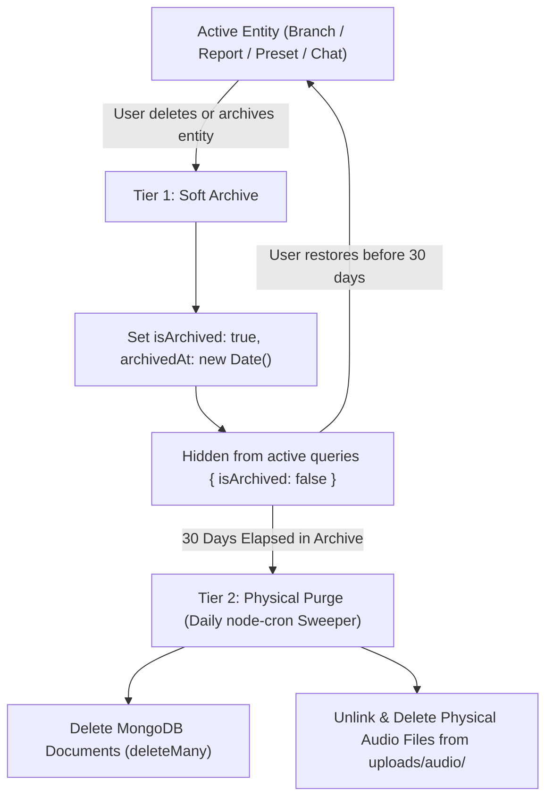

#### 4.3.1 Tier 1: Soft Archive Semantics
- When a supervisor deletes a Branch, Report, Preset, or Chat, the backend never executes a direct MongoDB `deleteOne()` or `deleteMany()`.
- Instead, the entity executes a soft archive:
  ```javascript
  entity.isArchived = true;
  entity.archivedAt = new Date();
  await entity.save();
  ```
- **Report & Chat Archive Cascading Invariant**: When soft-archiving a `Report`, its linked `Chat` document must be simultaneously marked `isArchived: true, archivedAt: new Date()` within a shared database transaction to maintain 1:1 state synchronization.
- **Query Scoping**: All normal service queries automatically include `{ isArchived: false }` unless the client explicitly passes the query parameter `?archived=true`.
- **Restoration**: Users can restore any archived entity within the 30-day grace window via `PATCH /api/v1/<resource>/:id/restore`, which atomically resets `isArchived: false` and `archivedAt: null` across the entity and any linked conversation node.

#### 4.3.2 Tier 2: Physical Purge Sweeper Engine (`jobs/sweeperJob.js`)
- A background scheduler executed via `node-cron` runs once daily at midnight (`0 0 * * *`), wrapping all multi-document purges in atomic Mongoose sessions:
  ```javascript
  /**
   * @function runArchiveSweeper
   * @description Permanently deletes entities soft-archived for more than 30 consecutive days within atomic transactions.
   */
  export const runArchiveSweeper = async () => {
    const thirtyDaysAgo = new Date(Date.now() - 30 * 24 * 60 * 60 * 1000);
    
    // 1. Identify and purge eligible archived Reports
    const expiredReports = await Report.find({ isArchived: true, archivedAt: { $lte: thirtyDaysAgo } });
    for (const report of expiredReports) {
      const session = await mongoose.startSession();
      try {
        await session.withTransaction(async () => {
          // Cascade delete linked Chat and Messages atomically
          if (report.chat) {
            await Message.deleteMany({ chat: report.chat }, { session });
            await Chat.deleteOne({ _id: report.chat }, { session });
          }
          await Report.deleteOne({ _id: report._id }, { session });
        });
      } finally {
        session.endSession();
      }

      // Unlink physical audio files from uploads/audio/ post-commit
      for (const audio of report.audioFiles) {
        await fs.promises.unlink(audio.path).catch(() => {});
      }
    }

    // 2. Purge eligible archived general Chats and unlinked Messages
    const expiredChats = await Chat.find({ isArchived: true, archivedAt: { $lte: thirtyDaysAgo } });
    for (const chat of expiredChats) {
      const messages = await Message.find({ chat: chat._id });
      const session = await mongoose.startSession();
      try {
        await session.withTransaction(async () => {
          await Message.deleteMany({ chat: chat._id }, { session });
          await Chat.deleteOne({ _id: chat._id }, { session });
        });
      } finally {
        session.endSession();
      }

      // Unlink general chat audio files post-commit
      for (const msg of messages) {
        if (msg.audio?.path) {
          await fs.promises.unlink(msg.audio.path).catch(() => {});
        }
      }
    }

    // 3. Purge eligible archived Branches
    await Branch.deleteMany({ isArchived: true, archivedAt: { $lte: thirtyDaysAgo } });

    // 4. Purge eligible archived Presets
    await Preset.deleteMany({ isArchived: true, archivedAt: { $lte: thirtyDaysAgo } });
  };
  ```

#### 4.3.3 Historical Snapshot Resilience (Zero Dangling Reference Breakage)
- When a company branch is permanently purged by the 30-day sweeper, existing historical reports referencing that branch `_id` will encounter a null population result.
- Because `Report` stores immutable snapshots (`branchName`, `supervisorName`, and per-visit `branchName`), the plain-text renderer `utils/reportRenderer.js` **never depends on population**. The historical plain-text Amharic report continues to render with 100% fidelity indefinitely.

---

### 4.4 Schema Validation Rules & Express-Validator Ingress Matrix

Validation occurs at two distinct application boundaries:

| Entity | Layer 1: Ingress Validation (`express-validator`) | Layer 2: Persistence Defense (Mongoose Schema) |
|---|---|---|
| **User Registration** | `firstName`, `lastName` (not empty); `email` (isEmail, normalizeEmail); `password` (min length 8). | `unique: true`, regex on `email`, bcrypt pre-save hash. |
| **Branch** | `name` (trimmed, 1–100 chars); `phone` (optional, valid format); `address` (optional, max 250 chars). | `normalizedName` lowercase, compound unique `{ user: 1, normalizedName: 1 }`. |
| **Report Creation** | `branch` (isMongoId); `date` (isISO8601); `clockIn`, `clockOut` (regex `^([01]\d\|2[0-3]):([0-5]\d)$`); `visits` (valid array of time intervals). | `supervisorName`, `branchName` snapshots required; subdocument validators for activities and issues. |
| **Chat Message** | `text` (required string unless audio file present); `audio` (Multer MIME validation). | `sender` enum, compound index on `{ chat: 1, createdAt: 1 }`. |
| **Preset** | `name` (1–100 chars); `persona` (required text); `system` (required text). | Compound unique `{ user: 1, name: 1 }`. |

---

# Section 5: Chat, Message & Conversation Node Architecture

### 5.1 Dual Conversation Node Taxonomy

The application implements a multi-turn conversational runtime supporting two distinct node types: **Report Chats** and **General Chats**.

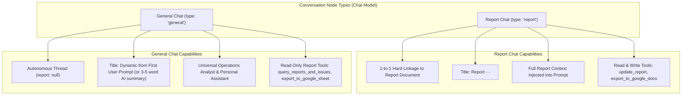

#### 5.1.1 Report Chat (`type: 'report'`) — Operational Refinement Co-Pilot
- **Scope & Persona**: The agent operates as a specialized operational co-pilot dedicated exclusively to the active report. It possesses deep, real-time contextual awareness of the report's date, supervisor identity, primary branch, visit intervals, activities, issues, general comments, and plain-text assembly.
- **1-to-1 Relationship Invariant**:
  - Bound to exactly one `Report` document via `chat.report` (`Schema.Types.ObjectId`).
  - Enforced by a MongoDB partial unique index:
    `chatSchema.index({ report: 1 }, { unique: true, partialFilterExpression: { report: { $type: 'objectId' } } })`.
  - Exactly one conversation node may exist per report. Creating a second chat for an existing report is physically impossible.
- **Deterministic Titling**:
  - Automatically derived upon report association: `Report - <branchName> - <DD-MM-YY>` (e.g., `"Report - Bole - 08-01-17"`).
  - Synchronizes if the report's primary branch or calendar date is updated.
- **Available Tool Set (Read & Write)**:
  - `get_report_context`: Fetches current report JSON and assembled plain-text string.
  - `update_report`: Mutates report fields (shift hours, visits, activities, issues, comments) and automatically triggers deterministic re-rendering via `utils/reportRenderer.js`.
  - `export_report_to_google_docs`: Exports the active report text to Google Docs using the user's Google OAuth tokens (`drive.file` scope).
  - `export_to_google_sheet`: Exports current report activities/issues to a live Google Sheet.
  - `list_branches`: Lists user branches for name validation.
  - `create_branch`: Adds a new branch location if the supervisor mentions an unlisted store.
  - *(Note: Workplace transliteration & technical terminology are injected directly into the LLM system prompt via dynamic few-shot learning from the user's last 3–5 approved reports, completely eliminating static database glossary tables and runtime dictionary queries).*

#### 5.1.2 General Chat (`type: 'general'`) — Universal Operations Analyst & Personal Assistant
- **Scope & Persona**: The agent operates as a universal operations analyst, business writing co-pilot, and versatile personal assistant. It is decoupled from any single report (`report: null`), enabling supervisors to query cross-branch historical data, generate Google Sheets across date ranges, draft formal management escalations, review SOP compliance, and perform general inquiries outside company boundaries.
- **Strict Read-Only Guarantee on Reports**:
  - General Chat is **strictly prohibited from mutating existing report documents**.
  - The `update_report` tool is **never registered** in General Chat contexts.
  - Can query historical reports, aggregate activities/issues across branches and dates, and generate Google Sheets, but cannot alter historical records.
- **Dynamic Titling Mechanics**:
  - Initializes upon blank creation as `"New Chat"`.
  - **Automatic Derivation from Prompt**: Upon receiving the supervisor's **first message**, the title is immediately set to the first 35 characters of the prompt (cleanly word-wrapped), or a concise 3–5 word AI summary (e.g., `"የፎይል አቅርቦት እና ስቶር እጥረት"`).
  - **Manual Renaming**: The supervisor may manually rename the chat at any time via `PATCH /api/v1/chats/:chatId` (`{ title }`).

---

### 5.2 Comprehensive General Chat Request Catalog

General Chat accommodates a wide variety of supervisory workflows across seven major operational archetypes:

#### 5.2.1 Cross-Branch Operational Analytics & Historical Issue Tracking
Supervisors can filter, aggregate, and compare historical performance across branches, dates, and statuses:
1. **Multi-Branch Issue Queries**:
   - *"Get me all Bole branch issues with status 'reported' between 01-01-17 and 15-01-17."*
   - *"Which branches experienced stockouts or machinery failures this past week?"*
   - *"List all unresolved maintenance issues across Sarbet and Megnagna branches."*
2. **Activity & Audit History**:
   - *"Show me all deep-cleaning and cash reconciliation activities completed across all branches this month."*
   - *"List all branches visited on Monday and Tuesday with recorded arrival and departure times."*
3. **Frequency & Trend Detection**:
   - *"How many times did foil shortage or POS machine downtime occur in the last 30 days?"*
   - *"Which branch had the highest volume of reported issues this month?"*
4. **Shift & Working Hours Breakdown**:
   - *"Calculate the total hours I spent on-site across all branches last week."*
   - *"Compare total inspection hours between Bole and Piassa branches."*

#### 5.2.2 Structured Document & Live Google Sheets Generation (`export_to_google_sheet`)
Supervisors can command the AI to aggregate operational data and instantly generate an accessible spreadsheet in Google Workspace:
1. **Multi-Branch Issue Spreadsheets**:
   - Prompt: *"Export all unresolved issues across all branches for the last 14 days into a Google Sheet so I can share it with corporate maintenance."*
   - Backend Execution:
     - Agent invokes tool: `export_to_google_sheet({ type: 'issues', status: 'reported', startDate, endDate })`.
     - Queries MongoDB, instantiates Google Sheets API (v4) using the user's OAuth access token (`drive.file` scope).
     - Creates sheet titled `Unresolved Issues - <dateRange>`.
     - Writes headers: `ቀን (Date) | ብራንች (Branch) | ችግር (Issue Description) | ሁኔታ (Status) | ተቆጣጣሪ (Supervisor)`.
     - Returns direct link: `https://docs.google.com/spreadsheets/d/<spreadsheetId>/edit`.
   - In-Chat Response: Displays Amharic summary plus a clickable action button: `[በ Google Sheet ክፈት 📊]`.
2. **Timeline & Shift Logs**:
   - *"Create a Google Sheet tracking my daily arrival and departure times across all branches for the month of Meskerem."*
3. **In-Chat Markdown Tabular Summaries**:
   - *"Format all kitchen equipment maintenance requests from this week into a comparison table here in the chat."*

#### 5.2.3 Corporate Memos, Management Escalations & Meeting Agendas (Amharic)
Field findings frequently require formal corporate escalation:
1. **Executive Escalation Letters**:
   - *"Draft a formal Amharic memo to the Supply Chain Director explaining the ongoing foil shortage at Bole branch, highlighting the 6,630 ETB daily financial loss from outside purchases, and urging immediate warehouse delivery."*
   - *"Help me write an urgent maintenance escalation memo to Operations regarding the broken deep fryer at Sarbet."*
2. **Branch Manager Meeting Agendas**:
   - *"Based on the customer service complaints reported at Piassa this week, draft an agenda for my branch manager meeting tomorrow morning."*
3. **Supervisory Feedback & HR Notes**:
   - *"Draft a professional supervisory feedback note to a branch shift leader regarding uniform hygiene and cash drawer reconciliation."*

#### 5.2.4 SOP Guidance, Compliance & Technical Troubleshooting
Immediate operational decision support while on-site:
1. **Standard Operating Procedure (SOP) Verification**:
   - *"What are the standard checklist steps for closing cash reconciliation at the end of the shift according to company policy?"*
   - *"What is the approved procedure for logging expired raw meat in the kitchen waste log?"*
2. **Equipment Troubleshooting**:
   - *"The POS machine at Bole is displaying a network timeout error during lunch rush. What are the standard troubleshooting steps before calling IT?"*
   - *"What is the emergency protocol if the branch water supply is cut off during operational hours?"*

#### 5.2.5 Financial Impact & Shortage Calculations
1. **Financial Waste Projections**:
   - *"If Bole purchases foil from local retailers at 6,630 ETB per week, calculate the projected 3-month financial loss if the central warehouse does not supply."*
   - *"Calculate total overtime labor cost if 3 employees work 2 additional hours each day for 6 days."*
2. **Visit Route Optimization**:
   - *"I need to inspect Bole, Sarbet, and Megnagna tomorrow between 08:30 and 17:00. Considering lunchtime traffic and rush hours, suggest an optimal visit sequence and time allocation."*

#### 5.2.6 Workplace Transliteration & In-Context Phonetic Guidance
1. **Phonetic Terminology Lookup & Guidance**:
   - *"What is the standard Amharic Ge'ez transliteration for 'soft serve machine' or 'grease trap'?"*
   - The agent responds directly in natural Amharic providing canonical workplace Ge'ez transliterations (e.g., `ሶፍት ሰርቭ ማሽን`, `ግሪስ ትራፕ`) adhering to corporate phonetic standards.
2. **Dynamic In-Context Few-Shot Learning**:
   - Rather than maintaining a separate MongoDB `Glossary` collection and performing manual CRUD, the backend dynamically queries the supervisor's last 3–5 approved reports at prompt compilation time.
   - The verified transliterations and equipment names from those historical reports are injected directly into the LLM system prompt as concrete few-shot examples.
   - This ensures continuous, self-reinforcing vocabulary consistency across operational shifts with zero administrative overhead.

#### 5.2.7 Open-Ended Personal Productivity & Executive Advisory
Because General Chat operates as an unconstrained personal assistant:
- Drafting personal communications, proofreading Amharic texts, formulating constructive negotiation strategies with branch managers, and personal daily time management.

---

### 5.3 Dynamic AI Configuration & Inception / Mid-Chat Preset Switching

The chat system enables supervisors to customize or reconfigure the AI runtime **either before the conversation begins or at any turn mid-chat**:

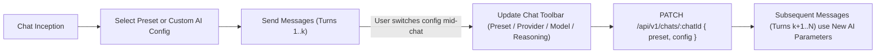

#### 5.3.1 Configurable AI Runtime Parameters
The supervisor can adjust four core execution parameters per chat session:
1. **Provider (`addis` | `google` | `nvidia`)**: Selects the active LLM backend.
2. **Model (`String`)**: Specific model identifier under the selected provider:
   - Google: `gemini-2.5-flash`, `gemini-2.5-flash-lite`
   - Addis AI: `addis-1-alef`
   - Nvidia: `meta/llama-3.1-nemotron-70b-instruct`
3. **Language (`'am'` | `'en'`)**: Primary generation language (defaults to Amharic `'am'`).
4. **Reasoning (`Boolean`)**: Enables or disables deep reasoning / chain-of-thought traces for supported reasoning models (capturing `.candidates[0].content.parts[].thought`).

#### 5.3.2 Preset Selection & Mid-Chat Creation Modal
- **Initial Selection**: When opening a new chat, the composer defaults to the user's default `Preset` (or general assistant prompt). The supervisor can select an existing preset from a dropdown selector.
- **Mid-Chat Switching**: At any turn in the conversation, the supervisor can open the Preset selector and switch to a different preset (e.g., switching from *"Kitchen Hygiene Audit"* to *"Management Escalation Mode"*).
- **In-Chat Preset Creation**:
  - The dropdown includes a **"Create New Preset"** action button.
  - Clicking mounts an inline Material-UI modal (`MuiDialog`) containing:
    - Preset Name (`MuiTextField`)
    - Persona (`MuiTextField`, multiline)
    - System Guidelines / Operational Rules (`MuiTextField`, multiline)
  - Submitting creates the `Preset` in MongoDB (`POST /api/v1/presets`) and immediately sets it as `chat.preset` without clearing or interrupting thread history.

#### 5.3.3 Historical Audit Trail & Per-Message Immutability
- When a supervisor switches presets, providers, models, or reasoning mid-chat, the change applies strictly to **future messages**.
- Every individual `Message` document permanently freezes:
  - `message.provider` (`'addis' | 'google' | 'nvidia'`)
  - `message.model` (e.g., `'gemini-2.5-flash'`)
  - `message.language` (`'am' | 'en'`)
  - `message.reasoning` (thinking trace text, if enabled)
  - `message.tokensUsed` (prompt, completion, and total tokens)
- This guarantees full auditing integrity: past turns visibly display which provider and model generated them, even within a single multi-model conversation.

---

### 5.4 Universal Navigation Entry Points, Permanent Sidebar "New Chat" & Outlet Layout

The application provides persistent entry points and layout rules ensuring supervisors can seamlessly initiate or resume conversations from anywhere in the platform:

| Entry Point | UI Location | Trigger Mechanism | Target Route & Behavior |
|---|---|---|---|
| **1. Permanent Sidebar "New Chat"** | Top of Sidebar (above Recent Chats) | Clicking `[ + New Chat ]` button (or compact icon in mini-rail) | Navigates directly to `/chat`, resetting conversation state and presenting a fresh, empty composer ready for general inquiry or new report synthesis. |
| **2. Sidebar Recent Chats List** | AppShell drawer (recent list) | Clicking any chat item in the recent chats list | Navigates directly to `/chat/:chatId`. List is paginated, auto-refreshes on `updatedAt: -1`, and displays an icon badge indicating `Report` vs `General`. |
| **3. Reports Card/List View** | `/reports` (Card / List layout) | Clicking `"Refine with AI / Open Chat"` button on report card | Invokes idempotent resolution `POST /api/v1/reports/:reportId/chat` (retrieves existing chat or creates new linked node) and redirects to `/chat/:chatId`. |
| **4. Reports DataGrid View** | `/reports` (MuiDataGrid layout) | Clicking Chat icon button in the row action column | Invokes idempotent resolution `POST /api/v1/reports/:reportId/chat` and navigates to `/chat/:chatId`. |

#### 5.4.1 Permanent Sidebar "New Chat" Button & Mini-Rail Adaptation
- **Expanded Drawer State**: A full-width, high-visibility button (`[ + New Chat ]`) rendered with Material-UI `Button` (variant `contained`, startIcon `AddIcon`).
- **Collapsed Mini-Rail State (64px width)**: When the sidebar collapses to the compact icon rail on desktop, the button automatically transforms into an icon-only button wrapped in a Material-UI `Tooltip` (`title="New Chat"`, `placement="right"`).
- **Universal Availability**: The button remains anchored at the top of the sidebar across all views (`/reports`, `/branches`, `/profile`, `/chat/:chatId`), giving the supervisor instant 1-click access to a new conversation without navigating through intermediate screens.

#### 5.4.2 Chat View Outlet Architecture & Zero Inner Chat Header
- **Single Header Invariant**: The Chat View rendered via React Router `<Outlet />` inside `AppShell` deliberately possesses **zero inner chat header**.
- **No Duplicate Toolbars**: The top application bar is provided exclusively by `AppShell`'s sticky `MuiAppbar` (displaying application branding, breadcrumb title, theme toggle, and user avatar).
- **Maximized Vertical Viewport**: By removing redundant nested headers inside the outlet, 100% of the outlet's vertical space is dedicated to the chronological message timeline and the pinned bottom composer. Message cards scroll smoothly underneath the global sticky app bar.

---

### 5.5 In-Thread Action Icons & Linear Downstream Truncation Mechanics

To prevent branching conversation trees, context divergence, and hallucinated state mutations, threads enforce a **strictly linear history timeline**.

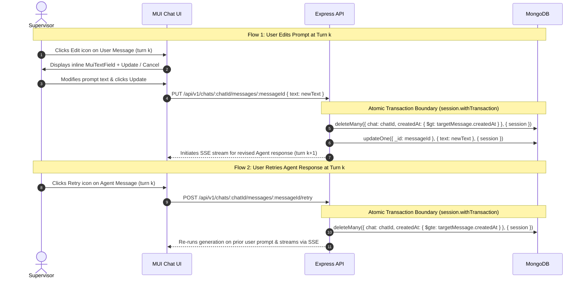

#### 5.5.1 User Message Action Icons
1. **Copy Prompt**: Copies user message text to clipboard.
2. **Edit Prompt**:
   - Replaces the message bubble with an inline `MuiTextField` editor equipped with "Update" and "Cancel" buttons.
   - **Linear Downstream Truncation (Atomic Session Transaction)**: Clicking Update causes the backend to permanently delete all messages in MongoDB where `chat: chatId` and `createdAt > targetMessage.createdAt`, and update the target message text within a single atomic `session.withTransaction(async () => { ... })` passing `{ session }` to both operations.
   - Once the transaction successfully commits, the server immediately begins streaming the new agent response from that fork point forward.

#### 5.5.2 Agent Message Action Icons
1. **Copy Response**: Copies generated response text or plain-text report directly to clipboard.
2. **Retry Generation**:
   - Clicking Retry permanently deletes the target agent response and any subsequent messages where `chat: chatId` and `createdAt >= targetMessage.createdAt` within an atomic transaction passing `{ session }`.
   - Re-executes LLM generation on the immediately preceding user prompt and streams the fresh response.

---

### 5.6 Multi-Modal Audio Dictation Flow (Mode 3 Ephemeral Voice Notes)

To eliminate typing fatigue, supervisors can narrate instructions, report updates, or conversational queries directly into the chat composer using the pulsating Audio Orb:

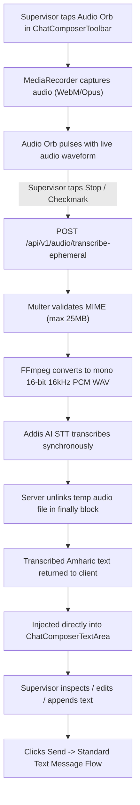

#### 5.6.1 The In-Composer Dictation Lifecycle
1. **Audio Capture**: Handled via browser `MediaRecorder` API recording into `audio/webm;codecs=opus` (with MP4 fallback for iOS Safari).
2. **Ephemeral Upload (`POST /api/v1/audio/transcribe-ephemeral`)**: Single audio file uploaded under field name `audio`.
3. **FFmpeg Normalization**: Converted to mono 16-bit 16kHz PCM WAV format via `fluent-ffmpeg`.
4. **Synchronous Addis AI STT**: Transcribed via official `addisai` SDK bounded by `AI_TIMEOUT_MS`.
5. **Zero Persistence Invariant**: Ephemeral voice notes are **never saved to MongoDB** and **never persisted in physical storage**. The uploaded file is unlinked immediately in an Express `finally` block.
6. **In-Composer Inspection**: The transcribed Amharic text is injected directly into `ChatComposerTextArea`. The supervisor can review the Ge'ez text, make minor edits, or append additional comments via keyboard before submitting.
7. **Submission**: Submitting sends a standard `POST /api/v1/chats/:chatId/messages` text payload, initiating token-by-token LLM generation.

#### 5.6.2 The 9-Point Edge-Case Defense Matrix for Voice Dictation
| # | Edge Case | Mitigation & Architectural Defense |
|---|---|---|
| **1** | **Microphone Permission Denied / Revoked** | Caught via `navigator.mediaDevices.getUserMedia()` error handler. Displays inline `MuiAlert` explaining how to allow microphone access in browser settings; composer seamlessly falls back to keyboard input. |
| **2** | **Zero Acoustic Input / Absolute Silence** | A Web Audio API `AnalyserNode` monitors real-time RMS power. If acoustic energy remains below threshold throughout recording, upload is cancelled with a toast: `"No speech detected. Please speak into your microphone."`, conserving STT API quota. |
| **3** | **Tab Switch / Background Sleep** | A `document.addEventListener('visibilitychange')` listener automatically finalizes and stops recording if the user switches browser tabs, preventing corrupted audio buffers. |
| **4** | **Network Drop During Upload** | The audio Blob is cached in memory. If upload fails, an inline retry chip appears on the composer: `[ 🔄 Retry Transcription ]`, ensuring the user never loses spoken narration. |
| **5** | **STT Timeout / Provider 5xx Outage** | Bounded strictly by `AI_TIMEOUT_MS`. Upon timeout or provider failure, the UI displays an error toast with options to retry or proceed with keyboard entry. |
| **6** | **Interleaving Voice & Typing** | Voice dictation appends text at the current textarea cursor position (`selectionStart`), preserving previously typed text without destructive replacement. |
| **7** | **Duration Hard-Cap Guardrail** | Maximum 120 seconds per voice note. A visual countdown timer warns the user at 100 seconds and auto-stops cleanly at 120 seconds. |
| **8** | **Acoustic Quality Gate** | If Addis AI STT returns an empty string or low-confidence noise tokens, the composer displays a gentle prompt: `"ድምፅዎ በደንብ አልተሰማም። እባክዎ በድጋሚ ይናገሩ"` without polluting the textarea. |
| **9** | **Zero Orphaned Disk Leaks** | Backend Multer disk files are strictly cleaned up inside a `finally` block on the Express route, guaranteeing zero orphaned `.wav` files on disk even during process crashes or aborts. |

---

### 5.7 Concurrency Control, Stream Locking & Abort Mechanics

To prevent duplicate requests, race conditions, and corrupted database states caused by rapid double-clicks:

1. **In-Memory Per-Chat Stream Lock**:
   - The backend maintains an active stream registry: `const activeChatStreams = new Map<string, AbortController>();`.
   - Keyed by `chatId.toString()`.
2. **HTTP 409 Conflict Rejection**:
   - If a user sends a message, edits a prompt, or triggers a retry while a stream is actively writing on that `chatId`:
     - The server rejects the incoming request immediately with **HTTP 409 Conflict**:
       `{ success: false, message: "A response is currently generating for this chat. Please wait for completion or abort the active response." }`.
3. **Client-Side "Stop Generation" Button**:
   - While streaming, the chat composer's "Send" button morphs into a red "Stop Generation" button.
   - Clicking invokes `POST /api/v1/chats/:chatId/abort`:
     - The server looks up `activeChatStreams.get(chatId)` and invokes `.abort()`.
     - Upstream LLM connection is severed, the active SSE stream is cleanly terminated, the partial generated text is saved to MongoDB, and the chat lock is released.

---

### 5.8 Typing Performance Guarantee & Input Fluidity

To ensure effortless, zero-latency interaction during intensive operational reporting:

1. **Strict Sub-5ms Input Render Budget**:
   - Keystrokes in `ChatComposerTextArea` must render within $< 5$ms to sustain a guaranteed 60fps typing experience.
2. **Component Memoization & Tree Isolation**:
   - The `ChatComposer` component is decoupled from the historical message list via strict `React.memo` boundaries and localized state.
   - Keystroke events never trigger re-renders of previous message cards, tool execution chips, or preview drawers.
3. **GPU-Accelerated CSS Animations**:
   - Audio Orb pulsing, wave visualizers, and streaming cursors run exclusively on GPU-composited CSS properties (`transform: scale(...)`, `opacity`).
   - Animations bypass the JavaScript thread entirely, preventing layout recalculation (`reflow`) and eliminating typing jank even in threads with 50+ messages.
---

# Section 6: Audio Pipeline, FFmpeg Preprocessing & Addis AI STT Engine

### 6.1 In-Browser Audio Capture & Multi-Modal Ingestion Architecture

The application provides a seamless, fault-tolerant audio capture system engineered specifically for mobile and desktop field supervisors. Audio input operates across two major UI surfaces: the **10-Row Report Initiation Form** (`/chat`) and the **Multi-Turn Chat Composer** (`/chat/:chatId`).

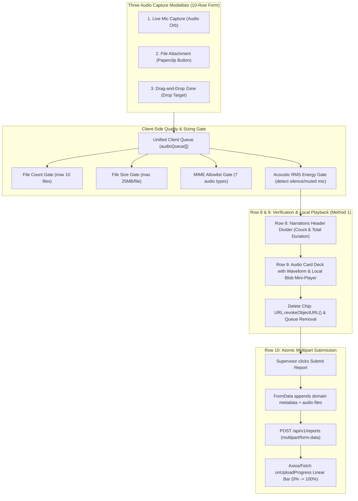

#### 6.1.1 Browser MediaRecorder Configuration & Cross-Platform Codecs
- **Primary Codec Selection**: Recording uses the browser `MediaRecorder` API targeting `audio/webm;codecs=opus` with audio constraints:
  ```javascript
  const constraints = {
    audio: {
      channelCount: 1,
      sampleRate: 16000,
      echoCancellation: true,
      noiseSuppression: true,
      autoGainControl: true,
    }
  };
  ```
- **iOS Safari Fallback**: If `MediaRecorder.isTypeSupported('audio/webm;codecs=opus')` returns false (e.g. iOS WebKit), the recorder automatically falls back to `audio/mp4` or `audio/aac`.
- **Blob Conversion**: When the supervisor stops recording, the recorded chunks are assembled into a native `Blob` and wrapped in a standard `File` object:
  ```javascript
  const recordedBlob = new Blob(audioChunks, { type: supportedMimeType });
  const audioFile = new File([recordedBlob], `narration-${Date.now()}.${extension}`, { type: supportedMimeType });
  ```

#### 6.1.2 Real-Time Acoustic Visualizer & Silent Recording Guardrail
- **AudioContext & AnalyserNode**: While recording, the client instantiates a Web Audio API `AudioContext` and connects an `AnalyserNode` with `fftSize: 256` to sample real-time RMS power and frequency bins.
- **Waveform UI**: The Audio Orb dynamically expands, rendering a smooth SVG or canvas-based waveform that pulses in direct synchrony with the supervisor's voice amplitude.
- **Silence & Muted Mic Detection**: The visualizer calculates the average RMS power over the recording interval. If acoustic power remains below `0.01` throughout the recording:
  - The client aborts upload.
  - Displays an inline Material-UI toast: `"ምንም ድምፅ አልተገኘም። እባክዎ ማይክሮፎንዎን ያረጋግጡ (No audio detected. Please check your microphone)"`.
  - Prevents burning Addis AI STT API quota on blank acoustic data.

#### 6.1.3 Duration Hard-Cap Guardrail (120-Second Cap)
- **Hard Cap**: Individual audio narrations are capped at **120 seconds** to optimize transcription accuracy and maintain bounded server processing times.
- **Visual Warning**: An interactive countdown timer displays recorded time (`MM:SS`). At 100 seconds (20 seconds remaining), the timer transitions from neutral to warning amber (`warning.main`) with subtle pulsing.
- **Automatic Finalization**: At 120 seconds, `MediaRecorder.stop()` triggers automatically, finalizing the clip cleanly without corrupting the audio buffer.

#### 6.1.4 The Three Ingestion Modalities in the 10-Row Form (Row 7)
1. **Live Mic Capture (Audio Orb)**: Centered pulsating button in Row 7. Tapping toggles between idle and active recording states.
2. **File Attachment (Paperclip Button)**: A prominent Material-UI button `[ 📎 Attach Audio Files ]` opens a hidden `<input type="file" accept="audio/*" multiple />`, allowing the supervisor to attach pre-recorded voice memos from their phone or computer.
3. **Interactive Drag-and-Drop Zone**: The entire Row 7 container functions as an HTML5 drag-and-drop target. Dragging audio files over the container activates a high-contrast dashed border and displays a bilingual drop overlay: `[ 🎙️ ፋይሎችን እዚህ ይልቀቁ / Drop audio recordings here ]`. Dropping extracts `e.dataTransfer.files`, filtering strictly for valid audio MIME types.

#### 6.1.5 Unified Client-Side Audio Queue State (`audioQueue[]`)
All three modalities push normalized items into a single unified client-side state:
```javascript
/**
 * @typedef {Object} QueuedAudioItem
 * @property {string} id - Client-side UUID (crypto.randomUUID())
 * @property {File} file - Native browser File object for FormData ingestion
 * @property {string} name - User-facing display name
 * @property {number} size - File size in bytes
 * @property {number} duration - Exact duration in seconds
 * @property {string} localBlobUrl - In-memory object URL (URL.createObjectURL(file))
 * @property {'recorded' | 'attached' | 'dropped'} source - Acquisition modality
 */
```

#### 6.1.6 Row 8 & 9: Verification Cards & Mini-Player (Method 1)
- **Row 8 (Divider Header)**: When `audioQueue.length > 0`, Row 8 renders a clean divider: `Narrations (k files, MM:SS total duration)`.
- **Row 9 (Audio Card Deck)**: Each queued clip renders as a compact horizontal card featuring:
  - Audio waveform icon and file name.
  - File size chip and duration chip.
  - **Inline Mini-Player**: Play/pause toggle playing directly from `item.localBlobUrl`. Playback is 100% in-memory with zero network latency.
  - **Delete Chip**: Tapping `[ ✕ ]` invokes `URL.revokeObjectURL(item.localBlobUrl)` to prevent memory leaks and removes the file from `audioQueue`.

#### 6.1.7 Row 10: Atomic Multipart Submission
Submitting the form constructs a single `FormData` payload containing both domain metadata and the accumulated audio files:
```javascript
const formData = new FormData();
formData.append('date', reportData.date);
formData.append('branch', reportData.branch);
formData.append('clockIn', reportData.clockIn);
formData.append('clockOut', reportData.clockOut);
if (reportData.visits && reportData.visits.length > 0) {
  formData.append('visits', JSON.stringify(reportData.visits));
}

// Append all files under field name 'audio' matching Multer array expectation
audioQueue.forEach((item) => {
  formData.append('audio', item.file, item.name);
});
```

---

### 6.2 Multer Server-Side Ingestion & Security Hardening

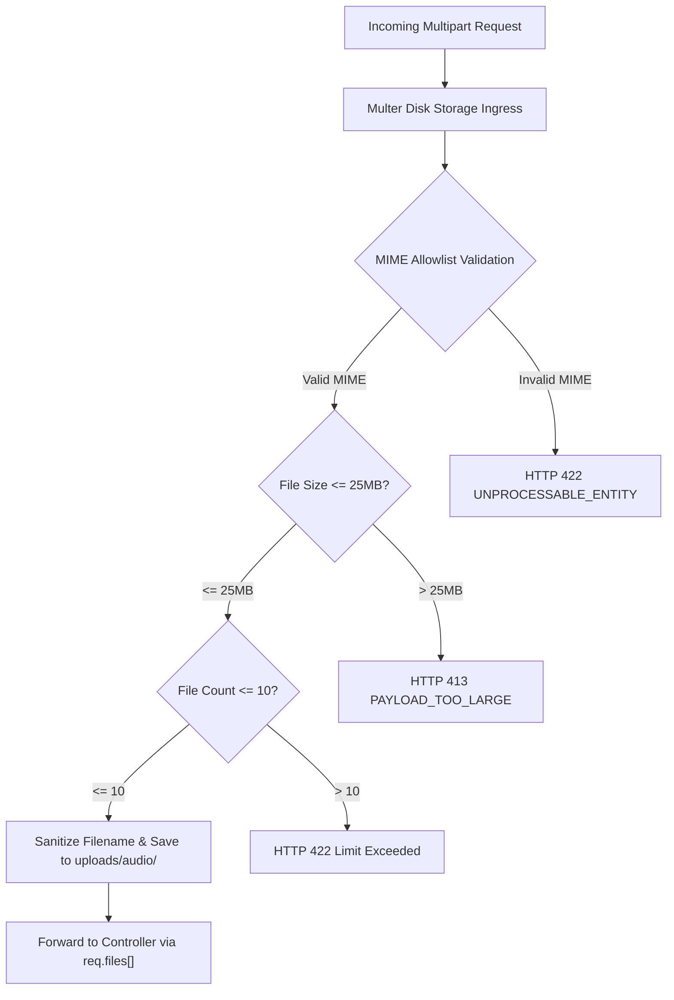

#### 6.2.1 Storage Directory & Initialization
- **Physical Directory**: Uploaded audio is stored in `uploads/audio/` (strictly gitignored).
- **Directory Bootstrapping**: On backend startup, `server.js` verifies directory existence via `node:fs` (`fs.mkdirSync('uploads/audio/', { recursive: true })`), ensuring that fresh deployments never fail on missing upload directories.

#### 6.2.2 Strict MIME Allowlist
Incoming files are validated at the stream boundary via Multer's `fileFilter`. Only the following 7 audio formats are permitted:
- `audio/webm`
- `audio/wav`
- `audio/mp3`
- `audio/mpeg`
- `audio/m4a`
- `audio/ogg`
- `audio/aac`

Any file outside this allowlist is rejected immediately with an HTTP 422 `UNPROCESSABLE_ENTITY` error:
`{ "success": false, "message": "Invalid audio file format. Allowed formats: webm, wav, mp3, m4a, ogg, aac.", "data": null }`.

#### 6.2.3 File Capacity & Size Envelopes
- **Report Creation (`POST /api/v1/reports`)**: Handled by `upload.array('audio', 10)`. Max 25MB per file, maximum 10 audio files per submission.
- **Ephemeral Dictation (`POST /api/v1/audio/transcribe-ephemeral`)**: Handled by `upload.single('audio')`. Max 25MB, exactly 1 file.
- **Chat Message Attachment (`POST /api/v1/chats/:chatId/messages`)**: Handled by `upload.single('audio')`. Max 25MB, exactly 1 file.
- **Payload Too Large (HTTP 413)**: Any file exceeding 25MB triggers Multer's `LIMIT_FILE_SIZE` error, returning HTTP 413 `PAYLOAD_TOO_LARGE`.

#### 6.2.4 Cryptographic Filename Sanitization
To prevent path traversal, filename collisions, and malicious script execution, all saved files are renamed upon ingress using cryptographically secure random tokens:
```javascript
const storage = multer.diskStorage({
  destination: (req, file, cb) => {
    cb(null, 'uploads/audio/');
  },
  filename: (req, file, cb) => {
    const ext = path.extname(file.originalname).toLowerCase() || '.webm';
    const randomBytes = crypto.randomBytes(8).toString('hex');
    const prefix = req.params.chatId ? `chat-${req.params.chatId}` : 'narration';
    cb(null, `${prefix}-${Date.now()}-${randomBytes}${ext}`);
  }
});
```

---

### 6.3 FFmpeg Audio Normalization & Acoustic Segmentation Engine

To guarantee pristine transcription accuracy across Addis AI STT, all uploaded audio is normalized through system FFmpeg into a standardized acoustic profile.

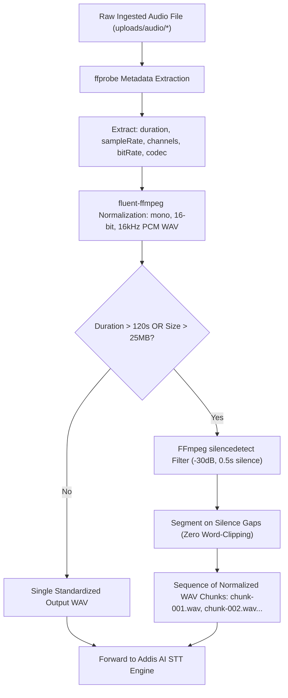

#### 6.3.1 Dynamic Binary Path Resolution
FFmpeg and FFprobe binary paths are loaded dynamically from `config/env.js`, falling back cleanly to the system `PATH`:
```javascript
import ffmpeg from 'fluent-ffmpeg';
import { env } from '../config/env.js';

if (env.FFMPEG_PATH) {
  ffmpeg.setFfmpegPath(env.FFMPEG_PATH);
}
if (env.FFPROBE_PATH) {
  ffmpeg.setFfprobePath(env.FFPROBE_PATH);
}
```

#### 6.3.2 Metadata Probing (`ffprobe`)
Before processing, `ffprobe` inspects the media stream to extract acoustic characteristics:
```javascript
/**
 * @function probeAudioMetadata
 * @param {string} filePath - Absolute path to uploaded file.
 * @returns {Promise<{ duration: number, sampleRate: number, channels: number, codec: string }>}
 */
export const probeAudioMetadata = (filePath) => {
  return new Promise((resolve, reject) => {
    ffmpeg.ffprobe(filePath, (err, metadata) => {
      if (err) return reject(err);
      const audioStream = metadata.streams.find(s => s.codec_type === 'audio');
      resolve({
        duration: parseFloat(metadata.format.duration || 0),
        sampleRate: parseInt(audioStream?.sample_rate || 0, 10),
        channels: parseInt(audioStream?.channels || 1, 10),
        codec: audioStream?.codec_name || 'unknown'
      });
    });
  });
};
```

#### 6.3.3 Acoustic Standardization (Mono 16-bit 16kHz PCM WAV)
Every incoming file is converted to mono 16-bit 16kHz PCM WAV format (`audio/wav`), the mathematically optimal acoustic configuration for Addis AI's Amharic acoustic models:
- **Channels (`-ac 1`)**: Downmixed to mono, eliminating phase cancellation from dual-mic smartphone recordings.
- **Sample Rate (`-ar 16000`)**: Resampled to 16,000 Hz.
- **Codec (`-c:a pcm_s16le`)**: Uncompressed 16-bit little-endian linear PCM.
```javascript
export const normalizeToWav = (inputPath, outputPath) => {
  return new Promise((resolve, reject) => {
    ffmpeg(inputPath)
      .noVideo()
      .audioChannels(1)
      .audioFrequency(16000)
      .audioCodec('pcm_s16le')
      .format('wav')
      .output(outputPath)
      .on('end', () => resolve(outputPath))
      .on('error', (err) => reject(err))
      .run();
  });
};
```

#### 6.3.4 Silence-Based Segmentation Algorithm (Preventing Mid-Word Truncation)
- If an uploaded recording exceeds **120 seconds** or **25MB**, naive fixed-duration slicing (e.g. cutting exactly at 60.0 seconds) risks severing Amharic words mid-syllable, corrupting Ge'ez phonetics.
- **Silence Detection Filter**: The engine executes FFmpeg's `silencedetect` filter:
  `-af silencedetect=noise=-30dB:d=0.5`
- **Dynamic Cut Points**: The engine parses silence start/end timestamps from the FFmpeg stderr output and selects split points located precisely within natural acoustic pauses closest to the 90–110 second interval.
- **Chunk Emission**: Generates sequential chunk files (`chunk-001.wav`, `chunk-002.wav`), guaranteeing that every spoken Amharic sentence remains linguistically intact.

---

### 6.4 Addis AI STT Engine & Synchronous Transcription Protocol

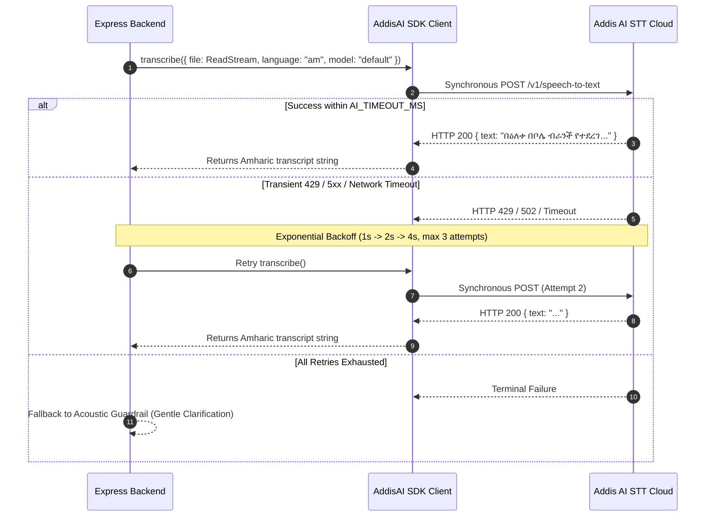

#### 6.4.1 Official SDK Client Initialization
The Addis AI client is instantiated strictly in `config/env.js` as an immutable singleton:
```javascript
import { AddisAI } from 'addisai';
import { env } from './env.js';

export const addisai = new AddisAI({
  apiKey: env.ADDIS_AI_API_KEY
});
```

#### 6.4.2 Synchronous Execution Protocol
Addis AI STT operates synchronously (not via WebSockets or streaming). Files and normalized chunks are dispatched directly via Node.js read streams:
```javascript
/**
 * @function transcribeAudioChunk
 * @param {string} wavPath - Path to normalized 16kHz PCM WAV file.
 * @returns {Promise<string>} Transcribed Amharic text.
 */
export const transcribeAudioChunk = async (wavPath) => {
  const fileStream = fs.createReadStream(wavPath);
  const response = await addisai.speechToText.transcribe({
    file: fileStream,
    language: 'am',
    model: 'default'
  });
  return response.text ? response.text.trim() : '';
};
```

#### 6.4.3 Timeout Bounding & Exponential Backoff Retry Matrix
- **Timeout Bound**: Every Addis AI request is wrapped in an `AbortSignal.timeout(env.AI_TIMEOUT_MS)` bounded strictly by `AI_TIMEOUT_MS` (default: 60,000ms).
- **Exponential Backoff Matrix**: If Addis AI returns HTTP 429 (Rate Limit), 500, 502, 503, or a network timeout, the engine executes up to 3 retries with deterministic delays:
  $$\text{Delay}_k = 2^{k-1} \times 1000\,\text{ms} \quad (k \in \{1, 2, 3\}) \implies 1\text{s} \rightarrow 2\text{s} \rightarrow 4\text{s}$$
- **Terminal Exhaustion**: If all 3 retries fail, the error is logged via Winston (`logger.error()`) and forwarded to the central error pipeline.

#### 6.4.4 Sequential Concatenation into Canonical `rawNarrationText`
When a report submission includes multiple audio files or segmented chunks:
1. Files and chunks are transcribed in strict chronological sequence ($1, 2, \dots, N$).
2. The individual Amharic transcripts are concatenated with a single whitespace delimiter.
3. The unified result is assigned to `report.rawTranscript` (and `message.transcription`), providing the LLM agent with the complete, unbroken operational narrative.

#### 6.4.5 Acoustic Quality Gate & Zero-Hallucination Guardrail
- If Addis AI returns an empty string `""` or low-confidence noise tokens (e.g. repetitive punctuation or acoustic artifacts), the server **never synthesizes or hallucinates report contents**.
- Instead, the agent prompts the supervisor for clarification:
  `"የተላከው የድምፅ መልዕክት ግልጽ አልነበረም። እባክዎ በድጋሚ ይናገሩ ወይም በጽሁፍ ያስገቡ (The voice recording was not clear. Please speak again or enter via text)."`

---

### 6.5 Mode 3 Ephemeral Voice Dictation Engine (`POST /api/v1/audio/transcribe-ephemeral`)

Mode 3 provides supervisors with a lightning-fast voice-typing experience directly inside the chat composer.

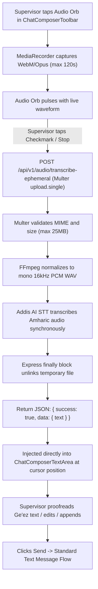

#### 6.5.1 Zero-Persistence Guarantee
- Ephemeral audio notes are **never written to MongoDB** and **never saved as persistent files in storage**.
- The temporary upload file on disk is unlinked immediately in an Express `finally` block:
  ```javascript
  export const transcribeEphemeralAudio = async (req, res, next) => {
    const tempPath = req.file?.path;
    let normalizedPath = null;
    try {
      if (!tempPath) {
        return res.status(HTTP_STATUS.BAD_REQUEST).json({
          success: false,
          message: 'No audio file provided',
          data: null
        });
      }
      normalizedPath = `${tempPath}-normalized.wav`;
      await normalizeToWav(tempPath, normalizedPath);
      const transcribedText = await transcribeAudioChunk(normalizedPath);

      return res.status(HTTP_STATUS.OK).json({
        success: true,
        message: 'Audio transcribed successfully',
        data: { text: transcribedText }
      });
    } catch (error) {
      next(error);
    } finally {
      // Guaranteed zero-orphan disk cleanup
      if (tempPath) await fs.promises.unlink(tempPath).catch(() => {});
      if (normalizedPath) await fs.promises.unlink(normalizedPath).catch(() => {});
    }
  };
  ```

#### 6.5.2 In-Composer Cursor Injection
- Upon receiving the transcribed Amharic text, the frontend calculates the composer textarea's `selectionStart` and `selectionEnd`.
- The text is inserted at the exact cursor position, preserving any text previously typed by the user without destructive replacement:
  ```javascript
  const insertTranscribedText = (transcribedText) => {
    const textarea = textareaRef.current;
    if (!textarea) return;
    const start = textarea.selectionStart;
    const end = textarea.selectionEnd;
    const current = textarea.value;
    const updated = current.substring(0, start) + transcribedText + current.substring(end);
    setValue('prompt', updated);
    // Restore cursor position after the newly inserted text
    setTimeout(() => {
      textarea.selectionStart = textarea.selectionEnd = start + transcribedText.length;
      textarea.focus();
    }, 0);
  };
  ```
- **Supervisor Control**: The supervisor inspects the Ge'ez text directly on screen, corrects any minor phonetic transliterations, and clicks **Send** when ready.

---

### 6.6 Chat Composer Audio Attachment Flow (Mode 4 Voice Note Messages)

When a supervisor wants to send an actual audio voice note into the ongoing chat thread for the agent to analyze and store in the permanent conversation record:

1. **Ingress**:
   - The supervisor clicks the Paperclip icon `[ 📎 ]` in `ChatComposerToolbar`, or drags and drops an audio file directly over the chat composer.
2. **Pre-Send Attachment Chip**:
   - An interactive Material-UI `Chip` is mounted above `ChatComposerTextArea`:
     `[ 🎵 voice-memo-fryer.m4a (1:45)  ✕ ]`
   - The user can type an accompanying text prompt (e.g., `"ይሄን ድምፅ ሰምተህ የችግሩን አይነት በሪፖርቱ ላይ መዝግብ"`).
3. **Multipart Message Ingestion (`POST /api/v1/chats/:chatId/messages`)**:
   - The payload is dispatched as `multipart/form-data` containing optional fields `text` and `audio`.
   - The backend normalizes the audio to mono 16kHz WAV, saves it to `uploads/audio/`, calls Addis AI STT, and creates the `Message` document:
     ```javascript
     const message = new Message({
       chat: chatId,
       sender: 'user',
       text: req.body.text || '',
       audio: {
         originalName: req.file.originalname,
         fileName: req.file.filename,
         path: req.file.path,
         duration: probedMetadata.duration,
         mimeType: req.file.mimetype
       },
       transcription: transcribedText
     });
     await message.save({ session });
     ```
4. **Agent Processing**:
   - In report chats (`type: 'report'`), the agent reviews both the user's typed prompt and the transcribed audio narration, invoking `update_report` if operational modifications are dictated.

---

### 6.7 Method 1: Authenticated Client-Side Blob URL Playback Engine

To permanently eliminate the common web development pitfalls associated with backend audio streaming (HTTP 206 Partial Content errors, missing Range header crashes, Safari `NaN:NaN` duration freezes, and cookie-dropping on `<audio src="...">` tags), the application standardizes exclusively on **Method 1: Authenticated Binary Fetch with In-Memory Blob URL Playback**.

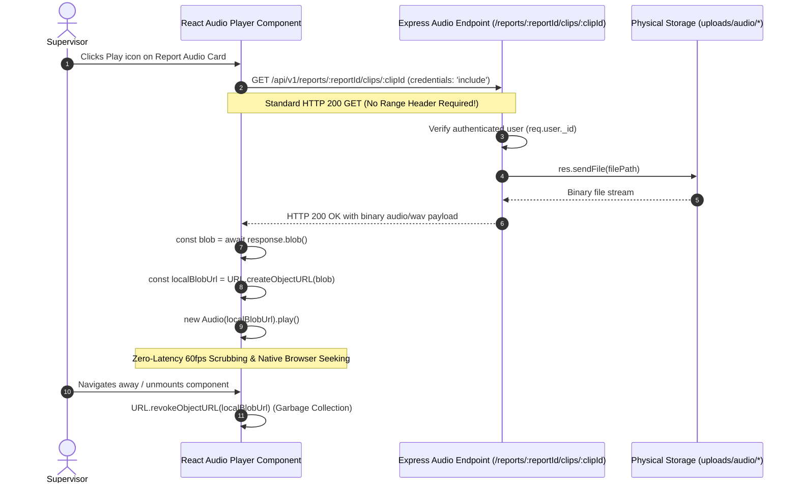

#### 6.7.1 The Three Backend Audio Serving Endpoints
All audio playback routes are protected, user-scoped endpoints that stream the entire file via `res.sendFile()` as a standard HTTP 200 binary response:
1. **Report Audio Clips**: `GET /api/v1/reports/:reportId/clips/:clipId`
   - Verifies `report.user.toString() === req.user._id.toString()`.
   - Resolves `audioFiles.id(clipId).path` and calls `res.sendFile(resolvedPath)`.
2. **Chat Message Audio Clips**: `GET /api/v1/chats/:chatId/messages/:messageId/audio`
   - Verifies `chat.user.toString() === req.user._id.toString()`.
   - Resolves `message.audio.path` and calls `res.sendFile(resolvedPath)`.
3. **Avatar Serving**: `GET /api/v1/auth/avatar`
   - Handled symmetrically via `res.sendFile()` for local avatars.

#### 6.7.2 Custom React Audio Hook (`useAudioBlob`)
The client encapsulates audio playback inside a reusable custom hook that handles binary retrieval, Blob URL generation, and automatic memory cleanup:
```javascript
/**
 * @hook useAudioBlob
 * @description Fetches authenticated audio binaries and creates in-memory Object URLs.
 * @param {string} audioEndpoint - Authenticated backend API URL.
 * @returns {{ play: Function, pause: Function, isPlaying: boolean, duration: number, currentTime: number, seek: Function, loading: boolean }}
 */
export const useAudioBlob = (audioEndpoint) => {
  const [blobUrl, setBlobUrl] = useState(null);
  const [loading, setLoading] = useState(false);
  const audioRef = useRef(null);

  useEffect(() => {
    let active = true;
    let createdUrl = null;

    const fetchAudio = async () => {
      setLoading(true);
      try {
        const response = await fetch(audioEndpoint, {
          credentials: 'include' // Guarantees httpOnly cookie transport
        });
        if (!response.ok) throw new Error('Failed to load audio');
        const blob = await response.blob();
        if (active) {
          createdUrl = URL.createObjectURL(blob);
          setBlobUrl(createdUrl);
          audioRef.current = new Audio(createdUrl);
        }
      } catch (err) {
        console.error('Audio loading error:', err);
      } finally {
        if (active) setLoading(false);
      }
    };

    fetchAudio();

    return () => {
      active = false;
      if (createdUrl) {
        URL.revokeObjectURL(createdUrl); // Prevents memory leaks
      }
      if (audioRef.current) {
        audioRef.current.pause();
        audioRef.current = null;
      }
    };
  }, [audioEndpoint]);

  return { blobUrl, loading, audioRef };
};
```

#### 6.7.3 Technical Advantages of Method 1
1. **Zero HTTP 206 Range Complexity**: Does not rely on complex byte-range math or chunked streaming headers that vary across web servers and reverse proxies.
2. **100% Reliable Cookie Authentication**: Uses standard `fetch({ credentials: 'include' })` instead of relying on `<audio src="...">` which frequently drops cookies in Safari and mobile browsers.
3. **Instantaneous In-Memory Seeking**: Once downloaded (1–3MB for a 1-minute 16kHz WAV), the user can scrub back and forth along the audio waveform with **zero network latency** and zero server roundtrips.
4. **Offline Resilience**: The loaded audio clip remains fully playable in browser RAM even if the supervisor temporarily loses connectivity while reading the report details.

---

### 6.8 Storage Hygiene, Two-Tier Sweeper & Error Isolation

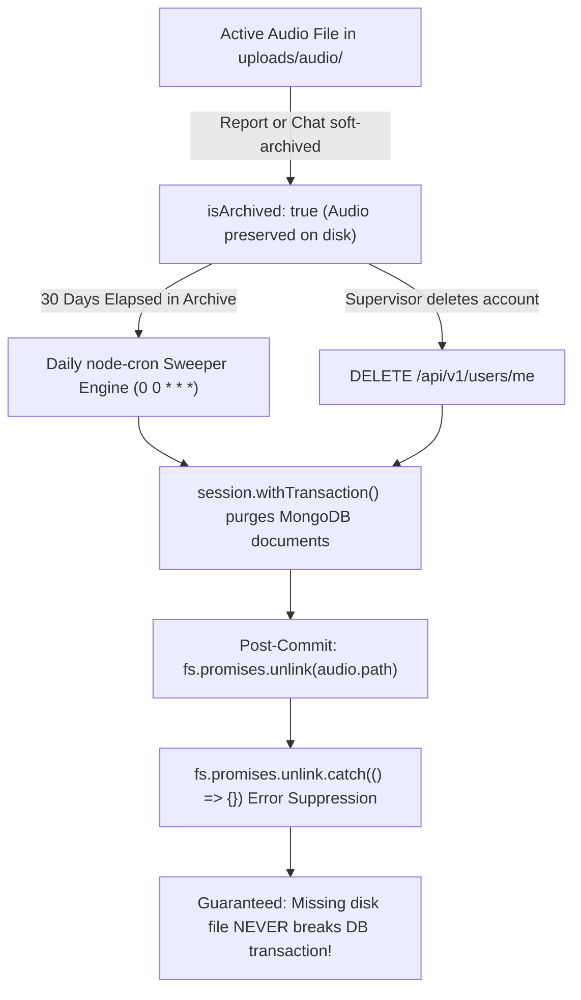

#### 6.8.1 Audio File Invariants & Document Linkage
- Every persisted audio file on disk is referenced by exactly one parent document:
  - Report narrations: referenced in `report.audioFiles[{ path, fileName, originalName, duration, mimeType }]`.
  - Chat voice notes: referenced in `message.audio{ path, fileName, originalName, duration, mimeType }`.

#### 6.8.2 Cascade Purge in 30-Day Sweeper (`jobs/sweeperJob.js`)
When the daily midnight sweeper executes, physical audio files are unlinked from disk **immediately after the database transaction commits**:
```javascript
// Unlink physical audio files post-commit
for (const audio of report.audioFiles) {
  if (audio.path) {
    await fs.promises.unlink(audio.path).catch((err) => {
      logger.warn(`Failed to unlink audio file ${audio.path}: ${err.message}`);
    });
  }
}
```

#### 6.8.3 Resilient Error Isolation
- **The Golden Rule of File Deletion**: Database transactions must **never** be rolled back or disrupted because a physical file is missing from disk (e.g. if an administrator manually cleared a directory or if a container restarted).
- All `fs.promises.unlink()` operations are strictly wrapped in `.catch(() => {})` with a Winston warning log, guaranteeing complete operational resilience and zero transaction rollback failures.

---

# Section 7: Agentic Reasoning, Multi-Tier Fallback & Gemini Runtime

### 7.1 LLM Architectural Vision & Orchestration Model

The Report Builder conversational runtime is engineered as an autonomous agent capable of reasoning over complex operational data, manipulating report documents with transactional precision, and answering multi-branch analytical inquiries in formal, grammatically impeccable corporate Amharic.

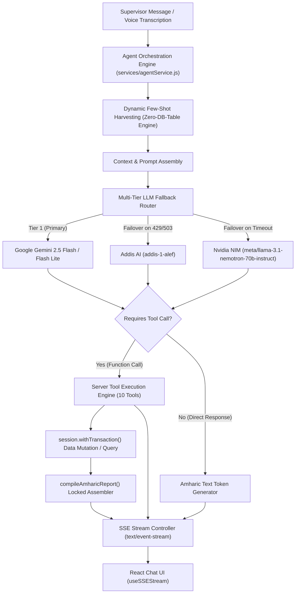

#### 7.1.1 Zero-DB-Table Dynamic Few-Shot Harvesting Architecture
Traditional NLP architectures rely on static database tables or rigid dictionaries to enforce domain-specific technical terminology. In field operations across developing retail and hospitality ecosystems, this static approach fails catastrophically:
1. Equipment makes and models vary wildly across branches (e.g., modern Italian espresso machines in Bole vs. legacy commercial fryers in Piassa).
2. Supervisors coin colloquial workplace transliterations that evolve organically and cannot be anticipated by database administrators.
3. Adding and maintaining glossary tables introduces unnecessary schema bloat, administrative overhead, and migration friction.

To solve this permanently, the Report Builder implements a **Zero-DB-Table Dynamic Few-Shot Architecture**:
- When a chat session initiates or processes a new message, the backend executes a lightweight query against historical approved reports:
  ```javascript
  // Extract real workplace vocabulary from the user's recent approved reports
  const recentReports = await Report.find({
    user: req.user._id,
    isArchived: false,
    'issues.0': { $exists: true }
  })
  .sort({ reportDate: -1 })
  .limit(4)
  .select('branchesVisited activities issues opinions plainTextReport')
  .lean();
  ```
- The prompt compiler harvests real-world terminology, equipment names, and Ge'ez transliterations directly from these documents (e.g., `ዲፕ ፍራየር`, `ፒኦኤስ ማሽን`, `ቺለር`, `ጀነሬተር`, `ማይክሮዌቭ`, `ኤስፕሬሶ ማሽን`) along with the supervisor's historical phrasing for resolutions (`የመፍትሄ አቅጣጫ`).
- These harvested examples are dynamically formatted into the LLM system prompt as in-context few-shot demonstrations. The model instantly mirrors the user's specific company vocabulary and transliteration style with **zero database migrations and zero manual dictionary maintenance**.

#### 7.1.2 Bidirectional Chat Awareness & The Universal Continuity Invariant
The agent runtime operates across two distinct conversation contexts with seamless, bidirectional intelligence sharing:

1. **Report Chat Mode (`type: 'report'`)**:
   - Anchored directly to an active `reportId`.
   - The agent possesses immediate, in-memory awareness of the report's current operational state: branches visited, shift, activities executed, identified issues, supervisory opinions, and compilation status.
   - Any modification requested by the user triggers the `update_report` or `update_report_item` tool, atomically mutating the MongoDB document within an isolated `ClientSession` transaction and re-running the deterministic `compileAmharicReport()` engine.

2. **General Chat Mode (`type: 'general'`)**:
   - Unbound from any single report document.
   - Functions as an executive operational partner and business intelligence analyst.
   - Synthesizes trends across weeks or months, tracks unresolved maintenance bottlenecks across 14+ branches, generates multi-branch comparative matrices, drafts formal administrative memos, and handles ad-hoc report inquiries.

3. **The Universal Continuity Doctrine (Bidirectional Cross-Chat Intelligence)**:
   - **Crucial Architectural Law**: The supervisor must **never** be forced to switch screens, exit an ongoing conversation, or navigate between menu items to accomplish operational inquiries or mutations. Context switching introduces cognitive friction. The intelligence must adapt to the user's location, not vice-versa.

   - **Direction 1: Inside Report Chat $\rightarrow$ Asking Multi-Branch / Cross-Branch Questions**:
     - *Example Scenario*: While editing a draft report for the Bole branch inside a Report Chat, the supervisor asks:
       > *"ባለፈው ሳምንት በጀሞ ብራንች የተከናወኑ ዋና ዋና ተግባራትና ያጋጠሙ ችግሮች ምን ምን ነበሩ? ከነቀናቸው ንገረኝ።"*
       *(What were the main activities and issues at Jemo branch last week? Tell me with their dates.)*
     - The agent immediately invokes `query_operational_data` with `{ branches: ['ጀሞ'], dateStart: '...', dataTypes: ['activities', 'issues'] }`, retrieves the items, and presents the response with exact dates attached without leaving the Report Chat or disrupting active report state.

   - **Direction 2: Inside General Chat $\rightarrow$ Asking Report-Specific Questions, Mutations, or In-Chat Creation**:
     - Supervisors frequently open General Chat to converse freely, and naturally make report-related inquiries or commands. The system handles all 4 major scenarios with logical determinism:
       1. **Report Inspection & Retrieval** (*"የትናንቱን የቦሌ ሪፖርት አሳየኝ"* or *"የካቲት 15 ሪፖርቴ ላይ የተጠቀሱትን ችግሮች አውጣልኝ"*):
          - In General Chat, the agent executes `get_report_context` with flexible search parameters (`{ date, branch, shift, mostRecent }`).
          - If a single report matches, the agent extracts the requested information, displays the plain-text preview, and renders an **Interactive Report Reference Card** in the chat UI.
          - If multiple reports match (e.g. day shift vs. night shift), the agent presents a polite conversational disambiguation list with dates, branches, and shifts, asking the supervisor which one they wish to inspect.
       2. **In-Chat Report Mutation from General Chat** (*"የትናንቱ ቦሌ ሪፖርት ላይ የፍራየሩን ችግር ሁኔታ ወደ 'ተጠናቋል' ቀይርልኝ"*):
          - The agent resolves the target report via `get_report_context`, obtains its `reportId` and `itemId`, and executes `update_report_item` inside an isolated Mongoose transaction (`session.withTransaction()`).
          - Recompiles the plain text via `compileAmharicReport()` and renders the updated status directly in General Chat with a 1-click link to view or verify the full document.
       3. **Ad-Hoc Report Creation from General Chat** (*"ዛሬ ጧት 3:00 ቦሌ ነበርኩ፤ ፍራየሩ ተበላሽቶ አየሁ... ሪፖርት አዘጋጅልኝ"*):
          - If the supervisor narrates an entire workday or shift inside General Chat, the agent does **not** reject the request or demand that they visit the Create Report page.
          - Instead, the agent invokes the `create_report` tool, creating both the `Report` document and its corresponding 1:1 `Chat` (`type: 'report'`) atomically within `session.withTransaction()`.
          - It compiles the locked Amharic plain-text report and returns a **Created Report Action Card** inside General Chat containing direct deep-links:
            - `[ሪፖርቱን ዝርዝር እይ (View Details)]` $\rightarrow$ `/reports/:reportId/details`
            - `[ሪፖርቱን አርም (Edit in Dedicated Page)]` $\rightarrow$ `/reports/:reportId/edit`
            - `[ወደ ሪፖርት ውይይት ሂድ (Continue in Dedicated Report Chat)]` $\rightarrow$ `/chat/:reportChatId`
       4. **In-Chat Report Export from General Chat** (*"የትናንቱን ሪፖርት ወደ ጎግል ዶክስ ላክልኝ"*):
          - Resolves the report and executes `export_report_to_google_docs`, returning the Google Drive document link directly in the chat stream.

4. **The General Chat Report Reference Card UI Protocol**:
   - When any report is retrieved, modified, or created inside General Chat, the server emits an SSE event `event: report_referenced` containing `{ reportId, reportChatId, title, ethiopianDate, primaryBranch, shift, status, plainTextReport }`.
   - The React client renders an interactive MUI card inside the message stream featuring:
     - Header with branch chip, shift badge, and Ethiopian date.
     - Collapsible accordion allowing the user to read the full Amharic report inline.
     - Action button cluster linking directly to the report's detail page, dedicated edit page, or dedicated report chat.

#### 7.1.3 Linguistic Guardrails & System Persona
The agent's system prompt strictly locks the LLM into a disciplined, respectful, and authoritative Amharic corporate persona:
- **Strict Amharic Purity**: All conversational outputs and generated reports must be 100% pure Amharic text. English words, Latin script, or hybrid jargon (e.g., *"status completed ነው"*) are strictly forbidden. Transliterated loan words must use standard Ge'ez orthography (e.g., `ኮምፕሊትድ ሆኗል` or `ተጠናቋል`).
- **Ethiopic Numerical Formatting**: All lists, tables, and sequence numbers must adhere to the Ethiopic numerical syntax (`፩, ፪, ፫` or standardized Arabic numerals with Ethiopic punctuation `1. `).
- **Tone**: Respectful, objective, and executive-ready (`ክቡር ተቆጣጣሪ`, `ሪፖርቱ በተሳካ ሁኔታ ተሻሽሏል`, `የቀረበው የክትትል ማጠቃለያ`).

---

### 7.2 The 11 Server-Executed Tools Catalog & Complete JSON Schemas

The agent runtime is equipped with 11 server-side tools. Each tool is declared via standard JSON Schema, validated against Mongoose models, executed strictly within transaction boundaries where writes occur, and logs comprehensive telemetry via Winston.

```
┌──────────────────────────────────────────────────────────────────────────────────────────┐
│                                 SERVER-EXECUTED TOOLS CATALOG                             │
├───────────────────────────────┬──────────────────────────────────────────────────────────┤
│ Tool Identifier               │ Operational Scope & Purpose                              │
├───────────────────────────────┼──────────────────────────────────────────────────────────┤
│ 1. query_operational_data     │ Multi-branch query engine for activities/issues w/ DATES │
│ 2. update_report_item         │ In-chat lifecycle modifier for historical/active items   │
│ 3. generate_operational_matrix│ Multi-branch matrix compiler & Google Sheets exporter     │
│ 4. track_operational_trends   │ Recurrent machinery breakdown & bottleneck tracker       │
│ 5. generate_executive_briefing│ Formal Amharic administrative memo generator (ማስታወሻ)     │
│ 6. get_report_context         │ Report inspection & multi-criteria lookup (date/branch)  │
│ 7. update_report              │ Full report mutation & deterministic plain-text compiler │
│ 8. create_report              │ In-chat atomic report + 1:1 chat creator with deep-links │
│ 9. list_branches              │ User branch inventory and operational metadata           │
│ 10. create_branch             │ Dynamic registration of unlisted field branches          │
│ 11. export_report_to_google_docs Single report Google Doc generator via OAuth Drive API │
└───────────────────────────────┴──────────────────────────────────────────────────────────┘
```

#### 7.2.1 Tool 1: `query_operational_data`
- **Purpose**: Retrieves operational activities, issues, and supervisory opinions across one, several, or all branches belonging to the supervisor over any specified date range.
- **Mandatory Output Invariant**: Every returned activity, issue, or opinion **must include its specific Date (both Ethiopian Calendar e.g. `12-07-2018 ዓ.ም` and Gregorian Calendar)** alongside the branch name and status so the supervisor can trace exact chronological timelines.
- **JSON Schema**:
  ```json
  {
    "name": "query_operational_data",
    "description": "Queries historical activities, issues, and supervisory opinions across one or more user branches over a specific date range. Every returned item includes its exact date, branch name, status, and solution direction.",
    "parameters": {
      "type": "object",
      "properties": {
        "branches": {
          "type": "array",
          "items": { "type": "string" },
          "description": "List of branch names to filter by (e.g. ['ቦሌ', 'ጀሞ']). If empty or omitted, queries across all branches belonging to the user."
        },
        "dateStart": {
          "type": "string",
          "description": "Start date in Ethiopian Calendar ('DD-MM-YYYY' or 'YYYY-MM-DD') or ISO Gregorian format."
        },
        "dateEnd": {
          "type": "string",
          "description": "End date in Ethiopian Calendar ('DD-MM-YYYY' or 'YYYY-MM-DD') or ISO Gregorian format."
        },
        "dataTypes": {
          "type": "array",
          "items": {
            "type": "string",
            "enum": ["activities", "issues", "opinions", "all"]
          },
          "description": "Categories of operational data to retrieve. Defaults to ['activities', 'issues']."
        },
        "statuses": {
          "type": "array",
          "items": {
            "type": "string",
            "enum": ["reported", "in_progress", "completed", "all"]
          },
          "description": "Filter by resolution status. Defaults to ['all']."
        },
        "searchKeyword": {
          "type": "string",
          "description": "Optional keyword to search within task descriptions, issue descriptions, or solution directions (e.g. 'ፍራየር', 'ጀነሬተር', 'ስልጠና')."
        }
      },
      "required": []
    }
  }
  ```
- **Backend Implementation Logic**:
  ```javascript
  export const executeQueryOperationalData = async (args, user) => {
    const { branches, dateStart, dateEnd, dataTypes = ['activities', 'issues'], statuses = ['all'], searchKeyword } = args;
    
    // Resolve date boundaries into UTC Gregorian timestamps
    const filter = { user: user._id, isArchived: false };
    if (dateStart || dateEnd) {
      filter.reportDate = {};
      if (dateStart) filter.reportDate.$gte = parseDateInputToUtc(dateStart, 'start');
      if (dateEnd) filter.reportDate.$lte = parseDateInputToUtc(dateEnd, 'end');
    }

    if (branches && branches.length > 0) {
      filter['branchesVisited.branch'] = { $in: branches.map(b => new RegExp(b.trim(), 'i')) };
    }

    const reports = await Report.find(filter).sort({ reportDate: -1 }).lean();
    const results = [];

    for (const rep of reports) {
      const ethiopianDateStr = rep.ethiopianDate?.formatted || formatEthiopianDate(rep.reportDate);
      const gregorianDateStr = rep.reportDate.toISOString().split('T')[0];

      // Extract activities
      if (dataTypes.includes('activities') || dataTypes.includes('all')) {
        for (const act of rep.activities || []) {
          if (branches && branches.length > 0 && !branches.some(b => b.toLowerCase() === act.branch.toLowerCase())) continue;
          if (!statuses.includes('all') && !statuses.includes(act.status)) continue;
          if (searchKeyword && !act.task.includes(searchKeyword)) continue;

          results.push({
            reportId: rep._id,
            category: 'activity',
            dateEthiopian: ethiopianDateStr,
            dateGregorian: gregorianDateStr,
            branch: act.branch,
            content: act.task,
            status: act.status,
            order: act.order
          });
        }
      }

      // Extract issues
      if (dataTypes.includes('issues') || dataTypes.includes('all')) {
        for (const iss of rep.issues || []) {
          if (branches && branches.length > 0 && !branches.some(b => b.toLowerCase() === iss.branch.toLowerCase())) continue;
          if (!statuses.includes('all') && !statuses.includes(iss.status)) continue;
          if (searchKeyword && !iss.description.includes(searchKeyword) && !iss.solutionDirection?.includes(searchKeyword)) continue;

          results.push({
            reportId: rep._id,
            itemId: iss._id,
            category: 'issue',
            dateEthiopian: ethiopianDateStr,
            dateGregorian: gregorianDateStr,
            branch: iss.branch,
            content: iss.description,
            solutionDirection: iss.solutionDirection || 'ያልተገለጸ',
            status: iss.status,
            order: iss.order
          });
        }
      }
    }

    return {
      totalFound: results.length,
      queriedBranches: branches && branches.length > 0 ? branches : 'ሁሉም ብራንቾች',
      items: results
    };
  };
  ```

#### 7.2.2 Tool 2: `update_report_item`
- **Purpose**: Allows the supervisor to update the resolution status, solution direction, or description of any specific issue or activity from any report directly within the chat conversation.
- **Mongoose Transaction Invariant**: Executes inside `session.withTransaction()` using Retrieve $\rightarrow$ Mutate $\rightarrow$ `report.save({ session })` to trigger pre-save hooks and recompile the report's locked plain-text representation.
- **JSON Schema**:
  ```json
  {
    "name": "update_report_item",
    "description": "Updates an individual issue or activity within a report (e.g. marking an issue as completed, changing its status to in_progress, updating the solution direction, or modifying text).",
    "parameters": {
      "type": "object",
      "properties": {
        "reportId": {
          "type": "string",
          "description": "The MongoDB ObjectId of the report containing the item."
        },
        "itemType": {
          "type": "string",
          "enum": ["issue", "activity"],
          "description": "Type of item being updated."
        },
        "itemId": {
          "type": "string",
          "description": "The MongoDB ObjectId of the specific issue or activity subdocument."
        },
        "updates": {
          "type": "object",
          "properties": {
            "status": {
              "type": "string",
              "enum": ["reported", "in_progress", "completed"],
              "description": "New resolution status."
            },
            "solutionDirection": {
              "type": "string",
              "description": "Updated corrective action or management direction."
            },
            "content": {
              "type": "string",
              "description": "Updated description or task text."
            }
          },
          "required": []
        }
      },
      "required": ["reportId", "itemType", "itemId", "updates"]
    }
  }
  ```
- **Execution Method**:
  ```javascript
  export const executeUpdateReportItem = async (args, user) => {
    const session = await mongoose.startSession();
    try {
      let updatedReport;
      await session.withTransaction(async () => {
        const report = await Report.findOne({ _id: args.reportId, user: user._id }).session(session);
        if (!report) throw new Error('ሪፖርቱ አልተገኘም ወይም የማሻሻል ፈቃድ የለዎትም።');

        if (args.itemType === 'issue') {
          const item = report.issues.id(args.itemId);
          if (!item) throw new Error('የተጠቀሰው ችግር በሪፖርቱ ውስጥ አልተገኘም።');
          if (args.updates.status) item.status = args.updates.status;
          if (args.updates.solutionDirection) item.solutionDirection = args.updates.solutionDirection;
          if (args.updates.content) item.description = args.updates.content;
        } else if (args.itemType === 'activity') {
          const item = report.activities.id(args.itemId);
          if (!item) throw new Error('የተጠቀሰው ተግባር በሪፖርቱ ውስጥ አልተገኘም።');
          if (args.updates.status) item.status = args.updates.status;
          if (args.updates.content) item.task = args.updates.content;
        }

        // Recompile plain-text report
        report.plainTextReport = compileAmharicReport(report);
        updatedReport = await report.save({ session });
      });

      return {
        success: true,
        message: 'የሪፖርት ዝርዝር መረጃው በተሳካ ሁኔታ ተሻሽሏል!',
        reportId: updatedReport._id,
        plainTextReport: updatedReport.plainTextReport
      };
    } finally {
      await session.endSession();
    }
  };
  ```

#### 7.2.3 Tool 3: `generate_operational_matrix`
- **Purpose**: Compiles a multi-branch tabular matrix summarizing activities, problems, solution directions, and current statuses across 14+ branches over any date range (inspired by the 13-branch supervisor review model). Can optionally export the generated matrix directly into a styled Google Sheet.
- **JSON Schema**:
  ```json
  {
    "name": "generate_operational_matrix",
    "description": "Compiles a standardized multi-branch tabular matrix summarizing activities, problems, solution directions, and statuses across branches over a date range. Supports dynamic columns, per-row dates, and optional Google Sheets export.",
    "parameters": {
      "type": "object",
      "properties": {
        "branches": {
          "type": "array",
          "items": { "type": "string" },
          "description": "Branches to include in the matrix. If empty, includes all branches visited within the date window."
        },
        "dateStart": { "type": "string", "description": "Start date (EC or GC)." },
        "dateEnd": { "type": "string", "description": "End date (EC or GC)." },
        "includeColumns": {
          "type": "array",
          "items": {
            "type": "string",
            "enum": ["seq", "branch", "date", "issue_or_activity", "solution_direction", "status"]
          },
          "description": "Custom column sequence for the matrix. Defaults to all 6 columns."
        },
        "itemTypeFilter": {
          "type": "string",
          "enum": ["issues_only", "activities_only", "both"],
          "description": "Data type to compile into the matrix. Defaults to 'issues_only'."
        },
        "exportToGoogleSheets": {
          "type": "boolean",
          "description": "If true, creates a new Google Spreadsheet in the user's Google Drive with color-coded status cells."
        },
        "spreadsheetTitle": {
          "type": "string",
          "description": "Optional title for the Google Spreadsheet."
        }
      },
      "required": ["dateStart", "dateEnd"]
    }
  }
  ```
- **Google Sheets Export Protocol**:
  When `exportToGoogleSheets: true` is provided, the backend utilizes the user's stored OAuth tokens via `googleapis`:
  1. Calls `sheets.spreadsheets.create` with header formatting (Deep Navy Blue `#1A365D`, white bold text).
  2. Applies conditional color formatting to the **ሁኔታ (Status)** column:
     - `ተጠናቋል` (Completed): Soft Emerald Green background (`#D1FAE5`), dark green text (`#065F46`).
     - `በሂደት ላይ` (In Progress): Soft Amber background (`#FEF3C7`), dark amber text (`#92400E`).
     - `ሪፖርት የተደረገ` (Reported): Soft Rose background (`#FEE2E2`), dark red text (`#991B1B`).
  3. Returns the direct Google Sheets URL to the user in the chat response.

#### 7.2.4 Tool 4: `track_operational_trends`
- **Purpose**: Analyzes operational reports across a rolling lookback window (e.g., 30 or 60 days) to detect recurring mechanical failures (e.g., deep fryers repeatedly failing across Bole and Piassa, generator cuts, POS communication drops) and alerts the supervisor to tasks stalled in `in_progress` status for more than 14 days.
- **JSON Schema**:
  ```json
  {
    "name": "track_operational_trends",
    "description": "Identifies recurring machinery/equipment breakdowns across branches and flags stalled in-progress issues exceeding 14 days.",
    "parameters": {
      "type": "object",
      "properties": {
        "lookbackDays": {
          "type": "integer",
          "description": "Number of days in the past to analyze (default: 30)."
        },
        "branches": {
          "type": "array",
          "items": { "type": "string" },
          "description": "Optional list of branches to restrict analysis to."
        },
        "minOccurrences": {
          "type": "integer",
          "description": "Minimum breakdown occurrences to trigger a trend alert (default: 2)."
        }
      },
      "required": []
    }
  }
  ```
- **Aggregation Pipeline Logic**:
  The tool executes a pipeline matching non-archived reports within `now - lookbackDays`, unwinds `issues`, normalizes equipment keywords using regex stems (`/ፍራየር/`, `/ጀነሬተር/`, `/ቺለር/`, `/ማቀዝቀዣ/`, `/ፒኦኤስ/`), groups by keyword and branch, and counts occurrences. Items with `status === 'in_progress'` whose parent report is older than 14 days are tagged with `isStalled: true`.

#### 7.2.5 Tool 5: `generate_executive_briefing`
- **Purpose**: Compiles a formal Amharic administrative memorandum (`ማስታወሻ`) or maintenance requisition letter addressed to Head Office (`ለዋናው መ/ቤት`) or technical contractors.
- **JSON Schema**:
  ```json
  {
    "name": "generate_executive_briefing",
    "description": "Generates a formal Amharic administrative memorandum (ማስታወሻ) addressed to Head Office or maintenance departments summarizing multi-branch challenges and required executive interventions.",
    "parameters": {
      "type": "object",
      "properties": {
        "recipient": {
          "type": "string",
          "description": "Addressee (e.g., 'ለዋናው መ/ቤት ሥራ አስኪያጅ', 'ለቴክኒክና ጥገና መምሪያ')."
        },
        "subject": {
          "type": "string",
          "description": "The formal memo subject (ጉዳዩ)."
        },
        "branches": {
          "type": "array",
          "items": { "type": "string" },
          "description": "List of branches included in the briefing."
        },
        "dateStart": { "type": "string", "description": "Coverage start date." },
        "dateEnd": { "type": "string", "description": "Coverage end date." },
        "priority": {
          "type": "string",
          "enum": ["urgent", "normal", "confidential"],
          "description": "Administrative priority level."
        }
      },
      "required": ["recipient", "subject", "dateStart", "dateEnd"]
    }
  }
  ```

#### 7.2.6 Tool 6: `get_report_context`
- **Purpose**: Fetches the complete JSON document and compiled Amharic plain-text representation of a specific operational report. In Report Chat, defaults automatically to the linked report. In General Chat, supports flexible lookup by criteria (date, branch, shift, or most recent) with automatic conversational disambiguation if multiple reports match.
- **JSON Schema**:
  ```json
  {
    "name": "get_report_context",
    "description": "Retrieves the full structured data and compiled Amharic plain-text of a specific operational report. In Report Chat, defaults to the linked report. In General Chat, resolves the report by reportId, date, branch, shift, or mostRecent flag, handling disambiguation if multiple reports match.",
    "parameters": {
      "type": "object",
      "properties": {
        "reportId": {
          "type": "string",
          "description": "The MongoDB ObjectId of the report. If provided, fetches this exact report."
        },
        "date": {
          "type": "string",
          "description": "Date in Ethiopian Calendar ('DD-MM-YYYY') or ISO Gregorian format ('YYYY-MM-DD')."
        },
        "branch": {
          "type": "string",
          "description": "Branch name to filter by (e.g. 'ቦሌ')."
        },
        "shift": {
          "type": "string",
          "enum": ["day", "night", "full_day"],
          "description": "Work shift to filter by."
        },
        "mostRecent": {
          "type": "boolean",
          "description": "If true, resolves the supervisor's most recently created report."
        }
      },
      "required": []
    }
  }
  ```
- **Execution & Disambiguation Logic**:
  ```javascript
  export const executeGetReportContext = async (args, user, currentChat) => {
    // 1. Direct ID or active chat default
    let targetReportId = args.reportId || (currentChat?.type === 'report' ? currentChat.report : null);

    if (targetReportId) {
      const report = await Report.findOne({ _id: targetReportId, user: user._id, isArchived: false }).lean();
      if (!report) throw new Error('ሪፖርቱ አልተገኘም ወይም የማየት ፈቃድ የለዎትም።');
      return { status: 'found', report, plainTextReport: report.plainTextReport };
    }

    // 2. Query in General Chat by criteria
    const filter = { user: user._id, isArchived: false };
    if (args.date) {
      const parsedUtc = parseDateInputToUtc(args.date, 'start');
      const nextDayUtc = new Date(parsedUtc.getTime() + 24 * 60 * 60 * 1000);
      filter.reportDate = { $gte: parsedUtc, $lt: nextDayUtc };
    }
    if (args.branch) {
      filter['branchesVisited.branch'] = new RegExp(args.branch.trim(), 'i');
    }
    if (args.shift) {
      filter.shift = args.shift;
    }

    const matches = await Report.find(filter)
      .sort({ reportDate: -1, createdAt: -1 })
      .limit(args.mostRecent ? 1 : 5)
      .lean();

    if (matches.length === 0) {
      return {
        status: 'not_found',
        message: 'በተጠቀሰው መስፈርት መሰረት የተገኘ ሪፖርት የለም።'
      };
    }

    if (matches.length === 1 || args.mostRecent) {
      const report = matches[0];
      return {
        status: 'found',
        report,
        plainTextReport: report.plainTextReport,
        reportId: report._id
      };
    }

    // 3. Multiple matches: return disambiguation summary
    return {
      status: 'multiple_matches',
      count: matches.length,
      message: 'በተጠቀሰው መስፈርት ከአንድ በላይ ሪፖርቶች ተገኝተዋል፤ እባክዎ አንዱን ይምረጡ።',
      candidates: matches.map((m, idx) => ({
        index: idx + 1,
        reportId: m._id,
        dateEthiopian: m.ethiopianDate?.formatted || formatEthiopianDate(m.reportDate),
        shift: m.shift,
        primaryBranch: m.primaryBranch || m.branchesVisited[0]?.branch,
        branchesVisited: m.branchesVisited.map(b => b.branch)
      }))
    };
  };
  ```

#### 7.2.7 Tool 7: `update_report`
- **Purpose**: In-place mutation engine for active report fields (`branchesVisited`, `shift`, `activities`, `issues`, `opinions`, `followUpTasks`, `notes`).
- **Transactional Determinism**: Runs inside an explicit Mongoose `ClientSession` transaction. Always re-executes `compileAmharicReport(report)` before saving to ensure the database document and plain-text output remain 100% synchronized.
- **JSON Schema**:
  ```json
  {
    "name": "update_report",
    "description": "Updates fields of an active operational report. Automatically re-compiles the Amharic plain-text document and broadcasts updates to the UI via SSE.",
    "parameters": {
      "type": "object",
      "properties": {
        "reportId": { "type": "string", "description": "The MongoDB ObjectId of the report." },
        "shift": { "type": "string", "enum": ["day", "night", "full_day"] },
        "branchesVisited": {
          "type": "array",
          "items": {
            "type": "object",
            "properties": {
              "branch": { "type": "string" },
              "arrivalTime": { "type": "string" },
              "departureTime": { "type": "string" },
              "visitOrder": { "type": "integer" }
            },
            "required": ["branch"]
          }
        },
        "activities": {
          "type": "array",
          "items": {
            "type": "object",
            "properties": {
              "branch": { "type": "string" },
              "task": { "type": "string" },
              "status": { "type": "string", "enum": ["reported", "in_progress", "completed"] },
              "order": { "type": "integer" }
            },
            "required": ["branch", "task"]
          }
        },
        "issues": {
          "type": "array",
          "items": {
            "type": "object",
            "properties": {
              "branch": { "type": "string" },
              "description": { "type": "string" },
              "solutionDirection": { "type": "string" },
              "status": { "type": "string", "enum": ["reported", "in_progress", "completed"] },
              "order": { "type": "integer" }
            },
            "required": ["branch", "description"]
          }
        },
        "opinions": {
          "type": "array",
          "items": {
            "type": "object",
            "properties": {
              "branch": { "type": "string" },
              "comment": { "type": "string" },
              "order": { "type": "integer" }
            },
            "required": ["comment"]
          }
        },
        "notes": { "type": "string" }
      },
      "required": ["reportId"]
    }
  }
  ```

#### 7.2.8 Tool 8: `create_report`
- **Purpose**: Creates a new operational report and its corresponding 1:1 linked Report Chat document atomically within a Mongoose `ClientSession` transaction. Used when a supervisor dictates or types daily report details within General Chat or via voice transcription.
- **JSON Schema**:
  ```json
  {
    "name": "create_report",
    "description": "Creates a new operational report and its dedicated 1:1 Report Chat document atomically within a Mongoose transaction. Compiles the Amharic plain-text report and returns deep-links for immediate inspection and continuation.",
    "parameters": {
      "type": "object",
      "properties": {
        "reportDate": {
          "type": "string",
          "description": "Report date in Ethiopian Calendar ('DD-MM-YYYY') or ISO Gregorian format. Defaults to current date."
        },
        "shift": {
          "type": "string",
          "enum": ["day", "night", "full_day"],
          "description": "Work shift."
        },
        "branchesVisited": {
          "type": "array",
          "items": {
            "type": "object",
            "properties": {
              "branch": { "type": "string" },
              "arrivalTime": { "type": "string" },
              "departureTime": { "type": "string" },
              "visitOrder": { "type": "integer" }
            },
            "required": ["branch"]
          },
          "description": "Chronological list of branches visited."
        },
        "activities": {
          "type": "array",
          "items": {
            "type": "object",
            "properties": {
              "branch": { "type": "string" },
              "task": { "type": "string" },
              "status": { "type": "string", "enum": ["reported", "in_progress", "completed"] },
              "order": { "type": "integer" }
            },
            "required": ["branch", "task"]
          }
        },
        "issues": {
          "type": "array",
          "items": {
            "type": "object",
            "properties": {
              "branch": { "type": "string" },
              "description": { "type": "string" },
              "solutionDirection": { "type": "string" },
              "status": { "type": "string", "enum": ["reported", "in_progress", "completed"] },
              "order": { "type": "integer" }
            },
            "required": ["branch", "description"]
          }
        },
        "opinions": {
          "type": "array",
          "items": {
            "type": "object",
            "properties": {
              "branch": { "type": "string" },
              "comment": { "type": "string" },
              "order": { "type": "integer" }
            },
            "required": ["comment"]
          }
        },
        "notes": { "type": "string" }
      },
      "required": ["shift", "branchesVisited"]
    }
  }
  ```
- **Atomic Creation Implementation**:
  ```javascript
  export const executeCreateReport = async (args, user) => {
    const session = await mongoose.startSession();
    try {
      let createdReport, createdChat;
      await session.withTransaction(async () => {
        const reportDate = args.reportDate ? parseDateInputToUtc(args.reportDate) : new Date();
        const primaryBranch = args.branchesVisited[0]?.branch || 'ዋና';

        const reportData = {
          user: user._id,
          reportDate,
          shift: args.shift,
          branchesVisited: args.branchesVisited.map((b, i) => ({
            ...b,
            visitOrder: b.visitOrder || i + 1
          })),
          activities: args.activities || [],
          issues: args.issues || [],
          opinions: args.opinions || [],
          notes: args.notes || '',
          status: 'draft',
          source: 'chat'
        };

        // Deterministic Amharic compilation
        reportData.plainTextReport = compileAmharicReport(reportData);

        // Atomic create with array syntax
        const reports = await Report.create([reportData], { session });
        createdReport = reports[0];

        // Create 1:1 linked Report Chat
        const chats = await Chat.create([{
          user: user._id,
          type: 'report',
          report: createdReport._id,
          title: `${primaryBranch} - ${formatEthiopianDate(reportDate)}`
        }], { session });
        createdChat = chats[0];
      });

      return {
        success: true,
        message: 'አዲስ ሪፖርት በተሳካ ሁኔታ ተፈጥሯል!',
        reportId: createdReport._id,
        reportChatId: createdChat._id,
        plainTextReport: createdReport.plainTextReport,
        navigation: {
          detailsUrl: `/reports/${createdReport._id}/details`,
          editUrl: `/reports/${createdReport._id}/edit`,
          chatUrl: `/chat/${createdChat._id}`
        }
      };
    } finally {
      await session.endSession();
    }
  };
  ```

#### 7.2.9 Tool 9: `list_branches`
- **Purpose**: Returns the complete catalog of branches configured for the user, including branch names, addresses, active issue counts, and known phonetic aliases.
- **JSON Schema**:
  ```json
  {
    "name": "list_branches",
    "description": "Lists all branch locations managed by or assigned to the supervisor, along with operational metadata.",
    "parameters": {
      "type": "object",
      "properties": {},
      "required": []
    }
  }
  ```

#### 7.2.10 Tool 10: `create_branch`
- **Purpose**: Allows the agent to dynamically register a new branch location if the supervisor mentions an unlisted or newly opened branch during chat or voice narration.
- **JSON Schema**:
  ```json
  {
    "name": "create_branch",
    "description": "Registers a new branch location in the database under the supervisor's account.",
    "parameters": {
      "type": "object",
      "properties": {
        "name": { "type": "string", "description": "Branch name in Amharic (e.g. 'ገርጂ', 'ሰሚት')." },
        "location": { "type": "string", "description": "Physical address or landmark." },
        "aliases": {
          "type": "array",
          "items": { "type": "string" },
          "description": "Phonetic or alternative spellings (e.g. ['Gerji', 'ጊዮርጊስ']).'}"
        }
      },
      "required": ["name"]
    }
  }
  ```

#### 7.2.11 Tool 11: `export_report_to_google_docs`
- **Purpose**: Exports a compiled Amharic operational report directly into a beautifully formatted Google Document in the supervisor's Google Drive.
- **JSON Schema**:
  ```json
  {
    "name": "export_report_to_google_docs",
    "description": "Exports a compiled Amharic operational report directly to a Google Document in the user's Google Drive.",
    "parameters": {
      "type": "object",
      "properties": {
        "reportId": { "type": "string", "description": "The report to export." },
        "documentTitle": { "type": "string", "description": "Optional title for the Google Doc." }
      },
      "required": ["reportId"]
    }
  }
  ```

---

### 7.3 Multi-Tier Fallback Chain & Resilience Strategy

In production environments in East Africa, external LLM APIs experience periodic network latency, regional packet loss, and rate limiting. The Report Builder implements a **Deterministic 3-Tier Fallback Chain** to guarantee zero downtime and uninterrupted supervisor interaction:

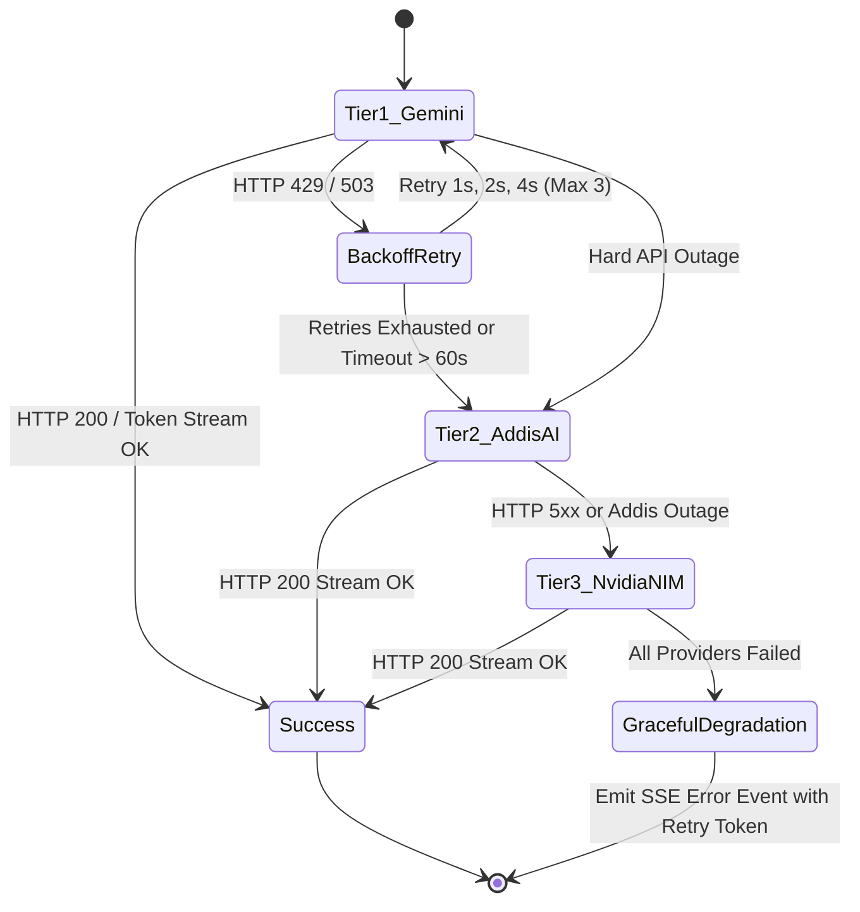

#### 7.3.1 Provider Configuration Matrix
```javascript
// config/llmConfig.js
export const LLM_TIERS = {
  TIER_1: {
    provider: 'google',
    model: process.env.GEMINI_MODEL || 'gemini-2.5-flash',
    apiKey: process.env.GEMINI_API_KEY,
    timeoutMs: 60000,
    maxRetries: 3
  },
  TIER_2: {
    provider: 'addis_ai',
    model: 'addis-1-alef',
    baseURL: process.env.ADDIS_AI_BASE_URL || 'https://api.addisassistant.com/v1',
    apiKey: process.env.ADDIS_AI_API_KEY,
    timeoutMs: 45000,
    maxRetries: 2
  },
  TIER_3: {
    provider: 'nvidia_nim',
    model: 'meta/llama-3.1-nemotron-70b-instruct',
    baseURL: 'https://integrate.api.nvidia.com/v1',
    apiKey: process.env.NVIDIA_NIM_API_KEY,
    timeoutMs: 60000,
    maxRetries: 2
  }
};
```

#### 7.3.2 Deterministic Execution Engine (`services/llmFallbackService.js`)
```javascript
/**
 * Executes an LLM generation or tool-calling loop across the 3-tier fallback matrix.
 * Transparently transitions to lower tiers without closing client SSE connections.
 */
export const executeWithFallback = async ({ messages, tools, systemInstruction, onToken, onToolCall, sseRes }) => {
  const tiers = [LLM_TIERS.TIER_1, LLM_TIERS.TIER_2, LLM_TIERS.TIER_3];

  for (let i = 0; i < tiers.length; i++) {
    const tier = tiers[i];
    const tierIndex = i + 1;

    try {
      logger.info(`Attempting LLM execution on Tier ${tierIndex} (${tier.provider}: ${tier.model})`);
      return await executeProviderStream({ tier, messages, tools, systemInstruction, onToken, onToolCall });
    } catch (err) {
      const isRateLimit = err.status === 429 || err.code === 'RESOURCE_EXHAUSTED';
      const isServerDown = err.status >= 500 || err.code === 'ECONNRESET' || err.name === 'AbortError';

      logger.warn(`Tier ${tierIndex} failed: ${err.message}. (RateLimit: ${isRateLimit}, ServerDown: ${isServerDown})`);

      // Inform client UI of fallback event via SSE comment/event
      if (sseRes && !sseRes.writableEnded) {
        sseRes.write(`event: provider_fallback\ndata: ${JSON.stringify({
          fromTier: tierIndex,
          toTier: tierIndex + 1,
          reason: isRateLimit ? 'RATE_LIMIT' : 'TIMEOUT_OR_ERROR'
        })}\n\n`);
      }

      if (i === tiers.length - 1) {
        // All tiers exhausted
        logger.error('All 3 LLM fallback tiers exhausted. Throwing fatal error.');
        throw new Error('ሁሉም የቋንቋ ሞዴል አገልጋዮች በጊዜያዊነት አይሰሩም። እባክዎ ከጥቂት ደቂቃዎች በኋላ እንደገና ይሞክሩ።');
      }

      // Small backoff before jumping to the next tier
      await new Promise(resolve => setTimeout(resolve, 1000));
    }
  }
};
```

---

### 7.4 SSE Streaming Event Protocol & Lifecycle

All agent responses are delivered via Server-Sent Events (SSE) over a standard HTTP connection. This guarantees immediate sub-second visual feedback as tokens generate and displays real-time execution cards when tools run.

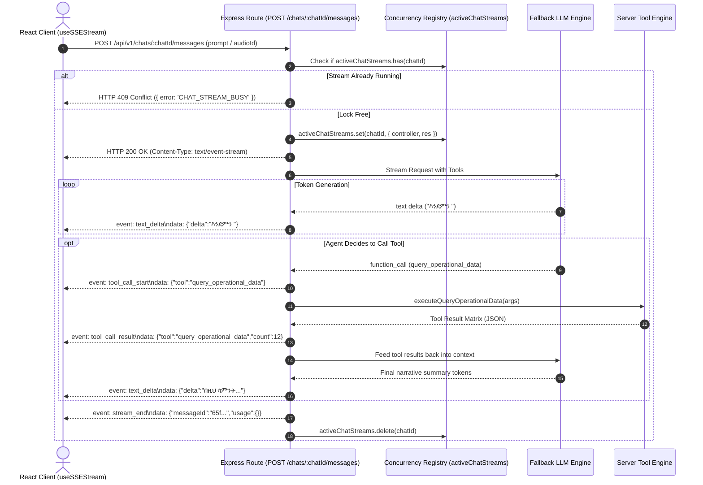

#### 7.4.1 Complete SSE Event Catalog
| Event Name | Payload Structure | Purpose |
| :--- | :--- | :--- |
| `event: text_delta` | `{"delta": "string"}` | Emits partial Amharic text tokens for smooth typewriter UI rendering. |
| `event: tool_call_start` | `{"toolName": "string", "args": object}` | Displays an animated "የስርዓት ፍተሻ እየተከናወነ ነው..." (System processing) chip in the chat window. |
| `event: tool_call_result`| `{"toolName": "string", "summary": "string", "data": any}` | Replaces the loader chip with a success card summarizing the tool's findings. |
| `event: report_updated` | `{"reportId": "string", "plainText": "string", "updatedAt": "ISO"}` | Fired when `update_report` or `update_report_item` modifies a report. Triggers real-time report card re-rendering. |
| `event: provider_fallback`| `{"fromTier": number, "toTier": number, "reason": "string"}` | Informative toast notifying user of an automated resilience switch. |
| `event: stream_end` | `{"messageId": "string", "interrupted": boolean, "durationMs": number}` | Signals client to finalize message bubble and close the stream reader. |
| `event: error` | `{"code": "string", "message": "string", "recoverable": boolean}` | Transmits server-side or LLM exceptions for inline banner rendering. |

#### 7.4.2 SSE HTTP Headers & Keep-Alive Standard
Express endpoints serving SSE must configure specific HTTP headers to disable reverse proxy buffering (e.g. Nginx, Cloudflare):
```javascript
res.setHeader('Content-Type', 'text/event-stream');
res.setHeader('Cache-Control', 'no-cache, no-transform');
res.setHeader('Connection', 'keep-alive');
res.setHeader('X-Accel-Buffering', 'no'); // Essential for Nginx proxy streaming
res.flushHeaders();

// Send initial keep-alive comment to unblock client fetch streams
res.write(': keep-alive\n\n');

// 15-second heartbeat interval to prevent gateway socket timeouts
const heartbeat = setInterval(() => {
  if (!res.writableEnded) {
    res.write(': keep-alive\n\n');
  }
}, 15000);

req.on('close', () => {
  clearInterval(heartbeat);
});
```

---

### 7.5 Concurrency Lock, Abort Mechanics & Race Prevention

In mobile field environments, supervisors frequently tap buttons multiple times, double-submit voice messages, or attempt to send new instructions while the model is halfway through compiling a 1,000-word operational matrix. Without explicit concurrency controls, this creates catastrophic race conditions, corrupted report documents, and wasted API quotas.

#### 7.5.1 In-Memory Stream Registry
The Express server maintains a centralized, in-memory Map of all active streaming connections:
```javascript
// services/streamLockService.js
/**
 * Key: chatId (string)
 * Value: { abortController: AbortController, res: Response, startedAt: number }
 */
export const activeChatStreams = new Map();

export const acquireStreamLock = (chatId, res) => {
  if (activeChatStreams.has(chatId)) {
    return false; // Lock acquisition rejected
  }
  const abortController = new AbortController();
  activeChatStreams.set(chatId, {
    abortController,
    res,
    startedAt: Date.now()
  });
  return abortController;
};

export const releaseStreamLock = (chatId) => {
  activeChatStreams.delete(chatId);
};
```

#### 7.5.2 Concurrency Rejection (HTTP 409 Conflict)
If a user or script posts a new message to a chat that is already generating a response, the controller rejects the request synchronously before touching the database or LLM:
```javascript
// controllers/chatController.js
export const sendMessageStream = async (req, res) => {
  const { chatId } = req.params;
  
  const abortController = acquireStreamLock(chatId, res);
  if (!abortController) {
    return res.status(409).json({
      status: 'fail',
      code: 'CHAT_STREAM_BUSY',
      message: 'ቀዳሚው ምላሽ በመዘጋጀት ላይ ነው። እባክዎ ጥቂት ይጠብቁ ወይም «አቁም» የሚለውን ይጫኑ።'
    });
  }
  // Proceed with stream...
};
```

#### 7.5.3 Clean Client Interruption (`POST /api/v1/chats/:chatId/abort`)
The supervisor has the ability to cancel generation mid-sentence by pressing the UI "Stop" (አቁም) button:
1. Client issues `POST /api/v1/chats/:chatId/abort`.
2. The endpoint looks up `activeChatStreams.get(chatId)`.
3. Calls `streamData.abortController.abort()`.
4. The active LLM stream catches the abort signal, halts token generation, persists whatever partial message was successfully generated to MongoDB, writes `event: stream_end` with `{ interrupted: true }`, and terminates the HTTP response cleanly.
5. Releases the lock via `releaseStreamLock(chatId)`.

---

### 7.6 Rate Limiting, Free Tier Quotas & Cost Protection

To ensure continuous operation on the **Google Gemini Free Tier** (15 RPM / 1,000,000 TPM / 1,500 RPD) without unexpected service denial:

1. **Context Window Pruning (Sliding Window Engine)**:
   - Chat histories can expand to hundreds of messages. Sending full history on every prompt rapidly exhausts token limits.
   - The runtime passes only the **last 10 messages** verbatim to the LLM.
   - Older messages (> 10) are condensed into a single dynamic system summary:
     ```
     [ያለፈው የውይይት ማጠቃለያ: ተቆጣጣሪው በቦሌና ፒኦኤስ ማሽን ችግር ዙሪያ ውይይት አድርገው ሪፖርቱን አሻሽለዋል።]
     ```

2. **Per-User Rate Limiter**:
   - Standard users are bounded to 10 prompt submissions per minute via an in-memory token bucket middleware.
   - Prevents automated spamming or accidental rapid loops.

3. **Daily Quota Telemetry**:
   - Winston logger records exact token usage reported by Gemini / Addis AI responses (`usageMetadata.totalTokenCount`).
   - If daily consumption exceeds 80% of the 1,500 RPD limit, the system proactively routes new non-critical analytical requests to Tier 2 (Addis AI) to preserve Gemini quota for real-time voice report drafting.

---

# Section 8: Workplace Transliteration Engine & In-Context Phonetic Guidance

### 8.1 The Transliteration Dilemma in Ethiopian Field Operations

In Ethiopian multi-branch commercial enterprises (such as restaurant chains, supermarkets, retail outlets, diagnostic clinics, and logistics depots), field personnel routinely communicate in a natural blend of spoken Amharic and technical English loan words. Machinery, spare parts, electronic hardware, inventory supplies, and operational procedures are almost universally referred to by their English names.

```
┌─────────────────────────────────────────────────────────────────────────────────────────┐
│                      THE THREE TRADITIONAL TRANSLITERATION FAILURES                     │
├─────────────────────────┬───────────────────────────────┬───────────────────────────────┤
│ Failure Mode            │ Concrete Example              │ Operational Consequence       │
├─────────────────────────┼───────────────────────────────┼───────────────────────────────┤
│ 1. Raw Latin Leaks      │ "የቦሌ deep fryer ተበላሽቷል"     │ Highly unprofessional layout; │
│                         │                               │ violates corporate plain-text │
│                         │                               │ report presentation standards.│
├─────────────────────────┼───────────────────────────────┼───────────────────────────────┤
│ 2. Literal Translation  │ Translating "deep fryer" to   │ Unrecognizable in the field;  │
│                         │ "ጥልቅ መጥበሻ" or "POS" to       │ technicians and store managers│
│                         │ "የመሸጫ ነጥብ ማሽን"            │ never use these terms.        │
├─────────────────────────┼───────────────────────────────┼───────────────────────────────┤
│ 3. Inconsistent Ge'ez   │ Supervisor A: "ዲፕ ፍራየር"     │ Search fragmentation; queries │
│    Spelling             │ Supervisor B: "ዲፕ ፍራይር"     │ for equipment breakdowns miss │
│                         │ Supervisor C: "ዲፍ ፍራየር"     │ historical maintenance logs.  │
└─────────────────────────┴───────────────────────────────┴───────────────────────────────┘
```

#### 8.1.1 The Architectural Solution: Standardized Ge'ez Workplace Transliteration
The Report Builder permanently resolves this linguistic dilemma through three core operational rules:
1. **Zero Raw Latin in Reports**: English technical nouns are never left in raw Latin script within the report body.
2. **Zero Literal Translations**: Technical equipment, hardware parts, and operational roles are never translated into literal, artificial Amharic phrases.
3. **Standardized Ge'ez Phonetics**: Every technical loan word is phonetically transliterated into its canonical, established workplace Ge'ez syllabary (e.g., `ዲፕ ፍራየር`, `ፒኦኤስ ማሽን`, `ቺለር`, `ጀነሬተር`, `ማይክሮዌቭ`).

---

### 8.2 Zero-DB-Table Dynamic Vocabulary Harvesting Architecture

Traditional linguistic architectures rely on static database tables (e.g., a `Glossary` or `Dictionary` collection) where administrators must manually map English terms to Amharic equivalents. In real-world field operations, this static model fails:
- Maintaining static tables requires continuous administrative overhead and database migrations.
- Equipment makes, models, and colloquial pronunciations vary between branch networks and regions.
- Hardcoded dictionaries cannot keep pace with new machinery or seasonal equipment acquisitions.

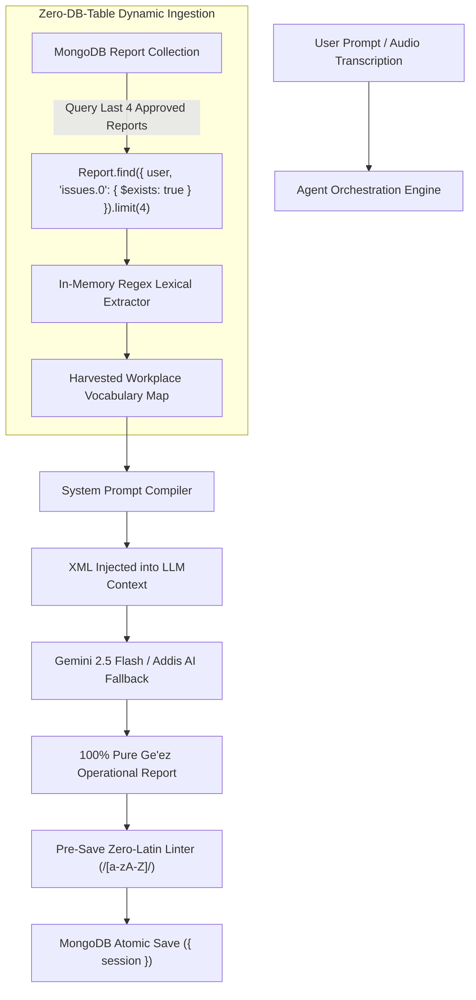

#### 8.2.1 The Harvesting Pipeline (`services/vocabularyHarvestService.js`)
When an operational report or chat response is being compiled, the backend executes an in-memory scan of the user's recent approved reports:

```javascript
/**
 * Dynamically extracts verified workplace transliterations from recent approved reports.
 * Completely eliminates static glossary database tables.
 * @param {string} userId - Authenticated user ID.
 * @returns {Promise<string>} Formatted XML string for prompt injection.
 */
export const harvestWorkplaceVocabulary = async (userId) => {
  const recentReports = await Report.find({
    user: userId,
    isArchived: false,
    'issues.0': { $exists: true }
  })
  .sort({ reportDate: -1 })
  .limit(4)
  .select('branchesVisited activities issues opinions plainTextReport')
  .lean();

  if (!recentReports || recentReports.length === 0) {
    return getDefaultWorkplaceGlossaryXml();
  }

  // Set of verified transliterated terms extracted from historical reports
  const harvestedTerms = new Set();

  const technicalKeywordsRegex = /(?:ፍራየር|ቺለር|ፍሪዘር|ፒኦኤስ|ጀነሬተር|ማይክሮዌቭ|ኤስፕሬሶ|ዋርመር|ቤንማሪ|ስታብላይዘር|ፋን|ዋይፋይ|ራውተር|ፓምፕ|ስቶክ|ፎይል)/g;

  for (const report of recentReports) {
    for (const issue of report.issues || []) {
      const text = `${issue.description} ${issue.solutionDirection || ''}`;
      const matches = text.match(technicalKeywordsRegex);
      if (matches) {
        matches.forEach(term => harvestedTerms.add(term));
      }
    }
    for (const act of report.activities || []) {
      const matches = act.task.match(technicalKeywordsRegex);
      if (matches) {
        matches.forEach(term => harvestedTerms.add(term));
      }
    }
  }

  // Construct in-memory few-shot XML block
  let xml = '<workplace_glossary>\n';
  harvestedTerms.forEach(term => {
    xml += `  <term>${term}</term>\n`;
  });
  xml += '</workplace_glossary>';

  return xml;
};
```

---

### 8.3 Standardized Ge'ez Orthography & Phonetic Mapping Registry

To guarantee consistency across all reports, searches, and AI generations, the system establishes a canonical **Workplace Transliteration Registry**.

#### 8.3.1 Commercial Kitchen & Restaurant Equipment
| English Technical Term | Strict Workplace Ge'ez Transliteration | Forbidden Literal Translation (Never Use) |
| :--- | :--- | :--- |
| Deep Fryer | **ዲፕ ፍራየር** | ~~ጥልቅ መጥበሻ~~ |
| Fryer / Fryer Basket | **ፍራየር / የፍራየር ቅርጫት** | ~~መጥበሻ~~ |
| Chiller | **ቺለር** | ~~አቀዝቃዛ~~ |
| Freezer / Deep Freezer | **ፍሪዘር / ዲፕ ፍሪዘር** | ~~በረዶ ቤት~~ |
| Display Warmer | **ዲስፕሌይ ዋርመር** | ~~የምግብ ማሞቂያ ማሳያ~~ |
| Bain-marie | **ቤንማሪ** | ~~የውሃ ትኩስ ገንዳ~~ |
| Espresso Machine | **ኤስፕሬሶ ማሽን** | ~~የቡና ማሽን~~ |
| Microwave Oven | **ማይክሮዌቭ** | ~~ፈጣን ሞገድ ማሞቂያ~~ |
| Commercial Grill | **ግሪል / የንግድ ግሪል** | ~~መጥበሻ ብረት~~ |
| Ice Cream Machine | **አይስክሬም ማሽን** | ~~የበረዶ ክሬም ማሽን~~ |
| Exhaust Fan | **ኤግዞስት ፋን** | ~~የጭስ ማውጫ ማራገቢያ~~ |
| Blender / Commercial Mixer | **ብሌንደር / ሚክሰር** | ~~መፍጫ~~ |
| Meat Slicer | **ስላይሰር / የስጋ ስላይሰር** | ~~ስጋ መክተፊያ~~ |
| Grease Trap | **ግሪስ ትራፕ** | ~~የቅባት መያዣ~~ |

#### 8.3.2 Electronic, IT & Electrical Infrastructure
| English Technical Term | Strict Workplace Ge'ez Transliteration | Forbidden Literal Translation (Never Use) |
| :--- | :--- | :--- |
| POS Machine / Terminal | **ፒኦኤስ ማሽን / ፒኦኤስ** | ~~የመሸጫ ነጥብ ማሽን~~ |
| Generator | **ጀነሬተር** | ~~የኤሌክትሪክ አመንጪ~~ |
| Voltage Stabilizer | **ስታብላይዘር** | ~~የኃይል ማመጣጠኛ~~ |
| Wi-Fi Router | **ዋይፋይ / ራውተር** | ~~ሽቦ አልባ ቋት~~ |
| CCTV Camera | **ሲሲቲቪ ካሜራ** | ~~የደህንነት ምስል መቅረጫ~~ |
| Network Switch | **ኔትወርክ ስዊች** | ~~የመረብ መገናኛ~~ |
| UPS (Uninterruptible Power) | **ዩፒኤስ** | ~~ተጠባባቂ ኃይል~~ |
| Water Pump | **ዋተር ፓምፕ** | ~~የውሃ መሳቢያ~~ |
| Water Filter / Cartridge | **ዋተር ፊልተር / ካርትሪጅ** | ~~የውሃ ማጣሪያ~~ |

#### 8.3.3 Operations, Personnel & Inventory Terms
| English Workplace Term | Strict Workplace Ge'ez Transliteration | Forbidden Literal Translation (Never Use) |
| :--- | :--- | :--- |
| Aluminum Foil | **ፎይል / አልሙኒየም ፎይል** | ~~ቀጭን ብረት ወረቀት~~ |
| Stock / Inventory | **ስቶክ / ኢንቬንተሪ** | ~~ክምችት~~ *(ስቶክ is industry standard)* |
| Stockout | **ስቶክ አውት** | ~~ክምችት ማለቅ~~ |
| Cashier | **ካሺየር** | ~~ገንዘብ ተቀባይ~~ |
| Shift Leader | **ሺፍት ሊደር** | ~~የፈረቃ መሪ~~ |
| Order Taker | **ኦርደር ቴክተር** | ~~ትዕዛዝ ተቀባይ~~ |
| Store Keeper | **ስቶር ኪፐር** | ~~የመጋዘን ኃላፊ~~ |

---

### 8.4 Homophonous Ge'ez Character Normalization (Search & Indexing Engine)

Amharic contains historically distinct Ge'ez characters that share identical modern pronunciations. Supervisors frequently interchange these characters when searching or dictating:
- **`ሀ, ሐ, ኀ`** (All pronounced *ha*)
- **`አ, ዐ`** (Both pronounced *a*)
- **`ጸ, ፀ`** (Both pronounced *tse*)
- **`ሰ, ሠ`** (Both pronounced *se*)

If a supervisor searches for `ማቀዝቀዣ` (with `ዘ`) but the document was saved as `ማቀዝቀዛ` (with `ዛ`), or searches for `አሰራር` while the document contains `ዐሰራር`, standard database string queries fail.

#### 8.4.1 Canonical Normalization Rules (`utils/amharicNormalizer.js`)
The application implements an in-memory linguistic normalizer applied to all search keywords and text index generation:

```javascript
/**
 * Normalizes homophonous Ge'ez characters into canonical forms for search and indexing.
 * @param {string} text - Raw Amharic text string.
 * @returns {string} Normalized Amharic text.
 */
export const normalizeAmharicPhonetics = (text) => {
  if (!text || typeof text !== 'string') return '';

  return text
    // Normalize H-series (ሐ, ኀ -> ሀ)
    .replace(/[ሐኀ]/g, 'ሀ')
    .replace(/[ሑኁ]/g, 'ሁ')
    .replace(/[ሒኂ]/g, 'ሂ')
    .replace(/[ሓኃ]/g, 'ሃ')
    .replace(/[ሔኄ]/g, 'ሔ')
    .replace(/[ሕኅ]/g, 'ህ')
    .replace(/[ሖኆ]/g, 'ሆ')
    // Normalize S-series (ሠ -> ሰ)
    .replace(/ሠ/g, 'ሰ')
    .replace(/ሡ/g, 'ሱ')
    .replace(/ሢ/g, 'ሲ')
    .replace(/ሣ/g, 'ሳ')
    .replace(/ሤ/g, 'ሴ')
    .replace(/ሥ/g, 'ስ')
    .replace(/ሦ/g, 'ሶ')
    // Normalize A-series (ዐ -> አ)
    .replace(/ዐ/g, 'አ')
    .replace(/ዑ/g, 'ኡ')
    .replace(/ዒ/g, 'ኢ')
    .replace(/ዓ/g, 'ኣ')
    .replace(/ዔ/g, 'ኤ')
    .replace(/ዕ/g, 'እ')
    .replace(/ዖ/g, 'ኦ')
    // Normalize Tse-series (ፀ -> ጸ)
    .replace(/ፀ/g, 'ጸ')
    .replace(/ፁ/g, 'ጹ')
    .replace(/ፂ/g, 'ጺ')
    .replace(/ፃ/g, 'ጻ')
    .replace(/ፄ/g, 'ጼ')
    .replace(/ፅ/g, 'ጽ')
    .replace(/ፆ/g, 'ጾ');
};
```

---

### 8.5 Strict Agent Prompt Enforcement & Zero-Latin Script Linter

To guarantee that raw Latin words never leak into finalized reports, the system implements a two-tier defense mechanism:

#### 8.5.1 Tier 1: LLM System Instruction Directive
The system prompt explicitly commands the model:
```
[የቋንቋና የፊደላት ሕግጋት / LINGUISTIC DIRECTIVES]
1. በሪፖርቱ ውስጥ ምንም ዓይነት የእንግሊዝኛ የላቲን ፊደላት (Latin characters a-z, A-Z) መጠቀም በጥብቅ የተከለከለ ነው።
2. የቴክኒክና የማሽነሪ መጠሪያዎች በቀጥታ ወደ አማርኛ አይተረጎሙም (ለምሳሌ "deep fryer" ወደ "ጥልቅ መጥበሻ" በፍጹም አይቀየርም)።
3. ሁሉም የቴክኒክ መጠሪያዎች በስራ ቦታው በሚታወቀው ትክክለኛ የፊደል አጻጻፍ ብቻ በግዕዝ ፊደላት ይጻፉ (ምሳሌ፦ "ዲፕ ፍራየር"፣ "ፒኦኤስ ማሽን"፣ "ቺለር"፣ "ጀነሬተር")።
```

#### 8.5.2 Tier 2: Deterministic Pre-Save Linter (`models/Report.js`)
Before any report document is persisted, Mongoose middleware inspects the assembled `plainTextReport`:

```javascript
reportSchema.pre('save', function (next) {
  if (this.isModified('plainTextReport') && this.plainTextReport) {
    // Regex matching any Latin characters, ignoring legitimate URLs
    const sanitizedText = this.plainTextReport.replace(/https?:\/\/[^\s]+/g, '');
    const latinMatch = sanitizedText.match(/[a-zA-Z]{2,}/);

    if (latinMatch) {
      logger.warn(`Zero-Latin Linter Warning: Leaked Latin word '${latinMatch[0]}' detected in report ${this._id}. Triggering phonetic normalization.`);
      this.plainTextReport = applyPhoneticTransliterationFallback(this.plainTextReport);
    }
  }
  next();
});
```

---

### 8.6 In-Context Phonetic Guidance in Chat Composer

Field supervisors frequently type on smartphones or laptops with standard English QWERTY keyboard layouts and no dedicated Amharic keyboard enabled.

#### 8.6.1 Real-Time Composer Suggestion Chips
As the supervisor types in `<ChatComposerTextArea>`, the client monitors words against the phonetic dictionary:
- If the user types `deep fryer` or `chiller` or `generator`, an unobtrusive suggestion chip appears above the composer:
  ```
  [ 💡 "chiller" ➔ ቺለር | 1-Click Convert ]
  ```
- Clicking the chip replaces the English Latin text with its canonical Ge'ez transliteration at the cursor position with zero input lag ($< 5\text{ms}$).

#### 8.6.2 Addis AI STT Transliteration Harmonization
When voice notes are transcribed via the Addis AI STT engine:
- Spoken Amharic containing English technical terms is evaluated against the harvested workplace vocabulary.
- The transcription engine normalizes speech artifacts into the canonical orthography (e.g., ensuring `ዲፕ ፍራየር` is rendered rather than `ዲፍ ፍራየር` or `ዲፕ ፍራይር`).

---

### 8.7 Novel Technical Words & The 4-Stage Organic Learning Lifecycle

When a supervisor encounters and mentions a brand-new machine, imported tool, or chemical that was **never defined anywhere in advance** (e.g., `air fryer`, `sous-vide cooker`, `dough proofer`, `steamer`, `degreaser`, or a new brand like `Rational oven`):

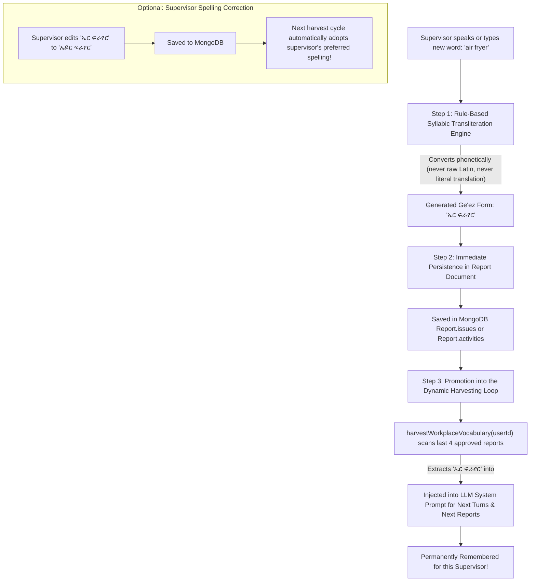

#### Step 1: Real-Time Detection & Syllabic Transliteration
When the supervisor speaks into the microphone (*"የኤር ፍራየሩ (air fryer) ቴምፕሬቸር አልሰራም"*) or types `air fryer`:
1. The engine's **Rule-Based English-to-Ge'ez Syllabic Transliteration** decomposes the English phonemes into Ge'ez syllables:
   - `air` $\rightarrow$ `ኤር`
   - `fryer` $\rightarrow$ `ፍራየር`
   - Combined $\rightarrow$ `ኤር ፍራየር`
2. It strictly enforces the core linguistic rule: **never leave it in raw Latin** (`air fryer`) and **never literally translate it** into artificial phrases (`የአየር መጥበሻ`).

#### Step 2: Immediate Persistence in the Active Report
The newly transliterated term `ኤር ፍራየር` is immediately written into the report document:
```javascript
report.issues.push({
  branch: 'ቦሌ',
  description: 'የኤር ፍራየር የሙቀት መቆጣጠሪያ ብልሽት',
  solutionDirection: 'በአዲስ ሊቀየር ታዟል',
  status: 'reported'
});
```
The supervisor sees it immediately in their draft report preview and chat response.

#### Step 3: Automatic Promotion into the Dynamic Harvest Loop (Zero-DB Architecture)
- On every prompt and report creation, the backend function `harvestWorkplaceVocabulary(userId)` queries the supervisor's **last 4 approved reports**:
  ```javascript
  Report.find({ user: req.user._id, isArchived: false, 'issues.0': { $exists: true } })
    .sort({ reportDate: -1 })
    .limit(4);
  ```
- Because the supervisor just filed a report containing `ኤር ፍራየር`, that report is now part of the historical dataset.
- On the **very next turn or report**, the lexical extractor automatically discovers `ኤር ፍራየር` in those past reports, tags it as a verified workplace term, and includes it inside the `<workplace_glossary>` XML injected into the LLM system prompt:
  ```xml
  <workplace_glossary>
    <term>ዲፕ ፍራየር</term>
    <term>ፒኦኤስ ማሽን</term>
    <term>ቺለር</term>
    <term>ኤር ፍራየር</term> <!-- Newly learned term! -->
  </workplace_glossary>
  ```
- From that moment forward, the model treats `ኤር ፍራየር` as an **established, first-class technical term** for that supervisor.

#### Step 4: User Correction Adaptation (Self-Reinforcing Learning)
What if the supervisor dislikes the AI's first phonetic spelling?
- Suppose the AI wrote `ኤር ፍራየር`, but the supervisor prefers `ኤይር ፍራየር`.
- The supervisor simply edits the word via the in-thread `[Edit]` button or the `/reports/:reportId/edit` page.
- Once saved, `ኤይር ፍራየር` is saved in the latest report document.
- Because the harvester always samples the most recent reports (`sort({ reportDate: -1 })`), the system **instantly and automatically adopts the supervisor's preferred spelling** on the next harvest cycle!

---

### Summary of Invariants for Section 8

| Invariant | Enforcement Mechanism |
| :--- | :--- |
| **Zero Database Glossary Tables** | Dynamic few-shot harvesting from last 4 approved reports directly into system prompt. |
| **Zero Raw Latin Script in Reports** | Pre-save regex linter (`/[a-zA-Z]/`) with automated phonetic fallback. |
| **Zero Literal Translations** | System prompt directive prohibiting artificial translations (e.g. `ጥልቅ መጥበሻ`). |
| **Standardized Ge'ez Orthography** | Canonical mapping matrix for all restaurant, kitchen, IT, and maintenance hardware. |
| **Homophone Search Resilience** | Canonical normalization (`ሀ, ሰ, አ, ጸ`) for all search indexes and query filters. |
| **Novel Word Learning Loop** | 4-step organic cycle: syllabic phonetics $\rightarrow$ report persistence $\rightarrow$ harvest loop $\rightarrow$ user correction. |
| **English UI / Amharic Content** | UI controls in 100% English; message/report text in Amharic with 17px default font size. |

---

# Section 9: Conversational Agent UI & MUI X Chat Integration

### 9.1 Single-Column ChatBox Canvas & AppShell Architecture

#### 9.1.1 Architectural Layout & Strict Single-Column Canvas
The Conversational Agent UI is built entirely upon **`@mui/x-chat`**, using the **`<ChatBox>`** component as the root conversational container. Across the entire application, both **Report Chat** (`type: 'report'`) and **General Chat** (`type: 'general'`) adhere strictly to a **Single-Column Canvas Layout**:

1. **Chronological Message Stream**: The conversational canvas consists of a single, unified vertical thread where messages are rendered sequentially from top to bottom.
2. **Horizontal Message Role Alignment**:
   - **Assistant Response (Agent)**: Fixed to the **LEFT** side of the canvas (`role="assistant"`). Renders with the AI Assistant avatar, dark slate neutral background (`#1E293B`), Ge'ez-optimized typography, tool execution indicators, and interactive report action cards.
   - **User Request (Supervisor)**: Fixed to the **RIGHT** side of the canvas (`role="user"`). Renders with the Supervisor avatar, primary brand accent background (`#2563EB`), white text, and attached voice note chips.
3. **Prohibition of Multi-Column Chat Views**: Under no circumstances shall the chat interface be split into a two-column desktop layout (such as placing a message stream on the left and a live document or metadata panel on the right within the chat route). The conversational workspace is strictly single-column to maximize readability of complex Ge'ez script, eliminate layout shifting during streaming, and provide identical visual experiences across desktop monitors, field laptops, and tablets.

#### 9.1.2 Linguistic Separation: 100% English Shell vs Amharic/Mixed Content
In strict compliance with Section 1.4.1 (Linguistic Separation Law), the Conversational Agent UI enforces an immutable linguistic boundary:

- **100% English App Shell**: All navigational chrome, drawer menus, header titles, status chips, buttons (`Send`, `Stop Generation`, `Copy`, `Edit`, `Retry`, `View Full Report`), tooltips, dialogs, validation messages, and composer helper text are rendered **exclusively in English**. No Amharic text may ever appear in UI chrome, button labels, or navigation elements.
- **Amharic / Mixed Conversational Content**: The text content within message bubbles, transcribed audio voice notes, and generated report payloads may be in **Amharic, English, or mixed**. Spoken audio recordings are always Amharic. English workplace technical terms appearing in chat text or generated reports are transliterated into natural Amharic phonetics (e.g., `ዲፕ ፍራየር`, `ፒኦኤስ ማሽን`, `ቺለር`, `ጀነሬተር`) per Section 8. Translation of user speech or report content is never artificially forced.

#### 9.1.3 Direct Request/Response Interaction Model (Zero `ChatConfirmation`)
The interaction architecture follows a clean, direct **Request/Response Model**:
- When a supervisor sends a message (via text input or Mode 3 audio dictation), the conversational agent immediately evaluates intent, executes required server-side tools (e.g., querying operational data, generating comparisons, mutating report fields), streams back the response, and renders in-stream action triggers.
- **Zero Gating Modals**: The UI **never** renders blocking approval popups, confirmation dialogs, or `ChatConfirmation` widgets. Supervisors are never forced to click "Confirm Action" or "Approve Tool Execution" before an action is carried out.
- **Post-Action Control**: If a supervisor wishes to modify an action taken by the agent, they do so directly through post-response controls: clicking **`[ ✏️ Edit in Form ]`**, clicking **`[ 📄 View Full Report ]`**, editing the message via **`[Edit]`**, or providing a natural conversational follow-up prompt.

#### 9.1.4 Zero Inner Chat Header Architecture
The chat interface mounts directly into the `AppShell` main content outlet (`<Box sx={{ flex: 1, display: 'flex', flexDirection: 'column', height: '100%', overflow: 'hidden' }}>`):
- **Single Global App Bar**: The top sticky `MuiAppbar` of the `AppShell` serves as the sole, authoritative header for the application.
- **Zero Duplicate Header**: The `<ChatBox>` component is explicitly configured with `features={{ conversationHeader: false }}`, completely removing the inner chat header, subtitle, and action toolbar. Stacked double-headers are strictly prohibited.
- **Top App Bar Controls**: The global `AppShell` header houses strictly 3 controls on the right: the Global Search icon (`[ 🔍 ]`), Theme Toggle (`[ 🌓 ]`), and the User Avatar/Profile menu. The sidebar collapse/toggle is located on the Sidebar header itself. The Model Selector and Preset Selector live inside the Chat Composer and Chat View toolbar.

#### 9.1.5 General Chat vs Report Chat Symmetrical Layout
The application maintains two specialized conversational modes that share the exact same single-column `<ChatBox>` foundation:

| Feature | General Chat (`type: 'general'`) | Report Chat (`type: 'report'`) |
| :--- | :--- | :--- |
| **Primary Route** | `/chats/:chatId` | `/reports/:reportId/chat` |
| **Header Badge** | `General Operations Chat` | `Report Co-Pilot: <Branch> (<DD-MM-YY>)` |
| **Primary Capabilities** | Cross-branch analytics, Google Sheets generation, management escalation memos, SOP guidance, financial calculations, read-only report querying. | 1-to-1 active report compilation, field mutation (`update_report_item`), visit scheduling, plain-text export. |
| **Interactive Triggers** | `[ 📄 View Full Report ]`, `[ 📊 Open Google Sheet ]`, Dynamic Comparison Matrices. | `[ 📄 View Full Report ]`, `[ ✏️ Edit in Form ]`, `[ 📋 Copy Report Text ]`. |
| **Composer Capabilities** | Mode 3 Audio Dictation, Mode 4 Voice Note Attachment, Suggestion Pills. | Mode 3 Audio Dictation, Mode 4 Voice Note Attachment, Transliteration Guidance. |
| **Message Alignment** | Agent on Left, User on Right. | Agent on Left, User on Right. |

---

#### 9.1.6 Visual Wireframes

##### Wireframe 1: General Chat (`type: 'general'`)
```
+-------------------------------------------------------------------------------------------------------------------+
| Report Builder                                                    [ 🔍 ]   [ 🌓 ]   [ User Avatar ▾ ]             |  <-- AppShell AppBar (Clean 3 controls, toggle is on sidebar)
+--------------+----------------------------------------------------------------------------------------------------+
| [ < Collapse]|                                                                                                    |
| [ + New Chat]|  [ 🤖 AI Operations Assistant ]                                                                     |
|              |  +-----------------------------------------------------------------------------------------------+  |
| DASHBOARD    |  | ሰላም ግርማ! በዛሬው ዕለት በሁሉም ብራንቾች የተመዘገቡ ዋና ዋና የአሰራር ጉዳዮችን እና የሽያጭ ሁኔታዎችን መመልከት ትችላለህ።     |  |  <-- Agent on LEFT
| • Overview   |  | ምን ማወቅ ትፈልጋለህ?                                                                            |  |
|              |  +-----------------------------------------------------------------------------------------------+  |
| REPORTS      |                                                                                                    |
| • All Reports|                                              +---------------------------------------------------+ |
| • Drafts     |                                              | የቦሌ እና የሳርቤት ብራንቾችን የትላንትና የቺለር እና የፒኦኤስ ማሽን ሁኔታ አወዳድርልኝ። | |  <-- User on RIGHT
|              |                                              +---------------------------------------------------+ |
| CHATS        |                                                                                                    |
| • Today's Ops|  [ 🤖 AI Operations Assistant ]                                                                     |
| • Bole Visit |  [ ⚙️ Queried 2 Branch Reports: Bole & Sarbet (19-01-2016 ዓ.ም) ]                                  |
| • Sarbet Rpt |  +-----------------------------------------------------------------------------------------------+  |
|              |  | ሁለቱንም ብራንቾች አወዳድሬያለሁ። በቦሌ ብራንች ቺለር ላይ የሙቀት መጨመር ችግር ሪፖርት ተደርጓል፤              |  |
| BRANCHES     |  | የሳርቤት ፒኦኤስ ማሽን ደግሞ የኔትወርክ መቆራረጥ አሳይቷል።                                             |  |
| • Bole       |  |                                                                                               |  |
| • Sarbet     |  | [ Branch Comparison Matrix ]                                                                  |  |
| • CMC        |  | +-------------+----------------------+--------------------+--------------------+            |  |
|              |  | | Branch      | Equipment Issue      | Severity           | Action Taken       |            |  |
| PROFILE      |  | +-------------+----------------------+--------------------+--------------------+            |  |
| • Profile    |  | | Bole        | ቺለር የሙቀት መጨመር  | High (አፋጣኝ)       | ቴክኒሻን ተጠርቷል    |            |  |
|              |  | | Sarbet      | ፒኦኤስ ማሽን መቆራረጥ  | Medium             | በሞባይል ዳታ ተተክቷል |            |  |
|              |  | +-------------+----------------------+--------------------+--------------------+            |  |
|              |  |                                                                                               |  |
|              |  | [ 📄 View Bole Report ]   [ 📄 View Sarbet Report ]   [ 📊 Export to Google Sheets ]            |  |  <-- Action Cards
|              |  +-----------------------------------------------------------------------------------------------+  |
|              |                                                                                                    |
|              |                             [ ↓ Jump to Latest ]                                                   |  <-- Scroll Affordance
|              |  +-----------------------------------------------------------------------------------------------+  |
|              |  | [ chiller ➔ ቺለር | Convert ]  [ pos ➔ ፒኦኤስ ማሽን | Convert ]                                     |  |  <-- Suggestion Chips
|              |  +-----------------------------------------------------------------------------------------------+  |
|              |  | [ 🎙️ ] [ 📎 ] | Ask a question, compare branches, or export data...                | [ ➤ Send ] |  |  <-- Centered Composer
|              |  +-----------------------------------------------------------------------------------------------+  |
|              |    Hold 🎙️ for Amharic dictation • Press Shift+Enter for newline • 100% Secure Enterprise AI     |  <-- Composer Helper
+--------------+----------------------------------------------------------------------------------------------------+
```

##### Wireframe 2: Report Chat (`type: 'report'`)
```
+-------------------------------------------------------------------------------------------------------------------+
| Report Builder                                                    [ 🔍 ]   [ 🌓 ]   [ User Avatar ▾ ]             |  <-- AppShell AppBar (Clean 3 controls, toggle is on sidebar)
+--------------+----------------------------------------------------------------------------------------------------+
| [ < Collapse]|                                                                                                    |
| [ + New Chat]|  [ 🤖 AI Report Co-Pilot ]                                                                         |
|              |  +-----------------------------------------------------------------------------------------------+  |
| DASHBOARD    |  | የቦሌ ብራንች የ 19-01-2016 ዓ.ም የቁጥጥር ሪፖርት ረቂቅ ተዘጋጅቷል። 4 ስራዎች እና 1 ችግር ተመዝግቧል።           |  |  <-- Agent on LEFT
| • Overview   |  | ሪፖርቱን እዚህ መመልከት፣ ማስተካከል ወይም በቀጥታ ወደ ሙሉ ፎርም መውሰድ ትችላለህ።                     |  |
|              |  |                                                                                               |  |
| REPORTS      |  | 📋 ሪፖርት ማጠቃለያ:                                                                           |  |
| • All Reports|  | • ብራንች: ቦሌ                                                                                 |  |
| • Drafts     |  | • ሰዓት: 08:30 - 17:00                                                                         |  |
|              |  | • ዋና ጉዳይ: የዲፕ ፍራየር ቴርሞስታት ብልሽት                                                       |  |
| CHATS        |  |                                                                                               |  |
| • Today's Ops|  | [ 📄 View Full Report ]   [ ✏️ Edit in Form ]   [ 📋 Copy Report Text ]                          |  |  <-- Direct Triggers
| • Bole Visit |  +-----------------------------------------------------------------------------------------------+  |
| • Sarbet Rpt |                                                                                                    |
|              |                                              +---------------------------------------------------+ |
| BRANCHES     |                                              | በመፍትሄ የሚፈልጉ ጉዳዮች ላይ የዲፕ ፍራየሩ ቴክኒሻን ነገ ከቀኑ 8 ሰዓት  | |  <-- User on RIGHT
| • Bole       |                                              | እንደሚመጣ ጨምርበት።                                | |
| • Sarbet     |                                              +---------------------------------------------------+ |
| • CMC        |                                                                                                    |
|              |  [ 🤖 AI Report Co-Pilot ]                                                                         |
| SETTINGS     |  [ ⚙️ Updated Report Field: issues[0].actionTaken ]                                                |
| • Profile    |  +-----------------------------------------------------------------------------------------------+  |
| • Presets    |  | በቦሌ ብራንች ሪፖርት ላይ ጉዳዩ ተስተካክሏል:                                                           |  |
|              |  | "የዲፕ ፍራየር ቴርሞስታት ብልሽት አጋጥሟል፤ ቴክኒሻን ነገ ከቀኑ 8:00 ሰዓት መጥቶ እንደሚያስተካክል ተረጋግጧል።"      |  |
|              |  |                                                                                               |  |
|              |  | [ 📄 View Full Report ]   [ ✏️ Edit in Form ]   [ 📋 Copy Report Text ]                          |  |  <-- Interactive Triggers
|              |  +-----------------------------------------------------------------------------------------------+  |
|              |                                                                                                    |
|              |  +-----------------------------------------------------------------------------------------------+  |
|              |  | [ deep fryer ➔ ዲፕ ፍራየር | Convert ]                                                           |  |  <-- Suggestion Chips
|              |  +-----------------------------------------------------------------------------------------------+  |
|              |  | [ 🎙️ ] [ 📎 ] | Instruct the co-pilot or narrate changes in Amharic...            | [ ➤ Send ] |  |  <-- Centered Composer
|              |  +-----------------------------------------------------------------------------------------------+  |
|              |    Hold 🎙️ for Amharic dictation • Press Shift+Enter for newline • Direct Request/Response Model    |  <-- Composer Helper
+--------------+----------------------------------------------------------------------------------------------------+
```

---

### 9.2 MUI X Chat Compound Component Specification & Styling Tokens

#### 9.2.1 Component Tree & Slot Architecture
The conversational interface uses the official `@mui/x-chat` component hierarchy:

```jsx
import {
  ChatBox,
  ChatMessageList,
  ChatMessage,
  ChatMessageAvatar,
  ChatMessageContent,
  ChatMessageActions,
  ChatTypingIndicator,
  ChatScrollToBottomAffordance,
  ChatComposer,
  ChatComposerTextArea,
  ChatComposerSendButton,
  ChatComposerAttachmentList
} from '@mui/x-chat';
```

##### Master Compound Hierarchy:
```
<ChatBox adapter={chatAdapter} features={{ conversationHeader: false, conversationList: false, scrollToBottom: true, autoScroll: true, attachments: true }}>
  ├── <ChatMessageList> (Virtualized with @tanstack/react-virtual or MUI Virtualizer)
  │     ├── <ChatDateDivider /> (Marks Ethiopian Calendar daily boundaries)
  │     ├── <ChatMessageGroup>
  │     │     ├── <ChatMessage role="assistant" | "user">
  │     │     │     ├── <ChatMessageAvatar src={...} />
  │     │     │     ├── <ChatMessageContent>
  │     │     │     │     ├── <ToolExecutionChip /> (e.g. "⚙️ Queried 2 Branch Reports")
  │     │     │     │     ├── <Typography className="chat-bubble-text"> (Ge'ez Script)
  │     │     │     │     ├── <ReportActionCard /> ([ View Full Report ], [ Edit in Form ], [ Copy Text ])
  │     │     │     │     └── <ComparisonMatrixTable /> (Responsive dynamic data grid)
  │     │     │     └── <ChatMessageActions>
  │     │     │           ├── <ActionButton label="Copy" icon={<ContentCopyIcon />} />
  │     │     │           ├── <ActionButton label="Edit" icon={<EditIcon />} />
  │     │     │           └── <ActionButton label="Retry" icon={<RefreshIcon />} />
  │     │     └── ...
  │     ├── <ChatTypingIndicator /> (Active when SSE stream is open or STT transcribing)
  │     └── <ChatScrollToBottomAffordance /> (Floating jump button when scrolled up)
  │
  └── <ChatComposer sx={{ maxWidth: 880, mx: 'auto', width: '100%' }}>
        ├── <TransliterationSuggestionBar /> (Surfaces novel word chips, e.g. "chiller" ➔ ቺለር)
        ├── <ChatComposerAttachmentList /> (Renders Mode 4 audio voice note attachments)
        └── <Box className="composer-input-row">
              ├── <AudioOrbButton mode="mode-3" /> (Ephemeral Amharic dictation)
              ├── <AudioAttachmentButton mode="mode-4" /> (File attachment paperclip)
              ├── <ChatComposerTextArea placeholder="Ask a question or dictate in Amharic..." />
              └── <ChatComposerSendButton /> (Transforms into Stop button during SSE stream)
```

#### 9.2.2 Legibility & Ge'ez Typography Tokens
Rendering Ethiopic Fidel characters requires careful typographic tuning to eliminate cramped glyphs, overlapping diacritics, and eye strain:

- **Font Family**: `'Noto Sans Ethiopic', 'Roboto', 'Helvetica', sans-serif`. `Noto Sans Ethiopic` is loaded via `@fontsource` to guarantee complete glyph coverage for all Amharic syllables.
- **Default Base Font Size**: **17px** (`1.0625rem`). Standard Latin 14px/16px sizes are too small for complex Ge'ez ligatures.
- **Line Height**: **1.75** (`lineHeight: 1.75`). Amharic characters possess distinct vertical ascenders and base variations; an expanded line height guarantees breathing room.
- **Letter Spacing**: `0.015em` for optimal optical character recognition by native Amharic readers.

#### 9.2.3 Dynamic Font-Size Scaling Subsystem
To ensure maximum comfort for field personnel working in varying lighting conditions, the UI includes a global font-size scaling mechanism:
- **Configuration Controls**: Located inside the User Preferences tab of the `/profile` route (`MuiSelect` font size dropdown: Small 15px, Normal 17px [default], Large 19px, Extra Large 21px). The top `MuiAppbar` remains ultra-clean and contains zero font stepper buttons.
- **State Definition**: Managed in Redux `themeSlice.fontSizeDelta` with values `-2`, `0` (default), `+2`, `+4`:
  - `fontSizeDelta: -2` $\rightarrow$ Base size **15px** (`lineHeight: 1.65`).
  - `fontSizeDelta: 0` $\rightarrow$ Base size **17px** (`lineHeight: 1.75`) — **Default**.
  - `fontSizeDelta: +2` $\rightarrow$ Base size **19px** (`lineHeight: 1.85`).
  - `fontSizeDelta: +4` $\rightarrow$ Base size **21px** (`lineHeight: 1.95`).
- **Persistence**: Persisted to `localStorage.getItem('theme_font_delta')` and applied universally across all `<ChatMessageContent>` and `<ReportActionCard>` components.

#### 9.2.4 Message Bubble Theming Tokens
Message bubbles derive visual styles from the active Material UI theme with curated contrast tokens:

| Element | Role / Variant | Light Mode Palette | Dark Mode Palette | Border & Shape |
| :--- | :--- | :--- | :--- | :--- |
| **Assistant Bubble** | `role="assistant"` | Background: `#F8FAFC`<br>Text: `#0F172A`<br>Code: `#E2E8F0` | Background: `#1E293B`<br>Text: `#F8FAFC`<br>Code: `#334155` | Border: `1px solid divider`<br>Border Radius: `16px 16px 16px 4px` |
| **User Bubble** | `role="user"` | Background: `#2563EB`<br>Text: `#FFFFFF`<br>Code: `#1D4ED8` | Background: `#3B82F6`<br>Text: `#FFFFFF`<br>Code: `#1D4ED8` | Border: `none`<br>Border Radius: `16px 16px 4px 16px` |
| **Tool Execution Chip** | `variant="outlined"` | Background: `#EFF6FF`<br>Text: `#1E40AF`<br>Border: `#BFDBFE` | Background: `#1E293B`<br>Text: `#93C5FD`<br>Border: `#3B82F6` | Border Radius: `8px`<br>Font Size: `13px` |
| **Action Trigger Card** | `variant="card"` | Background: `#FFFFFF`<br>Border: `#E2E8F0` | Background: `#0F172A`<br>Border: `#334155` | Border Radius: `12px`<br>Padding: `12px 16px` |

#### 9.2.5 Virtualized List & Auto-Scroll Configuration
- **Virtualization**: Long operational threads (exceeding 50+ turns) utilize `@tanstack/react-virtual` to virtualize off-screen message nodes, preserving a constant DOM node count under 100 elements.
- **Scroll Stickiness**: `<ChatBox>` sets `autoScroll={{ buffer: 300 }}`. When the supervisor is within 300px of the bottom, incoming SSE tokens auto-scroll smoothly. If the supervisor scrolls up to inspect previous turns, auto-scroll unlocks automatically.
- **Scroll Affordance**: `<ChatScrollToBottomAffordance>` renders a floating `[ ↓ Jump to Latest ]` badge with unread token count whenever auto-scroll is unlocked.

---

### 9.3 Custom SSE Streaming Adapter (`useChatStreamAdapter`) & Abort Protocol

#### 9.3.1 Adapter Implementation (`ChatAdapter` Specification)
The application bridges the backend SSE endpoint (`POST /api/v1/chats/:chatId/messages`) with MUI X Chat via a custom `ChatAdapter`:

```javascript
/**
 * Custom MUI X Chat Adapter bridging backend SSE streaming
 * @param {string} chatId - Target Chat ID
 * @param {string} activePresetId - Currently active Preset ID
 * @returns {import('@mui/x-chat').ChatAdapter}
 */
export const createChatStreamAdapter = (chatId, activePresetId) => {
  let activeAbortController = null;

  return {
    async sendMessage({ message, signal }) {
      activeAbortController = new AbortController();

      // Combined abort signal: UI stop button or adapter unmount
      const combinedSignal = signal || activeAbortController.signal;

      const payload = {
        prompt: message.parts.find((p) => p.type === 'text')?.text || '',
        preset: activePresetId,
        audioFileIds: message.attachments?.map((a) => a.id) || []
      };

      const response = await fetch(`/api/v1/chats/${chatId}/messages`, {
        method: 'POST',
        headers: { 'Content-Type': 'application/json' },
        body: JSON.stringify(payload),
        credentials: 'include',
        signal: combinedSignal
      });

      if (!response.ok) {
        if (response.status === 409) {
          throw new Error('Another generation is currently active for this chat.');
        }
        throw new Error(`Server error: ${response.statusText}`);
      }

      const reader = response.body.getReader();
      const decoder = new TextDecoder('utf-8');
      const messageId = `msg-assistant-${Date.now()}`;

      return new ReadableStream({
        async start(controller) {
          controller.enqueue({ type: 'start', messageId });
          controller.enqueue({ type: 'text-start', id: `text-${messageId}` });

          let buffer = '';

          try {
            while (true) {
              const { done, value } = await reader.read();
              if (done) break;

              buffer += decoder.decode(value, { stream: true });
              const lines = buffer.split('\n\n');
              buffer = lines.pop(); // Retain partial chunks

              for (const block of lines) {
                const eventMatch = block.match(/^event:\s*(.+)$/m);
                const dataMatch = block.match(/^data:\s*(.+)$/m);

                if (!eventMatch || !dataMatch) continue;

                const eventType = eventMatch[1].trim();
                const eventData = JSON.parse(dataMatch[1]);

                switch (eventType) {
                  case 'text_delta':
                    controller.enqueue({
                      type: 'text-delta',
                      id: `text-${messageId}`,
                      delta: eventData.delta
                    });
                    break;

                  case 'tool_call_start':
                    controller.enqueue({
                      type: 'custom',
                      name: 'tool_indicator',
                      data: { toolName: eventData.tool, status: 'running' }
                    });
                    break;

                  case 'tool_call_result':
                    controller.enqueue({
                      type: 'custom',
                      name: 'tool_indicator',
                      data: { toolName: eventData.tool, status: 'completed', result: eventData.summary }
                    });
                    break;

                  case 'report_updated':
                    controller.enqueue({
                      type: 'custom',
                      name: 'report_trigger',
                      data: {
                        reportId: eventData.reportId,
                        branchName: eventData.branchName,
                        ethiopianDate: eventData.ethiopianDate,
                        plainText: eventData.plainText
                      }
                    });
                    break;

                  case 'provider_fallback':
                    controller.enqueue({
                      type: 'custom',
                      name: 'fallback_notification',
                      data: { from: eventData.from, to: eventData.to, reason: eventData.reason }
                    });
                    break;

                  case 'stream_end':
                    controller.enqueue({ type: 'text-end', id: `text-${messageId}` });
                    controller.enqueue({ type: 'finish', messageId });
                    return;

                  case 'error':
                    throw new Error(eventData.message);
                }
              }
            }
          } catch (err) {
            controller.enqueue({ type: 'text-end', id: `text-${messageId}` });
            controller.enqueue({ type: 'abort', messageId });
          } finally {
            controller.close();
          }
        }
      });
    },

    stop() {
      // Explicit backend notification to halt Gemini generation and release lock
      if (activeAbortController) {
        activeAbortController.abort();
      }
      fetch(`/api/v1/chats/${chatId}/abort`, {
        method: 'POST',
        credentials: 'include'
      }).catch(() => {});
    },

    async listMessages({ conversationId, cursor }) {
      const params = new URLSearchParams({ cursor: cursor || '', limit: '20' });
      const res = await fetch(`/api/v1/chats/${chatId}/messages?${params}`, {
        credentials: 'include'
      });
      const { data } = await res.json();
      return {
        messages: data.docs.map(transformMessageToMuiFormat),
        cursor: data.nextCursor,
        hasMore: Boolean(data.hasMore)
      };
    }
  };
};
```

#### 9.3.2 Client-Side Stream Cancellation Protocol (`POST /api/v1/chats/:chatId/abort`)
When a supervisor clicks the **`[ Stop Generation ]`** button while the assistant is streaming:
1. **Frontend Abort**: The adapter immediately calls `activeAbortController.abort()`, which terminates the client-side `fetch` stream and stops browser rendering.
2. **Backend Abort Request**: The adapter simultaneously fires `POST /api/v1/chats/:chatId/abort`.
3. **Backend Processing**: The backend looks up the active chat in the in-memory `activeChatStreams` map, triggers the associated Node.js `AbortController.abort()`, interrupts the Gemini API token stream, persists the partial text to MongoDB with `isTruncated: true`, and deletes the entry from `activeChatStreams`.
4. **Lock Release**: The per-chat concurrency lock is released within **<50ms**, allowing the supervisor to immediately send a new query without encountering an HTTP 409 Conflict.

---

### 9.4 Centered Composer, Sub-5ms Latency Guarantee & Mode 3 Audio Dictation Flow

#### 9.4.1 Layout & Responsive Centering
The conversational composer is housed in a fixed bottom container engineered for maximum ergonomic comfort:
- **Max Width**: Strictly constrained to **880px** (`maxWidth: 880, width: '100%'`). On ultra-wide monitors, the composer never stretches across the entire screen; it remains centered directly under the user's primary line of sight.
- **Horizontal Centering**: Centered via `margin: '0 auto'` with responsive padding (`px: { xs: 2, sm: 3 }`).
- **Elevated Pill Surface**: Designed as an elevated rounded container (`borderRadius: '24px'`, `boxShadow: '0 8px 32px rgba(0,0,0,0.12)'`, background `#1E293B` in dark mode, `#FFFFFF` in light mode).

#### 9.4.2 Sub-5ms Typing Latency Guarantee
Typing in Amharic or mixed English requires extreme keystroke responsiveness. A typing lag exceeding 16ms causes dropped frames and typing stutter:
1. **Strict Component Isolation**: The `<ChatComposer>` component maintains its own local, uncontrolled input state via `useRef` and local `useState`. Typing in the textarea **never** triggers re-renders in the parent `<ChatBox>`, `<ChatMessageList>`, or global Redux store.
2. **`React.memo` Boundary**: The entire composer tree is wrapped in `React.memo`, preventing any re-render cycles while messages are streaming in the list above.
3. **Hardware-Accelerated Layout**: Fixed height limits and CSS `contain: layout style` ensure that keystroke DOM updates take **<3ms** to layout and paint, satisfying the sub-5ms latency guarantee at 60fps.

#### 9.4.3 Mode 3 Audio Dictation Flow (Audio Orb)
The composer features a dedicated **Microphone Audio Orb** button for natural spoken Amharic dictation:

```
[ Click 🎙️ Orb ]
       │
       ▼
[ Browser MediaRecorder starts (audio/webm;codecs=opus) ]
       │
       ▼
[ Orb pulses with GPU-accelerated CSS keyframe animation ]
       │
       ▼
[ Supervisor clicks Stop (or 120s auto-cutoff) ]
       │
       ▼
[ Client uploads Audio Blob to POST /api/v1/audio/transcribe-draft ]
       │
       ▼
[ Addis AI STT processes audio synchronously (mono 16kHz PCM) ]
       │
       ▼
[ Amharic plain text returned to frontend ]
       │
       ▼
[ Injected directly at cursor position in <ChatComposerTextArea> ]
       │
       ▼
[ Supervisor reviews/edits text in composer ➔ Presses [ Send ] ]
       │
       ▼
[ Ephemeral audio blob in memory garbage-collected; ZERO server disk files saved ]
```

##### 9-Point Mode 3 Edge-Case Defense Matrix:
1. **Zero Server Disk Storage**: Audio recorded via Mode 3 is sent to an ephemeral endpoint that streams directly to Addis AI. The file is never written to disk or GridFS.
2. **Microphone Permission Denied**: If the user denies mic access, a non-blocking toast informs: `"Microphone access required. Please enable permissions in your browser settings."` The composer remains active for text input.
3. **Empty / Silent Audio Gate**: If the supervisor records silence or ambient noise (<1.5s or RMS < -45dB), the client detects low amplitude and displays: `"No speech detected. Please speak clearly into the microphone."` No API call is made.
4. **Mid-Dictation Network Drop**: If the network disconnects during transcription, the client caches the audio Blob locally in memory and displays a `[ Retry Transcription ]` button.
5. **Cursor Position Preservation**: If text already exists in `<ChatComposerTextArea>`, the transcribed Amharic text is spliced exactly at `selectionStart`, inserting a leading and trailing space automatically.
6. **Maximum Duration Bounding**: Mode 3 enforces a hard client-side cutoff of **120 seconds**. At 115 seconds, a countdown timer pulses red; at 120 seconds, recording stops automatically and dispatches to STT.
7. **Accidental Tab Close / Navigation**: If recording is active and the user attempts to close the tab, the `beforeunload` event triggers a native browser warning.
8. **Audio Recording During Active SSE Stream**: If the assistant is currently streaming a response, clicking the mic orb automatically stops the SSE stream first via `adapter.stop()` before opening the microphone stream.
9. **Zero Latin Transliteration Enforcement**: Text transcribed by Addis AI is verified against the Section 8 phonetic dictionary; English equipment terms (e.g. `chiller`) are automatically harmonized to canonical Ge'ez (`ቺለር`) before insertion.

#### 9.4.4 Mode 4 Audio Attachment Flow
Next to the Audio Orb sits the **Paperclip Attachment Button** (`[ 📎 ]`):
- Clicking the paperclip allows supervisors to attach pre-recorded audio files (`.m4a`, `.mp3`, `.wav`, `.aac`, max 25MB).
- Attached audio files render as removable audio chips in `<ChatComposerAttachmentList>` directly above the textarea:
  `[ 🎵 Bole_Visit_Audio.m4a (3:12) | ✕ ]`
- When sent, the audio file is uploaded via `multipart/form-data` to `/api/v1/audio/upload`, saved to GridFS/disk, processed through FFmpeg, transcribed, and attached permanently to the `Message` node.

#### 9.4.5 Real-Time Transliteration Guidance & Suggestion Chips
Directly above the composer sits the **Transliteration Suggestion Bar**:
- As the supervisor types in the composer, an in-memory lexical watcher scans for English words matching known restaurant/workplace hardware.
- If a supervisor types `"chiller"`, a pill chip immediately appears:
  **`[ chiller ➔ ቺለር | Convert ]`**
- Clicking the chip (or pressing `Tab`) instantly replaces `"chiller"` with `"ቺለር"` inside the textarea at the active cursor position.
- This empowers supervisors to type quickly without memorizing complex phonetic key combinations.

---

### 9.5 In-Stream Interactive Action Cards & Dynamic Matrices

#### 9.5.1 Report Action Triggers
Whenever the agent compiles, queries, or updates a report, the assistant message bubble renders an interactive **Action Button Bar** directly below the response text:

```jsx
<Box sx={{ display: 'flex', gap: 1.5, mt: 2, flexWrap: 'wrap' }}>
  <Button
    variant="contained"
    size="medium"
    startIcon={<DescriptionIcon />}
    onClick={() => navigate(`/reports/${report._id}/details`)}
    sx={{ textTransform: 'none', fontWeight: 600 }}
  >
    View Full Report
  </Button>
  
  <Button
    variant="outlined"
    size="medium"
    startIcon={<EditIcon />}
    onClick={() => navigate(`/reports/${report._id}/edit`)}
    sx={{ textTransform: 'none' }}
  >
    Edit in Form
  </Button>
  
  <Button
    variant="outlined"
    size="medium"
    startIcon={<ContentCopyIcon />}
    onClick={() => handleCopyReportText(report.generated)}
    sx={{ textTransform: 'none' }}
  >
    Copy Report Text
  </Button>
</Box>
```

- **`[ 📄 View Full Report ]`**: Navigates the supervisor to `/reports/:reportId/details` or opens the full-screen report viewer drawer with zero page reload.
- **`[ ✏️ Edit in Form ]`**: Deep-links to the 2-column dedicated report editor `/reports/:reportId/edit` with all fields pre-populated.
- **`[ 📋 Copy Report Text ]`**: Copies the locked, formatted Amharic plain-text string directly to the clipboard and triggers a green confirmation toast: `"Amharic report text copied to clipboard!"`.

#### 9.5.2 In-Message Report Preview Card (`ReportReferenceCard`)
When an existing report is referenced in General Chat, the agent embeds an interactive reference card:
```
+-----------------------------------------------------------------------------------------------+
| 📄 Bole Branch Operational Report                                          [ Status: Approved ]|
| Date: 19-01-2016 ዓ.ም (29-09-2024) • Shift: 08:30 - 17:00 • Supervisor: ግርማ ተስፋዬ               |
| Activities: 4 Recorded • Issues: 1 Critical (ዲፕ ፍራየር) • Comments: Good Progress             |
|                                                                                               |
| [ View Full Report ]          [ Edit in Form ]          [ Copy Plain Text ]                   |
+-----------------------------------------------------------------------------------------------+
```

#### 9.5.3 Dynamic Multi-Branch Comparison Matrix (`OperationalMatrixCard`)
When the supervisor asks cross-branch analytical questions (e.g. comparing POS machine uptime or chiller temperatures across branches), the agent invokes `generate_operational_matrix` and renders a responsive Material UI table card:

```
+-----------------------------------------------------------------------------------------------+
| 📊 Multi-Branch Comparison: Equipment & Systems Status (19-01-2016 ዓ.ም)                        |
+-------------------+----------------------+--------------------+-------------------------------+
| Branch            | Equipment / System   | Status / Severity  | Action Taken / Note           |
+-------------------+----------------------+--------------------+-------------------------------+
| Bole (ቦሌ)         | ዲፕ ፍራየር          | 🔴 High (አፋጣኝ)    | ቴክኒሻን ተጠርቷል                |
| Sarbet (ሳርቤት)     | ፒኦኤስ ማሽን          | 🟡 Medium          | በሞባይል ዳታ እየሰራ ነው          |
| CMC (ሲኤምሲ)       | ቺለር                 | 🟢 Normal          | መደበኛ ፍተሻ ተካሂዷል             |
| Kazanchis (ካዛንቺስ) | ጀነሬተር              | 🟢 Normal          | የነዳጅ መጠን ተሞልቷል            |
+-------------------+----------------------+--------------------+-------------------------------+
| [ Export to Google Sheets ]                       [ Query Specific Branch Details ]           |
+-----------------------------------------------------------------------------------------------+
```

#### 9.5.4 Google Sheets Live Export Trigger (`GoogleSheetsExportCard`)
When the agent executes `export_to_google_sheet`, it returns an interactive chip card with a direct Google Drive link:
```
+-----------------------------------------------------------------------------------------------+
| 📊 Google Spreadsheet Generated Successfully                                                  |
| Title: "Enjoy Burger - Multi-Branch Operations Comparison (19-01-2016)"                       |
| Created: Just now • Rows: 14 Branches • Permissions: Restricted to your Google Account         |
|                                                                                               |
| [ 🔗 Open in Google Sheets ↗ ]                                  [ 📋 Copy Sheet Link ]       |
+-----------------------------------------------------------------------------------------------+
```

---

### 9.6 Model Selector & Preset Management Architecture

#### 9.6.1 Strict Architectural Separation of Model Selector vs. Preset Selector
To eliminate configuration confusion, Section 9 establishes a strict functional and visual separation between runtime LLM parameter selection and persistent persona presets:
1. **The Model Selector**: Manages runtime LLM execution parameters (Provider, Model, Language, and Reasoning effort) on the fly via an accessible Popover/Menu.
2. **The Preset Selector**: Manages reusable operational personas, system prompts, and SOP instructions via a dedicated Material UI Dialog featuring empty-state handling and `react-hook-form`.

---

#### 9.6.2 Control A: The Model Selector (LLM Runtime Configuration)
- **Placement & UI Trigger**: Mounted on the Chat Composer action row and Chat header via a model badge/icon button: `[ ⚙️ Google / Gemini 2.5 ▾ ]`. Clicking opens an **MUI Menu / Popover**.
- **Configurable Dimensions (Derived from Provider Documentation)**:
  1. **Provider**: `Google` | `Addis AI` | `NVIDIA`.
  2. **Model**: Filtered dynamically by selected provider:
     - Google: `gemini-2.5-flash` (default), `gemini-2.5-flash-lite`.
     - Addis AI: `addis-1-alef`.
     - NVIDIA NIM: `meta/llama-3.1-nemotron-70b-instruct`.
  3. **Language**: `Amharic` (`am`, default) | `English` (`en`) based on provider doc capabilities.
  4. **Reasoning Effort / Budget**: Dynamically displayed according to upstream provider capabilities:
     - **Addis AI**: Does not support reasoning parameters $\rightarrow$ field is hidden or disabled.
     - **Google Gemini**: Supports reasoning $\rightarrow$ exposed with selectable values `default`, `high`, `max` (defaulting to `max`).
- **System Defaults**:
  - **Provider**: `Google`
  - **Model**: `gemini-2.5-flash`
  - **Language**: `Amharic`
  - **Reasoning**: `max` (highest available supported by the provider)
- **STT Invariance Law**: Selecting or altering the LLM provider, model, language, or reasoning has **zero effect on Speech-to-Text**. In-browser audio dictation and uploaded voice notes are **always and exclusively** transcribed by **Addis AI** (`addisai` SDK).

```
MODEL SELECTOR POPOVER / MENU WIREFRAME:
┌────────────────────────────────────────────────────────┐
│ ⚙️ AI Model Configuration                              │
├────────────────────────────────────────────────────────┤
│ Provider:   [ Google ▾ ]  (Google | Addis AI | NVIDIA) │
│ Model:      [ gemini-2.5-flash ▾ ]                     │
│ Language:   [ Amharic (አማርኛ) ▾ ]                       │
│ Reasoning:  [ Max / Deep Thought ▾ ]                   │
│             (Dynamically disabled if Addis AI selected)│
│                                                        │
│ ℹ️ STT Voice Narration is always powered by Addis AI   │
│                                           [ Apply ]    │
└────────────────────────────────────────────────────────┘
```

---

#### 9.6.3 Control B: The Preset Selector & Management Dialog (`MuiDialog`)
- **Placement & UI Trigger**: Triggered via `[ 📋 Presets ▾ ]` button in the composer action toolbar or App bar.
- **Dialog Architecture & Two-State Flow**:
  - **State 1: Empty State (When no presets exist for user)**:
    - Centers an **`MuiEmptyState`** component inside the dialog:
      - Icon: Document / Persona icon (`FolderSpecialIcon` or `AssignmentIndIcon`).
      - Title: *"No Presets Found"*.
      - Description: *"You have not created any custom agent presets. Create a tailored persona with custom prompts and AI parameters."*
      - Primary Action Button: **`[ + Create Preset ]`** (size="small", contained).
  - **State 2: Preset Creation / Edit Form (`react-hook-form`)**:
    - Clicking `[ + Create Preset ]` renders the structured creation form built with `react-hook-form` using `mode: 'onBlur'`:
      1. **`name`**: Preset name string (Required, 3–50 chars, inline `helperText` on error).
      2. **`persona`**: Operational persona / role prompt (Required textarea, min 2 rows).
      3. **`system`**: Foundational system prompt and SOP checklist (Required textarea, min 4 rows).
      4. **`providerConfig`**: Embedded Model Selector configuration incorporating Provider, Model, Language, and Reasoning (as specified in Subsection 9.6.2).
- **Responsive Layout**: Renders fullscreen on `xs` without border radius; centered 560px modal on `sm+`.
- **Validation**: Strict `mode: 'onBlur'` evaluation; all validation errors surface via red `helperText` beneath the corresponding inputs.

```
PRESET DIALOG - STATE 1: EMPTY STATE
┌────────────────────────────────────────────────────────┐
│ Presets                                            [✕] │
├────────────────────────────────────────────────────────┤
│                                                        │
│                      [ 📋 Icon ]                       │
│                   No Presets Found                     │
│    You haven't created any custom agent presets yet.   │
│                                                        │
│                 [ + Create Preset ]                    │
│                                                        │
└────────────────────────────────────────────────────────┘

PRESET DIALOG - STATE 2: REACT-HOOK-FORM CREATION
┌────────────────────────────────────────────────────────┐
│ New Agent Preset                                   [✕] │
├────────────────────────────────────────────────────────┤
│ Preset Name:                                           │
│ [ e.g. Strict Food Safety Auditor                    ] │
│                                                        │
│ Persona Prompt:                                        │
│ [ You are an uncompromising restaurant hygiene...    ] │
│                                                        │
│ System Prompt:                                         │
│ [ Evaluate kitchen checklist adherence against...    ] │
│                                                        │
│ ── AI Model Configuration ──────────────────────────── │
│ Provider:   [ Google ▾ ]                               │
│ Model:      [ gemini-2.5-flash ▾ ]                     │
│ Language:   [ Amharic ▾ ]   Reasoning: [ Max ▾ ]       │
│                                                        │
│                             [ Cancel ]   [ Save Preset]│
└────────────────────────────────────────────────────────┘
```

#### 9.6.4 Mid-Chat Switching Behavior
- **Zero Thread Disruption**: Switching model configuration or preset does not reload or truncate the active thread.
- **Dynamic Context Transition**: Future messages immediately adopt the new runtime parameters or system instructions.
- **Immutable Historical Node Execution**: Past message nodes permanently store the executed parameters (`aiMetadata.provider`, `aiMetadata.model`, `aiMetadata.reasoning`, `aiMetadata.preset`).

---


### 9.7 The In-Canvas 10-Row Symmetrical Report Initiation Form

#### 9.7.1 Form Architecture & Two-Column In-Canvas Canvas Layout
Report creation is hosted strictly **in-canvas within `/chat`** (zero `/reports/new` standalone page). When the supervisor clicks `[ + New Report ]`, the centered composer temporarily hides and the **In-Canvas 10-Row Report Initiation Form** mounts directly in the conversational outlet:
- **Left Column (60% width)**: The 10-row structured input form with pickers, autocomplete, audio ingestion, and task tables.
- **Right Column (40% width)**: Sticky, real-time live preview of the assembled **Plain-Text Amharic Report**. As the supervisor selects branches, times, or issues, the locked Amharic text updates deterministically before their eyes.
- **Lifecycle & Dismissal**: Clicking `[ Cancel ]` prompts an `MuiConfirmDialog` (if dirty) and restores the normal composer; clicking `[ Submit ]` validates fields, dismisses the form, restores the composer in streaming state, and initiates the SSE agent turn.

#### 9.7.2 Row-by-Row Field Specification

```
+--------------------------------------------------------------------------------------------------------------------+
| The In-Canvas 10-Row Symmetrical Report Initiation Surface (Mounted in /chat)                                      |
+--------------------------------------------------------------------------------------------------------------------+
| Row 1: Ethiopian Date Picker                                                                                       |
|   [ 📅 19-01-2016 ዓ.ም ]  (Bidirectionally synced with Gregorian: 29-09-2024 UTC)                                   |
+--------------------------------------------------------------------------------------------------------------------+
| Row 2: Shift Selector                                                                                              |
|   (•) Morning (08:30 - 17:00)   ( ) Afternoon (13:00 - 21:00)   ( ) Night (20:00 - 04:00)   ( ) Custom Shift       |
+--------------------------------------------------------------------------------------------------------------------+
| Row 3: Primary Branch Autocomplete                                                                                 |
|   [ Search or select primary branch: Bole Branch ▾ ]   Chips: [ Bole ] [ Sarbet ] [ CMC ] [ Kazanchis ]            |
+--------------------------------------------------------------------------------------------------------------------+
| Row 4: Multi-Branch Visits Table (Chronological Itinerary)                                                          |
|   +----+---------------+----------+-----------+--------------------+-----------------------------+                 |
|   | #  | Branch Name   | Clock-In | Clock-Out | Inspection Status  | Actions                     |                 |
|   +----+---------------+----------+-----------+--------------------+-----------------------------+                 |
|   | 1  | Sarbet        | 08:30    | 11:45     | Completed          | [ ✏️ Edit ] [ 🗑️ Delete ]     |                 |
|   | 2  | Bole (Primary)| 12:15    | 15:30     | In Progress        | [ ✏️ Edit ] [ 🗑️ Delete ]     |                 |
|   | 3  | CMC           | 15:45    | 17:00     | Scheduled          | [ ✏️ Edit ] [ 🗑️ Delete ]     |                 |
|   +----+---------------+----------+-----------+--------------------+-----------------------------+                 |
|   [ + Add Branch Visit ]                                                                                           |
+--------------------------------------------------------------------------------------------------------------------+
| Row 5: Activities Multi-Input                                                                                      |
|   • የጠዋት የሰራተኞች ስብሰባ ተካሂዶ የስራ ድልድል ተሰጥቷል።                                                  [ ✕ ]           |
|   • የጥሬ ዕቃ እና የፍሪጅ ሙቀት ፍተሻ ተደርጓል።                                                               [ ✕ ]           |
|   [ + Add Activity in Amharic...                                                            ] [ Add ]              |
+--------------------------------------------------------------------------------------------------------------------+
| Row 6: Issues & Corrective Actions Grid                                                                            |
|   +---------------+--------------------------------+---------------+--------------------+--------+                 |
|   | Branch        | Issue Description (Amharic)    | Severity      | Action Taken       | Action |                 |
|   +---------------+--------------------------------+---------------+--------------------+--------+                 |
|   | Bole          | የዲፕ ፍራየር ቴርሞስታት ብልሽት       | High (አፋጣኝ)  | ቴክኒሻን ተጠርቷል   | [ 🗑️ ] |                 |
|   +---------------+--------------------------------+---------------+--------------------+--------+                 |
|   [ + Add Issue / Corrective Action ]                                                                              |
+--------------------------------------------------------------------------------------------------------------------+
| Row 7: Tri-Modal Audio Ingestion Bar                                                                               |
|   [ Mode A: 🎙️ Record Spoken Amharic Narration (Audio Orb) ]                                                        |
|   [ Mode B: 📁 Browse Audio Files ]                                                                                 |
|   [ Mode C: 📥 Drag and drop audio files here (.m4a, .mp3, .wav, .aac - max 25MB) ]                                 |
+--------------------------------------------------------------------------------------------------------------------+
| Row 8: Audio Queue Deck (Method 1 In-Memory Client Blob Players)                                                   |
|   +----------------------------------------------------------------------------------------------+                 |
|   | 🎵 Bole_Morning_Narration.m4a (2:45) • 4.2 MB • Ready for Compilation                         |                 |
|   | [ ▶ Play ] ──●──────────────────────── 02:45   Volume: [ 🔊 ──●── ]   [ 🗑️ Remove Clip ]       |                 |
|   +----------------------------------------------------------------------------------------------+                 |
|   | 🎵 Sarbet_Issue_Note.wav (1:12) • 1.8 MB • Ready for Compilation                             |                 |
|   | [ ▶ Play ] ──────●──────────────────── 01:12   Volume: [ 🔊 ──●── ]   [ 🗑️ Remove Clip ]       |                 |
|   +----------------------------------------------------------------------------------------------+                 |
+--------------------------------------------------------------------------------------------------------------------+
| Row 9: Supervisory Opinions & Recommendations                                                                      |
|   +----------------------------------------------------------------------------------------------+                 |
|   | በሳርቤት ብራንች የነበረው የደንበኞች መስተንግዶ ፈጣን ነበር። በቦሌ ብራንች የተበላሸው ዲፕ ፍራየር በአፋጣኝ እንዲጠገን        |                 |
|   | ክትትል ሊደረግበት ይገባል።                                                                    |                 |
|   +----------------------------------------------------------------------------------------------+                 |
+--------------------------------------------------------------------------------------------------------------------+
| Row 10: Action Footer (Sticky Bottom Bar)                                                                          |
|   [ Reset Form ]                    [ Save as Draft ]           [ 🚀 Compile & Open in Report Chat ]               |
+--------------------------------------------------------------------------------------------------------------------+
```

#### 9.7.3 Row 7 Tri-Modal Audio Ingestion & Row 8 Audio Queue Deck
Row 7 provides three flexible ways for supervisors to ingest spoken audio notes:
1. **Mode A (Live Audio Orb)**: Click the embedded Audio Orb to record spoken Amharic directly into the browser.
2. **Mode B (File Browser)**: Standard file picker allowing multi-selection of `.m4a`, `.mp3`, `.wav`, `.aac` files.
3. **Mode C (Drag-and-Drop Dropzone)**: Visual drop area supporting file drop events.

All ingested audio clips stage into **Row 8: Audio Queue Deck**. Each clip displays:
- Original file name and byte size.
- Duration formatted as `MM:SS`.
- **Method 1 In-Memory Client Blob Player**: Plays audio directly from `URL.createObjectURL(file)` in browser memory. This guarantees zero network roundtrips, instant playback seeking, and complete immunity to HTTP 206 Range stream errors.
- Remove / Re-record button.

#### 9.7.4 Form Submission & Transition into Report Chat
When the supervisor clicks **`[ 🚀 Compile & Open in Report Chat ]`**:
1. The client performs atomic validation of required fields (Date, Shift, Primary Branch).
2. The client packages all form fields along with audio clips into a single `multipart/form-data` request sent to `POST /api/v1/reports`.
3. The backend executes Section 1.4.7 (Mongoose `ClientSession` atomic transaction), creates the `Report` document, initializes the corresponding `type: 'report'` `Chat` document, transcribes queued audio via Addis AI STT, deterministically assembles the locked Amharic report string, and commits the transaction.
4. The frontend receives `{ success: true, data: { report, chat } }` and smoothly navigates to:
   **`/reports/:reportId/chat`**
5. The supervisor lands directly in the Report Chat, with the draft report pre-loaded on the left, ready for conversational refinement!

---

### 9.8 Implementation Precautions & Cross-Section Guardrails

To prevent implementation defects in subsequent phases (Frontend Routing in Section 10, REST API in Section 11, Backend Infrastructure in Section 12, Verification in Section 13, and Deployment in Section 14), downstream developers and builder agents must enforce the following explicit guardrails:

#### 9.8.1 Common Implementation Pitfalls & Mitigation Checklist
1. **Composer Redux Decoupling**: **Never** connect the `<ChatComposerTextArea>` value to the global Redux store. Storing every keystroke in Redux triggers top-level state updates that re-render the virtualized message list, violating the sub-5ms latency guarantee. State must be purely local to `<ChatComposer>`.
2. **Audio Blob Memory Leak Prevention**: When audio clips are staged in Row 8 using `URL.createObjectURL(blob)`, always revoke the URLs using `URL.revokeObjectURL(url)` inside the component's `useEffect` cleanup return:
   ```javascript
   useEffect(() => {
     return () => {
       audioQueue.forEach((item) => {
         if (item.blobUrl) URL.revokeObjectURL(item.blobUrl);
       });
     };
   }, [audioQueue]);
   ```
3. **SSE Connection Teardown on Route Change**: When a supervisor navigates away from `/chats/:chatId` while an SSE stream is active, the React router cleanup hook must explicitly call `adapter.stop()`. Leaving dangling fetch connections results in orphaned Gemini generation tokens and persistent concurrency locks.
4. **MUI X Chat Feature Flag Enforcement**: Always set:
   ```javascript
   features={{
     conversationHeader: false, // Ensures zero inner header
     conversationList: false,   // Prevents duplicate inner conversation drawer
     scrollToBottom: true,
     autoScroll: true,
     attachments: true
   }}
   ```
5. **Dynamic Font Sizing Consistency**: The `fontSizeDelta` value managed in `themeSlice` must be passed into MUI theme typography overrides so that tool execution chips, preview cards, and composer inputs scale harmoniously with message bubble text.

#### 9.8.2 Novel Workplace Term Lifecycle in the UI (Continuous Learning Loop)
When a supervisor encounters or dictates a novel English workplace term (e.g. `air fryer`), the UI seamlessly executes the 4-Stage Learning Loop established in Section 8:
1. **Real-Time Suggestion**: As the supervisor types `air fryer`, the composer's transliteration watcher suggests `[ air fryer ➔ ኤር ፍራየር | Convert ]`.
2. **Addis AI Harmonization**: If spoken in audio, Addis AI transcribes the phonetics as `ኤር ፍራየር`.
3. **Report Persistence**: When the supervisor clicks `[ Save as Draft ]` or compiles the report, `ኤር ፍራየር` is stored in the `Report` document.
4. **Dynamic Harvest Loop**: On subsequent chats, the backend lexical harvester automatically discovers `ኤር ፍራየር` from the supervisor's last 4 approved reports and injects it into `<workplace_glossary>`.
5. **Supervisor Correction Support**: If the supervisor prefers a different phonetic spelling (e.g. `ኤይር ፍራየር`), they simply click `[ ✏️ Edit in Form ]` or `[Edit]`, modify the word, and save. The harvester immediately adopts the supervisor's corrected spelling on the very next harvest cycle!

---

### Summary of Invariants for Section 9

| Invariant | Enforcement Mechanism |
| :--- | :--- |
| **Strict Single-Column ChatBox Canvas** | Root layout is strictly 1-column `@mui/x-chat` `<ChatBox>`. Multi-column split views prohibited in chat. |
| **Horizontal Role Alignment** | Assistant on LEFT (`#1E293B`, dark slate, avatar); User on RIGHT (`#2563EB`, primary blue, avatar). |
| **100% English Shell / Amharic Content** | UI chrome, buttons, badges, navigation are 100% English; message/report text is Amharic/mixed. |
| **Direct Request/Response Model** | Direct execution without `ChatConfirmation` approval dialogs or blocking popups. |
| **Zero Inner Chat Header** | `ChatBox` sets `features={{ conversationHeader: false }}`; `AppShell` `AppBar` is the only header. |
| **Legibility & Ge'ez Typography** | Default base font size **17px**, `lineHeight: 1.75`, `Noto Sans Ethiopic` font family. |
| **Clean App Bar Right Controls** | `AppShell` `AppBar` right side strictly limited to Global Search `[ 🔍 ]`, Theme Toggle `[ 🌓 ]`, and User Avatar `[ 👤 ]` (zero bell icon, zero font stepper buttons). |
| **Model Selector & Preset Separation** | Model Selector handles runtime LLM params via Popover with default Google/Gemini/Amharic/max; Preset Selector manages personas via MUI Dialog with `MuiEmptyState` and `react-hook-form`. |
| **STT Provider Invariance** | Changing LLM model, provider, or reasoning has 0 impact on STT; STT is always and exclusively executed by Addis AI (`addisai` SDK). |
| **Universal `xs` Control Iconification** | All text-labeled buttons and compound controls collapse into compact icon-only buttons with tooltips on `xs` (<600px) to prevent overflow. |
| **Universal Reusable Inputs & Adornments** | `MuiTextField`, `MuiSelect`, `MuiAutocomplete` under `client/src/components/reusable/*` feature mandatory contextual Start Adornments and functional End Adornments. |
| **Universal `react-hook-form` Validation** | All forms evaluate validation on blur (`mode: 'onBlur'`) with red inline `helperText` error rendering. |
| **Custom SSE Streaming Adapter** | `createChatStreamAdapter` maps SSE chunks to typed MUI X Chat events (`text_delta`, `tool_call`, etc.). |
| **Clean Stream Abort Protocol** | Stop button triggers `AbortController.abort()` and `POST /api/v1/chats/:chatId/abort` to release lock. |
| **Sub-5ms Typing Latency** | `React.memo` composer isolation, uncontrolled input state, zero Redux dispatch on keystroke. |
| **Mode 3 Audio Dictation** | Ephemeral voice recording via Audio Orb transcribes to Amharic text at cursor; 0 disk files saved. |
| **Interactive Action Triggers** | Every report response renders `[ View Full Report ]`, `[ Edit in Form ]`, and `[ Copy Report Text ]`. |
| **In-Canvas Report Creation** | Report creation is hosted strictly inside `/chat`; zero `/reports/new` route. Initiation form replaces composer until submitted or cancelled. |
| **Method 1 In-Memory Audio Playback** | Row 8 audio players stream directly from client memory Blob URLs; zero server re-download. |

---

# Section 10: Frontend Routing, Shell Layout & Component Matrix

### 10.1 Application Root, Routing & Route Guard Architecture (`main.jsx` & `App.jsx`)

#### 10.1.1 Flat Router Map (`createBrowserRouter`)
The application defines a strict, flat route map using lazy dynamic component loading (`lazy: async () => ({ Component: (await import(...)).default })`), guaranteeing optimal code-splitting and bundle isolation across all views:

```jsx
const router = createBrowserRouter([
  {
    path: "/",
    Component: App,
    ErrorBoundary: NotFoundPage,
    children: [
      // 1. PUBLIC ROUTES (Guarded by PublicRoute)
      {
        Component: PublicRoute, // Redirects authenticated users to /dashboard (replace: true)
        children: [
          {
            Component: PublicLayout,
            children: [
              { index: true, lazy: async () => ({ Component: (await import("./pages/Landing/Landing")).default }) },
              { path: "login", lazy: async () => ({ Component: (await import("./pages/Auth/Login")).default }) },
              { path: "register", lazy: async () => ({ Component: (await import("./pages/Auth/Register")).default }) },
            ],
          },
        ],
      },
      // 2. PROTECTED ROUTES (Guarded by ProtectedRoute)
      {
        Component: ProtectedRoute, // Redirects unauthenticated users to /login (replace: true)
        children: [
          {
            Component: AppShell,
            children: [
              { path: "dashboard", lazy: async () => ({ Component: (await import("./pages/Dashboard/Dashboard")).default }) },
              { path: "chat", lazy: async () => ({ Component: (await import("./pages/Chat/Chat")).default }) },
              { path: "chat/:chatId", lazy: async () => ({ Component: (await import("./pages/Chat/Chat")).default }) },
              { path: "reports", lazy: async () => ({ Component: (await import("./pages/Reports/ReportsList")).default }) },
              { path: "reports/:reportId/details", lazy: async () => ({ Component: (await import("./pages/Reports/ReportDetails")).default }) },
              { path: "reports/:reportId/edit", lazy: async () => ({ Component: (await import("./pages/Reports/ReportEdit")).default }) },
              { path: "branches", lazy: async () => ({ Component: (await import("./pages/Branches/BranchesList")).default }) },
              { path: "branches/:branchId/details", lazy: async () => ({ Component: (await import("./pages/Branches/BranchDetails")).default }) },
              { path: "profile", lazy: async () => ({ Component: (await import("./pages/Profile/Profile")).default }) },
            ],
          },
        ],
      },
      // 3. WILDCARD CATCH-ALL
      { path: "*", Component: NotFoundPage },
    ],
  },
]);
```

#### 10.1.2 Route Guards & Boundary Laws
1. **`PublicRoute` Guard Invariant**: Authenticated supervisors are strictly barred from accessing public routes (`/`, `/login`, `/register`). When an authenticated session is detected, `PublicRoute` immediately and unconditionally redirects the user to `/dashboard` with `{ replace: true }`.
2. **`ProtectedRoute` Guard Invariant**: Unauthenticated visitors attempting to access any route under `AppShell` are immediately redirected to `/login` with `{ replace: true }`. The intended target URL is saved into navigation state (`state: { from: location }`) so that post-login redirection resumes at the originally requested resource.
3. **Direct Symmetrical Routing (Zero Redirect Hopping)**:
   - Reports Detail is directly accessed at `/reports/:reportId/details`.
   - Reports Edit is directly accessed at `/reports/:reportId/edit`.
   - Branches Detail is directly accessed at `/branches/:branchId/details`.
   - All internal links across the application (Sidebar, Reports Cards, Reports DataGrid rows, Branches Cards, Branches DataGrid rows) link directly to `/details`, eliminating unnecessary redirect hops.
4. **App Provider Hierarchy (`App.jsx`)**:
   ```jsx
   <AppTheme>
     <CssBaseline />
     <AppErrorBoundary>
       <AppToastContainer />
       <Outlet />
     </AppErrorBoundary>
   </AppTheme>
   ```

---

### 10.2 Public Shell Layout & Landing Page Specification (`PublicLayout.jsx` & `Landing.jsx`)

#### 10.2.1 `PublicLayout` Architecture
- **Fixed `MuiAppbar`**: Content-padding driven height (zero hardcoded height strings).
  - **Left Section**: `Logo.jsx` (clickable vector icon + brand title, navigates to `/`).
  - **Right Section**:
    1. Theme Toggle button `[ 🌓 ]` (toggles light/dark theme in `themeSlice`).
    2. `[ Login ]` button (`MuiButton`, `size="small"`, `variant="outlined"`, navigates to `/login`).
    3. `[ Sign Up ]` button (`MuiButton`, `size="small"`, `variant="contained"`, navigates to `/register`).
- **Sibling Container**: `<Outlet />` renders full-width beneath the AppBar with smooth route transitions.

#### 10.2.2 Option A Product Landing Page Specification (`Landing.jsx`)
Organized into three dedicated, highly professional marketing sections:
1. **Hero Section**:
   - **Headline**: *"Standardized Daily Amharic Reporting for Multi-Branch Operations"*.
   - **Subheadline**: *"Speak naturally in Amharic during branch audits. Automatically compile locked, company-ready daily reports with zero mechanical typing fatigue."*
   - **Primary Action CTAs**:
     - `[ Get Started Free ]` (`MuiButton`, `size="medium"`, `variant="contained"`, navigates to `/register`).
     - `[ Sign In ]` (`MuiButton`, `size="medium"`, `variant="outlined"`, navigates to `/login`).
2. **Feature Highlights (3 Cards)**:
   - **Card 1: Spoken Amharic Narration**: Real-time acoustic capture powered by Addis AI speech recognition; spoken workplace technical terms naturally transliterated to Ge'ez (`ዲፕ ፍራየር`, `ፒኦኤስ ማሽን`).
   - **Card 2: Locked Corporate Report Engine**: Immutable Ethiopian dates (`DD-MM-YY`), 24-hour shift times, first-person active voice, and guaranteed clean plain-text delivery.
   - **Card 3: Universal Multi-Branch Oversight**: Chronological visit itineraries, cross-branch issue matrices, and Google Docs/Sheets automated exports.
3. **Footer**: Clean copyright notice, system version tag (`v1.0.0`), and privacy/terms statement.

---

### 10.3 Authenticated App Shell Architecture (`AppShell.jsx`)

#### 10.3.1 Shell Viewport Container
- **Layout Wrap**: `height: 100vh; overflow: hidden; display: flex`. Body/HTML scrolling is strictly forbidden.
- Composed of: **Responsive Sidebar** + **Right Flex Column** (Sticky `MuiAppbar` + Scrollable Content Outlet).

#### 10.3.2 Responsive Navigation Sidebar (`Sidebar.jsx`)
- **Breakpoints**:
  - **Mobile (`xs`, `sm`)**: Temporary overlay drawer (`MuiDrawer` with `variant="temporary"`), toggled via AppBar hamburger button.
  - **Desktop (`md+`)**: Persistent toggleable drawer:
    - **Mini-Rail Mode**: Collapsed width **64px**; text labels hidden; buttons transform to centered icon buttons with `MuiTooltip`.
    - **Expanded Mode**: Full width **240px**; displays complete brand logo, label text, and chevron collapse button `<`.
- **Header**:
  - Mini mode: Centered brand icon.
  - Expanded mode: Full `Logo.jsx` + collapse toggle button `<`. Clicking the logo navigates to `/dashboard`.
- **Top Permanent Action**:
  - `[ + New Chat ]` button anchored at the very top of the navigation list.
  - In 64px mini-rail mode, transforms into a compact centered `[ + ]` icon button wrapped in `MuiTooltip`. Navigates to `/chat`.
- **Navigation Links**:
  - Dashboard (`/dashboard`), Branches (`/branches`), Reports (`/reports`).
  - Active route indicated with theme primary accent background and left border highlight.
- **Recent Chats Drawer**:
  - Divider with centered "Recent" header (visible **only** when previous chat nodes exist in state).
  - Virtualized, scrollable chat list with pagination on scroll.
  - Hover action menu per chat node: **Pin/Unpin**, **Inline Rename** (`MuiTextField`), and **Delete** (confirmed via `MuiConfirmDialog`).
- **Footer User Section**:
  - Summary card displaying user Avatar, `fullName`, and organizational role.
  - Clicking anywhere on the user summary card navigates directly to `/profile`.
  - Includes compact Logout icon button.

#### 10.3.3 Sticky Top `MuiAppbar` (Strictly 3 Right-Side Controls)
- **Position**: Sticky top bar in the right flex column.
- **Left Section**: Sidebar hamburger toggle button `[ ☰ ]`.
- **Right Section (Strictly 3 Controls)**:
  1. **Global Search Button `[ 🔍 ]`**: Opens the Global Search Dialog.
  2. **Theme Toggle Button `[ 🌓 ]`**: Switches between Light and Dark themes.
  3. **User Avatar `[ 👤 ]`**: Displays avatar / initials; clicking opens dropdown menu with direct links to `Profile` and `Logout`.
  - *(Zero notification bell icon, zero font scaling stepper buttons).*

#### 10.3.4 Outlet Container
- Houses `MuiPageHeader` (breadcrumbs, view title, and responsive action toolbar with `xs` iconification) and the scrollable content view.

---

### 10.4 Global Search Dialog Specification (`GlobalSearchDialog.jsx`)

#### 10.4.1 Viewport Responsiveness & Layout
- **Extra-Small Screens (`xs` and `sm-landscape`)**:
  - Positioned `absolute; top: 0; bottom: 0; left: 0; right: 0; width: 100%; height: 100%; max-width: 100%; margin: 0; border-radius: 0`. Fullscreen edge-to-edge overlay.
- **Small Screens and Above (`sm+`)**:
  - Centered modal dialog with `maxWidth="sm"` (640px) and standard rounded Paper container.

#### 10.4.2 Pinned Header & Lag-Free Input
- **Left Control**: Left arrow icon button (`ArrowBackIcon`) that immediately closes the dialog.
- **Search Field (`MuiTextField`)**:
  - Start Adornment: Search icon (`SearchIcon`).
  - End Adornment: Clear icon button `[ ✕ ]` that resets the search text when populated.
  - Sub-5ms typing performance guarantee: Uncontrolled internal input state debouncing search queries (zero main-thread blocking).
- **Strict Scroll Boundary Invariant**:
  - The dialog outer container **never scrolls**.
  - Scrolling is strictly confined to **`<DialogContent sx={{ overflowY: 'auto', p: 0 }}>`**, keeping the search bar pinned at the top at all times.

#### 10.4.3 Categorized Accordion Results
- Content renders 3 expandable accordions:
  1. **Reports**: Matches by Ethiopian date, primary branch name, issues summary, or report status.
  2. **Branches**: Matches by `name`, `normalizedName`, `location`, or phone.
  3. **Chat Nodes**: Matches by chat title or message transcription snippets.
- Each accordion header features a count badge (e.g., `Reports (4)`).
- Clicking any result item navigates directly to the canonical detail page (`/reports/:reportId/details`, `/branches/:branchId/details`, or `/chat/:chatId`) and closes the dialog.
- If zero results match, renders an **`MuiEmptyState`** with a *"No results found"* illustration.

---

### 10.5 In-Canvas Report Creation & Chat Lifecycle (`/chat`, `/chat/:chatId`)

#### 10.5.1 Dual-Role Chat Canvas
The Chat Canvas (`ChatPage.jsx`) serves two operational modes:
1. **General Operations Assistant & Analyst**: Supervisor can engage in free conversational chat, query multi-branch trends, request Google Sheets exports, or draft escalation memos without creating a report.
2. **In-Canvas Report Creation**: Structured workflow for initiating, editing, and compiling daily shift reports.

#### 10.5.2 The 10-Row Initiation Form Lifecycle
```
[ Chat Composer View ]
       │
       ▼ (Supervisor clicks "+ New Report")
[ 10-Row Initiation Form Appears in Canvas ] ──► (Composer temporarily hides)
       │
       ├─────────────────────────────────────────┐
       ▼ [ User Clicks Cancel ]                  ▼ [ User Clicks Submit ]
[ MuiConfirmDialog Confirmation ]        [ Form Validation Passes ]
       │                                         │
       ▼                                         ▼
[ Form Disappears ]                      [ Form Disappears ]
[ Composer Restored ]                    [ Composer Reappears in Disabled State ]
[ Normal Chat Continues ]                [ Agent Turn Launches via SSE Stream ]
                                                 │
                                                 ▼
                                         [ Streaming Completes ]
                                         [ Report Card + Action Triggers in Thread ]
```
- **Initiation**: Clicking "+ New Report" hides the centered composer and opens the structured 10-Row Form in the canvas.
- **Cancel Flow**: Clicking `[ Cancel ]` opens an `MuiConfirmDialog` (if inputs are dirty). Upon confirmation, the form is dismissed, the composer is restored, and normal chat proceeds.
- **Submit & Stream Flow**:
  - Submitting executes `react-hook-form` validation.
  - On success, the form immediately disappears, the composer reappears in streaming/disabled state, and the agent SSE stream begins.
  - Upon completion, the compiled plain-text Amharic report and interactive **Report Reference Card** (`[ View Full Report ]`, `[ Edit in Form ]`, `[ Copy Text ]`) are inserted into the message list.

---

### 10.6 Core Operations Pages Matrix

#### 10.6.1 Dashboard Page (`/dashboard`)
- Connected to `dashboardSlice` and `dashboardApi`.
- **4 KPI Cards**: Total Reports, Monthly Reports, Open Issues, Branches Visited.
- **4 Charts (`@mui/x-charts`)**:
  1. Reports Trend (Line chart of reports submitted over the last 30 days).
  2. Issues by Status (Donut chart including `no_issue`, `reported`, `in_progress`, `completed`).
  3. Issues per Branch (Bar chart highlighting operational trouble spots).
  4. Visit Frequency (Bar chart tracking audits per branch).
- **Recent Reports Ledger**: Compact table with direct links to `/reports/:reportId/details`.
- **Needs-Attention Panel**: Alerts for open high-severity issues requiring supervisor action.

#### 10.6.2 Branches Directory (`/branches`) & Detail (`/branches/:branchId/details`)
- **`/branches`**:
  - `MuiPageHeader` with view toggle (Card list on `xs`; `MuiDataGrid` on `sm+`).
  - Action button: `[ + Add Branch ]` (collapses to `[ + ]` icon on `xs`) $\rightarrow$ opens `BranchDialog` in Create Mode.
  - Filter drawer: Search input, location filter, active/archived toggle.
  - DataGrid utilizes columns from `client/src/components/columns/branch.jsx`.
- **`/branches/:branchId/details`**:
  - Header: Branch title, location chip, contact phone, and `[ ✏️ Edit Branch ]` button (opens `BranchDialog` in Edit Mode).
  - KPI summary, visit timeline, associated reports table, and open branch issues list.

#### 10.6.3 Reusable Branch Management Modal (`BranchDialog.jsx`)
- Reusable `MuiDialog` for Create (`isEdit=false`) and Edit (`isEdit=true`).
- Powered by `react-hook-form` with `mode: 'onBlur'`:
  - `name`: Required string (`MuiTextField`).
  - `location`: Required string (`MuiTextField`).
  - `phone`: Optional phone string (`MuiTextField`).
  - `address`: Optional address string (`MuiTextField`).
- All inputs have Start contextual icons, End clear icons, and inline red `helperText` on error.
- Standard action buttons: `[ Cancel ]` and `[ Save Branch ]` (with loading spinner during async mutation).

#### 10.6.4 Reports Directory (`/reports`), Detail & Edit
- **`/reports`**:
  - `MuiPageHeader` with view toggle (Card list on `xs`; `MuiDataGrid` on `sm+`).
  - Action button: `[ + New Report ]` $\rightarrow$ navigates to `/chat` with report initiation triggered.
  - Filter drawer: Date range picker (Ethiopian dates), branch selector, issue status filter, archived toggle.
  - DataGrid utilizes columns from `client/src/components/columns/report.jsx`.
- **`/reports/:reportId/details`**:
  - Formatted Plain-Text Amharic report card.
  - Action bar: `[ 📋 Copy Text ]`, `[ 📥 Download .txt ]`, `[ 🖨️ Print PDF ]`, `[ 📄 Export Google Docs ]`, and `[ ✏️ Edit Report ]` (navigates to `/reports/:reportId/edit`).
  - Protected audio playback: `MuiAudioPlayer` streaming narration clips via client-built Blob URLs.
- **`/reports/:reportId/edit`**:
  - 2-Column Symmetrical Edit Surface: left column contains structured inputs for visits, activities, and issues; right column provides sticky live plain-text Amharic preview.

#### 10.6.5 Consolidated Profile & Settings Page (`/profile`)
- Replaces standalone `/settings`, accessed via AppBar user avatar menu or Sidebar footer.
- **Section 1: Profile Information**: Avatar preview with upload (`MuiFileInput` / `uploads/avatars/`, max 15MB, jpeg/jpg/png/webp), Full Name, Email (read-only), Phone, Position.
- **Section 2: Security & Credentials**: Change Password (`currentPassword`, `newPassword`, `confirmPassword`) with visibility toggle adornments and `onBlur` helper text.
- **Section 3: Preferences**: Theme mode (Light/Dark/System), default shift hours (`clockIn`/`clockOut`), default primary branch.
- **Section 4: Danger Zone**: Permanent self-service account deletion (`DELETE /api/v1/users/me`) with `MuiConfirmDialog` and 7-collection atomic transaction cascade.

---

### 10.7 DataGrid Columns Architecture (`client/src/components/columns/*`)

Dedicated directory defining column configurations for `@mui/x-data-grid`:
- **`branch.jsx`**:
  - Columns: `name` (flex: 1.5), `location` (flex: 1), `phone` (flex: 1), `totalReports` (flex: 0.8), `openIssues` (flex: 0.8), `actions` (flex: 0.8, action menu with Edit and View Details).
- **`report.jsx`**:
  - Columns: `ethiopianDate` (flex: 1), `primaryBranch` (flex: 1.2), `shiftHours` (`clockIn` - `clockOut`, flex: 1), `issuesSummary` (flex: 1.5), `status` (flex: 0.8), `actions` (flex: 0.8, action menu with View Details, Edit, and Copy Text).
- **Column Rules**: All columns strictly use `flex` properties (zero hardcoded pixel widths); action icons styled via `sx`; row-click auto-navigation is disabled (navigation occurs strictly via action buttons).

---

### 10.8 Reusable Component Matrix (`client/src/components/reusable/*`)

Complete catalog of the 13 standardized UI component wrappers:

| Component Name | File Path | Functional Specification & Invariants |
|---|---|---|
| **`MuiAudioPlayer`** | `reusable/MuiAudioPlayer.jsx` | Method 1 in-memory Blob audio player with waveform/progress bar, play/pause, seek, duration, and volume controls. Zero HTTP-range streaming. |
| **`MuiFileInput`** | `reusable/MuiFileInput.jsx` | Drag-and-drop & file browser input with MIME allowlist (`audio/*`, `image/*`), size validation, and file preview chips. |
| **`MuiButton`** | `reusable/MuiButton.jsx` | Standardized button (`size="small"`, `flexShrink: 0`, loading state, and responsive `xs` text suppression). |
| **`MuiPageHeader`** | `reusable/MuiPageHeader.jsx` | View header with breadcrumbs, title, subtitle, and action toolbar with universal `xs` iconification. |
| **`MuiConfirmDialog`** | `reusable/MuiConfirmDialog.jsx` | Generic confirmation dialog for deletions and cancellations with title, message, and standardized action buttons (`[ Cancel ]` and `[ Confirm ]`). |
| **`MuiPagination`** | `reusable/MuiPagination.jsx` | Wrapped pagination component for card lists and DataGrid integration. |
| **`MuiTextField`** | `reusable/MuiTextField.jsx` | Input wrapper with mandatory Start contextual icon and End clear icon `[ ✕ ]` / password visibility toggle `[ 👁️ ]`, plus inline red `helperText`. |
| **`MuiDataGrid`** | `reusable/MuiDataGrid.jsx` | Wrapped `@mui/x-data-grid` configured with flex columns, empty state fallbacks, and row action menus. |
| **`MuiRecorder`** | `reusable/MuiRecorder.jsx` | Web Audio API live recording orb with 120s timer countdown, frequency visualizer, and stop/cancel actions. |
| **`LoadingSpinner`** | `reusable/LoadingSpinner.jsx` | Standardized centered loading spinner for async transitions and lazy-loaded routes. |
| **`MuiDialog`** | `reusable/MuiDialog.jsx` | Accessible modal wrapper with standardized header (title + close button), scrollable `DialogContent`, and standardized `DialogActions` buttons with loading/disabled states. |
| **`MuiSelect`** | `reusable/MuiSelect.jsx` | Dropdown select component with Start icon adornment, dropdown chevron, and inline `helperText`. |
| **`MuiAutocomplete`** | `reusable/MuiAutocomplete.jsx` | Free-solo autocomplete with Start contextual icon, clear End adornment, and async search loading. |
| **`Logo`** | `reusable/Logo.jsx` | Application brand component combining vector icon and "Report Builder" typography. |

---

### 10.9 Domain-Based Redux Architecture (`client/src/features/*`)

State management follows a clean feature-based architecture powered by `@reduxjs/toolkit` and RTK Query:

```
client/src/
├── app/
│   ├── store.js                   # Configures Redux store with root reducer & redux-persist
│   └── rootReducer.js             # Combines all domain feature slices
└── features/
    ├── api/
    │   └── apiSlice.js            # Base RTK Query slice with baseQueryWithReauth & async-mutex
    ├── auth/
    │   ├── authSlice.js           # User state, token status
    │   └── authApi.js             # Login, register, logout, profile endpoints
    ├── dashboard/
    │   ├── dashboardSlice.js      # Dashboard filter dates, active metric views
    │   └── dashboardApi.js        # KPI cards and 4 @mui/x-charts metrics endpoints
    ├── reports/
    │   ├── reportsSlice.js        # Filter parameters, active report draft
    │   └── reportsApi.js          # Report CRUD, compilation, PDF print, Google Docs export
    ├── branches/
    │   ├── branchesSlice.js       # View mode (grid/card), active branch filters
    │   └── branchesApi.js         # Branch CRUD endpoints
    ├── chats/
    │   ├── chatsSlice.js          # Active thread ID, SSE stream status, abort controller
    │   └── chatsApi.js            # Chat threads, messages, stream connection, abort
    └── theme/
        └── themeSlice.js          # Theme mode (light/dark)
```

---

### 10.10 Summary of Invariants & Unstated Requirement Law

> [!IMPORTANT]
> **The Unstated Requirement Law**:
> Any ambiguous, unstated, or unspecified behavior must never be proactively assumed or implemented by downstream builder agents. It must strictly be clarified and created **only upon explicit user confirmation**.

| Invariant | Enforcement Mechanism |
| :--- | :--- |
| **Flat Lazy Route Hierarchy** | Implemented via `createBrowserRouter` using lazy `Component` definitions. |
| **Strict Route Isolation** | `PublicRoute` locks out authenticated users (redirecting to `/dashboard`); `ProtectedRoute` locks out unauthenticated users (redirecting to `/login`). |
| **Direct Symmetrical Routing** | `/reports/:reportId/details`, `/reports/:reportId/edit`, and `/branches/:branchId/details` link directly without redirect hops. |
| **In-Canvas Report Creation** | Report creation is hosted strictly inside `/chat`; zero `/reports/new` route. |
| **Global Search Dialog Positioning** | Absolute fullscreen on `xs` and `sm-landscape`; centered modal on `sm+`. Dialog container never scrolls; only `DialogContent` scrolls. |
| **Clean App Bar Right Controls** | AppShell AppBar right side strictly limited to Global Search, Theme Toggle, and User Avatar (zero bell notifications, zero font steppers). |
| **Universal `xs` Control Iconification** | All text-labeled buttons and compound controls collapse into compact icon-only buttons with tooltips on `xs` (<600px). |
| **Universal Start & End Adornments** | All input wrappers (`MuiTextField`, `MuiSelect`, `MuiAutocomplete`) feature contextual Start icons and functional End clear/toggle icons. |
| **Standardized Dialog Actions** | `MuiDialog` provides standardized action buttons (`[ Cancel ]` and `[ Confirm/Save ]`) with loading and disabled states. |
| **Domain-Based Architecture** | Features segregated into `features/auth`, `features/dashboard`, `features/reports`, `features/branches`, `features/chats`, and `features/theme`. |

---

# Section 11: REST API Endpoint Inventory, Validation Chains & Response Envelopes

### 11.1 Architectural Principles & Envelope Specifications

The Report Builder backend exposes a strictly contract-driven, RESTful HTTP API mounted universally under the `/api/v1` namespace. Every communication exchange between the React frontend and the Express backend adheres to an immutable envelope protocol, deterministic status code mappings, and strict schema validation boundaries.

#### 11.1.1 The Standard Response Envelope
All non-streaming HTTP responses (both successful operations and recoverable errors) are wrapped in the standard three-key JSON envelope:

```json
{
  "success": true,
  "message": "Operation completed successfully",
  "data": {}
}
```

- **`success`** (`boolean`): Universal discriminant flag. `true` for 2xx status codes; `false` for 4xx and 5xx status codes.
- **`message`** (`string`): Human-readable operational description in 100% English. Sourced from centralized response message constants (`constants/messages.js`).
- **`data`** (`object | array | null`): Operational payload. Contains the created/retrieved DTO, or `null` for deletions, logouts, or errors without payloads.

#### 11.1.2 The Paginated List Response Envelope
All collection listing endpoints (Branches, Reports, Chats, Presets) utilize `mongoose-paginate-v2` to enforce bounded data retrieval. The paginated payload is standardized inside `data`:

```json
{
  "success": true,
  "message": "Reports retrieved successfully",
  "data": {
    "docs": [
      {
        "_id": "651f1b2c4f1a2b3c4d5e6f7a",
        "date": "19-01-2016",
        "primaryBranch": {
          "_id": "651f1b2c4f1a2b3c4d5e6f10",
          "name": "Bole Branch"
        },
        "status": "draft",
        "createdAt": "2024-09-29T08:30:00.000Z",
        "updatedAt": "2024-09-29T09:15:00.000Z"
      }
    ],
    "totalDocs": 42,
    "limit": 10,
    "page": 1,
    "totalPages": 5,
    "pagingCounter": 1,
    "hasPrevPage": false,
    "hasNextPage": true,
    "prevPage": null,
    "nextPage": 2
  }
}
```

- **Pagination Defaults**: `page = 1`, `limit = 10`.
- **Upper Bound**: `limit` is strictly clamped to a maximum of `100` via `express-validator`. Any request specifying `limit > 100` fails validation with HTTP 422.
- **Sorting Default**: Unspecified sort parameters default to `-createdAt` (or `-date` for Reports).

#### 11.1.3 Server-Sent Events (SSE) Stream Envelope
Interactive conversational turns (`POST /api/v1/chats/:chatId/messages`) bypass standard JSON serialization and establish a long-lived HTTP connection using `Content-Type: text/event-stream`. SSE messages are formatted as typed event blocks:

```text
event: text_delta
data: {"content": "የቦሌ "}

event: text_delta
data: {"content": "ብራንች "}

event: tool_call
data: {"tool": "synthesize_report", "input": {"branchId": "651f1b2c4f1a2b3c4d5e6f10"}}

event: report_card
data: {"reportId": "651f1b2c4f1a2b3c4d5e6f7a", "title": "Bole Branch Daily Report", "summary": "4 tasks completed, 1 issue recorded"}

event: done
data: {"messageId": "651f1b2c4f1a2b3c4d5e6f88", "totalTokens": 384, "latencyMs": 1420}
```

- **Event Types**:
  - `text_delta`: Incremental plain-text token emitted by the active LLM runtime.
  - `tool_call`: Live notification of agent tool invocation.
  - `report_card`: Synthesis completion event payload containing the structured report summary.
  - `done`: Final stream lifecycle terminator with metadata and token usage.
  - `error`: Stream-aborted error packet with recoverable context.

---

### 11.2 Error Pipeline, Format & Status Codes

#### 11.2.1 Centralized Error Handling Pipeline
The backend enforces a strict **Zero-Direct-Error-Response Law**:
1. **Controller Layer**: Controllers and middlewares never serialize error responses directly via `res.status(...).json(...)`.
2. **Error Forwarding**: All exceptions, validation failures, and database errors are forwarded downstream via `next(error)`.
3. **Async Error Catching**: Route handlers are wrapped in `asyncHandler` or utilize native Express 5 promise rejection forwarding to guarantee zero unhandled promise rejections.
4. **Centralized Middleware (`middlewares/errorHandler.js`)**: Serves as the sole exit point for application errors. It logs the full stack trace via Winston (at `error` or `warn` level), sanitizes internal server details in production, and formats the standardized error envelope.

#### 11.2.2 Canonical HTTP Status Codes (`config/httpStatus.js`)
Numeric HTTP status literals (e.g. `200`, `404`, `500`) are **strictly prohibited** in controller and service code. All status codes are imported from the immutable `HTTP_STATUS` dictionary:

```javascript
/**
 * @module config/httpStatus
 * @description Centralized immutable HTTP status code dictionary.
 */
export const HTTP_STATUS = Object.freeze({
  OK: 200,
  CREATED: 201,
  ACCEPTED: 202,
  NO_CONTENT: 204,
  BAD_REQUEST: 400,
  UNAUTHORIZED: 401,
  FORBIDDEN: 403,
  NOT_FOUND: 404,
  CONFLICT: 409,
  UNPROCESSABLE_ENTITY: 422,
  TOO_MANY_REQUESTS: 429,
  INTERNAL_SERVER_ERROR: 500,
  BAD_GATEWAY: 502,
  SERVICE_UNAVAILABLE: 503,
});
```

#### 11.2.3 Error Envelope & 422 Validation Details
When a request fails business validation or `express-validator` schema rules, the centralized error handler returns HTTP 422 (`HTTP_STATUS.UNPROCESSABLE_ENTITY`) containing an explicit `details` array:

```json
{
  "success": false,
  "message": "Validation failed",
  "data": null,
  "details": [
    {
      "field": "clockOut",
      "message": "Clock-out time must be after clock-in time"
    },
    {
      "field": "primaryBranch",
      "message": "Primary branch must be a valid Mongo ObjectId"
    }
  ]
}
```

For unexpected runtime exceptions (HTTP 500):
- In `production`: Returns `{ success: false, message: "Internal server error occurred", data: null }`.
- In `development`: Appends `stack: error.stack` to aid rapid debugging.

---

### 11.3 Rate Limiting Matrix & Enforcers

API rate limiting is configured via `express-rate-limit` using distinct memory stores and sliding window algorithms to protect server resources and third-party AI quotas.

| Limiter Tier | Target Endpoints | Window | Max Requests | Key Generator | Rejection Response |
| :--- | :--- | :--- | :--- | :--- | :--- |
| **Health Tier** | `/health`, `/api/v1/health` | — | **Exempt** (Unlimited) | N/A | Never rate-limited. |
| **Auth Tier** | `/api/v1/auth/login`<br>`/api/v1/auth/register`<br>`/api/v1/auth/refresh` | 15 minutes | **10 requests** | Client IP (`req.ip`) | HTTP 429 with bilingual message. |
| **CRUD Tier** | `/api/v1/branches/*`<br>`/api/v1/reports/*`<br>`/api/v1/users/*`<br>`/api/v1/presets/*` | 15 minutes | **300 requests** | User ID (`req.user._id.toString()`) | HTTP 429 with bilingual message. |
| **AI Stream Tier** | `/api/v1/chats/:chatId/messages` | 1 minute | **10 requests** (Burst) | User ID (`req.user._id.toString()`) | HTTP 429 with bilingual message. |
| **Audio Ephemeral** | `/api/v1/audio/transcribe` | 15 minutes | **20 requests** | User ID (`req.user._id.toString()`) | HTTP 429 with bilingual message. |

#### 11.3.1 Standardized 429 Bilingual Envelope
When a client exceeds their designated rate threshold, the rate limiter emits HTTP 429 (`HTTP_STATUS.TOO_MANY_REQUESTS`):

```json
{
  "success": false,
  "message": "Rate limit exceeded. እባክዎ ትንሽ ቆይተው እንደገና ይሞክሩ።",
  "data": null
}
```

---

### 11.4 Full REST API Endpoint Inventory & Validation Chains

Every endpoint defined below is cataloged with its exact HTTP method, path, authentication requirement, rate limiter tier, validation schema, execution logic, and response schema.

```
====================================================================================================
1. SYSTEM & HEALTH
====================================================================================================
```

#### 11.4.1 Health Check (`GET /health`)
- **Path**: `GET /health` (also mounted at `GET /api/v1/health`)
- **Auth Guard**: Public (Zero authentication required).
- **Rate Limit Tier**: Health Tier (Exempt).
- **Validation**: None.
- **Handler Logic**: Checks MongoDB connection state (`mongoose.connection.readyState === 1`) and Node.js process uptime.
- **Success Status**: `HTTP_STATUS.OK` (200).
- **Response Payload**:
  ```json
  {
    "success": true,
    "message": "Server is healthy",
    "data": {
      "status": "up",
      "timestamp": "2024-09-29T10:00:00.000Z",
      "uptimeSeconds": 14285.4,
      "database": "connected"
    }
  }
  ```

```
====================================================================================================
2. AUTHENTICATION & SESSION LIFECYCLE (/api/v1/auth)
====================================================================================================
```

#### 11.4.2 User Registration (`POST /api/v1/auth/register`)
- **Path**: `POST /api/v1/auth/register`
- **Auth Guard**: Public.
- **Rate Limit Tier**: Auth Tier (10 req / 15 min / IP).
- **Validation Chain (`express-validator`)**:
  - `body('email')`: `.trim().isEmail().normalizeEmail().withMessage('Valid email address is required')`
  - `body('password')`: `.isLength({ min: 8 }).withMessage('Password must be at least 8 characters long')`
  - `body('confirmPassword')`: `.custom((value, { req }) => value === req.body.password).withMessage('Passwords do not match')`
  - `body('fullName')`: `.optional().trim().isLength({ min: 2, max: 100 }).withMessage('Full name must be between 2 and 100 characters')`
- **Handler Logic**:
  1. Checks if user email already exists. If found, throws `ConflictError` (HTTP 409).
  2. Hashes password via bcrypt (salt rounds: 12).
  3. Creates user record in database.
  4. Deliberately does NOT log the user in or set auth cookies.
- **Success Status**: `HTTP_STATUS.CREATED` (201).
- **Response Payload**:
  ```json
  {
    "success": true,
    "message": "Registration successful. Please log in with your credentials.",
    "data": {
      "_id": "651f1b2c4f1a2b3c4d5e6f01",
      "email": "supervisor@enjoyburger.com",
      "fullName": "Girma Tesfaye"
    }
  }
  ```

#### 11.4.3 Email/Password Login (`POST /api/v1/auth/login`)
- **Path**: `POST /api/v1/auth/login`
- **Auth Guard**: Public.
- **Rate Limit Tier**: Auth Tier (10 req / 15 min / IP).
- **Validation Chain (`express-validator`)**:
  - `body('email')`: `.trim().isEmail().normalizeEmail().withMessage('Valid email is required')`
  - `body('password')`: `.notEmpty().withMessage('Password is required')`
- **Handler Logic**:
  1. Finds user by email with `passwordHash` selected (`.select('+passwordHash')`).
  2. Compares password via bcrypt. If invalid, throws `UnauthorizedError` (HTTP 401).
  3. Generates 15-minute `accessToken` and 7-day `refreshToken`.
  4. Hashes `refreshToken` with SHA-256 and persists a new active session row in `RefreshToken` collection.
  5. Sets `accessToken` httpOnly cookie (`path: '/'`, `maxAge: 15m`).
  6. Sets `refreshToken` httpOnly cookie (`path: '/api/v1/auth'`, `maxAge: 7d`).
- **Success Status**: `HTTP_STATUS.OK` (200).
- **Response Payload**:
  ```json
  {
    "success": true,
    "message": "Logged in successfully",
    "data": {
      "user": {
        "_id": "651f1b2c4f1a2b3c4d5e6f01",
        "email": "supervisor@enjoyburger.com",
        "fullName": "Girma Tesfaye",
        "position": "Area Supervisor",
        "avatarUrl": "/api/v1/auth/avatar"
      }
    }
  }
  ```

#### 11.4.4 Token Family Refresh (`POST /api/v1/auth/refresh`)
- **Path**: `POST /api/v1/auth/refresh`
- **Auth Guard**: Public (Reads `refreshToken` cookie from request).
- **Rate Limit Tier**: Auth Tier (10 req / 15 min / IP).
- **Validation**:
  - Validates presence of `req.cookies.refreshToken`. If missing, throws `UnauthorizedError` (HTTP 401).
- **Handler Logic**:
  1. Verifies JWT signature using `JWT_REFRESH_SECRET`.
  2. Computes SHA-256 hash of incoming token.
  3. Queries `RefreshToken` collection.
  4. If record is marked `isRevoked: true` (Reuse Detection Triggered): Invalidate entire token family for that user and clear all auth cookies. Throw HTTP 401.
  5. Rotates session: Marks old token revoked, generates fresh token pair, persists new token hash.
  6. Updates both httpOnly cookies.
- **Success Status**: `HTTP_STATUS.OK` (200).
- **Response Payload**:
  ```json
  {
    "success": true,
    "message": "Tokens refreshed successfully",
    "data": {
      "user": {
        "_id": "651f1b2c4f1a2b3c4d5e6f01",
        "email": "supervisor@enjoyburger.com",
        "fullName": "Girma Tesfaye"
      }
    }
  }
  ```

#### 11.4.5 Logout (`POST /api/v1/auth/logout`)
- **Path**: `POST /api/v1/auth/logout`
- **Auth Guard**: Public / Cookie-based.
- **Rate Limit Tier**: CRUD Tier.
- **Validation**: None.
- **Handler Logic**:
  1. Reads `req.cookies.refreshToken`.
  2. If present, hashes token and marks `isRevoked: true` on that active device's session.
  3. Clears `accessToken` cookie (`path: '/'`).
  4. Clears `refreshToken` cookie (`path: '/api/v1/auth'`).
- **Success Status**: `HTTP_STATUS.OK` (200).
- **Response Payload**:
  ```json
  {
    "success": true,
    "message": "Logged out successfully",
    "data": null
  }
  ```

#### 11.4.6 Google OAuth Authorization URL (`GET /api/v1/auth/google/url`)
- **Path**: `GET /api/v1/auth/google/url`
- **Auth Guard**: Public.
- **Rate Limit Tier**: CRUD Tier.
- **Validation**: None.
- **Handler Logic**: Generates Google OAuth 2.0 authorization URL with cryptographically secure random `state` and PKCE `code_challenge`, requesting `openid`, `email`, `profile`, and `https://www.googleapis.com/auth/drive.file` scopes.
- **Success Status**: `HTTP_STATUS.OK` (200).
- **Response Payload**:
  ```json
  {
    "success": true,
    "message": "Google authorization URL generated",
    "data": {
      "url": "https://accounts.google.com/o/oauth2/v2/auth?client_id=...&response_type=code&scope=...&state=...&code_challenge=..."
    }
  }
  ```

#### 11.4.7 Google OAuth Callback Exchange (`POST /api/v1/auth/google/callback`)
- **Path**: `POST /api/v1/auth/google/callback`
- **Auth Guard**: Public.
- **Rate Limit Tier**: Auth Tier.
- **Validation Chain (`express-validator`)**:
  - `body('code')`: `.notEmpty().withMessage('Authorization code is required')`
  - `body('state')`: `.notEmpty().withMessage('State parameter is required')`
  - `body('codeVerifier')`: `.notEmpty().withMessage('PKCE code verifier is required')`
- **Handler Logic**:
  1. Verifies state against session/cookie.
  2. Exchanges authorization code + `codeVerifier` for Google access and refresh tokens.
  3. Fetches user profile from Google UserInfo endpoint.
  4. Upserts user in database (associating Google ID and storing encrypted Google OAuth refresh token for Drive exports).
  5. Generates application JWT token pair, sets httpOnly cookies.
- **Success Status**: `HTTP_STATUS.OK` (200).
- **Response Payload**:
  ```json
  {
    "success": true,
    "message": "Authenticated successfully with Google",
    "data": {
      "user": {
        "_id": "651f1b2c4f1a2b3c4d5e6f01",
        "email": "supervisor@enjoyburger.com",
        "fullName": "Girma Tesfaye",
        "avatarUrl": "/api/v1/auth/avatar"
      }
    }
  }
  ```

#### 11.4.8 Authenticated User Avatar Stream (`GET /api/v1/auth/avatar`)
- **Path**: `GET /api/v1/auth/avatar`
- **Auth Guard**: Authenticated (`authenticate` middleware).
- **Rate Limit Tier**: CRUD Tier.
- **Validation**: None.
- **Handler Logic**:
  1. Reads user's stored avatar path from database.
  2. Streams image directly from secure local storage (`uploads/avatars/`).
  3. If no custom avatar exists, returns HTTP 204 or a standardized SVG placeholder with user initials.
- **Success Status**: `HTTP_STATUS.OK` (200).
- **Response**: Binary image stream (`image/jpeg`, `image/png`, `image/webp`).

```
====================================================================================================
3. USER SELF-SERVICE & PROFILE (/api/v1/users)
====================================================================================================
```

#### 11.4.9 Get Current User Profile (`GET /api/v1/users/me`)
- **Path**: `GET /api/v1/users/me`
- **Auth Guard**: Authenticated (`authenticate` middleware).
- **Rate Limit Tier**: CRUD Tier.
- **Validation**: None.
- **Handler Logic**: Queries User collection by `req.user._id.toString()`. Excludes sensitive fields (`passwordHash`, `googleRefreshToken`).
- **Success Status**: `HTTP_STATUS.OK` (200).
- **Response Payload**:
  ```json
  {
    "success": true,
    "message": "User profile retrieved successfully",
    "data": {
      "_id": "651f1b2c4f1a2b3c4d5e6f01",
      "email": "supervisor@enjoyburger.com",
      "fullName": "Girma Tesfaye",
      "phone": "+251911223344",
      "position": "Area Supervisor",
      "avatarUrl": "/api/v1/auth/avatar",
      "preferences": {
        "theme": "dark",
        "fontSizeDelta": 0,
        "defaultPreset": "651f1b2c4f1a2b3c4d5e6f99"
      },
      "createdAt": "2024-09-01T08:00:00.000Z"
    }
  }
  ```

#### 11.4.10 Update Current User Profile (`PATCH /api/v1/users/me`)
- **Path**: `PATCH /api/v1/users/me`
- **Auth Guard**: Authenticated.
- **Rate Limit Tier**: CRUD Tier.
- **Validation Chain (`express-validator`)**:
  - `body('fullName')`: `.optional().trim().isLength({ min: 2, max: 100 }).withMessage('Full name must be 2-100 characters')`
  - `body('phone')`: `.optional().trim().matches(/^\+251[0-9]{9}$/).withMessage('Phone must be a valid Ethiopian phone number (+251...)')`
  - `body('position')`: `.optional().trim().isLength({ max: 100 }).withMessage('Position cannot exceed 100 characters')`
  - `body('preferences')`: `.optional().isObject().withMessage('Preferences must be an object')`
  - `body('preferences.theme')`: `.optional().isIn(['light', 'dark']).withMessage('Theme must be light or dark')`
  - `body('preferences.fontSizeDelta')`: `.optional().isIn([-2, 0, 2, 4]).withMessage('Invalid font size delta')`
- **Handler Logic**: Updates allowed profile fields. Email is immutable and rejected if included in body.
- **Success Status**: `HTTP_STATUS.OK` (200).
- **Response Payload**:
  ```json
  {
    "success": true,
    "message": "Profile updated successfully",
    "data": {
      "_id": "651f1b2c4f1a2b3c4d5e6f01",
      "fullName": "Girma Tesfaye",
      "phone": "+251911223344",
      "position": "Senior Area Supervisor",
      "preferences": {
        "theme": "dark",
        "fontSizeDelta": 2
      }
    }
  }
  ```

#### 11.4.11 Upload Profile Avatar (`POST /api/v1/users/me/avatar`)
- **Path**: `POST /api/v1/users/me/avatar`
- **Auth Guard**: Authenticated.
- **Rate Limit Tier**: CRUD Tier.
- **Multer Middleware**: `uploadAvatar.single('avatar')` (Limits: max `15MB`, MIME types: `image/jpeg`, `image/png`, `image/webp`).
- **Validation Chain (`express-validator`)**:
  - Validates that `req.file` exists.
- **Handler Logic**:
  1. Converts uploaded image to standardized 400x400 WebP square avatar via Sharp.
  2. Saves optimized file to `uploads/avatars/${userId}.webp`.
  3. Updates user document `avatarUrl = '/api/v1/auth/avatar'`.
- **Success Status**: `HTTP_STATUS.OK` (200).
- **Response Payload**:
  ```json
  {
    "success": true,
    "message": "Avatar uploaded successfully",
    "data": {
      "avatarUrl": "/api/v1/auth/avatar"
    }
  }
  ```

#### 11.4.12 Change Password (`PUT /api/v1/users/me/password`)
- **Path**: `PUT /api/v1/users/me/password`
- **Auth Guard**: Authenticated.
- **Rate Limit Tier**: Auth Tier (10 req / 15 min).
- **Validation Chain (`express-validator`)**:
  - `body('currentPassword')`: `.notEmpty().withMessage('Current password is required')`
  - `body('newPassword')`: `.isLength({ min: 8 }).withMessage('New password must be at least 8 characters long')`
  - `body('confirmPassword')`: `.custom((val, { req }) => val === req.body.newPassword).withMessage('Passwords do not match')`
- **Handler Logic**:
  1. Retrieves user with password hash.
  2. Verifies `currentPassword` against stored hash. If mismatch, throws `BadRequestError` (HTTP 400).
  3. Hashes `newPassword` and persists.
  4. Revokes all other existing sessions in `RefreshToken` collection, maintaining security.
- **Success Status**: `HTTP_STATUS.OK` (200).
- **Response Payload**:
  ```json
  {
    "success": true,
    "message": "Password changed successfully",
    "data": null
  }
  ```

#### 11.4.13 Self-Service Account Deletion (`DELETE /api/v1/users/me`)
- **Path**: `DELETE /api/v1/users/me`
- **Auth Guard**: Authenticated.
- **Rate Limit Tier**: CRUD Tier.
- **Validation Chain (`express-validator`)**:
  - `body('confirmation')`: `.equals('DELETE').withMessage('Explicit confirmation string "DELETE" is required')`
- **Handler Logic**:
  1. Opens a dedicated MongoDB Client Session and Transaction (`session.withTransaction`).
  2. Cascades hard deletion across all 7 collections scoped to `req.user._id`:
     - `User.deleteOne({ _id: userId }, { session })`
     - `Branch.deleteMany({ user: userId }, { session })`
     - `Report.deleteMany({ user: userId }, { session })`
     - `AudioClip.deleteMany({ user: userId }, { session })`
     - `Chat.deleteMany({ user: userId }, { session })`
     - `Message.deleteMany({ user: userId }, { session })`
     - `Preset.deleteMany({ user: userId }, { session })`
     - `RefreshToken.deleteMany({ user: userId }, { session })`
  3. Commits transaction.
  4. Queues background cleanup of all user audio files and avatar from local disk.
  5. Clears all auth cookies.
- **Success Status**: `HTTP_STATUS.OK` (200).
- **Response Payload**:
  ```json
  {
    "success": true,
    "message": "Account and all associated operational data permanently deleted",
    "data": null
  }
  ```

```
====================================================================================================
4. DASHBOARD ANALYTICS (/api/v1/dashboard)
====================================================================================================
```

#### 11.4.14 Get Dashboard Analytics & KPI Summary (`GET /api/v1/dashboard`)
- **Path**: `GET /api/v1/dashboard`
- **Auth Guard**: Authenticated.
- **Rate Limit Tier**: CRUD Tier.
- **Validation**: None.
- **Handler Logic**:
  Executes high-performance MongoDB aggregation pipelines scoped to `user: req.user._id`:
  1. KPI Metrics: Total reports count, current month reports count, total open issues (`status: 'reported' | 'in_progress'`), distinct visited branches count.
  2. Time Series Chart Data: Daily report counts over the last 30 days.
  3. Issue Distribution Chart Data: Counts grouped by issue status (`reported`, `in_progress`, `completed`, `no_issue`).
  4. Issues per Branch Chart Data: Top 5 branches by unresolved issue volume.
  5. Recent Reports Ledger: Last 5 generated reports with branch names and dates.
  6. Needs Attention Panel: Critical issues marked `reported` requiring immediate supervisor follow-up.
- **Success Status**: `HTTP_STATUS.OK` (200).
- **Response Payload**:
  ```json
  {
    "success": true,
    "message": "Dashboard analytics aggregated successfully",
    "data": {
      "kpis": {
        "totalReports": 128,
        "monthlyReports": 24,
        "openIssues": 7,
        "branchesVisited": 14
      },
      "charts": {
        "reportsOverTime": [
          { "date": "2024-09-01", "count": 2 },
          { "date": "2024-09-02", "count": 1 }
        ],
        "issuesByStatus": [
          { "status": "reported", "count": 4 },
          { "status": "in_progress", "count": 3 },
          { "status": "completed", "count": 18 },
          { "status": "no_issue", "count": 32 }
        ],
        "issuesPerBranch": [
          { "branchName": "Bole Branch", "count": 3 },
          { "branchName": "Sarbet Branch", "count": 2 }
        ]
      },
      "recentReports": [
        {
          "_id": "651f1b2c4f1a2b3c4d5e6f7a",
          "date": "19-01-2016",
          "primaryBranchName": "Bole Branch",
          "status": "completed",
          "createdAt": "2024-09-29T08:30:00.000Z"
        }
      ],
      "needsAttention": [
        {
          "_id": "651f1b2c4f1a2b3c4d5e6a11",
          "reportId": "651f1b2c4f1a2b3c4d5e6f7a",
          "branchName": "Bole Branch",
          "issueDescription": "ቺለር የሙቀት መጨመር (High Severity)",
          "reportedDate": "19-01-2016"
        }
      ]
    }
  }
  ```

```
====================================================================================================
5. BRANCH MANAGEMENT (/api/v1/branches)
====================================================================================================
```

#### 11.4.15 List Branches (`GET /api/v1/branches`)
- **Path**: `GET /api/v1/branches`
- **Auth Guard**: Authenticated.
- **Rate Limit Tier**: CRUD Tier.
- **Validation Chain (`express-validator`)**:
  - `query('page')`: `.optional().isInt({ min: 1 }).toInt()`
  - `query('limit')`: `.optional().isInt({ min: 1, max: 100 }).toInt()`
  - `query('search')`: `.optional().trim().isString()`
  - `query('isArchived')`: `.optional().isBoolean().toBoolean()`
  - `query('sort')`: `.optional().isIn(['name', '-name', 'createdAt', '-createdAt'])`
- **Handler Logic**: Scoped to `user: req.user._id`. If `search` provided, performs case-insensitive regex on `name` and `location`. Filters by `isArchived` (defaults to `false`). Returns paginated envelope.
- **Success Status**: `HTTP_STATUS.OK` (200).
- **Response Payload**: Paginated envelope of Branch DTOs.

#### 11.4.16 Create Branch (`POST /api/v1/branches`)
- **Path**: `POST /api/v1/branches`
- **Auth Guard**: Authenticated.
- **Rate Limit Tier**: CRUD Tier.
- **Validation Chain (`express-validator`)**:
  - `body('name')`: `.trim().notEmpty().withMessage('Branch name is required').isLength({ max: 100 })`
  - `body('location')`: `.trim().notEmpty().withMessage('Branch location is required').isLength({ max: 150 })`
  - `body('phone')`: `.optional().trim().matches(/^\+251[0-9]{9}$/).withMessage('Invalid Ethiopian phone number')`
  - `body('address')`: `.optional().trim().isLength({ max: 250 })`
- **Handler Logic**: Checks for duplicate branch name under same user. Saves new Branch document.
- **Success Status**: `HTTP_STATUS.CREATED` (201).
- **Response Payload**:
  ```json
  {
    "success": true,
    "message": "Branch created successfully",
    "data": {
      "_id": "651f1b2c4f1a2b3c4d5e6f10",
      "name": "Bole Branch",
      "location": "Bole Medhanialem",
      "phone": "+251911001122",
      "isArchived": false,
      "createdAt": "2024-09-29T10:00:00.000Z"
    }
  }
  ```

#### 11.4.17 Get Branch Details (`GET /api/v1/branches/:branchId`)
- **Path**: `GET /api/v1/branches/:branchId`
- **Auth Guard**: Authenticated.
- **Rate Limit Tier**: CRUD Tier.
- **Validation Chain (`express-validator`)**:
  - `param('branchId')`: `.isMongoId().withMessage('Valid branchId parameter is required')`
- **Handler Logic**: Finds branch by `_id: branchId` and `user: req.user._id`. Computes aggregated visit count and open issues count for this branch.
- **Success Status**: `HTTP_STATUS.OK` (200).
- **Response Payload**: Standard envelope with branch DTO + computed stats.

#### 11.4.18 Update Branch (`PUT /api/v1/branches/:branchId`)
- **Path**: `PUT /api/v1/branches/:branchId`
- **Auth Guard**: Authenticated.
- **Rate Limit Tier**: CRUD Tier.
- **Validation Chain (`express-validator`)**:
  - `param('branchId')`: `.isMongoId().withMessage('Valid branchId parameter is required')`
  - `body('name')`: `.trim().notEmpty().withMessage('Branch name is required')`
  - `body('location')`: `.trim().notEmpty().withMessage('Branch location is required')`
  - `body('phone')`: `.optional().trim()`
  - `body('address')`: `.optional().trim()`
- **Handler Logic**: Updates branch document.
- **Success Status**: `HTTP_STATUS.OK` (200).
- **Response Payload**: Standard envelope with updated Branch DTO.

#### 11.4.19 Archive Branch (`DELETE /api/v1/branches/:branchId`)
- **Path**: `DELETE /api/v1/branches/:branchId`
- **Auth Guard**: Authenticated.
- **Rate Limit Tier**: CRUD Tier.
- **Validation Chain (`express-validator`)**:
  - `param('branchId')`: `.isMongoId().withMessage('Valid branchId parameter is required')`
- **Handler Logic**: Soft-delete archive operation. Sets `isArchived: true` and `archivedAt: new Date()`. Hard deletion of branches is strictly prohibited via API; archived branches are purged automatically by `node-cron` after 30 days.
- **Success Status**: `HTTP_STATUS.OK` (200).
- **Response Payload**:
  ```json
  {
    "success": true,
    "message": "Branch archived successfully",
    "data": null
  }
  ```

#### 11.4.20 Restore Archived Branch (`PATCH /api/v1/branches/:branchId/restore`)
- **Path**: `PATCH /api/v1/branches/:branchId/restore`
- **Auth Guard**: Authenticated.
- **Rate Limit Tier**: CRUD Tier.
- **Validation Chain (`express-validator`)**:
  - `param('branchId')`: `.isMongoId().withMessage('Valid branchId parameter is required')`
- **Handler Logic**: Sets `isArchived: false` and `archivedAt: null`.
- **Success Status**: `HTTP_STATUS.OK` (200).
- **Response Payload**: Standard envelope with restored Branch DTO.

```
====================================================================================================
6. REPORTS & NESTED AUDIO CLIPS (/api/v1/reports)
====================================================================================================
```

#### 11.4.21 List Reports (`GET /api/v1/reports`)
- **Path**: `GET /api/v1/reports`
- **Auth Guard**: Authenticated.
- **Rate Limit Tier**: CRUD Tier.
- **Validation Chain (`express-validator`)**:
  - `query('page')`: `.optional().isInt({ min: 1 }).toInt()`
  - `query('limit')`: `.optional().isInt({ min: 1, max: 100 }).toInt()`
  - `query('search')`: `.optional().trim().isString()`
  - `query('branchId')`: `.optional().isMongoId()`
  - `query('status')`: `.optional().isIn(['draft', 'completed'])`
  - `query('startDate')`: `.optional().matches(/^\d{2}-\d{2}-\d{4}$/)`
  - `query('endDate')`: `.optional().matches(/^\d{2}-\d{2}-\d{4}$/)`
  - `query('isArchived')`: `.optional().isBoolean().toBoolean()`
  - `query('sort')`: `.optional().isIn(['date', '-date', 'createdAt', '-createdAt'])`
- **Handler Logic**: Populates `primaryBranch` with `_id name location`. Filters by user. Returns paginated envelope.
- **Success Status**: `HTTP_STATUS.OK` (200).
- **Response Payload**: Paginated envelope of Report DTOs.

#### 11.4.22 Create Structured Report (`POST /api/v1/reports`)
- **Path**: `POST /api/v1/reports`
- **Auth Guard**: Authenticated.
- **Rate Limit Tier**: CRUD Tier.
- **Validation Chain (`express-validator`)**:
  - `body('date')`: `.matches(/^\d{2}-\d{2}-\d{4}$/).withMessage('Ethiopian date in DD-MM-YYYY format is required')`
  - `body('clockIn')`: `.matches(/^([01]\d|2[0-3]):[0-5]\d$/).withMessage('24h clockIn time required (HH:mm)')`
  - `body('clockOut')`: `.matches(/^([01]\d|2[0-3]):[0-5]\d$/).withMessage('24h clockOut time required (HH:mm)')`
  - `body('primaryBranch')`: `.isMongoId().withMessage('Valid primaryBranch ObjectId is required')`
  - `body('visitedBranches')`: `.optional().isArray()`
  - `body('visitedBranches.*.branch')`: `.isMongoId()`
  - `body('visitedBranches.*.clockIn')`: `.matches(/^([01]\d|2[0-3]):[0-5]\d$/)`
  - `body('visitedBranches.*.clockOut')`: `.matches(/^([01]\d|2[0-3]):[0-5]\d$/)`
  - `body('activities')`: `.isArray().withMessage('Activities array is required')`
  - `body('activities.*.description')`: `.trim().notEmpty().withMessage('Activity description required')`
  - `body('activities.*.status')`: `.isIn(['completed', 'in_progress'])`
  - `body('issues')`: `.isArray().withMessage('Issues array is required')`
  - `body('issues.*.description')`: `.trim().notEmpty().withMessage('Issue description required')`
  - `body('issues.*.status')`: `.isIn(['reported', 'in_progress', 'completed', 'no_issue'])`
  - `body('comments')`: `.optional().trim()`
  - `body('clipIds')`: `.optional().isArray()`
- **Handler Logic**:
  1. Validates that clockOut is chronologically after clockIn.
  2. Compiles the immutable plain-text Amharic report using the deterministic formatter engine (`services/reportFormatter.js`).
  3. Saves Report document with `rawText` containing the synthesized Amharic report.
  4. Links associated audio clips to this report.
- **Success Status**: `HTTP_STATUS.CREATED` (201).
- **Response Payload**: Standard envelope with created Report document and compiled `rawText`.

#### 11.4.23 Get Report Details (`GET /api/v1/reports/:reportId`)
- **Path**: `GET /api/v1/reports/:reportId`
- **Auth Guard**: Authenticated.
- **Rate Limit Tier**: CRUD Tier.
- **Validation Chain (`express-validator`)**:
  - `param('reportId')`: `.isMongoId().withMessage('Valid reportId parameter is required')`
- **Handler Logic**: Retrieves report by ID and user. Populates `primaryBranch`, `visitedBranches.branch`, and associated `audioClips`.
- **Success Status**: `HTTP_STATUS.OK` (200).
- **Response Payload**: Standard envelope with detailed Report DTO.

#### 11.4.24 Update Report (`PUT /api/v1/reports/:reportId`)
- **Path**: `PUT /api/v1/reports/:reportId`
- **Auth Guard**: Authenticated.
- **Rate Limit Tier**: CRUD Tier.
- **Validation Chain (`express-validator`)**:
  - `param('reportId')`: `.isMongoId().withMessage('Valid reportId parameter is required')`
  - Re-evaluates creation validation rules on updated payload fields.
- **Handler Logic**: Updates structured fields, recompiles plain-text Amharic `rawText`, increments `version`, and updates `updatedAt`.
- **Success Status**: `HTTP_STATUS.OK` (200).
- **Response Payload**: Standard envelope with updated Report DTO.

#### 11.4.25 Archive or Delete Report (`DELETE /api/v1/reports/:reportId`)
- **Path**: `DELETE /api/v1/reports/:reportId`
- **Auth Guard**: Authenticated.
- **Rate Limit Tier**: CRUD Tier.
- **Validation Chain (`express-validator`)**:
  - `param('reportId')`: `.isMongoId().withMessage('Valid reportId parameter is required')`
- **Handler Logic**:
  - **First Call**: If report has `isArchived: false`, marks `isArchived: true` and `archivedAt: new Date()`.
  - **Second Call (Targeting Archived Report)**: If report already has `isArchived: true`, executes hard delete in transaction: deletes report document, deletes associated `AudioClip` rows, and unlinks audio files from disk.
- **Success Status**: `HTTP_STATUS.OK` (200).
- **Response Payload**:
  ```json
  {
    "success": true,
    "message": "Report archived successfully",
    "data": null
  }
  ```

#### 11.4.26 Restore Archived Report (`PATCH /api/v1/reports/:reportId/restore`)
- **Path**: `PATCH /api/v1/reports/:reportId/restore`
- **Auth Guard**: Authenticated.
- **Rate Limit Tier**: CRUD Tier.
- **Validation Chain (`express-validator`)**:
  - `param('reportId')`: `.isMongoId().withMessage('Valid reportId parameter is required')`
- **Handler Logic**: Sets `isArchived: false` and `archivedAt: null`.
- **Success Status**: `HTTP_STATUS.OK` (200).
- **Response Payload**: Standard envelope with restored Report DTO.

#### 11.4.27 Export Report to Google Docs (`POST /api/v1/reports/:reportId/export/gdocs`)
- **Path**: `POST /api/v1/reports/:reportId/export/gdocs`
- **Auth Guard**: Authenticated.
- **Rate Limit Tier**: CRUD Tier.
- **Validation Chain (`express-validator`)**:
  - `param('reportId')`: `.isMongoId().withMessage('Valid reportId parameter is required')`
- **Handler Logic**:
  1. Checks if user has authorized Google OAuth with Drive scope. If not, returns HTTP 403 (`GOOGLE_AUTH_REQUIRED`).
  2. Uses user's refresh token to acquire a fresh Google access token.
  3. Creates a Google Doc titled `[Report Builder] ${report.date} - ${report.primaryBranch.name}` using Google Drive API (`drive.file` scope).
  4. Inserts the compiled plain-text Amharic report into the document body.
  5. Returns direct web link to the created Google Doc.
- **Success Status**: `HTTP_STATUS.OK` (200).
- **Response Payload**:
  ```json
  {
    "success": true,
    "message": "Report successfully exported to Google Docs",
    "data": {
      "documentId": "1a2b3c4d5e6f7g8h9i0j",
      "documentUrl": "https://docs.google.com/document/d/1a2b3c4d5e6f7g8h9i0j/edit"
    }
  }
  ```

#### 11.4.28 Upload Audio Clip to Report (`POST /api/v1/reports/:reportId/clips`)
- **Path**: `POST /api/v1/reports/:reportId/clips`
- **Auth Guard**: Authenticated.
- **Rate Limit Tier**: CRUD Tier.
- **Multer Middleware**: `uploadAudio.single('audio')` (Max `25MB`, MIME: `audio/webm`, `audio/ogg`, `audio/mp4`, `audio/wav`).
- **Validation Chain (`express-validator`)**:
  - `param('reportId')`: `.isMongoId().withMessage('Valid reportId parameter is required')`
  - Validates `req.file` presence.
- **Handler Logic**:
  1. Executes FFmpeg preprocessing: converts audio to mono 16-bit 16kHz PCM WAV.
  2. Saves preprocessed file to `uploads/audio/${reportId}/${clipId}.wav`.
  3. Creates `AudioClip` document referencing `report: reportId` and `user: req.user._id`.
- **Success Status**: `HTTP_STATUS.CREATED` (201).
- **Response Payload**: Standard envelope with `AudioClip` metadata (`_id`, `durationSeconds`, `fileSizeBytes`, `mimeType`).

#### 11.4.29 Stream Report Audio Clip (`GET /api/v1/reports/:reportId/clips/:clipId`)
- **Path**: `GET /api/v1/reports/:reportId/clips/:clipId`
- **Auth Guard**: Authenticated.
- **Rate Limit Tier**: CRUD Tier.
- **Validation Chain (`express-validator`)**:
  - `param('reportId')`: `.isMongoId()`
  - `param('clipId')`: `.isMongoId()`
- **Handler Logic**: Verifies clip belongs to report and user. Streams binary audio content with `Content-Type: audio/wav` and `Accept-Ranges: bytes`.
- **Success Status**: `HTTP_STATUS.OK` (200) or `HTTP_STATUS.PARTIAL_CONTENT` (206).
- **Response**: Binary audio stream.

#### 11.4.30 Delete Report Audio Clip (`DELETE /api/v1/reports/:reportId/clips/:clipId`)
- **Path**: `DELETE /api/v1/reports/:reportId/clips/:clipId`
- **Auth Guard**: Authenticated.
- **Rate Limit Tier**: CRUD Tier.
- **Validation Chain (`express-validator`)**:
  - `param('reportId')`: `.isMongoId()`
  - `param('clipId')`: `.isMongoId()`
- **Handler Logic**: Removes `AudioClip` document and unlinks the audio file from local disk.
- **Success Status**: `HTTP_STATUS.OK` (200).
- **Response Payload**: Standard envelope with `data: null`.

```
====================================================================================================
7. CHATS & CONVERSATION NODES (/api/v1/chats)
====================================================================================================
```

#### 11.4.31 List Chat Threads (`GET /api/v1/chats`)
- **Path**: `GET /api/v1/chats`
- **Auth Guard**: Authenticated.
- **Rate Limit Tier**: CRUD Tier.
- **Validation Chain (`express-validator`)**:
  - `query('page')`: `.optional().isInt({ min: 1 }).toInt()`
  - `query('limit')`: `.optional().isInt({ min: 1, max: 50 }).toInt()`
  - `query('type')`: `.optional().isIn(['general', 'report'])`
  - `query('isPinned')`: `.optional().isBoolean().toBoolean()`
- **Handler Logic**: Scoped to user. Returns pinned threads first, followed by threads ordered by `-lastMessageAt`.
- **Success Status**: `HTTP_STATUS.OK` (200).
- **Response Payload**: Paginated envelope of Chat DTOs.

#### 11.4.32 Create Chat Thread (`POST /api/v1/chats`)
- **Path**: `POST /api/v1/chats`
- **Auth Guard**: Authenticated.
- **Rate Limit Tier**: CRUD Tier.
- **Validation Chain (`express-validator`)**:
  - `body('title')`: `.optional().trim().isLength({ max: 150 })`
  - `body('type')`: `.isIn(['general', 'report']).withMessage('Chat type must be general or report')`
  - `body('reportId')`: `.optional().isMongoId()`
  - `body('presetId')`: `.optional().isMongoId()`
- **Handler Logic**: Creates new Chat thread document. If `type === 'report'` and `reportId` provided, links report.
- **Success Status**: `HTTP_STATUS.CREATED` (201).
- **Response Payload**: Standard envelope with created Chat DTO.

#### 11.4.33 Get Chat Thread Metadata (`GET /api/v1/chats/:chatId`)
- **Path**: `GET /api/v1/chats/:chatId`
- **Auth Guard**: Authenticated.
- **Rate Limit Tier**: CRUD Tier.
- **Validation Chain (`express-validator`)**:
  - `param('chatId')`: `.isMongoId().withMessage('Valid chatId required')`
- **Handler Logic**: Retrieves chat thread details and verifies ownership.
- **Success Status**: `HTTP_STATUS.OK` (200).
- **Response Payload**: Standard envelope with Chat DTO.

#### 11.4.34 Update Chat Thread (`PATCH /api/v1/chats/:chatId`)
- **Path**: `PATCH /api/v1/chats/:chatId`
- **Auth Guard**: Authenticated.
- **Rate Limit Tier**: CRUD Tier.
- **Validation Chain (`express-validator`)**:
  - `param('chatId')`: `.isMongoId().withMessage('Valid chatId required')`
  - `body('title')`: `.optional().trim().isLength({ min: 1, max: 150 })`
  - `body('isPinned')`: `.optional().isBoolean()`
- **Handler Logic**: Updates chat title or pinned state.
- **Success Status**: `HTTP_STATUS.OK` (200).
- **Response Payload**: Standard envelope with updated Chat DTO.

#### 11.4.35 Delete Chat Thread (`DELETE /api/v1/chats/:chatId`)
- **Path**: `DELETE /api/v1/chats/:chatId`
- **Auth Guard**: Authenticated.
- **Rate Limit Tier**: CRUD Tier.
- **Validation Chain (`express-validator`)**:
  - `param('chatId')`: `.isMongoId().withMessage('Valid chatId required')`
- **Handler Logic**: Executes in a transaction: deletes Chat document and cascades deletion of all associated Message documents.
- **Success Status**: `HTTP_STATUS.OK` (200).
- **Response Payload**: Standard envelope with `data: null`.

#### 11.4.36 Get Chat Message History (`GET /api/v1/chats/:chatId/messages`)
- **Path**: `GET /api/v1/chats/:chatId/messages`
- **Auth Guard**: Authenticated.
- **Rate Limit Tier**: CRUD Tier.
- **Validation Chain (`express-validator`)**:
  - `param('chatId')`: `.isMongoId()`
  - `query('page')`: `.optional().isInt({ min: 1 }).toInt()`
  - `query('limit')`: `.optional().isInt({ min: 1, max: 100 }).toInt()`
  - `query('before')`: `.optional().isISO8601()`
- **Handler Logic**: Retrieves chronological messages for the chat thread with pagination.
- **Success Status**: `HTTP_STATUS.OK` (200).
- **Response Payload**: Paginated envelope of Message DTOs.

#### 11.4.37 Send Message & Execute Conversational Turn (`POST /api/v1/chats/:chatId/messages`)
- **Path**: `POST /api/v1/chats/:chatId/messages`
- **Auth Guard**: Authenticated.
- **Rate Limit Tier**: AI Stream Tier (10 req / min burst).
- **Validation Chain (`express-validator`)**:
  - `param('chatId')`: `.isMongoId().withMessage('Valid chatId required')`
  - `body('content')`: `.optional().trim().isString()`
  - `body('audioClipId')`: `.optional().isMongoId()`
  - `body('modelConfig')`: `.optional().isObject()`
  - `body('modelConfig.provider')`: `.optional().isIn(['Google', 'Addis AI', 'NVIDIA'])`
  - `body('modelConfig.model')`: `.optional().isString()`
  - `body('modelConfig.language')`: `.optional().isIn(['Amharic', 'English'])`
  - `body('modelConfig.reasoning')`: `.optional().isIn(['low', 'medium', 'high', 'max'])`
  - Validates that either `content` or `audioClipId` is provided.
- **Handler Logic**:
  1. Verifies ownership and locks chat thread (`isStreaming: true`).
  2. If `audioClipId` present, transcribes audio via Addis AI STT.
  3. Appends user message to Message collection.
  4. Flushes SSE headers (`Content-Type: text/event-stream`, `Cache-Control: no-cache`, `Connection: keep-alive`).
  5. Executes agent reasoning loop with multi-tier LLM fallback (Addis $
ightarrow$ Gemini $
ightarrow$ Nvidia).
  6. Emits `text_delta`, `tool_call`, and `report_card` SSE events.
  7. Persists assistant message node in database and emits `done` event.
  8. Unlocks chat thread (`isStreaming: false`).
- **Success Status**: `HTTP_STATUS.OK` (200) via SSE Stream (`text/event-stream`).

#### 11.4.38 Abort Ongoing SSE Stream (`POST /api/v1/chats/:chatId/abort`)
- **Path**: `POST /api/v1/chats/:chatId/abort`
- **Auth Guard**: Authenticated.
- **Rate Limit Tier**: CRUD Tier.
- **Validation Chain (`express-validator`)**:
  - `param('chatId')`: `.isMongoId().withMessage('Valid chatId required')`
- **Handler Logic**:
  1. Triggers `AbortController.abort()` on the active LLM request.
  2. Releases stream lock (`isStreaming: false`).
  3. Marks in-progress message as `interrupted: true`.
- **Success Status**: `HTTP_STATUS.OK` (200).
- **Response Payload**:
  ```json
  {
    "success": true,
    "message": "Stream aborted successfully",
    "data": null
  }
  ```

```
====================================================================================================
8. MODE 3 EPHEMERAL AUDIO INGESTION (/api/v1/audio)
====================================================================================================
```

#### 11.4.39 Ephemeral Voice Dictation Transcription (`POST /api/v1/audio/transcribe`)
- **Path**: `POST /api/v1/audio/transcribe`
- **Auth Guard**: Authenticated.
- **Rate Limit Tier**: Audio Ephemeral Tier (20 req / 15 min).
- **Multer Middleware**: `uploadMemoryAudio.single('audio')` (Stored strictly in memory buffer `req.file.buffer`, max `10MB`, MIME: `audio/webm`, `audio/ogg`, `audio/mp4`, `audio/wav`).
- **Validation**:
  - Validates `req.file` presence.
- **Handler Logic**:
  1. Streams memory buffer directly into FFmpeg pipeline to generate 16kHz mono PCM stream.
  2. Forwards PCM audio stream directly to Addis AI STT (`addisai` SDK).
  3. Applies Amharic workplace transliteration engine post-processing (`services/transliterationEngine.js`).
  4. Returns transcribed Amharic text directly to client.
  5. **Zero Disk Storage Mandate**: Exactly 0 bytes are written to persistent server storage. Memory buffer is garbage collected immediately upon response completion.
- **Success Status**: `HTTP_STATUS.OK` (200).
- **Response Payload**:
  ```json
  {
    "success": true,
    "message": "Audio transcribed successfully",
    "data": {
      "text": "በቦሌ ብራንች የቺለር ሙቀት መጨመር ችግር አጋጥሟል",
      "durationSeconds": 6.8
    }
  }
  ```

```
====================================================================================================
9. PRESETS & PERSONAS (/api/v1/presets)
====================================================================================================
```

#### 11.4.40 List Presets (`GET /api/v1/presets`)
- **Path**: `GET /api/v1/presets`
- **Auth Guard**: Authenticated.
- **Rate Limit Tier**: CRUD Tier.
- **Validation**: None.
- **Handler Logic**: Returns combined list of system default presets (`isSystem: true`) and custom user presets (`user: req.user._id`).
- **Success Status**: `HTTP_STATUS.OK` (200).
- **Response Payload**: Standard envelope containing array of Preset DTOs.

#### 11.4.41 Create Preset (`POST /api/v1/presets`)
- **Path**: `POST /api/v1/presets`
- **Auth Guard**: Authenticated.
- **Rate Limit Tier**: CRUD Tier.
- **Validation Chain (`express-validator`)**:
  - `body('name')`: `.trim().notEmpty().withMessage('Preset name is required').isLength({ max: 50 })`
  - `body('personaPrompt')`: `.trim().notEmpty().withMessage('Persona prompt is required')`
  - `body('systemPrompt')`: `.trim().notEmpty().withMessage('System prompt is required')`
  - `body('providerConfig')`: `.isObject().withMessage('Provider config is required')`
  - `body('providerConfig.provider')`: `.isIn(['Google', 'Addis AI', 'NVIDIA'])`
  - `body('providerConfig.model')`: `.isString().notEmpty()`
  - `body('providerConfig.language')`: `.isIn(['Amharic', 'English'])`
  - `body('providerConfig.reasoning')`: `.optional().isIn(['low', 'medium', 'high', 'max'])`
- **Handler Logic**: Saves custom preset associated with `user: req.user._id` and `isSystem: false`.
- **Success Status**: `HTTP_STATUS.CREATED` (201).
- **Response Payload**: Standard envelope with created Preset DTO.

#### 11.4.42 Get Preset Details (`GET /api/v1/presets/:presetId`)
- **Path**: `GET /api/v1/presets/:presetId`
- **Auth Guard**: Authenticated.
- **Rate Limit Tier**: CRUD Tier.
- **Validation Chain (`express-validator`)**:
  - `param('presetId')`: `.isMongoId().withMessage('Valid presetId required')`
- **Handler Logic**: Retrieves preset verifying that it is either system-owned or owned by requesting user.
- **Success Status**: `HTTP_STATUS.OK` (200).
- **Response Payload**: Standard envelope with Preset DTO.

#### 11.4.43 Update Preset (`PUT /api/v1/presets/:presetId`)
- **Path**: `PUT /api/v1/presets/:presetId`
- **Auth Guard**: Authenticated.
- **Rate Limit Tier**: CRUD Tier.
- **Validation Chain (`express-validator`)**:
  - `param('presetId')`: `.isMongoId().withMessage('Valid presetId required')`
  - Re-evaluates creation validation rules on updated payload fields.
- **Handler Logic**: Verifies that preset is NOT a system preset (`isSystem: false`) and is owned by requesting user. Updates preset.
- **Success Status**: `HTTP_STATUS.OK` (200).
- **Response Payload**: Standard envelope with updated Preset DTO.

#### 11.4.44 Delete Preset (`DELETE /api/v1/presets/:presetId`)
- **Path**: `DELETE /api/v1/presets/:presetId`
- **Auth Guard**: Authenticated.
- **Rate Limit Tier**: CRUD Tier.
- **Validation Chain (`express-validator`)**:
  - `param('presetId')`: `.isMongoId().withMessage('Valid presetId required')`
- **Handler Logic**: Prevents deletion of system presets. Deletes custom user preset.
- **Success Status**: `HTTP_STATUS.OK` (200).
- **Response Payload**: Standard envelope with `data: null`.

```
====================================================================================================
10. UNIFIED GLOBAL SEARCH (/api/v1/search)
====================================================================================================
```

#### 11.4.45 Multi-Entity Global Search (`GET /api/v1/search`)
- **Path**: `GET /api/v1/search`
- **Auth Guard**: Authenticated.
- **Rate Limit Tier**: CRUD Tier.
- **Validation Chain (`express-validator`)**:
  - `query('q')`: `.trim().notEmpty().withMessage('Search query string is required').isLength({ min: 2, max: 100 })`
  - `query('limit')`: `.optional().isInt({ min: 1, max: 20 }).toInt()`
- **Handler Logic**:
  Executes concurrent queries scoped to `user: req.user._id`:
  1. Reports: Searches `rawText`, date, and branch name.
  2. Branches: Searches branch `name`, `location`, and `address`.
  3. Chat Nodes: Searches message content within user's chat threads.
  Aggregates results into a structured multi-entity payload for accordion rendering.
- **Success Status**: `HTTP_STATUS.OK` (200).
- **Response Payload**:
  ```json
  {
    "success": true,
    "message": "Global search completed successfully",
    "data": {
      "reports": [
        {
          "_id": "651f1b2c4f1a2b3c4d5e6f7a",
          "title": "Bole Branch Report",
          "date": "19-01-2016",
          "snippet": "...የቺለር ሙቀት መጨመር ችግር..."
        }
      ],
      "branches": [
        {
          "_id": "651f1b2c4f1a2b3c4d5e6f10",
          "name": "Bole Branch",
          "location": "Bole Medhanialem"
        }
      ],
      "chats": [
        {
          "_id": "651f1b2c4f1a2b3c4d5e6f33",
          "title": "Operations Chat",
          "snippet": "...ስለ ቦሌ ብራንች የሪፖርት ማጠቃለያ..."
        }
      ]
    }
  }
  ```

---

### 11.5 Forbidden Endpoints Registry

To prevent architectural creep, insecure administrative bypasses, and unauthorized surface expansion, the following endpoints are **explicitly forbidden** from ever being implemented:

| Forbidden Route | Prohibited Pattern / Purpose | Architectural Rationale & Enforcement |
| :--- | :--- | :--- |
| `GET /api/v1/auth/me` | Redundant auth verification endpoint | Authentication state is confirmed via `GET /api/v1/users/me`. A separate `/auth/me` creates duplicate session endpoints. |
| `GET /api/v1/users` | Global user list / Directory enumeration | Report Builder operates on a strict single-user self-service model. Multi-user directory listing is prohibited. |
| `DELETE /api/v1/users/:userId` | Administrative third-party user deletion | Only the authenticated supervisor can delete their own account via `DELETE /api/v1/users/me`. No admin user-management routes. |
| `GET /api/v1/auth/sessions` | Multi-session inspection interface | Active sessions are managed transparently via cryptographic token families and DB rotation; no dedicated session management UI. |
| `POST /api/v1/auth/sessions/revoke` | Arbitrary remote session invalidation | Individual device revocation is handled automatically upon token refresh reuse detection and logout. |
| `POST /api/v1/reports/:id/email` | Automated email report distribution | Symmetrical manual delivery invariant: report distribution to management is strictly manual via copy/download/print. |
| `POST /api/v1/reports/:id/telegram` | Automated messaging bot distribution | Distribution is strictly supervisor-controlled. Automated third-party bot delivery is prohibited. |
| `POST /api/v1/translate` | Automated machine translation endpoint | Linguistic separation law: zero automated Amharic-to-English or English-to-Amharic translation tools. |
| `POST /api/v1/tts` | Text-to-speech synthesis endpoint | Amharic TTS is strictly prohibited; application consumes audio and produces text. |

---

### 11.6 Section 11 Invariants & Non-Negotiable Rules Table

| Invariant | Enforcement Mechanism |
| :--- | :--- |
| **Standard Three-Key Response Envelope** | All non-streaming responses strictly wrapped in `{ success, message, data }`. |
| **Paginated Response Structure** | Paginated collections return `{ success, message, data: { docs, totalDocs, limit, page, totalPages, ... } }`. Default page: 1, default limit: 10, max limit: 100. |
| **Zero Raw Numeric Status Codes** | HTTP status codes imported strictly from `config/httpStatus.js`. Numeric literals strictly forbidden in code. |
| **Centralized Error Pipeline** | All controllers and middlewares forward errors via `next(error)`. No controller responds directly with an error. |
| **Bilingual 429 Rate Limit Response** | Rate-limited requests return HTTP 429 with English and Amharic message: `Rate limit exceeded. እባክዎ ትንሽ ቆይተው እንደገና ይሞክሩ።`. |
| **Strict User Scoping Law** | Authenticated user ID read strictly from `req.user._id.toString()`. Every collection except User carries a required `user` field. |
| **Single MongoDB Transaction for Multi-Doc Writes** | All multi-collection operations (account deletion, chat deletion with messages, report hard deletion) run inside `session.withTransaction()`. |
| **Single Endpoint for Audio Transcription** | Ephemeral voice dictation runs strictly through `POST /api/v1/audio/transcribe` with in-memory buffer and zero disk storage. |
| **Zero Soft Deletion Flags** | Collections use `isArchived` and `archivedAt`. No `deletedAt` field anywhere in the application. |
| **Single TTL Index in Entire Database** | Exactly one TTL index exists on `RefreshToken` collection (`createdAt`). Soft-deleted records are pruned via `node-cron`. |
| **Direct Canonical Routes** | Route parameters use `<resource>Id` exclusively (e.g. `:reportId`, `:branchId`, `:chatId`). Never bare `:id`. |

---

# Section 12: Backend Infrastructure, Winston Logging & Sweeper Tasks

### 12.1 Server Architecture & Lifecycle Management (`backend/src/server.js`)

The Report Builder backend is built on Node.js utilizing ES modules (`"type": "module"` in `package.json`). The application bootstrap and lifecycle management are encapsulated in `backend/src/server.js`, adhering to a strict phased boot sequence and a resilient graceful shutdown protocol.

#### 12.1.1 Application Bootstrap Sequence
The server bootstrap proceeds linearly through six deterministic lifecycle phases:

```javascript
/**
 * @module server
 * @description Application entrypoint, HTTP server initialization, and lifecycle manager.
 */
import http from 'node:http';
import fs from 'node:fs';
import path from 'node:path';
import app from './app.js';
import { env } from './config/env.js';
import { connectDB } from './config/db.js';
import { logger } from './config/logger.js';
import { initSweeperTasks } from './services/sweeperService.js';

// Phase 1: Defensive Pre-boot Directory Initialization
const requiredDirectories = [
  path.resolve('logs'),
  path.resolve('uploads', 'avatars'),
  path.resolve('uploads', 'audio'),
  path.resolve('uploads', 'temp'),
];

requiredDirectories.forEach((dir) => {
  if (!fs.existsSync(dir)) {
    fs.mkdirSync(dir, { recursive: true });
  }
});

// Phase 2: Database Connection Initialization
await connectDB();

// Phase 3: Background Scheduled Tasks Initialization
const sweeperTask = initSweeperTasks();

// Phase 4: HTTP Server Creation & Port Binding
const server = http.createServer(app);
const PORT = env.PORT || 4000;

server.listen(PORT, () => {
  logger.info(`Report Builder Backend running in [${env.NODE_ENV}] mode on port ${PORT}`);
  logger.info(`API base URL: http://localhost:${PORT}/api/v1`);
});
```

#### 12.1.2 Graceful Shutdown Protocol
To guarantee zero dropped requests, clean transaction boundaries, and zero orphaned disk or database locks during restarts, deployments, or container shutdowns, the server traps `SIGTERM` and `SIGINT`:

```javascript
// Phase 5: Graceful Shutdown Traps
const handleGracefulShutdown = (signal) => {
  logger.info(`${signal} signal received: initiating graceful shutdown protocol...`);

  // 1. Forceful shutdown failsafe timeout (10 seconds)
  const forceExitTimeout = setTimeout(() => {
    logger.error('Graceful shutdown timeout exceeded (10s). Forcing termination.');
    process.exit(1);
  }, 10000);
  forceExitTimeout.unref();

  // 2. Stop receiving incoming HTTP connections
  server.close((serverErr) => {
    if (serverErr) {
      logger.error('Error occurred while closing HTTP server:', serverErr);
    } else {
      logger.info('HTTP server closed. Zero incoming requests accepted.');
    }

    // 3. Stop background sweeper tasks
    if (sweeperTask) {
      sweeperTask.stop();
      logger.info('Background sweeper tasks halted.');
    }

    // 4. Close MongoDB connection pool cleanly
    import('mongoose').then(({ default: mongoose }) => {
      mongoose.connection.close(false).then(() => {
        logger.info('MongoDB connection pool drained and closed cleanly.');
        logger.info('Graceful shutdown completed successfully. Process exiting.');
        process.exit(0);
      }).catch((dbErr) => {
        logger.error('Error draining MongoDB connection pool:', dbErr);
        process.exit(1);
      });
    });
  });
};

process.on('SIGTERM', () => handleGracefulShutdown('SIGTERM'));
process.on('SIGINT', () => handleGracefulShutdown('SIGINT'));

// Phase 6: Uncaught Exception & Rejection Handlers
process.on('uncaughtException', (err) => {
  logger.error('FATAL UNCAUGHT EXCEPTION:', err);
  handleGracefulShutdown('UNCAUGHT_EXCEPTION');
});

process.on('unhandledRejection', (reason, promise) => {
  logger.error('FATAL UNHANDLED REJECTION at:', promise, 'reason:', reason);
  handleGracefulShutdown('UNHANDLED_REJECTION');
});
```

---

### 12.2 Database Connection & Exponential Backoff Reconnection (`backend/src/config/db.js`)

Database operations utilize Mongoose connected to MongoDB. To withstand transient network failures, replica set elections, and infrastructure restarts, the connection logic enforces an **Exponential Backoff Reconnect Algorithm**.

#### 12.2.1 Connection Pool & Driver Configuration
The connection pool is configured for high concurrency, low latency, and deterministic socket timeouts:
- **`maxPoolSize`**: `50` concurrent sockets.
- **`minPoolSize`**: `10` persistent warm sockets.
- **`serverSelectionTimeoutMS`**: `5000` (5-second timeout for server discovery).
- **`socketTimeoutMS`**: `45000` (45-second socket idle timeout).
- **`family`**: `4` (enforces IPv4 resolution to prevent dual-stack DNS delays).

#### 12.2.2 Exponential Backoff Algorithm Implementation
When initial connection or background reconnection fails, the driver executes backoff with randomized jitter to prevent thundering herd spikes:

```javascript
/**
 * @module config/db
 * @description Mongoose connection manager with exponential backoff retry.
 */
import mongoose from 'mongoose';
import { env } from './env.js';
import { logger } from './logger.js';

const INITIAL_DELAY_MS = 1000;
const MAX_DELAY_MS = 30000;
const BACKOFF_FACTOR = 2;
const MAX_BOOT_RETRIES = 10;

let currentRetryAttempt = 0;

/**
 * Calculates exponential backoff delay with 10% jitter.
 * @param {number} attempt - Current consecutive failure attempt count.
 * @returns {number} Delay in milliseconds.
 */
const calculateBackoffDelay = (attempt) => {
  const baseDelay = Math.min(INITIAL_DELAY_MS * Math.pow(BACKOFF_FACTOR, attempt), MAX_DELAY_MS);
  const jitter = baseDelay * 0.1 * (Math.random() * 2 - 1); // +/- 10%
  return Math.round(baseDelay + jitter);
};

/**
 * Connects to MongoDB with exponential backoff retry.
 * @returns {Promise<typeof mongoose>}
 */
export const connectDB = async () => {
  const options = {
    maxPoolSize: 50,
    minPoolSize: 10,
    serverSelectionTimeoutMS: 5000,
    socketTimeoutMS: 45000,
    family: 4,
  };

  while (currentRetryAttempt < MAX_BOOT_RETRIES) {
    try {
      const conn = await mongoose.connect(env.MONGODB_URI, options);
      logger.info(`MongoDB Connected successfully: ${conn.connection.host}/${conn.connection.name}`);
      currentRetryAttempt = 0; // Reset retry counter upon success
      return conn;
    } catch (error) {
      currentRetryAttempt += 1;
      const delay = calculateBackoffDelay(currentRetryAttempt);
      logger.warn(
        `MongoDB connection attempt ${currentRetryAttempt}/${MAX_BOOT_RETRIES} failed: ${error.message}. Retrying in ${delay}ms...`
      );

      if (currentRetryAttempt >= MAX_BOOT_RETRIES) {
        logger.error(`FATAL: Could not connect to MongoDB after ${MAX_BOOT_RETRIES} attempts.`);
        throw error;
      }

      await new Promise((resolve) => setTimeout(resolve, delay));
    }
  }
};

// Lifecycle Event Listeners
mongoose.connection.on('disconnected', () => {
  logger.warn('MongoDB connection lost. Driver attempting automatic background reconnection...');
});

mongoose.connection.on('reconnected', () => {
  logger.info('MongoDB driver successfully reconnected to cluster.');
});

mongoose.connection.on('error', (err) => {
  logger.error('MongoDB operational error encountered:', err);
});
```

---

### 12.3 Environment & Constants Immutability (`Object.freeze`)

To prevent accidental runtime mutations, security compromises, or dynamic configuration drifts, all environment variables and configuration constants are validated at boot and exported as **deeply frozen, immutable objects** across both the backend and frontend.

#### 12.3.1 Backend Configuration (`backend/src/config/env.js`)
The backend validates required environment variables using standard validation logic. If any critical secret is absent, boot halts immediately with an explicit error:

```javascript
/**
 * @module config/env
 * @description Centralized, immutable backend environment configuration.
 */
import dotenv from 'dotenv';
dotenv.config();

const requiredEnvVars = [
  'MONGODB_URI',
  'JWT_ACCESS_SECRET',
  'JWT_REFRESH_SECRET',
  'ADDIS_AI_API_KEY',
  'GEMINI_API_KEY',
];

const missing = requiredEnvVars.filter((key) => !process.env[key]);
if (missing.length > 0) {
  throw new Error(`CRITICAL CONFIGURATION ERROR: Missing required environment variables: ${missing.join(', ')}`);
}

/**
 * Deeply frozen backend environment configuration object.
 */
export const env = Object.freeze({
  NODE_ENV: Object.freeze(process.env.NODE_ENV || 'development'),
  PORT: Object.freeze(parseInt(process.env.PORT || '4000', 10)),
  MONGODB_URI: Object.freeze(process.env.MONGODB_URI),
  JWT_ACCESS_SECRET: Object.freeze(process.env.JWT_ACCESS_SECRET),
  JWT_REFRESH_SECRET: Object.freeze(process.env.JWT_REFRESH_SECRET),
  JWT_ACCESS_EXPIRES_IN: Object.freeze('15m'),
  JWT_REFRESH_EXPIRES_IN: Object.freeze('7d'),
  ADDIS_AI_API_KEY: Object.freeze(process.env.ADDIS_AI_API_KEY),
  GEMINI_API_KEY: Object.freeze(process.env.GEMINI_API_KEY),
  NVIDIA_API_KEY: Object.freeze(process.env.NVIDIA_API_KEY || ''),
  GOOGLE_CLIENT_ID: Object.freeze(process.env.GOOGLE_CLIENT_ID || ''),
  GOOGLE_CLIENT_SECRET: Object.freeze(process.env.GOOGLE_CLIENT_SECRET || ''),
  GOOGLE_REDIRECT_URI: Object.freeze(process.env.GOOGLE_REDIRECT_URI || 'http://localhost:4000/api/v1/auth/google/callback'),
  ALLOWED_ORIGINS: Object.freeze(
    (process.env.ALLOWED_ORIGINS || 'http://localhost:5173')
      .split(',')
      .map((origin) => origin.trim())
  ),
  AI_TIMEOUT_MS: Object.freeze(parseInt(process.env.AI_TIMEOUT_MS || '25000', 10)),
});
```

#### 12.3.2 Frontend Configuration (`client/src/config/env.js`)
The Vite frontend mirrors this immutability pattern, preventing runtime tampering with client endpoints:

```javascript
/**
 * @module config/env
 * @description Centralized, immutable frontend environment configuration.
 */
export const env = Object.freeze({
  MODE: Object.freeze(import.meta.env.MODE),
  IS_DEV: Object.freeze(import.meta.env.DEV),
  IS_PROD: Object.freeze(import.meta.env.PROD),
  API_BASE_URL: Object.freeze(import.meta.env.VITE_API_BASE_URL || 'http://localhost:4000/api/v1'),
});
```

---

### 12.4 The Fixed Immutable Middleware Chain (`backend/src/app.js`)

All HTTP requests pass through an immutable, strictly ordered 11-step middleware chain in `backend/src/app.js`. **The order of these middlewares is permanent and non-reorderable**:

```
+---------------------------------------------------------------------------------------------------+
| THE 11-STEP IMMUTABLE EXPRESS MIDDLEWARE PIPELINE (backend/src/app.js)                            |
+---------------------------------------------------------------------------------------------------+
| 1. helmet()                   --> Sets strict HTTP security headers, HSTS, CSP, and sniffing guard|
| 2. cors()                     --> Validates origin against env.ALLOWED_ORIGINS; credentials: true |
| 3. compression()              --> Gzip/Brotli compression (explicitly skips SSE event-streams)    |
| 4. cookieParser()             --> Extracts and parses signed/httpOnly cookies                     |
| 5. morganRequestLogger        --> Terminal console output on dev; Winston http file stream on prod|
| 6. express.json({limit:'1mb'})--> Parses JSON request bodies; bounded to 1MB to prevent DoS       |
| 7. express.urlencoded(...)    --> Parses URL-encoded form data; bounded to 1MB                    |
| 8. expressMongoSanitize(...)  --> Recursively strips '$' and '.' operators to prevent NoSQL inject|
| 9. generalRateLimiter         --> 300 req/15min/user window; exempts /health endpoint             |
| 10. app.use('/api/v1', router)--> Mounts single authoritative REST API route namespace            |
| 11. 404 & Centralized Error   --> Catches unmapped routes and formats all errors via errorHandler |
+---------------------------------------------------------------------------------------------------+
```

#### 12.4.1 Complete Implementation (`backend/src/app.js`)
```javascript
/**
 * @module app
 * @description Express application assembly with strict 11-step middleware pipeline.
 */
import express from 'express';
import helmet from 'helmet';
import cors from 'cors';
import compression from 'compression';
import cookieParser from 'cookie-parser';
import mongoSanitize from 'express-mongo-sanitize';
import { env } from './config/env.js';
import { requestLogger } from './middlewares/requestLogger.js';
import { generalRateLimiter } from './middlewares/rateLimiter.js';
import { apiRouter } from './routes/index.js';
import { NotFoundError } from './errors/index.js';
import { errorHandler } from './middlewares/errorHandler.js';

const app = express();

// 1. Security Headers via Helmet
app.use(
  helmet({
    contentSecurityPolicy: {
      directives: {
        defaultSrc: ["'self'"],
        scriptSrc: ["'self'", "'unsafe-inline'"],
        styleSrc: ["'self'", "'unsafe-inline'", 'https://fonts.googleapis.com'],
        fontSrc: ["'self'", 'https://fonts.gstatic.com', 'data:'],
        imgSrc: ["'self'", 'data:', 'blob:'],
        connectSrc: ["'self'", ...env.ALLOWED_ORIGINS],
      },
    },
    crossOriginResourcePolicy: { policy: 'cross-origin' },
  })
);

// 2. Cross-Origin Resource Sharing (CORS)
app.use(
  cors({
    origin: (origin, callback) => {
      // Allow requests with no origin (e.g. mobile apps, curl, server-to-server)
      if (!origin || env.ALLOWED_ORIGINS.includes(origin)) {
        callback(null, true);
      } else {
        callback(new Error(`CORS blocked for origin: ${origin}`));
      }
    },
    credentials: true, // Mandatory for transmitting httpOnly auth cookies
    methods: ['GET', 'POST', 'PUT', 'PATCH', 'DELETE', 'OPTIONS'],
    allowedHeaders: ['Content-Type', 'Authorization', 'X-Requested-With', 'Accept'],
    exposedHeaders: ['Content-Range', 'X-Content-Range'],
    maxAge: 86400, // Pre-flight cache: 24 hours
  })
);

// 3. Response Compression (Bypassing SSE Streams)
app.use(
  compression({
    filter: (req, res) => {
      // Never compress Server-Sent Events streams; compression buffers chunks and breaks real-time delivery
      if (req.headers.accept === 'text/event-stream') {
        return false;
      }
      return compression.filter(req, res);
    },
  })
);

// 4. Cookie Parsing
app.use(cookieParser());

// 5. Morgan Request Logging
app.use(requestLogger);

// 6. JSON Body Parsing (Bounded to 1MB)
app.use(express.json({ limit: '1mb' }));

// 7. URL-Encoded Form Parsing (Bounded to 1MB)
app.use(express.urlencoded({ extended: true, limit: '1mb' }));

// 8. NoSQL Injection Sanitization
app.use(
  mongoSanitize({
    allowDots: false,
    replaceWith: '_',
  })
);

// 9. Application Rate Limiting
app.use(generalRateLimiter);

// 10. Authoritative API Route Mount
app.use('/api/v1', apiRouter);

// 11a. 404 Fallback Route Handler
app.use((req, res, next) => {
  next(new NotFoundError(`Cannot ${req.method} ${req.originalUrl} - Route not found`));
});

// 11b. Centralized Error Handler Middleware
app.use(errorHandler);

export default app;
```

---

### 12.5 Morgan Logging & Dev Terminal Configuration (`backend/src/middlewares/requestLogger.js`)

HTTP request logging is powered by Morgan with dual-mode behavior depending on `env.NODE_ENV`:
1. **Development Environment**: Logs directly to `process.stdout` in the colorized `dev` format (`:method :url :status :response-time ms - :res[content-length]`), giving developers instant visual feedback in the terminal.
2. **Production Environment**: Piped directly into Winston's daily rotating file stream at the `http` log level.
3. **Universal PII & Credential Masking**: Sanitizes sensitive fields before logging.

```javascript
/**
 * @module middlewares/requestLogger
 * @description Morgan HTTP logging middleware with development terminal formatting and production Winston stream.
 */
import morgan from 'morgan';
import { env } from '../config/env.js';
import { logger } from '../config/logger.js';

// List of sensitive payload keys masked in log output
const SENSITIVE_FIELDS = ['password', 'confirmPassword', 'currentPassword', 'newPassword', 'token', 'refreshToken'];

/**
 * Sanitizes an object by recursively masking sensitive field values.
 * @param {object} obj - Target object to sanitize.
 * @returns {object} Sanitized clone.
 */
export const sanitizePayload = (obj) => {
  if (!obj || typeof obj !== 'object') return obj;
  const sanitized = Array.isArray(obj) ? [...obj] : { ...obj };
  for (const key of Object.keys(sanitized)) {
    if (SENSITIVE_FIELDS.includes(key)) {
      sanitized[key] = '[REDACTED]';
    } else if (typeof sanitized[key] === 'object') {
      sanitized[key] = sanitizePayload(sanitized[key]);
    }
  }
  return sanitized;
};

// Stream pipe for production Winston integration
const winstonStream = {
  write: (message) => {
    logger.http(message.trim());
  },
};

/**
 * Exported request logger middleware configured for active environment.
 */
export const requestLogger =
  env.NODE_ENV === 'development'
    ? morgan('dev') // Colorized terminal output for developers
    : morgan(
        ':remote-addr - :remote-user [:date[iso]] ":method :url HTTP/:http-version" :status :res[content-length] ":referrer" ":user-agent" - :response-time ms',
        { stream: winstonStream }
      );
```

---

### 12.6 Winston Daily Rotating Logging Infrastructure (`backend/src/config/logger.js`)

The application implements a structured, multi-transport Winston logging engine utilizing `winston-daily-rotate-file` for file persistence and automated archival.

#### 12.6.1 Log File Strategy & Retention Policy
- **Combined Daily Log (`logs/combined-%DATE%.log`)**:
  - Captures all log events at level `info` and above (`info`, `http`, `warn`, `error`).
  - File retention: **30 days** (`maxFiles: '30d'`).
  - Max file size: **20 MB** per file (`maxSize: '20m'`).
  - Compression: Automated gzip compression of rotated archives (`zippedArchive: true`).
- **Error Daily Log (`logs/error-%DATE%.log`)**:
  - Captures only `error` level events.
  - File retention: **30 days** (`maxFiles: '30d'`).
  - Max file size: **20 MB** (`maxSize: '20m'`).
  - Compression: Automated gzip compression (`zippedArchive: true`).

#### 12.6.2 Logger Implementation (`backend/src/config/logger.js`)
```javascript
/**
 * @module config/logger
 * @description Centralized Winston logger with daily rotating file transports and development console formatting.
 */
import path from 'node:path';
import winston from 'winston';
import 'winston-daily-rotate-file';
import { env } from './env.js';

const { combine, timestamp, printf, colorize, json, errors } = winston.format;

// Human-readable format for development terminal
const devConsoleFormat = printf(({ level, message, timestamp, stack }) => {
  return `${timestamp} [${level}]: ${stack || message}`;
});

// Daily rotate file transport for general logs
const combinedFileTransport = new winston.transports.DailyRotateFile({
  filename: path.join('logs', 'combined-%DATE%.log'),
  datePattern: 'YYYY-MM-DD',
  level: 'info',
  maxSize: '20m',
  maxFiles: '30d',
  zippedArchive: true,
  format: combine(timestamp(), errors({ stack: true }), json()),
});

// Daily rotate file transport for error logs
const errorFileTransport = new winston.transports.DailyRotateFile({
  filename: path.join('logs', 'error-%DATE%.log'),
  datePattern: 'YYYY-MM-DD',
  level: 'error',
  maxSize: '20m',
  maxFiles: '30d',
  zippedArchive: true,
  format: combine(timestamp(), errors({ stack: true }), json()),
});

// Console transport (colorized in dev, JSON in prod)
const consoleTransport = new winston.transports.Console({
  format:
    env.NODE_ENV === 'development'
      ? combine(colorize(), timestamp({ format: 'YYYY-MM-DD HH:mm:ss' }), errors({ stack: true }), devConsoleFormat)
      : combine(timestamp(), errors({ stack: true }), json()),
});

export const logger = winston.createLogger({
  level: env.NODE_ENV === 'development' ? 'debug' : 'info',
  transports: [consoleTransport, combinedFileTransport, errorFileTransport],
  exitOnError: false,
});
```

---

### 12.7 Unified Validation Architecture & `req.validated` Pattern

To eliminate raw, unvalidated input bugs, prevent parameter pollution, and guarantee clean separation of concerns, validation is decoupled from controllers using `express-validator` and centralized in `backend/src/validators/validation.js`.

#### 12.7.1 The Generic `validate` Middleware Wrapper (`backend/src/validators/validation.js`)
The `validate` middleware executes an array of validation chains, checks for errors, formats 422 error details, extracts validated data via `matchedData()`, and attaches it cleanly to `req.validated`:

```javascript
/**
 * @module validators/validation
 * @description Generic express-validator runner attaching sanitized matchedData to req.validated.
 */
import { validationResult, matchedData } from 'express-validator';
import { UnprocessableEntityError } from '../errors/index.js';

/**
 * Wraps validation rule chains into an Express middleware.
 * @param {Array<import('express-validator').ValidationChain>} validations - Array of validator chains.
 * @param {object} [options={}] - matchedData options.
 * @returns {import('express').RequestHandler}
 */
export const validate = (validations, options = {}) => async (req, res, next) => {
  // 1. Run all validations concurrently
  await Promise.all(validations.map((validation) => validation.run(req)));

  // 2. Evaluate validation results
  const errors = validationResult(req);
  if (!errors.isEmpty()) {
    const details = errors.array().map((err) => ({
      field: err.path || err.param,
      message: err.msg,
    }));
    return next(new UnprocessableEntityError('Validation failed', details));
  }

  // 3. Populate sanitized req.validated object partitioned by location
  req.validated = {
    body: matchedData(req, { ...options, locations: ['body'] }),
    params: matchedData(req, { ...options, locations: ['params'] }),
    query: matchedData(req, { ...options, locations: ['query'] }),
  };

  next();
};
```

#### 12.7.2 Controller Consumption Standard
Controllers are **strictly prohibited** from reading raw `req.body`, `req.params`, or `req.query`. All controllers:
1. Are wrapped in `asyncHandler(async (req, res, next) => { ... })`.
2. Are declared as **arrow functions**.
3. Read user credentials strictly via `const userId = req.user._id;`.
4. Read inputs strictly from `req.validated.<body|params|query>`:

```javascript
// Example Controller Standard Pattern
export const updateBranch = asyncHandler(async (req, res, next) => {
  const userId = req.user._id;
  const { branchId } = req.validated.params;
  const { name, location, phone, address } = req.validated.body;

  const branch = await branchService.updateBranch(userId, branchId, { name, location, phone, address });
  res.status(HTTP_STATUS.OK).json({
    success: true,
    message: 'Branch updated successfully',
    data: branch,
  });
});
```

#### 12.7.3 Resource-Specific Validator Directory Layout
Validators are organized per resource under `backend/src/validators/`:
- `backend/src/validators/auth.js`: `registerValidator`, `loginValidator`, `passwordChangeValidator`.
- `backend/src/validators/branch.js`: `createBranchValidator`, `updateBranchValidator`, `branchIdParamValidator`.
- `backend/src/validators/report.js`: `createReportValidator`, `updateReportValidator`, `reportQueryValidator`.
- `backend/src/validators/chat.js`: `createChatValidator`, `sendMessageValidator`.
- `backend/src/validators/preset.js`: `createPresetValidator`, `updatePresetValidator`.
- `backend/src/validators/user.js`: `updateProfileValidator`, `deleteAccountValidator`.
- `backend/src/validators/search.js`: `searchQueryValidator`.

---

### 12.8 Universal Codebase Conventions: Arrow Functions & `forwardRef`

#### 12.8.1 Universal Arrow Functions Law
Unless syntactically or technically impossible, **every single function in the entire codebase** must be an **arrow function**:
- **Backend**:
  - Controllers: `export const getReports = asyncHandler(async (req, res, next) => { ... });`
  - Services: `export const calculateDailySummary = async (date) => { ... };`
  - Middlewares: `export const authenticate = (req, res, next) => { ... };`
  - Utilities: `export const formatDateToEthiopian = (date) => { ... };`
- **Frontend**:
  - React Components: `const ReportCard = ({ report, onSelect }) => { ... };`
  - Custom Hooks: `export const useAudioRecorder = () => { ... };`
  - Redux Reducers & Thunks: `(builder) => { builder.addCase(...); }`
  - Event Handlers: `const handleSubmit = async (e) => { ... };`
- **Strictly Permitted Exception**: Mongoose schema virtual getters, pre-save hooks, and model methods where lexical binding of `this` is mandatory by Mongoose driver specifications.

#### 12.8.2 Universal Form Fields `React.forwardRef` Wrapping
Every reusable form input component under `client/src/components/reusable/*` (`MuiTextField.jsx`, `MuiSelect.jsx`, `MuiAutocomplete.jsx`, `MuiDatePicker.jsx`, `MuiTimePicker.jsx`, `MuiFileInput.jsx`) must be wrapped in `React.forwardRef` and assign an explicit `displayName`.

This guarantees:
1. Seamless integration with `react-hook-form`'s `register()` ref forwarding.
2. Automated DOM focus shifting to the first invalid field upon form submission failure.
3. Zero React ref-forwarding warnings in the browser console.

```jsx
// client/src/components/reusable/MuiTextField.jsx
import React, { forwardRef } from 'react';
import TextField from '@mui/material/TextField';
import InputAdornment from '@mui/material/InputAdornment';

/**
 * @component MuiTextField
 * @description Reusable MUI TextField with React.forwardRef, Start icon, and clear End icon.
 */
const MuiTextField = forwardRef(({ label, error, helperText, startIcon, endIcon, ...props }, ref) => {
  return (
    <TextField
      inputRef={ref}
      label={label}
      size="small"
      error={Boolean(error)}
      helperText={helperText}
      InputProps={{
        startAdornment: startIcon ? <InputAdornment position="start">{startIcon}</InputAdornment> : null,
        endAdornment: endIcon ? <InputAdornment position="end">{endIcon}</InputAdornment> : null,
      }}
      {...props}
    />
  );
});

MuiTextField.displayName = 'MuiTextField';
export default MuiTextField;
```

---

### 12.9 The CustomError Hierarchy & Global Error Pipeline

Error handling is modeled as an object-oriented domain hierarchy rooted in `CustomError extends Error`.

```
                        +----------------------+
                        |     CustomError      |
                        | (Base Domain Error)  |
                        +----------+-----------+
                                   |
        +--------------------------+--------------------------+
        |                          |                          |
+-------v--------+         +-------v--------+         +-------v--------+
| BadRequestError|         |UnauthorizedErr |         | ForbiddenError |
|   (HTTP 400)   |         |   (HTTP 401)   |         |   (HTTP 403)   |
+----------------+         +----------------+         +----------------+
        |                          |                          |
+-------v--------+         +-------v--------+         +-------v--------+
| NotFoundError  |         | ConflictError  |         |UnprocessableErr|
|   (HTTP 404)   |         |   (HTTP 409)   |         |   (HTTP 422)   |
+----------------+         +----------------+         +----------------+
        |                          |                          |
+-------v--------+         +-------v--------+         +-------v--------+
|TooManyReqsError|         |InternalServErr |         | BadGatewayError|
|   (HTTP 429)   |         |   (HTTP 500)   |         |   (HTTP 502)   |
+----------------+         +----------------+         +----------------+
```

#### 12.9.1 Base Error Class (`backend/src/errors/CustomError.js`)
```javascript
/**
 * @module errors/CustomError
 * @description Base class for all operational domain errors.
 */
export class CustomError extends Error {
  /**
   * @param {string} message - Human-readable error message.
   * @param {number} statusCode - HTTP status code.
   * @param {Array<{field: string, message: string}> | null} [details=null] - Validation error details.
   */
  constructor(message, statusCode, details = null) {
    super(message);
    this.name = this.constructor.name;
    this.statusCode = statusCode;
    this.details = details;
    this.isOperational = true;
    Error.captureStackTrace(this, this.constructor);
  }
}
```

#### 12.9.2 Derived Domain Subclasses (`backend/src/errors/index.js`)
```javascript
/**
 * @module errors
 * @description Exported domain error classes.
 */
import { CustomError } from './CustomError.js';
import { HTTP_STATUS } from '../config/httpStatus.js';

export { CustomError };

export class BadRequestError extends CustomError {
  constructor(message = 'Bad request') {
    super(message, HTTP_STATUS.BAD_REQUEST);
  }
}

export class UnauthorizedError extends CustomError {
  constructor(message = 'Authentication required') {
    super(message, HTTP_STATUS.UNAUTHORIZED);
  }
}

export class ForbiddenError extends CustomError {
  constructor(message = 'Access forbidden') {
    super(message, HTTP_STATUS.FORBIDDEN);
  }
}

export class NotFoundError extends CustomError {
  constructor(message = 'Resource not found') {
    super(message, HTTP_STATUS.NOT_FOUND);
  }
}

export class ConflictError extends CustomError {
  constructor(message = 'Resource conflict detected') {
    super(message, HTTP_STATUS.CONFLICT);
  }
}

export class UnprocessableEntityError extends CustomError {
  constructor(message = 'Validation failed', details = null) {
    super(message, HTTP_STATUS.UNPROCESSABLE_ENTITY, details);
  }
}

export class TooManyRequestsError extends CustomError {
  constructor(message = 'Rate limit exceeded. እባክዎ ትንሽ ቆይተው እንደገና ይሞክሩ።') {
    super(message, HTTP_STATUS.TOO_MANY_REQUESTS);
  }
}

export class InternalServerError extends CustomError {
  constructor(message = 'Internal server error') {
    super(message, HTTP_STATUS.INTERNAL_SERVER_ERROR);
  }
}

export class BadGatewayError extends CustomError {
  constructor(message = 'Upstream service unavailable') {
    super(message, HTTP_STATUS.BAD_GATEWAY);
  }
}

export class ServiceUnavailableError extends CustomError {
  constructor(message = 'Service temporarily unavailable') {
    super(message, HTTP_STATUS.SERVICE_UNAVAILABLE);
  }
}
```

#### 12.9.3 Centralized Error Handler Middleware (`backend/src/middlewares/errorHandler.js`)
```javascript
/**
 * @module middlewares/errorHandler
 * @description Centralized Express error handler formatting standard JSON envelopes.
 */
import { CustomError } from '../errors/index.js';
import { HTTP_STATUS } from '../config/httpStatus.js';
import { env } from '../config/env.js';
import { logger } from '../config/logger.js';

export const errorHandler = (err, req, res, next) => {
  let statusCode = err.statusCode || HTTP_STATUS.INTERNAL_SERVER_ERROR;
  let message = err.message || 'An unexpected error occurred';
  let details = err.details || null;

  // Handle Mongoose CastError (invalid ObjectId)
  if (err.name === 'CastError') {
    statusCode = HTTP_STATUS.BAD_REQUEST;
    message = `Invalid format for resource parameter: ${err.path}`;
  }

  // Handle Mongoose Duplicate Key (E11000)
  if (err.code === 11000) {
    statusCode = HTTP_STATUS.CONFLICT;
    const field = Object.keys(err.keyValue)[0];
    message = `Duplicate value entered for unique field: ${field}`;
  }

  // Handle Mongoose Schema Validation Error
  if (err.name === 'ValidationError') {
    statusCode = HTTP_STATUS.UNPROCESSABLE_ENTITY;
    message = 'Database validation failed';
    details = Object.values(err.errors).map((e) => ({
      field: e.path,
      message: e.message,
    }));
  }

  // Handle JWT Verification Errors
  if (err.name === 'JsonWebTokenError' || err.name === 'TokenExpiredError') {
    statusCode = HTTP_STATUS.UNAUTHORIZED;
    message = 'Authentication token is invalid or expired';
  }

  // Log 500 errors to Winston error log with full stack trace
  if (statusCode >= 500) {
    logger.error(`[500 Server Error] ${req.method} ${req.originalUrl}:`, err);
  } else {
    logger.warn(`[${statusCode} Operational Warning] ${req.method} ${req.originalUrl} - ${message}`);
  }

  const responsePayload = {
    success: false,
    message,
    data: null,
  };

  if (details) {
    responsePayload.details = details;
  }

  // Include stack trace only in development
  if (env.NODE_ENV === 'development' && statusCode >= 500) {
    responsePayload.stack = err.stack;
  }

  res.status(statusCode).json(responsePayload);
};
```

---

### 12.10 30-Day Sweeper Service & Background Cron (`backend/src/services/sweeperService.js`)

Archived reports and branches are never permanently deleted upon user archival. Instead, they enter a 30-day soft-delete retention window. The **30-Day Sweeper Service** executes automatically via `node-cron` every night at **00:00 UTC (03:00 AM EAT)** to purge records exceeding the 30-day retention threshold.

#### 12.10.1 Multi-Resource Transactional Purge Lifecycle
When a report reaches 30 days past `archivedAt`:
1. **Database Cascade**: Opens a Mongoose transaction session (`session.withTransaction`).
2. **Report Deletion**: Removes the `Report` document.
3. **Clips Deletion**: Cascades deletion across all associated `AudioClip` rows matching `report: reportId`.
4. **Transaction Commit**: Commits changes atomically.
5. **Disk File Cleanup**: Physically unlinks audio directory `uploads/audio/${reportId}/` recursively.
6. **Branch Deletion**: Deletes expired soft-archived `Branch` records.
7. **Audit Logging**: Emits structured Winston log summarizing total deleted entities and duration.

#### 12.10.2 Complete Implementation (`backend/src/services/sweeperService.js`)
```javascript
/**
 * @module services/sweeperService
 * @description Automated node-cron scheduled sweeper for 30-day soft-archived entities and orphaned files.
 */
import fs from 'node:fs/promises';
import path from 'node:path';
import cron from 'node-cron';
import mongoose from 'mongoose';
import { Report } from '../models/Report.js';
import { Branch } from '../models/Branch.js';
import { AudioClip } from '../models/AudioClip.js';
import { logger } from '../config/logger.js';

const THIRTY_DAYS_MS = 30 * 24 * 60 * 60 * 1000;

/**
 * Executes the 30-day archival purge cycle.
 */
export const runArchivalSweep = async () => {
  const startTime = Date.now();
  const thresholdDate = new Date(Date.now() - THIRTY_DAYS_MS);

  logger.info(`Starting 30-day archival sweeper job for items archived prior to ${thresholdDate.toISOString()}...`);

  let reportsPurgedCount = 0;
  let branchesPurgedCount = 0;
  let clipsPurgedCount = 0;

  const session = await mongoose.startSession();

  try {
    // 1. Query expired archived reports
    const expiredReports = await Report.find({
      isArchived: true,
      archivedAt: { $lte: thresholdDate },
    }).select('_id').lean();

    const reportIds = expiredReports.map((r) => r._id);

    if (reportIds.length > 0) {
      await session.withTransaction(async () => {
        // Delete audio clip documents
        const clipResult = await AudioClip.deleteMany({ report: { $in: reportIds } }, { session });
        clipsPurgedCount = clipResult.deletedCount || 0;

        // Delete report documents
        const reportResult = await Report.deleteMany({ _id: { $in: reportIds } }, { session });
        reportsPurgedCount = reportResult.deletedCount || 0;
      });

      // Post-transaction: clean up physical audio clip folders on disk
      for (const reportId of reportIds) {
        const audioDir = path.resolve('uploads', 'audio', reportId.toString());
        try {
          await fs.rm(audioDir, { recursive: true, force: true });
        } catch (fileErr) {
          logger.warn(`Could not remove audio directory for purged report ${reportId}: ${fileErr.message}`);
        }
      }
    }

    // 2. Query and purge expired archived branches
    const branchResult = await Branch.deleteMany({
      isArchived: true,
      archivedAt: { $lte: thresholdDate },
    });
    branchesPurgedCount = branchResult.deletedCount || 0;

    // 3. Clean up orphaned temp files older than 24 hours
    const tempDir = path.resolve('uploads', 'temp');
    try {
      const tempFiles = await fs.readdir(tempDir);
      const oneDayAgo = Date.now() - 24 * 60 * 60 * 1000;
      for (const file of tempFiles) {
        const filePath = path.join(tempDir, file);
        const stats = await fs.stat(filePath);
        if (stats.mtimeMs < oneDayAgo) {
          await fs.unlink(filePath);
        }
      }
    } catch (tempErr) {
      logger.warn(`Orphaned temp cleanup encountered non-critical error: ${tempErr.message}`);
    }

    const durationMs = Date.now() - startTime;
    logger.info({
      event: 'SWEEPER_COMPLETED',
      reportsPurgedCount,
      clipsPurgedCount,
      branchesPurgedCount,
      durationMs,
    });
  } catch (error) {
    logger.error('Error occurred during 30-day archival sweeper execution:', error);
  } finally {
    await session.endSession();
  }
};

/**
 * Initializes the background cron task scheduled daily at 00:00 UTC (03:00 AM EAT).
 * @returns {cron.ScheduledTask}
 */
export const initSweeperTasks = () => {
  // Schedule: 0 0 * * * (Every day at 00:00:00 UTC)
  const task = cron.schedule('0 0 * * *', async () => {
    await runArchivalSweep();
  });

  logger.info('Archival sweeper cron initialized (Schedule: 0 0 * * * UTC / 03:00 EAT)');
  return task;
};
```

---

### 12.11 Client-Side RTK Query Re-Auth & Native Fetch Client (`client/src/features/api/apiSlice.js`)

Client-server communication is handled via a customized RTK Query base query wrapper that handles transparent JWT token refresh with concurrency protection via `async-mutex`.

#### 12.11.1 The Custom `baseQueryWithReauth` Wrapper
When a protected request receives an HTTP 401 response:
1. The `Mutex` acquires a lock so parallel requests wait.
2. Exactly one `POST /api/v1/auth/refresh` request is dispatched.
3. **If Refresh Succeeds**: Updated access tokens are set in httpOnly cookies, the mutex releases, and all queued queries retry automatically.
4. **If Refresh Fails**: The mutex releases, Redux dispatches `logout()`, all cached queries are purged, and the browser redirects to `/login`.
5. **Infinite Loop Prevention**: If `/api/v1/auth/refresh` itself returns 401, re-auth is immediately aborted and the user is logged out without retry.

```javascript
// client/src/features/api/apiSlice.js
import { createApi, fetchBaseQuery } from '@reduxjs/toolkit/query/react';
import { Mutex } from 'async-mutex';
import { env } from '../../config/env.js';
import { logout } from '../auth/authSlice.js';

const mutex = new Mutex();

const baseQuery = fetchBaseQuery({
  baseUrl: env.API_BASE_URL,
  credentials: 'include', // Mandates httpOnly cookie transmission
});

/**
 * Custom base query wrapper handling seamless JWT refresh with async-mutex.
 */
export const baseQueryWithReauth = async (args, api, extraOptions) => {
  // Wait until any active refresh has completed
  await mutex.waitForUnlock();
  let result = await baseQuery(args, api, extraOptions);

  if (result.error && result.error.status === 401) {
    // Prevent infinite loop if the refresh endpoint itself returns 401
    const isRefreshRequest = typeof args === 'string' ? args.includes('/auth/refresh') : args.url?.includes('/auth/refresh');
    if (isRefreshRequest) {
      api.dispatch(logout());
      return result;
    }

    if (!mutex.isLocked()) {
      const release = await mutex.acquire();
      try {
        const refreshResult = await baseQuery(
          { url: '/auth/refresh', method: 'POST' },
          api,
          extraOptions
        );

        if (refreshResult.data) {
          // Token rotation succeeded; retry original failed query
          result = await baseQuery(args, api, extraOptions);
        } else {
          // Refresh token invalid/revoked; terminate session
          api.dispatch(logout());
        }
      } finally {
        release();
      }
    } else {
      // Mutex is locked by another request; wait for release and retry
      await mutex.waitForUnlock();
      result = await baseQuery(args, api, extraOptions);
    }
  }

  return result;
};

export const apiSlice = createApi({
  reducerPath: 'api',
  baseQuery: baseQueryWithReauth,
  tagTypes: ['User', 'Branch', 'Report', 'Chat', 'Preset'],
  endpoints: () => ({}),
});
```

#### 12.11.2 Lightweight Native Fetch Client (`client/src/services/apiClient.js`)
For non-cached operations—specifically Server-Sent Events (SSE) streaming and audio Blob playback—the application uses a lightweight native fetch wrapper that also transmits `credentials: 'include'`:

```javascript
// client/src/services/apiClient.js
import { env } from '../config/env.js';

/**
 * Executes a native fetch request with credentials: 'include'.
 * @param {string} endpoint - API endpoint path.
 * @param {RequestInit} [options={}] - Fetch options.
 * @returns {Promise<Response>}
 */
export const apiClient = async (endpoint, options = {}) => {
  const url = `${env.API_BASE_URL}${endpoint.startsWith('/') ? endpoint : `/${endpoint}`}`;
  const response = await fetch(url, {
    credentials: 'include',
    headers: {
      'Content-Type': 'application/json',
      ...(options.headers || {}),
    },
    ...options,
  });

  return response;
};
```

---

### 12.12 Section 12 Invariants & Non-Negotiable Rules Table

| Invariant | Enforcement Mechanism |
| :--- | :--- |
| **Fixed 11-Step Middleware Pipeline** | Enforced in `backend/src/app.js`. Middleware chain order is strictly immutable. |
| **Exponential Backoff DB Reconnect** | Implemented in `backend/src/config/db.js` (`1s ➔ 2s ➔ 4s ➔ 8s ➔ 16s ➔ 30s max` + 10% jitter). |
| **Immutable Environment Constants** | `Object.freeze()` applied to all exported configuration objects in backend and frontend. |
| **Morgan Dual-Mode Logging** | Terminal console output on dev (`dev` format); Winston file logging on prod with PII masking. |
| **30-Day Daily Rotating Winston Logs** | `logs/combined-%DATE%.log` and `logs/error-%DATE%.log` rotated daily, 30-day retention, 20MB limit, gzip compression. |
| **Sanitized `req.validated` Standard** | Centralized `validate` middleware populates `req.validated = { body, params, query }` via `matchedData()`. Direct reading of raw `req.body/params/query` in controllers is strictly forbidden. |
| **Universal Controller `asyncHandler`** | Every controller wrapped in `asyncHandler(async (req, res, next) => { ... })` and declared as an arrow function. |
| **Universal Arrow Functions Law** | All functions across backend and frontend are arrow functions, with the sole exception of Mongoose hooks requiring `this`. |
| **Universal Form Fields `React.forwardRef`** | Reusable input components wrapped in `React.forwardRef` with explicit `displayName` for `react-hook-form` ref integration. |
| **Domain `CustomError` Hierarchy** | All operational errors inherit from `CustomError` and format into `{ success: false, message, data: null, details }`. |
| **Daily 00:00 UTC 30-Day Sweeper** | `node-cron` job (`0 0 * * *`) purges soft-archived reports, cascades clips in a transaction, and deletes disk files. |
| **Mutex-Locked 401 Token Refresh** | `client/src/features/api/apiSlice.js` queues concurrent queries via `async-mutex` during token refresh; zero toast on 401. |
| **Zero Orphaned Files Guarantee** | Pre-boot defensive directory checks and automated 24-hour temporary upload directory cleanups. |

---
